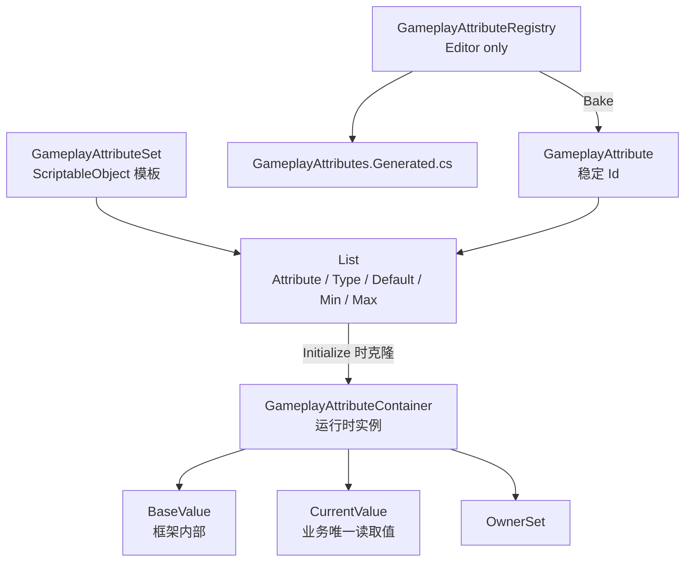
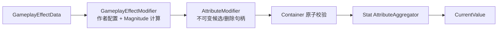
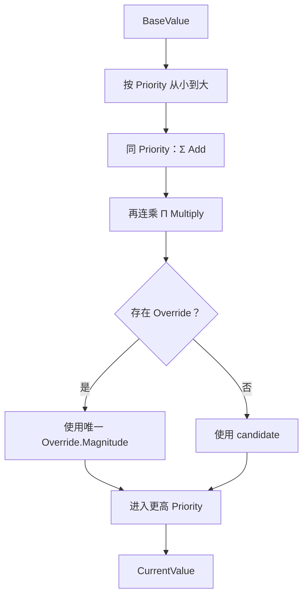
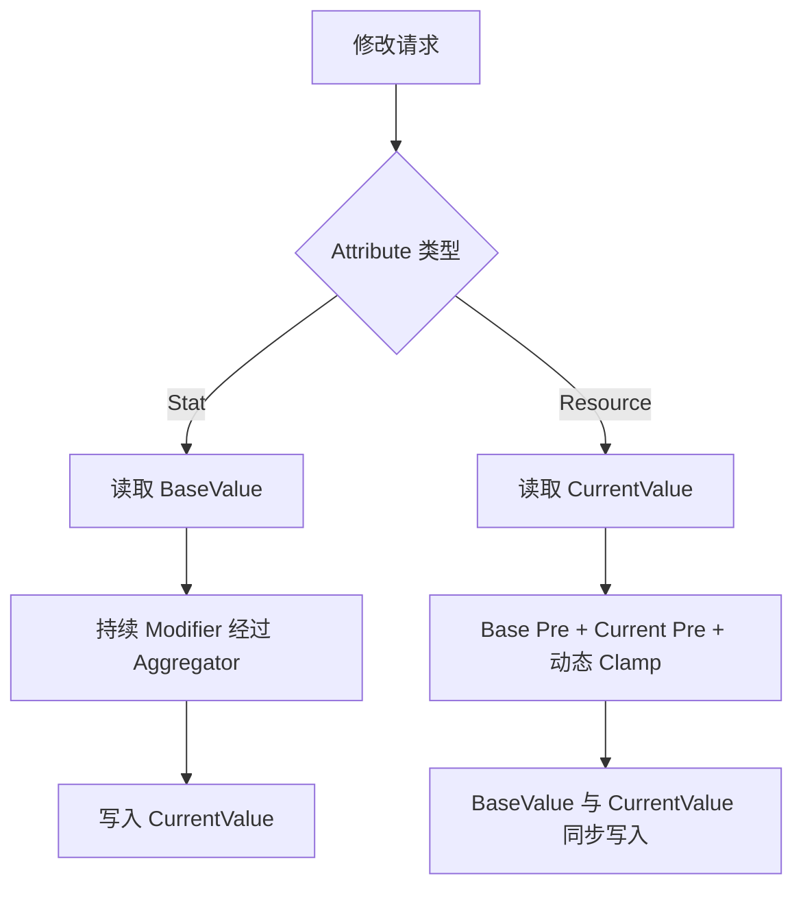
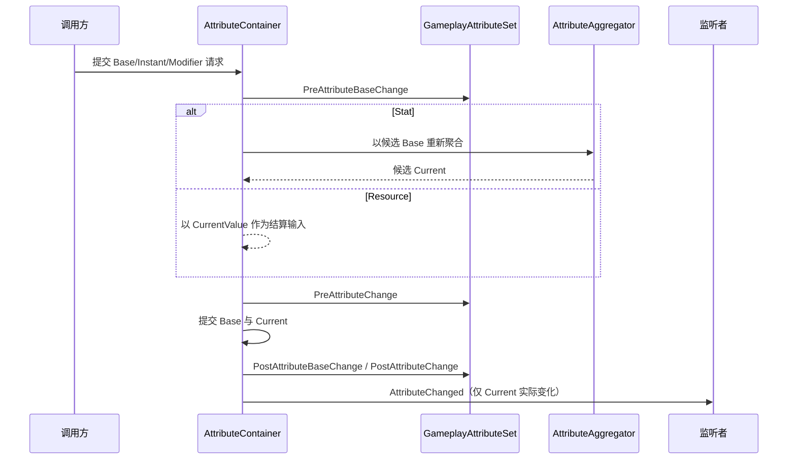
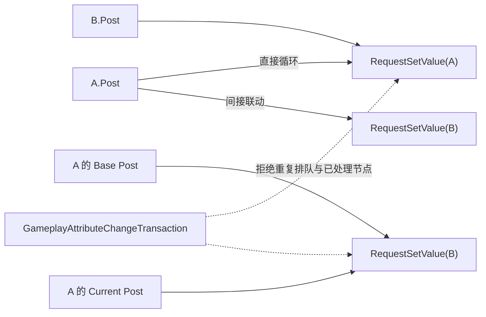

# Gameplay Attribute 设计

## 目标

Attribute 系统分成“全局身份”“Set 配置模板”和“Container 运行时实例”三层。Editor 只 Bake `GameplayAttribute` 的稳定 ID 与生成代码；`GameplayAttributeSet` 不参与 Bake，运行时直接从 Set 的 `List<GameplayAttributeDefinition>` 克隆数据。

## GameplayAttribute 与 Bake

- `GameplayAttribute` 只保存全局稳定整数 ID，相等性与哈希只依据 ID。
- Registry 的作者节点使用持久 Guid。重复 Bake、重命名不会改变已有 ID；删除后的 ID 永久废弃。
- Spec 名称全局唯一且采用平铺结构。生成常量格式为 `GameplayAttributes.Attribute_<Name>`。
- Inspector 的 PropertyDrawer 只写 ID，不把名称、路径或 Registry 引用写入业务资产。
- Set 新增 Definition 时只能选择已经 Bake 的 Attribute。

## GameplayAttributeSet

Set 是可直接使用的配置模板 SO，而不是需要再次 Bake 的中间作者格式。每个 Definition 直接包含 Attribute、Type、Default、Min 与 Max，避免额外 Data 嵌套。

`GameplayAttributeType.Stat` 与 `Resource` 使用相同的数值存储，但运行时结算规则不同。Stat 允许持续 Modifier；Resource 表示 Health、Mana、Stamina 等可消耗存量，只接受 Instant 结算，不保存持续 Modifier。Resource 的最大值仍由普通 Stat Attribute 表达，例如 `Health` 与 `MaxHealth` 是两个独立 Attribute；两者关系由具体 Set 的 Pre/Post 规则维护，而不是 `MaxAttribute` 特殊字段。

同一个 Attribute 可以配置在不同 Set 中，但同一个 Container 初始化时不能组合出重复 Attribute。重复时整个初始化失败，不留下部分数据。

## Runtime Container

运行时以单个可序列化 List 作为唯一数据源。当前预计每个角色 Attribute 数量较少，查询采用线性扫描，不额外维护 Dictionary 或缓存，避免重复内存和序列化同步问题。

`GameplayAttributeDefinition` 在 Set 中是模板，在 Container 中是独立克隆。运行时副本保存内部 BaseValue、公开只读的 CurrentValue 和 OwnerSet。所有业务读取、GE 计算、条件判断与 UI 只使用 CurrentValue；BaseValue 的读取和直接写入均不属于公共接口。

- 查询方依赖 `IReadOnlyGameplayAttributeContainer.TryGetCurrentValue`。
- 需要结算的一方依赖 `IGameplayAttributeContainer.TryApplyInstantModifier`。
- Stat 使用内部 BaseValue 作为 Aggregator 输入，Resource 则在 Instant 完成后同步内部 BaseValue 与 CurrentValue。
- 修改统一经过 Container，因此 Pre、Post、Clamp、FIFO 循环检测与事件不会被跳过。

## Aggregator 与 Modifier

每个运行时 Stat Definition 持有非序列化 Aggregator。GE 资产中的多态 `GameplayEffectModifier` 同时承担作者配置和 Magnitude 计算，计算后直接创建包含 Source、Attribute、Add/Multiply/Override、最终 Magnitude 与 Priority 的不可变 `AttributeModifier`。提交前它是候选结果；成功绑定 Container 后，同一对象引用就是精确删除 Handle。业务层不得修改其 Magnitude。

Aggregator 按 Priority 从小到大计算，同一 Priority 先合并 Add、再连乘 Multiply，最后由该 Priority 中唯一的 Override 覆盖：

Aggregator 内部 List 在 Add 和 Restore 后直接按 Priority 排序，`TryEvaluate` 对连续的同 Priority Modifier 进行单次遍历；不维护额外 Priority List，也不在运行时使用 LINQ 分组。

更高 Priority 会继续基于覆盖后的值计算。同一 Attribute、同一 Priority 最多允许一个持续 Override；单项添加会在修改 Aggregator 前拒绝冲突，Source 级 Replace 会忽略即将被替换的同 Source 旧项，但拒绝候选集合自身重复以及其他 Source 的冲突。失败时旧 Modifier、Owner 和 CurrentValue 保持不变。Aggregator 若发现该内部不变量已被破坏，也会拒绝计算，绝不依赖同 Priority 的 List 排序决定结果。负 Add 表示减法，小数 Multiply 表示除法。Modifier 不包含 Source Actor、Target、Tag、持续时间或叠层；未来 `ActiveGameplayEffect` 实现 `IModifierSource`，可按 Source 一次删除该次应用产生的全部 Modifier。

### Instant 结算

`ApplyInstantModifier` 与 `TryApplyInstantModifiers` 直接接收已计算的 `AttributeModifier`，按列表顺序执行 Add、Multiply 或 Override，忽略 Priority。Instant 仍保留 Source 作为本次结算身份，但不绑定 Container Owner，也不进入 Aggregator；结算完成后即可释放。

- Stat 以内部 BaseValue 为输入，提交后重新聚合 CurrentValue。
- Resource 以 CurrentValue 为输入，完成 Base Pre、Current Pre 与动态 Clamp 后，将最终结算结果同步到内部 BaseValue 和 CurrentValue。
- Resource 拒绝持续 Modifier；周期伤害、回血和回蓝由周期 GE 每次 Tick 执行一次 Instant。
- MaxHealth、MaxMana、回复速度和倍率等属于 Stat，可使用持续 Modifier。

## Pre/Post 流程

内部结算先执行 `PreAttributeBaseChange`。Stat 使用候选 Base 通过 Aggregator 计算候选 Current；Resource 直接把候选结算值交给 Current Pre。执行 `PreAttributeChange` 后，Stat 分别提交 Base 与聚合 Current，Resource 将 Current Pre 的最终结果同步提交到内部 Base 与 Current。随后发送实际发生变化的 Post 和 `AttributeChanged`。

Container 内部将 Instant、Reset 和 Post FIFO 请求统一视为 BaseValue 修改事务：候选 Base 依次经过 Base Pre、Stat 聚合或 Resource 直通、Current Pre，最后分别判断 Base 与 Current 是否实际变化。Base 未变化不能阻断 Current Post 与 `AttributeChanged`；持续 Modifier 操作仍是独立的 Current-only 事务。

持续 Modifier 的添加或删除仅允许 Stat，不改变内部 BaseValue，只重新聚合 CurrentValue 并执行 Current Pre/Post。单项和按 Source 批量操作都是原子事务，非法输入、计算溢出或 Pre 返回非法结果时恢复 Modifier 集合与旧 CurrentValue。

未来 GE 的 Level、SetByCaller 或动态 Magnitude 变化由 Active GE 层处理：重新计算配置后，以同一个 Source 原子替换其整组 Modifier。本阶段不公开单项 Modifier 更新 API，也不允许业务代码绕过 Active GE 修改底层 Modifier。

GE 集成增加两个批量事务入口：`TryApplyInstantModifiers` 按输出顺序计算并整体提交一次 Instant 结果；`TryReplaceModifiers` 以同一 `IModifierSource` 原子替换整组持续 Modifier。两者都会先完成全部配置、聚合与 Pre 校验，再写入 Base/Current 或 Aggregator；失败时不保留部分 Modifier 和数值结果。

固定 Min/Max Clamp 在 Set 基类的两个 Pre 中完成。派生 Set 覆写 Pre 时必须调用 `base`。

### 回调修改约束

非序列化的 `GameplayAttributeChangeTransaction` 使用内部 `scheduledAttributes` 与 `processedAttributes` 检测 Attribute 修改环。每个 Attribute 在一次 Base/Current/Modifier 事务中最多进入 FIFO 一次；重复排队、`A → A`、`A → B → A` 或更长的修改环会在请求入队时返回 `false`，不会继续扩展队列。

`GameplayAttributeChangeTransaction` 只依赖 `System.Collections.Generic` 和 `GameplayAttribute`，不访问 Container、Definition、Set、Aggregator、Modifier 或 Post Context。Container 负责调用 Begin、Schedule、Dequeue 和 Complete，并继续独占数值计算、提交、回滚与事件发送。

该 Transaction 的首要目的，是阻止 Post 联动产生重复修改或无法结束的同步修改环，而不是负责数值计算、线程安全或业务回滚。例如：

没有事务级检测时，这些请求可能持续扩展 FIFO，或让同一个 Attribute 在一次提交中被反复处理。`scheduledAttributes` 拒绝尚未执行但已经排队的重复请求；`processedAttributes` 拒绝本事务已经处理过的 Attribute，因此合法的单向联动 `A → B` 可以执行一次，而 `A → A`、`A → B → A` 和对 B 的重复排队会返回 `false`。`IsProcessing` 另外用于阻止回调期间重入 Modifier 事务；调用方仍应将被拒绝的修改环视为业务配置错误并主动修正。

- `PreAttributeBaseChange` 和 `PreAttributeChange` 只能校验或 Clamp 当前 `ref newValue`，禁止修改其他 Attribute、增删 Modifier、发送会修改数据的事件或调用任何修改入口。
- `PostAttributeBaseChange` 和 `PostAttributeChange` 可以通过 `GameplayAttributePostChangeContext.RequestSetValue` 请求关联结算；请求统一排入 FIFO，在当前回调和事件完成后执行。
- `AttributeChanged` 监听者不得同步修改当前 Container 中的 Attribute 或 Modifier；需要后续行为时应交给更外层流程延后执行。
- 修改环虽然会被安全拒绝，但仍属于业务关系配置错误；调用方必须检查 Post Context 修改入口返回的 `false`，并在开发阶段修正关系。

`ResetToDefaultValues` 恢复内部默认结算值：Stat 保留活跃 Modifier 并重新聚合，Resource 恢复同步的 CurrentValue；初始化、Clear 和反序列化会丢弃非序列化 Modifier。

## 四属性 Odin 手动测试

Editor 专用的 `GameplayAttributeTestSet` 使用已烘焙常量配置 Health、MaxHealth、Armor 与 MP，用来验证真实 Container API，而不在测试代码中复制聚合、Clamp 或 FIFO 实现：

| Attribute | Type     | Default | 固定范围 | 额外规则                                               |
| --------- | -------- | ------: | -------- | ------------------------------------------------------ |
| Health    | Resource |     100 | 0..1000  | Current Pre 再 Clamp 到`0..MaxHealth.CurrentValue`     |
| MaxHealth | Stat     |     100 | 1..1000  | Current Post 将当前 Health 排入 FIFO，触发动态上限重算 |
| Armor     | Stat     |      10 | 0..1000  | 用于验证 Add、Multiply 与 Instant                      |
| MP        | Resource |      50 | 0..100   | 归零时输出资源耗尽测试日志                             |

`GameplayAttributeOdinTester` 提供“初始化四属性测试”“测试 Instant 与 Pre/Post”“测试 Modifier 与 Post 联动”“测试 Override 唯一性”和“执行完整四属性测试”按钮。Override 场景覆盖跨 Source 冲突、同 Source Replace、候选集合自身重复以及失败后的 Owner/CurrentValue 原子保持。各场景开始前重新初始化专用 Set，日志统一包含 Actual、Expected 与 PASS/FAIL。完整测试在各组之间重新初始化，避免前一组的 Resource 结算和 Stat BaseValue 永久修改污染后一组预期。

MaxHealth 的 Post 联动严格为单向 `MaxHealth → Health`。Post 只通过 `GameplayAttributePostChangeContext.RequestSetValue` 排队当前 Health，由 Health 的 Current Pre 在 FIFO 消费时执行动态 Clamp；不在 Post 回调栈中直接写 Definition，也不会形成 `Health → MaxHealth` 反向关系。

## Editor

GAS 主窗口新增 `Attribute` 选项卡，内部包含两个子页面：

- `Attribute Specs`：编辑 Registry 的全局 Spec、验证并 Bake。
- `Attribute Sets`：选择或创建 Set，按 Stat/Resource 虚拟分组编辑 Definition。

Editor 继续采用轻量 MVC：View 封装 UI Toolkit，Controller 负责投影和 SessionState，Service 负责校验、Undo 和资产修改。双击 Registry 或 Set 都进入 GAS 主窗口对应 Attribute 子页面。域重载通过 Asset GUID 恢复 Registry、Set、页面、搜索与选择。

## 多 Set 导入

运行时 ASC 可以一次导入多个 `GameplayAttributeSet`。Container 会将各 Set 的 Definition 合并到同一运行时列表，要求所有 AttributeId 唯一；重复 Id 表示配置冲突，不进行默认值或 Pre/Post 规则覆盖。

Unity MonoBehaviour 只负责序列化 `List<GameplayAttributeSet>` 并在运行时传入 ASC，GameplayAttributeContainer 继续负责实际校验与运行时 Definition 创建。

## ASC 与 Attribute 查询边界

ASC 的快捷门面只提供 `TryGetCurrentValue`、`HasTag` 和 `HasTagExact` 等只读查询。Attribute 的 BaseValue、CurrentValue、Pre/Post、Aggregator 和 Modifier 仍由 `GameplayAttributeContainer` 管理，ASC 不增加直接修改 Attribute 或 Modifier 的快捷入口。

GE 快捷应用最终仍通过 Target ASC 的 `GameEffectCtrl` 进入 Attribute Container，因此所有原子结算、CurrentValue 读取和 Post FIFO 约束保持不变。
