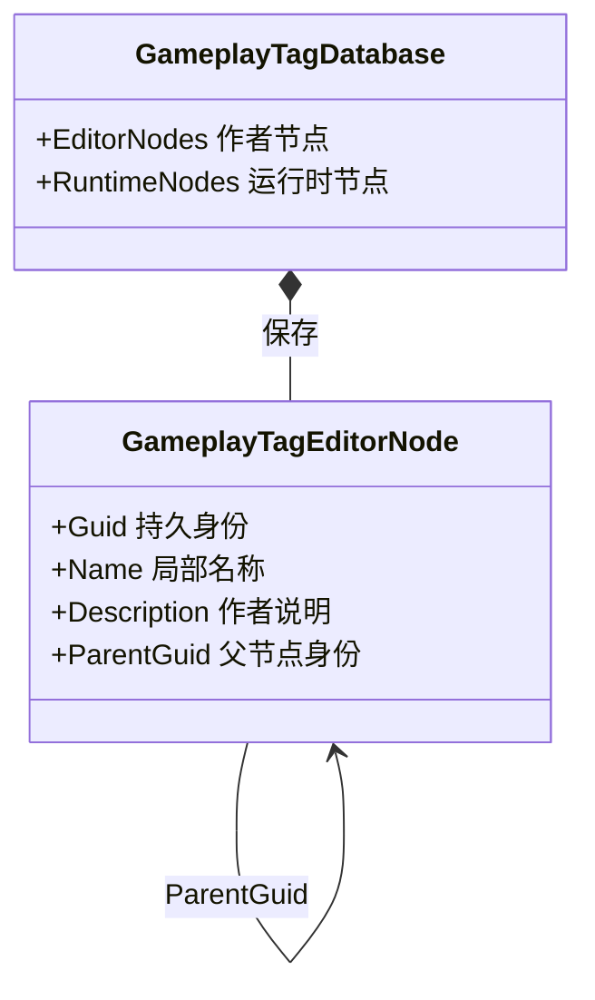
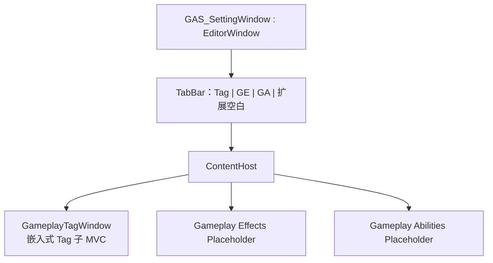
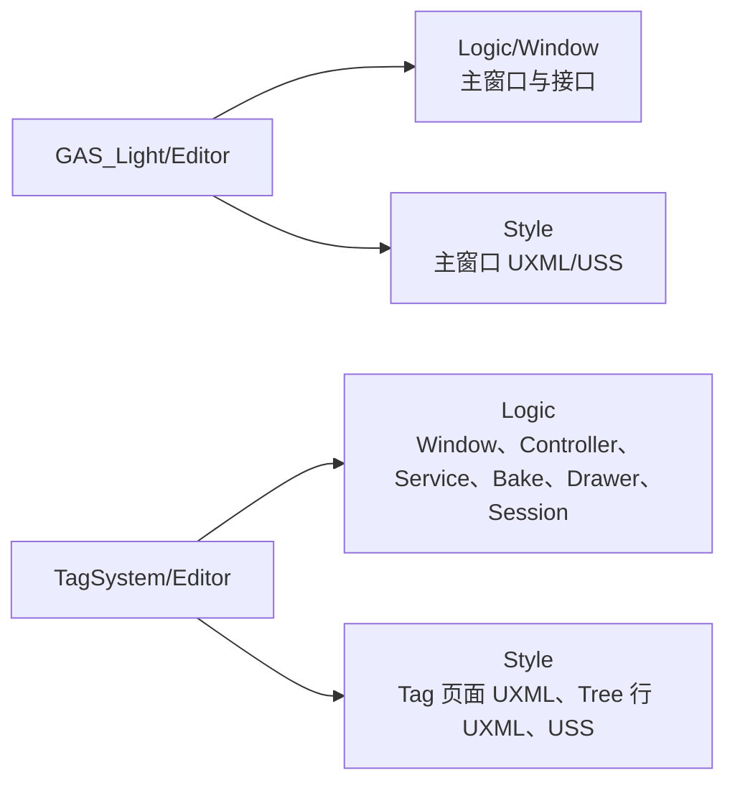
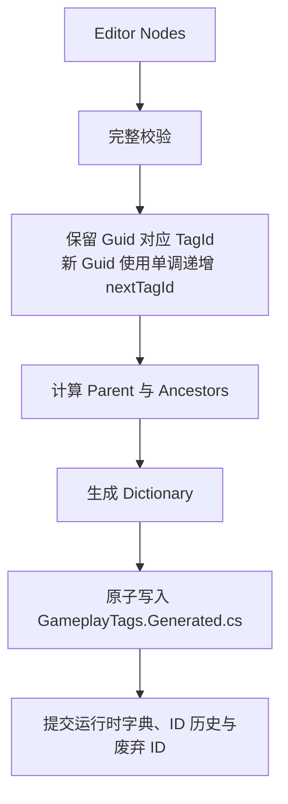
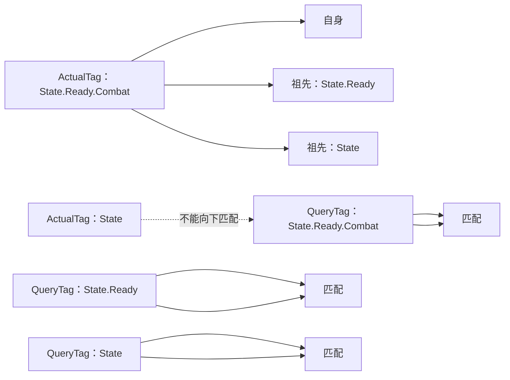
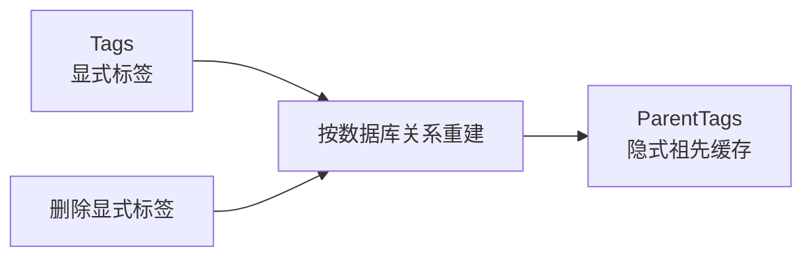
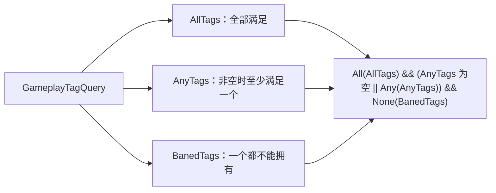

# GAS_Light Gameplay Tag 系统设计

## 1. 数据边界

Gameplay Tag 使用 `State.Ready.Combat` 形式的树状路径表达作者语义，但 Player 不保存或查询路径字符串。

- `GameplayTag` 仅序列化稳定 `TagId`；相等、哈希和 Exact 匹配只基于 ID。
- `GameplayTagDatabase` 的运行时数据只有 `Dictionary<GameplayTag, GameplayTagNode>`。
- `GameplayTagNode` 缓存直接父级和“直接父级 → 根节点”的全部祖先。
- Editor 作者数据与运行时代码保存在同一个 `GameplayTagDatabase.cs`，并整体放在 `#if UNITY_EDITOR` 区块中。
- 作者节点以持久 Guid 标识；重命名、Path 修改或拖动不会改变已分配 ID，删除后的 ID 永不复用。

动态 Inspector 配置通过 `GameplayTagPropertyDrawer` 的层级下拉框选择已烘焙 Tag，业务资产只写入 `TagId`，不写数据库引用或 Path。叶子 Tag 可直接选择；中间 Tag 进入子菜单后通过首项 `Select This Tag (节点名)` 选择自身，因为 Unity `AdvancedDropdown` 的父项固定用于导航。未烘焙节点只可作为路径分组，不提供选择入口。存在多个数据库时，优先使用 Tag 窗口通过 `SessionState` 记录的数据库；没有明确数据库时 Drawer 会提示用户选择。

## 2. Editor 作者数据

Path 不持久化，由父链实时计算。Path 字段采用延迟提交：Enter 或失焦后拆分完整路径，最后一段作为 Name，前缀作为父路径。缺失父级会在同一个 Undo 操作中自动创建；空层级、路径冲突以及移动到自身后代会整次拒绝。

## 3. EditorWindow

GAS Editor 只保留一个真正的 `EditorWindow`，顶部选项卡切换同一内容区域中的模块页面：

资源与逻辑位于：

窗口使用 UI Toolkit UXML/USS 和接口化 MVC，不引入完整 MVVM：

- `GAS_SettingWindow` 实现 `IGASSettingWindow`，只负责选项卡、页面宿主和页面生命周期；当前 GE/GA 显示待实现页面。
- `GameplayTagWindow` 实现 `IGameplayTagWindow` 与 `IDisposable`，不是 `EditorWindow`，只负责在宿主内容区组合和释放 Tag View/Controller。
- 切换选项卡时释放旧页面；返回 Tag 时从 `SessionState` 恢复数据库、节点选择、搜索和展开状态。
- `GameplayTagEditorView` 实现 `IGameplayTagEditorView`，封装控件、TreeView 行、拖放、快捷键、对话框和视觉刷新。
- Controller 仅依赖 View 接口，管理选择、搜索、展开状态、Service 命令和只读 ViewData 投影，不持有 UI Toolkit 控件。
- Service 是作者数据变更、Undo、校验和 Bake 的唯一入口。
- 数据库 Asset GUID、选中节点 Guid、搜索文本和展开 Guid 存入 `SessionState`，脚本编译后自动恢复。
- 菜单、数据库双击和 PropertyDrawer 缺库入口都会打开同一个 `GAS_SettingWindow`，切换到 Tag 页并恢复或选择数据库。

### 3.1 Tree 与快捷键

- Tree 始终按 Name 排序，不保存手工兄弟顺序。
- 自定义拖放明确区分节点内部、上方和下方：内部成为子级，上下方成为目标节点的同级。
- 向左拖到缩进区域时，纵向参考行与横向缩进共同决定任意目标深度，并显示 Root/Level 层级指示器。
- 拖放直接修改 `ParentGuid`，随后从作者数据重建 Tree，因此 Path 和 ScriptableObject 数据立即一致。
- 禁止移动到自身、后代或产生同父重名；搜索生效时禁用拖放。
- 根节点以 TrickleDown 捕获快捷键：Tree 聚焦且单选时，`F2` 行内重命名，`Delete` 级联删除。
- TextField 编辑期间不拦截快捷键；重命名以 Enter/失焦提交，Escape 取消。
- 创建、重命名、Path 修改、移动和级联删除均支持单步 Undo/Redo。

## 4. 烘焙

路径只在 Editor 烘焙期间用于生成稳定的 C# 访问字段，不进入 Player 数据库。烘焙失败时保留上一次有效运行时数据；作者数据发生修改后标记 Bake Dirty，进入 Play Mode 或 Build 前由 Guard 拦截。

校验覆盖空名称、非法 `.`、同父重名、完整路径重复、空或重复 Guid、孤儿 ParentGuid、循环父链、ID 冲突及生成 C# 标识符冲突。

## 5. UE 匹配语义

调用方向固定为 `ActualTag.MatchesTag(QueryTag)`：更具体的实际标签能匹配自身和祖先查询，父标签不能反向匹配子标签。

| ActualTag            | QueryTag             | MatchesTag |
| -------------------- | -------------------- | ---------: |
| `State.Ready.Combat` | `State.Ready.Combat` |       true |
| `State.Ready.Combat` | `State.Ready`        |       true |
| `State.Ready.Combat` | `State`              |       true |
| `State`              | `State.Ready`        |      false |

## 6. GameplayTagContainer

Container 是纯运行时内存对象：`Tags` 保存显式标签，`ParentTags` 保存由数据库关系展开的隐式祖先。删除显式标签后会从剩余 Tags 完整重建祖先缓存，以正确处理共享祖先。

`IReadOnlyGameplayTagContainer` 统一普通 Container、计数 Container 和 Query 的只读匹配入口；`IGameplayTagContainer` 只为可直接增删的集合增加修改操作。空查询遵循 UE 语义：`HasAny(empty)` 为 false，`HasAll(empty)` 为 true。

### 6.1 GameplayTagCountContainer

`GameplayTagCountContainer` 由后续 AbilitySystem 或 TagOwner 持有，记录同一标签被装备、Ability、GameplayEffect 等来源赋予的次数，但不保存来源对象或 Handle。

- `GetExplicitTagCount` 只返回标签被直接添加的次数。
- `GetTagCount` 返回标签自身和全部子标签共同贡献的层级次数。
- 增减显式标签时同步更新全部祖先；任何下溢都会拒绝整个操作。
- 批量更新先完整校验再提交，失败时不留下部分计数。
- `TagCountChanged` 发送每次层级计数变化，`TagPresenceChanged` 只发送零边界变化。

Tag Count 与 GE StackCount 分离：前者表示目标当前拥有 Tag 的来源数量，后者表示单个 Active GameplayEffect 的叠层数量。

### 6.2 GameplayTagQuery

当前 Query 使用可直接理解和序列化的三组数组，不使用 Token Stream 或递归表达式：

`BanedTags` 表示容器不应该拥有的标签集合；其中任意一个标签通过层级 `HasTag` 匹配时，整个 Query 返回 false。

三组条件均使用层级 `HasTag`。完全空 Query 表示没有限制，对任意非 null 容器返回 true；任意数组包含非法或未烘焙 Tag 时 Query 整体失效并返回 false。业务资产只序列化数组元素中的稳定 TagId。

## 7. 手动验证

1. 双击数据库，确认窗口自动选择该资产。
2. 测试子级提升到根、拖入其他节点、同级移动和非法循环目标。
3. 修改 Path，测试自动创建一层/多层父级以及单步 Undo/Redo。
4. Tree 聚焦测试 F2/Delete，并确认 TextField 编辑时不被拦截。
5. Bake 后在 Inspector 的 GameplayTag 字段选择层级项，确认业务资产只保存 ID。
6. 触发脚本编译，确认数据库、选中节点、搜索和展开状态恢复。
7. 使用 `GameplayTagOdinTester` 验证 UE 方向匹配、普通 Container、CountContainer 与简化 Query。
