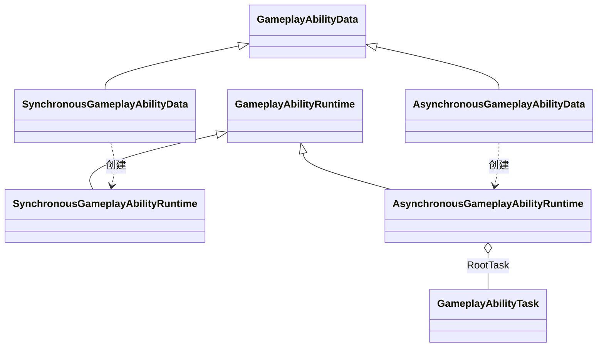
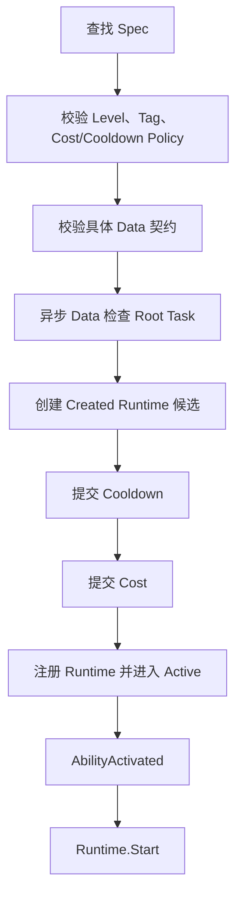
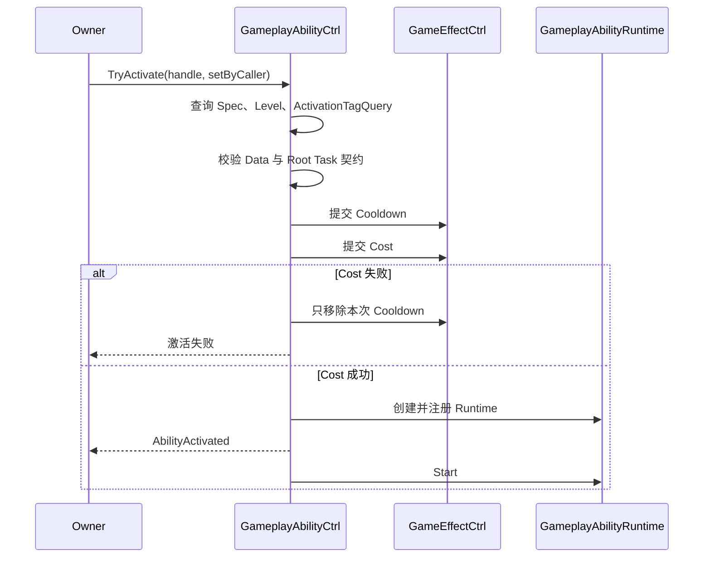
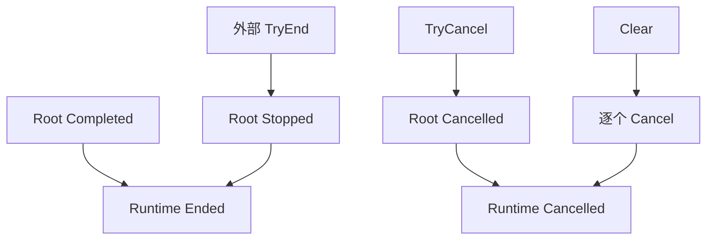
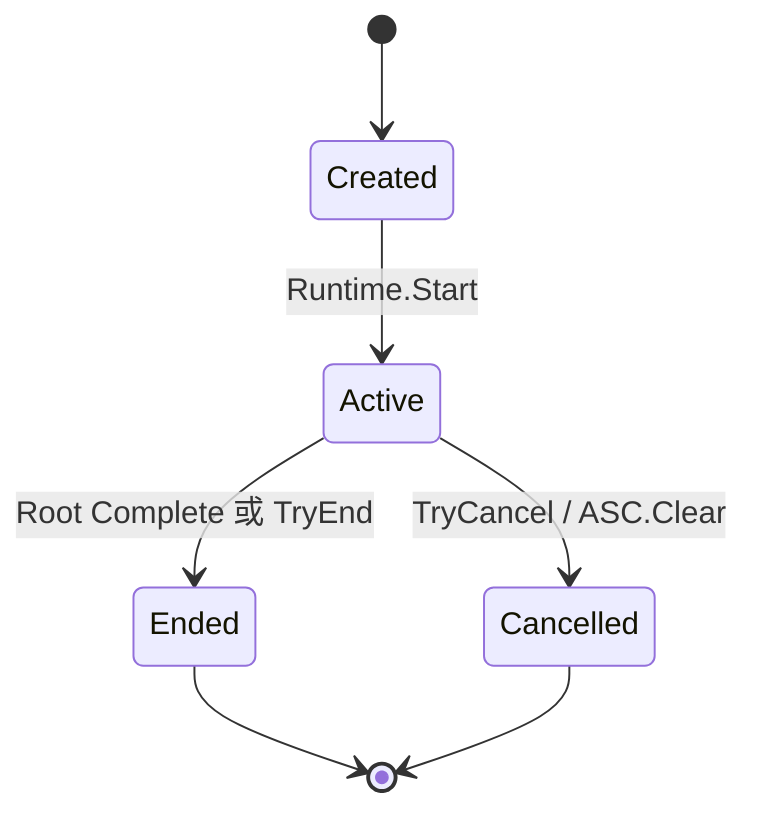
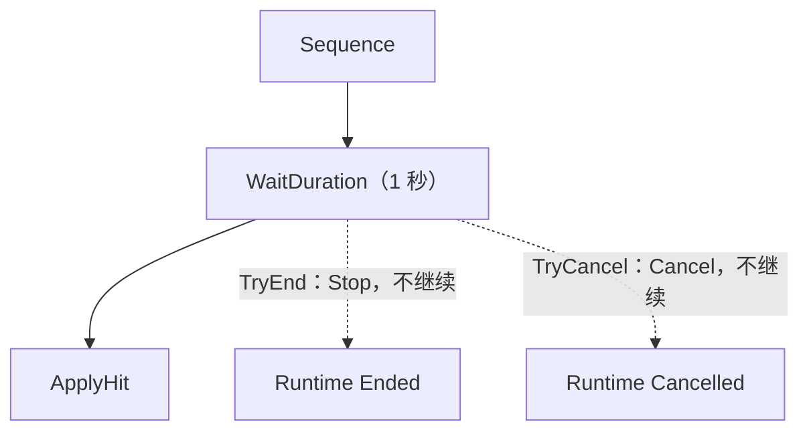
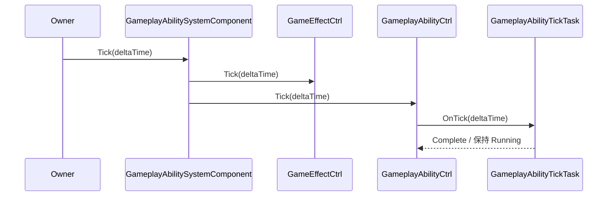
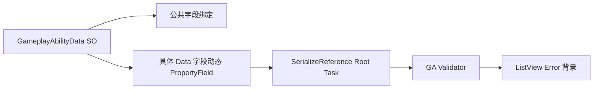

# Gameplay Ability 设计

## 1. 分层与依赖

Gameplay Ability 按执行生命周期分成同步和异步两条多态分支：

核心 AbilitySystem 不依赖 SkillConfig、碰撞、投射物、动画或具体目标系统。业务模块可以用清晰的业务类名继承对应分支，例如 ProjectileGameplayAbilityData 继承同步基类，CastGameplayAbilityData 继承异步基类。

Runtime 直接持有 Root Task，不增加 Runner、ExecutionNode、通用 Context 或目标黑板。



## 2. 公共 Data 与 Spec

GameplayAbilityData 只保存所有技能共用的作者配置：

- Description
- ActivationTagQuery
- CostEffect
- CooldownEffect

SelfEffects 与 TargetEffects 已从公共 Data 删除。具体技能需要的 GE、目标或投射物配置由具体同步 Data 或具体 Task 保存。

GameplayAbilitySpec 是 ASC 中长期存在的授予状态，保存 Handle、Data 和当前 Level。Runtime 激活时复制 Level 与 SetByCaller，之后修改 Spec Level 不影响已创建 Runtime。

## 3. 激活事务与事件顺序

Controller 激活顺序固定为：


Cost 失败时精确移除本次刚创建的 Cooldown Runtime。Root Task 为空或 Task 配置非法时，必须在 Cost/Cooldown 副作用前拒绝；异步 Ability 由 Owner 主动调用 ASC.Tick 推进。



Runtime 进入终态后，Controller 先将它从 ActiveRuntimes 移除，再发送 AbilityEnded 或 AbilityCancelled。同步 Runtime 可能在 TryActivate 返回前结束，但事件顺序仍是 Activated → Ended。

## 4. 同步 Ability

SynchronousGameplayAbilityData 直接覆盖 Execute。执行返回后 Runtime 自动 Complete 并进入 Ended，不创建 Task，也不注册 Tick 回调。

同步只表示 Ability 业务入口在当前调用内完成，不代表它产生的对象必须立即销毁。例如投射物技能可以同步创建并发射投射物，投射物随后独立管理碰撞和生命周期。

同步实现不得注册持续更新或等待外部事件；需要等待时应改为异步 Ability。同步、Passive 和 Projectile 三类基础技能：

- `InstantGameplayAbilityData` 保存多个 Instant GE。激活时按列表顺序逐个提交；某一项 GE 被目标拒绝只记录失败，不回滚已成功项，也不阻止后续项。
- `PassiveGameplayAbilityData` 使用不主动完成的 `PassiveGameplayAbilityTaskConfig` 保持 Runtime Active。每次成功应用的 Infinite GE Runtime 都保存为本次 Runtime 的精确句柄；End/Cancel 时只移除这些句柄，不使用按 Source 的全量删除，因此不会误删其他技能或外部效果。Passive GE 当前要求 `StackingType.None`，保证每次激活拥有独立句柄。
- `ProjectileGameplayAbilityData` 在同步入口中创建投射物，GA Runtime 随即 Ended。Sphere 示例从 Source ASC 的 Transform 生成球体，投射物通过 Rigidbody 与 Trigger 独立移动和命中，并在首次有效命中时应用统一 Effects；通用阵营、LayerMask、范围和 Targeting 仍由后续业务层扩展。

上述配置均可作为 ScriptableObject 在 GA Editor 中创建和检查。Odin Tester 使用 SO 引用而不是每次按钮点击临时创建 Ability Data，便于检查多态字段和 Validation。 测试夹具位于 Assets/GAS_Light/AbilitySystem/Runtime/GAData/SO/，可直接拖到 GameplayAbilityOdinTester 的 Skill 测试 SO 字段。
GA Odin 测试器还需要配置 `Assets/GAS_Light/AttributeSystem/Editor/TestAssets/GameplayAttributeTestSet.asset`。每次重置测试时，Tester 会将该 Set 导入新的 ASC；否则依赖 Attribute 的 Cost GE 无法提交。该 Set 只用于测试夹具，不是 GA Runtime 的必需依赖。

`GA_Test_PassiveSkill.asset` 当前 `Effects` 为空，因此只能验证 Passive Runtime 的激活、保持和结束生命周期；`AppliedEffects=0` 是当前资产配置结果，不代表 Runtime 错误。

## 5. 异步 Ability 与 Task

AsynchronousGameplayAbilityData 使用 SerializeReference 保存 Root Task Config。每次激活都从 Config 创建全新的 GameplayAbilityTask 实例，多个 Runtime 之间不共享运行状态。
`Assets/GAS_Light/AbilitySystem/Runtime/GAData/SO/GA_Test_AsyncAbility.asset` 是基础异步 Ability 测试资产，使用一秒 `WaitDurationGameplayAbilityTaskConfig`。激活后 Runtime 保持 Active，Owner 调用 `ASC.Tick` 累计一秒后 Root Task 完成，Runtime 进入 Ended。

Root Task 生命周期驱动 Runtime：


Task 不能直接写 Runtime.State。Task 完成只通知父 Sequence 或 Root Runtime。



GameplayAbilityTaskState：

- Inactive
- Running
- Completed
- Stopped
- Cancelled

### Complete、Stop 与 Cancel

这三个结束入口都可能释放同一批临时资源，但它们代表不同的生命周期原因，不能互相替代。

| 入口 | 触发者 | Task 状态 | 是否发送 `Completed` | Runtime 结果 |
|---|---|---|---|---|
| `Complete()` | Task 自身条件满足 | `Completed` | 是 | `Ended` |
| `Stop()` | 外部要求正常结束 | `Stopped` | 否 | `Ended` |
| `Cancel()` | 外部打断或 `Clear()` | `Cancelled` | 否 | `Cancelled` |

`Complete()` 是任务的“成功完成”路径。它会发送 `Completed`，因此父级 `Sequence` 可以继续启动下一个子 Task；如果它是 Root Task，则通知 Runtime 正常进入 `Ended`。

```csharp
// WaitDuration 或动画进度达到结束条件。
if (elapsed >= duration)
    Complete();
```

`Stop()` 是外部发起的“正常提前结束”。Runtime 已经进入 `Ended`，Root Task 只被标记为 `Stopped`，不会再发送 `Completed`，也不会让 Sequence 继续推进后续步骤。

```csharp
// 例如外部主动结束蓄力技能，但不把“蓄力完成”当成成功完成。
source.Abilities.TryEnd(runtime);
```

`Cancel()` 是外部发起的“中断”。它进入 `Cancelled`，Controller 发送 `AbilityCancelled`，适用于眩晕、死亡、场景清理或 `AbilitySystemComponent.Clear()`。

```csharp
// 例如角色死亡时打断仍在运行的技能。
source.Abilities.TryCancel(runtime);
```

`GameplayAbilityTickTask` 中三条路径都会注销 Tick 注册，因为无论是成功完成、正常提前结束还是被打断，都不能继续接收帧更新。这个共同清理行为不代表三者语义相同；具体 Task 仍可以分别实现 `OnComplete`、`OnStop` 和 `OnCancel`。

例如一个由两个阶段组成的技能：



- 等待满 1 秒：`WaitDuration.Complete()`，Sequence 继续执行 `ApplyHit`。
- 等待过程中调用 `TryEnd`：Root Task `Stop()`，技能结束，但不会执行 `ApplyHit`。
- 等待过程中调用 `TryCancel`：Root Task `Cancel()`，技能被打断，也不会执行 `ApplyHit`。

因此，`Stop` 和 `Complete` 不能简单合并；最多只能抽取它们共有的资源释放逻辑。

## 6. Sequence 与 WaitDuration

Sequence 按顺序启动子 Task：

- 子 Task 同步完成时在当前调用内继续下一项。
- 子 Task 保持 Running 时等待完成通知。
- 空 Sequence 合法并立即完成。
- 空子项非法，Editor 和 Runtime 激活校验都会拒绝。
- Stop/Cancel 只传播给当前运行子项。
- 推进标记用于处理 Start 内同步完成回调，避免递归重复推进。

GameplayAbilityTickTask：

- 启动时向所属 ASC 的 AbilityCtrl 注册 Tick 回调。
- AbilityCtrl 返回 WSFrame 的 IUnRegister；Tick Task 持有该句柄，并在 Stop、Cancel 或 Complete 时调用 UnRegister。
- IUnRegister 只负责 Task 从 AbilityCtrl 注销 Tick 回调，不改变 Runtime、ASC 或 GameObject 的生命周期。
- 每次更新调用业务子类的 OnTick(deltaTime)。
- 业务 Task 在 OnTick 中驱动动画进度、蓄力值、位移或持续输入，并在完成时调用 Complete()。
- Stop、Cancel 和 Complete 都会在完成通知前释放 Tick 注册。
- AbilityCtrl 每帧复用稳定快照推进回调：本帧注销且尚未执行的回调会跳过，本帧新增的回调从下一帧开始执行，因此回调修改注册表不会造成重复执行或漏执行。
- Tick Task 不保存 Animator、AnimationClip、SkillConfig、Transform 或目标信息。

WaitDuration：

- WaitDuration 继承 GameplayAbilityTickTask。
- Duration 必须为有限值且不小于 0。
- 0 秒在完成注册后立即完成。
- 正数通过 Tick 累计时间，达到时长后完成。
- Stop 与 Cancel 都释放注册，注册只释放一次。

Odin Tester 中的 Tick Probe Task 按 ASC Tick 次数完成，用于验证“持续若干帧执行内容、达到条件后通知完成”的生命周期。未来动画 Task 可以直接继承 GameplayAbilityTickTask，不需要修改 Ability Runtime。

同步 Ability 不使用 Tick 注册；异步 Ability 由所属 ASC 的 AbilityCtrl 接收统一 Tick。



## 7. 统一 Tick 入口

外部 Owner 负责主动调用 `GameplayAbilitySystemComponent.Tick(deltaTime)`，GAS 不自动绑定 Unity `Update`。ASC 内部固定先调用 `GameEffectCtrl.Tick(deltaTime)`，再调用 `GameplayAbilityCtrl.Tick(deltaTime)`，因此同一帧先推进 GE 的周期与到期，再推进 GA 的 Tick Task。`deltaTime` 为负数、NaN 或 Infinity 时会被安全忽略。

同步 Ability 不使用 Tick 注册；异步 Ability 的 WaitDuration、动画、蓄力和其他持续 Task 都由所属 ASC 的 AbilityCtrl 接收 Tick。Task 持有的 `IUnRegister` 只管理这一个回调的注销，不承担外部对象或 ASC 的生命周期。Controller 遍历帧开始时的回调快照，同时以当前注册表判断该项是否仍有效；因此 Task 可以在 `OnTick` 中完成自身、取消其他 Ability 或启动新 Task，而不会破坏当前帧遍历。

## 8. Editor



GA Editor 通过 TypeCache 发现公开、非抽象、非泛型的 GameplayAbilityData 子类。抽象同步/异步基类不会出现在 Create 菜单；内部测试类型也不会出现。

公共字段由固定 UXML 绑定，具体子类字段通过 SerializedObject 动态生成 PropertyField，不复制 Model 或 ViewData。

Task Config PropertyDrawer 支持：

- 发现具体 Task Config 类型。
- 创建、替换与清空 managed reference。
- Sequence 子项复用同一 Drawer。
- 使用 Unity Undo 写回。

Validation 检查：

- Cost 必须是 Instant。
- Cooldown 必须是 Duration 或 Infinite。
- 异步 Root Task 不能为空。
- Sequence 子项不能为空。
- Wait Duration 不能为负数、NaN 或 Infinity。

存在 Error 的 GA 在资产 ListView 中显示错误背景。

## 9. 当前边界

本阶段不实现：

- Parallel Task
- CancelReason
- SkillConfig Task
- Target Context
- 通用碰撞策略、范围和阵营筛选
- 投射物业务 Task
- GE 业务 Task
- 具体动画系统、输入、网络预测

这些能力后续通过具体同步 Data、具体异步 Data 或业务 Task 扩展，不改变当前同步/异步基类和 Runtime 生命周期。

## 10. Root Task 完成语义

当前 Root Task 代表整套 Ability 流程。Root Task 完成后，GameplayAbilityRuntime 自动进入 Ended；如果需要多个阶段，使用 Sequence 继续组织子 Task。

这是一种当前阶段的简化约定。未来若需要 UE 风格的“Task 完成但 Ability 仍保持 Active”，应增加显式 Ability 流程或 Completion Policy，由 Ability 决定何时 TryEnd，而不是让 Task 私自修改 Runtime 状态。

## ASC 初始化与多 Set

`GameplayAbilitySystemComponent` 是挂载在角色 Owner 上的 MonoBehaviour 运行时组件。它不实现 `Update`，由 Owner 调用 `Initialize(attributeSets)`、每帧调用 `ASC.Tick(deltaTime)`，并在正常退场时调用 `ASC.Clear()`。组件 `OnDestroy` 会再次执行清理，确保 Task Tick 注册、Active GA 和 GE 不残留。

多个 `GameplayAttributeSet` 会被 `GameplayAttributeContainer` 导入为同一个运行时 Attribute 集合。不同 Set 可以分别承载战斗、资源或移动属性；相同 `AttributeId` 在多个 Set 中出现时视为配置冲突，不会自动覆盖或合并 Definition。

ASC 成功初始化后再次调用 `Initialize` 直接返回。初始化失败只通过 `Debug.Log` 输出原因，ASC 保持未初始化。Ability Controller 不重复检查 ASC 初始化状态，其生命周期由 ASC 和外部 Owner 的调用顺序保证。

## ASC 高频快捷接口

`GameplayAbilitySystemComponent` 提供面向业务层的高频门面，但不复制 Controller 状态，也不重新发送事件。Ability 相关操作都作用于当前 ASC 作为 Source 的 `Abilities` Controller：

- `GiveAbility`、`TrySetAbilityLevel`、`TryGetAbilitySpec` 和 `TryRemoveAbility` 管理授予的 Spec。
- `TryActivateAbility` 提交既有的 Tag、Cooldown、Cost 检查，并保持原有 Runtime 与生命周期事件顺序。
- `TryEndAbility` 与 `TryCancelAbility` 只结束或取消 Runtime，不自动移除 Runtime 已应用的 GE。
- `GrantedAbilities` 与 `ActiveAbilities` 是 Controller 列表的只读别名，不创建快照，也不允许外部修改。

复杂流程或需要订阅 `AbilityActivated`、`AbilityEnded`、`AbilityCancelled` 的代码继续使用 `source.Abilities` Controller；ASC 本身不增加第二套事件系统。

GE 快捷接口作用于当前 ASC 作为 Target：`TryApplyEffect` 接收显式 Source、Level 和 SetByCaller，简化重载默认 Level 为 1 且不携带 SetByCaller；`TryRemoveEffect` 只接受属于当前 Target 的 Runtime。`ActiveEffects` 与 `HasActiveEffect` 直接转发目标 `GameEffectCtrl`，不复制叠层、计时或 Modifier 状态。

例如，普通技能代码可以写成 `target.TryApplyEffect(effect, source, level, setByCaller, out runtime)`，而需要监听 Ability 生命周期的系统仍直接订阅 `source.Abilities`。Tag、Attribute 和 Modifier 不提供 ASC 直接修改快捷入口。
## Mono ASC 与 Owner

`GameplayAbilitySystemComponent` 直接继承 `MonoBehaviour`，不能使用 `new` 创建。角色 Owner 持有同一 GameObject 上的 ASC 组件，在自己的生命周期中负责导入多个 AttributeSet、主动 Tick 与正常 Clear；ASC 本身不抢占 Unity `Update`。

具体 Projectile GA 可以直接读取 `runtime.Source.transform`。投射物的移动、碰撞与命中结算属于具体 GA 产生的投射物实例，不需要额外的 ASC Behaviour 包装或 Owner Context。

`GameplayAbilitySystemComponentOdinTester` 专门验证 ASC 集成周期：它在 Play Mode 临时创建 Source/Target Mono ASC，通过自身真实 `Update` 推进 Tick，并覆盖 Instant、异步 Wait、Passive Infinite、Cooldown 到期和 Sphere Trigger 命中。`GameplayAbilityOdinTester` 只保留 GA Data、Runtime、Task 与事件的隔离测试。
