# Gameplay Ability 设计

## 1. 分层与依赖

Gameplay Ability 按执行生命周期分成同步和异步两条多态分支：

核心 AbilitySystem 不依赖 SkillConfig、碰撞、投射物、动画或具体目标系统。业务模块可以用清晰的业务类名继承对应分支，例如 ProjectileGameplayAbilityData 继承同步基类，CastGameplayAbilityData 继承异步基类。

Runtime 直接持有 Root Task，不增加 Runner、ExecutionNode、通用 Context 或目标黑板。

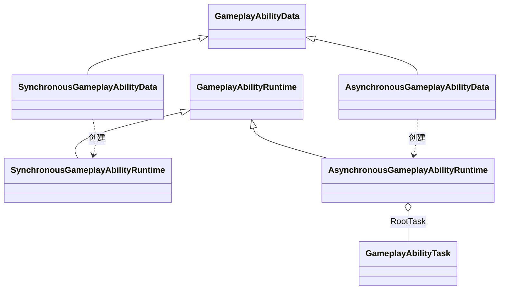

## 2. 公共 Data 与 Spec

GameplayAbilityData 只保存所有技能共用的作者配置：

- Description
- AbilityTags
- CancelTags
- ActivationTagQuery
- CostEffect
- CooldownEffect
- Effects
- CueTags

`Effects` 是所有技能统一的结果 GE 配置。具体 Data 或 Task 决定何时、向谁提交；本阶段的自身技能只提交到 Source，投射物在物理命中其他 ASC 后提交。Target 快照、锁定目标和目标提交接口仍留给后续 Targeting 阶段。

GameplayAbilitySpec 是 ASC 中长期存在的授予状态，保存 Handle、Data 和当前 Level。Runtime 激活时复制 Level 与 SetByCaller，之后修改 Spec Level 不影响已创建 Runtime。

`AbilityTags` 表示 Ability 自身的分类身份，`CancelTags` 是一次成功激活发出的取消指令。两者都不写入 ASC Owner Tag 容器。任一实际 AbilityTag 可以匹配同名 CancelTag 或其祖先，例如 `Ability.Action.Cast.Recall` 可被 `Ability.Action.Cast` 取消，反向不匹配。`ActivationTagQuery.BanedTags` 仍只负责阻止当前 Owner 状态下的新激活。

GA Editor 分别校验 `AbilityTags` 与 `CancelTags` 列表内部是否重复，但允许两组之间有意匹配。SkillConfig 主动作可配置同一公共 AbilityTag 与 CancelTag，让新 Runtime 在启动时间轴前取消旧 Runtime；Controller 明确排除新 Runtime 自身。

## 3. 激活事务与事件顺序

Controller 激活顺序固定为：

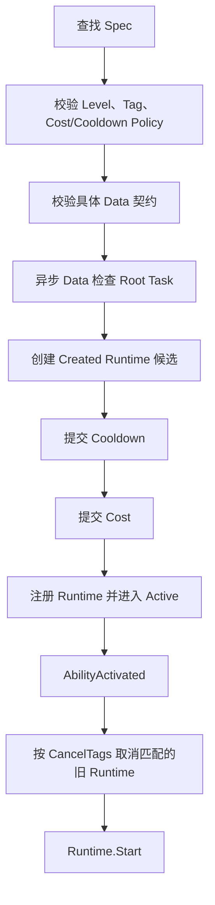
Cost 失败时精确移除本次刚创建的 Cooldown Runtime。只有新 Runtime 成功进入 Active 且 `AbilityActivated` 回调后仍然 Active，才会用 `CancelTags` 取消旧 Runtime；事件顺序为新 Runtime `AbilityActivated` 后再发送旧 Runtime `AbilityCancelled`。Root Task 为空或 Task 配置非法时，必须在 Cost/Cooldown 副作用前拒绝；异步 Ability 由 Owner 主动调用 ASC.Tick 推进。

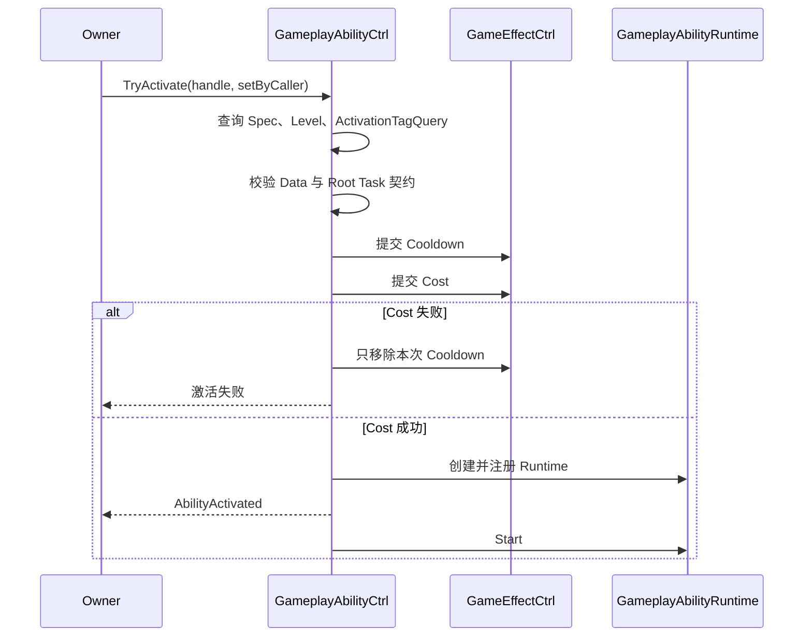

Runtime 进入终态后，Controller 先将它从 ActiveRuntimes 移除，再发送 AbilityEnded 或 AbilityCancelled。同步 Runtime 可能在 TryActivate 返回前结束，但事件顺序仍是 Activated → Ended。

## 4. 同步 Ability

SynchronousGameplayAbilityData 直接覆盖 Execute。执行返回后 Runtime 自动 Complete 并进入 Ended，不创建 Task，也不注册 Tick 回调。

同步只表示 Ability 业务入口在当前调用内完成，不代表它产生的对象必须立即销毁。例如投射物技能可以同步创建并发射投射物，投射物随后独立管理碰撞和生命周期。

同步实现不得注册持续更新或等待外部事件；需要等待时应改为异步 Ability。当前同步技能包括：

- `InstantGameplayAbilityData` 保存多个 Instant GE。激活时按列表顺序逐个提交；某一项 GE 被目标拒绝只记录失败，不回滚已成功项，也不阻止后续项。
- `ProjectileGameplayAbilityData` 是唯一的同步 Projectile GA。它从 Source Marker 或 Transform 计算批量扇形 Pose，再从对象池生成投射物；Linear 和 Sphere 只通过不同 Prefab 区分外观与碰撞。GA Runtime 随即 Ended，投射物通过统一 Behaviour 独立移动、命中并应用 Effects。
- `ProjectileSpawnConfig` 保存总扇形角、发射数量、局部位置、速度和寿命。同步 Projectile GA 直接在激活调用内发射；SkillConfig 使用 Projectile Clip 的 `StartFrame` 作为唯一延迟时机。

上述配置均可作为 ScriptableObject 在 GA Editor 中创建和检查。Odin Tester 使用 SO 引用而不是每次按钮点击临时创建 Ability Data，便于检查多态字段和 Validation。 测试夹具位于 Assets/GAS_Light/AbilitySystem/Runtime/GAData/SO/，可直接拖到 GameplayAbilityOdinTester 的 Skill 测试 SO 字段。
GA Odin 测试器还需要配置 `Assets/GAS_Light/AttributeSystem/Editor/TestAssets/GameplayAttributeTestSet.asset`。每次重置测试时，Tester 会将该 Set 导入新的 ASC；否则依赖 Attribute 的 Cost GE 无法提交。该 Set 只用于测试夹具，不是 GA Runtime 的必需依赖。

`GA_Test_PassiveSkill.asset` 使用 `PersistentSelfEffectsGameplayAbilityTaskConfig`，其 Infinite Effect 在启动时登记到 `GameplayAbilityRuntime.OwnedEffects`，并在 End/Cancel 时只移除本次 Runtime 持有的句柄。

## 5. 异步 Ability 与 Task

AsynchronousGameplayAbilityData 使用 SerializeReference 保存 Root Task Config。每次激活都从 Config 创建全新的 GameplayAbilityTask 实例，多个 Runtime 之间不共享运行状态。
`Assets/GAS_Light/AbilitySystem/Runtime/GAData/SO/GA_Test_AsyncAbility.asset` 是基础异步 Ability 测试资产，使用一秒 `WaitDurationGameplayAbilityTaskConfig`。激活后 Runtime 保持 Active，Owner 调用 `ASC.Tick` 累计一秒后 Root Task 完成，Runtime 进入 Ended。

Root Task 生命周期驱动 Runtime：

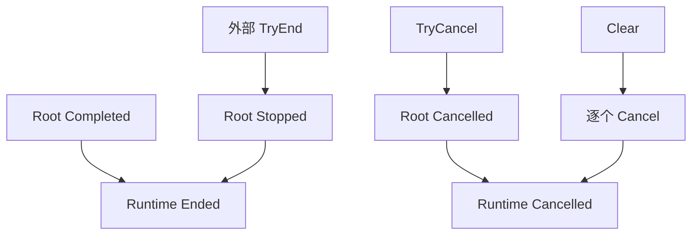
Task 不能直接写 Runtime.State。Task 完成只通知父 Sequence 或 Root Runtime。

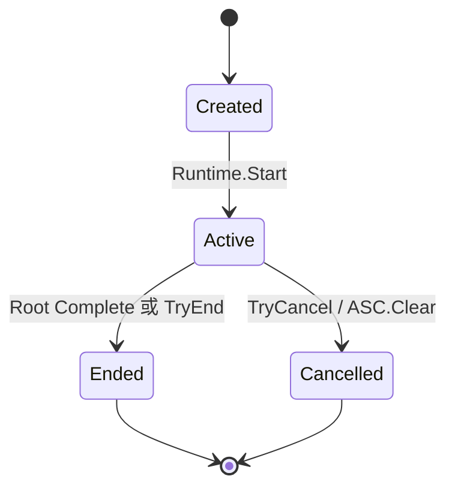

GameplayAbilityTaskState：

- Inactive
- Running
- Completed
- Stopped
- Cancelled

### Complete、Stop 与 Cancel

这三个结束入口都可能释放同一批临时资源，但它们代表不同的生命周期原因，不能互相替代。

| 入口 | 触发者 | Task 状态 | 是否发送 `Completed` | Runtime 结果 |
|---|---|---|---|---|
| `Complete()` | Task 自身条件满足 | `Completed` | 是 | `Ended` |
| `Stop()` | 外部要求正常结束 | `Stopped` | 否 | `Ended` |
| `Cancel()` | 外部打断或 `Clear()` | `Cancelled` | 否 | `Cancelled` |

`Complete()` 是任务的“成功完成”路径。它会发送 `Completed`，因此父级 `Sequence` 可以继续启动下一个子 Task；如果它是 Root Task，则通知 Runtime 正常进入 `Ended`。

```csharp
// WaitDuration 或动画进度达到结束条件。
if (elapsed >= duration)
    Complete();
```

`Stop()` 是外部发起的“正常提前结束”。Runtime 已经进入 `Ended`，Root Task 只被标记为 `Stopped`，不会再发送 `Completed`，也不会让 Sequence 继续推进后续步骤。

```csharp
// 例如外部主动结束蓄力技能，但不把“蓄力完成”当成成功完成。
source.Abilities.TryEnd(runtime);
```

`Cancel()` 是外部发起的“中断”。它进入 `Cancelled`，Controller 发送 `AbilityCancelled`，适用于眩晕、死亡、场景清理或 `AbilitySystemComponent.Clear()`。

```csharp
// 例如角色死亡时打断仍在运行的技能。
source.Abilities.TryCancel(runtime);
```

Task 不再向 Controller 单独注册 Tick。ASC 从 Active Runtime 快照出发，经异步 Runtime、Root Task 和组合 Task 逐层推进；Task 完成、正常结束或取消后会离开 Running/Active 状态，因此后续阶段自然不再进入该 Task。

例如一个由两个阶段组成的技能：

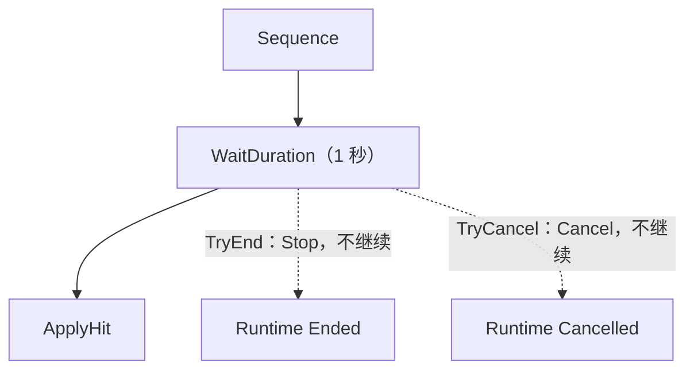

- 等待满 1 秒：`WaitDuration.Complete()`，Sequence 继续执行 `ApplyHit`。
- 等待过程中调用 `TryEnd`：Root Task `Stop()`，技能结束，但不会执行 `ApplyHit`。
- 等待过程中调用 `TryCancel`：Root Task `Cancel()`，技能被打断，也不会执行 `ApplyHit`。

因此，`Stop` 和 `Complete` 不能简单合并；最多只能抽取它们共有的资源释放逻辑。

## 6. Sequence 与 WaitDuration

Sequence 按顺序启动子 Task：

- 子 Task 同步完成时在当前调用内继续下一项。
- 子 Task 保持 Running 时等待完成通知。
- 空 Sequence 合法并立即完成。
- 空子项非法，Editor 和 Runtime 激活校验都会拒绝。
- Stop/Cancel 只传播给当前运行子项。
- 推进标记用于处理 Start 内同步完成回调，避免递归重复推进。

GameplayAbilityTask 阶段钩子：

- 启动时向所属 ASC 的 AbilityCtrl 注册 Tick 回调。
- AbilityCtrl 返回 WSFrame 的 IUnRegister；Tick Task 持有该句柄，并在 Stop、Cancel 或 Complete 时调用 UnRegister。
- IUnRegister 只负责 Task 从 AbilityCtrl 注销 Tick 回调，不改变 Runtime、ASC 或 GameObject 的生命周期。
- 每次更新调用业务子类的 OnTick(deltaTime)。
- 业务 Task 在 OnTick 中驱动动画进度、蓄力值、位移或持续输入，并在完成时调用 Complete()。
- Stop、Cancel 和 Complete 都会在完成通知前停止 Task 树的阶段推进。
- AbilityCtrl 每帧复用稳定快照推进回调：本帧注销且尚未执行的回调会跳过，本帧新增的回调从下一帧开始执行，因此回调修改注册表不会造成重复执行或漏执行。
- Tick Task 不保存 Animator、AnimationClip、SkillConfig、Transform 或目标信息。

WaitDuration：

- WaitDuration 直接继承 GameplayAbilityTask，只覆写普通 Tick。
- Duration 必须为有限值且不小于 0。
- 0 秒在完成注册后立即完成。
- 正数通过 Tick 累计时间，达到时长后完成。
- Stop 与 Cancel 都释放注册，注册只释放一次。

Odin Tester 中的 Tick Probe Task 按 ASC 普通阶段次数完成，用于验证“持续若干帧执行内容、达到条件后通知完成”的生命周期。未来 Task 可按需覆写普通、固定或延迟阶段，不需要阶段专用基类。

同步 Ability 不进入阶段推进；异步 Ability 由所属 ASC 的 AbilityCtrl 推进 Active Runtime 与 Task 树。

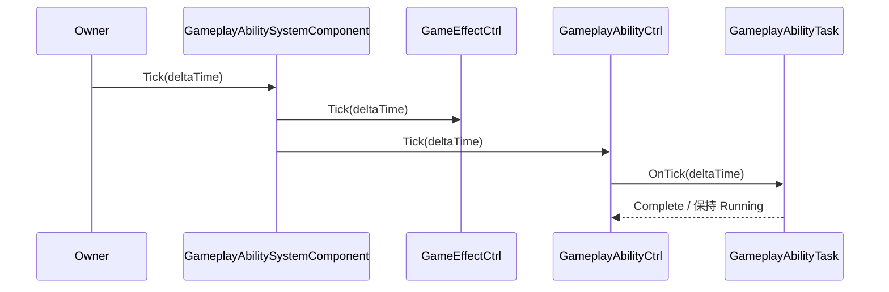

## 7. 常用自身技能与重复激活

当前阶段不依赖 Target Runtime。六类常用技能通过统一重复激活策略和三个自身 Effects Task 组合：

| Ability | 重复激活策略 | 执行方式 |
|---|---|---|
| Instant | `AllowMultiple` | 激活时立即向 Source 结算 |
| Passive | `RejectWhileActive` | Persistent Task 持有自身 Infinite Effects |
| Toggle | `ToggleOff` | 再次激活正常 End 旧 Runtime，不重复提交 Cost/Cooldown |
| SelfCast | `RejectWhileActive` | `WaitDuration → ApplySelfEffects` |
| SelfChannel | `RejectWhileActive` | Periodic Task 按 ASC Tick 结算 Instant Effects |
| LinearProjectile | `AllowMultiple` | 同步发射，投射物独立命中并结算 |

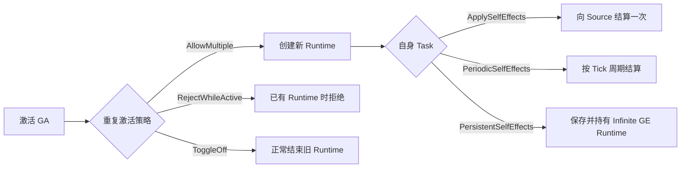

`PersistentSelfEffectsGameplayAbilityTask` 只接受 `Infinite + StackingType.None`，这样每次 Ability 激活都能把 GE Runtime 登记到 Ability Runtime 并精确移除。`PeriodicSelfEffectsGameplayAbilityTask` 只接受 Instant GE；已经完成的周期结算不会因后续 End/Cancel 回滚。

Cooldown 的身份来自 Cooldown GE 的 `GrantedTags`，不再通过 GE Data 引用判断。ASC 只要匹配任一 Cooldown Tag 就拒绝新的同类激活；Cooldown GE 不登记到 `OwnedEffects`，因此同步 Ability 结束或 Toggle Off 不会提前清理冷却。`IGameplayAbilityCtrl` 发布 `CooldownStarted` 与 `CooldownEnded`，事件参数同时携带 Ability、Handle、AbilityId、Cooldown Runtime 和剩余时长，UI Controller 可直接订阅并自行计时。

SelfCast 的等待正常完成后才进入 Apply Task。外部 `TryEnd` 会 Stop 当前 Root，`TryCancel` 会 Cancel 当前 Root，两者都不会越过等待阶段结算 Effects。

线性投射物复制 Source、Level、SetByCaller、Effects 与 CueTags 快照。GA Runtime 在发射后立即 Ended，投射物随后通过 Trigger 获取命中的 ASC；命中目标选择、阵营、LayerMask 和锁定逻辑不属于本阶段。

## 8. 统一 Tick 入口

外部 Owner 负责主动调用 `GameplayAbilitySystemComponent.Tick(deltaTime)`，GAS 不自动绑定 Unity `Update`。ASC 内部固定先调用 `GameEffectCtrl.Tick(deltaTime)`，再调用 `GameplayAbilityCtrl.Tick(deltaTime)`，因此同一帧先推进 GE 的周期与到期，再推进 GA 的 Tick Task。`deltaTime` 为负数、NaN 或 Infinity 时会被安全忽略。

同步 Ability 不进入阶段推进；异步 Ability 的 WaitDuration、动画、蓄力和其他持续 Task 都由所属 ASC 的 AbilityCtrl 通过 Active Runtime 树推进。Controller 每个阶段遍历帧开始时的 Runtime 快照，并在调用前确认 Runtime 仍属于当前 Controller 且保持 Active，因此 Task 可以在阶段中完成自身、取消其他 Ability 或启动新 Runtime，而不会破坏当前遍历。

## 9. Editor

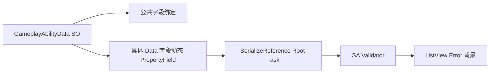

GA Editor 通过 TypeCache 发现公开、非抽象、非泛型的 GameplayAbilityData 子类。抽象同步/异步基类不会出现在 Create 菜单；内部测试类型也不会出现。

公共字段由固定 UXML 绑定，具体子类字段通过 SerializedObject 动态生成 PropertyField，不复制 Model 或 ViewData。

Root Task 与 Sequence 子项直接使用 Unity 原生 `SerializeReference PropertyField`。类型选择、替换、清空、Undo 和域重载都由原生 managed-reference 编辑能力处理，不再维护第二套自定义 Dropdown。

Validation 检查：

- Cost 必须是 Instant。
- Cooldown 必须是 Duration 或 Infinite。
- 异步 Root Task 不能为空。
- Sequence 子项不能为空。
- Wait Duration 不能为负数、NaN 或 Infinity。
- Passive 与 Toggle 必须使用 Persistent Task，Effects 必须是非叠层 Infinite GE。
- SelfCast 必须保持 `WaitDuration → ApplySelfEffects` 顺序。
- SelfChannel 必须使用合法 Periodic Task，Effects 只能是 Instant GE。
- LinearProjectile 必须具备 Addressable Key 或 Fallback Prefab；Prefab 需要投射物 Behaviour、Trigger Collider、Rigidbody 和根节点有效的 `IGameObjectPoolable.Key`。配置 Addressable Key 时，两者必须一致。

存在 Error 的 GA 在资产 ListView 中显示错误背景。

## Gameplay Ability 稳定身份与 Bake

`GameplayAbilityData.AbilityId` 是 Ability 资产的全局稳定整数身份，由 Editor Bake 后直接写入 Data。`GameplayAbilityHandle` 仍然只是某个 ASC 授予 Spec 时分配的临时运行时身份，不能跨 ASC 或跨会话保存。

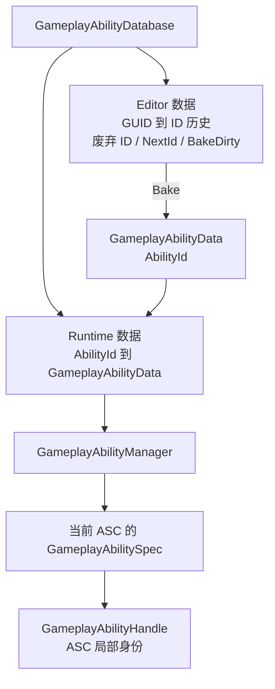

Database 使用 Unity 资产 GUID 识别同一个 Data，因此资产改名或移动不会改变 AbilityId。被删除资产使用过的 ID 进入废弃列表，后续不再复用。Editor 历史字段位于 `#if UNITY_EDITOR` 中，不进入 Player；运行时只保留已经 Bake 的 `AbilityId → GameplayAbilityData` 字典。

GA Editor 顶部只选择一个 GameplayAbilityDatabase 并执行 Bake。Play Mode 和 Build Guard 会检查 Data、GUID 历史与运行时字典是否一致。运行时启动流程负责调用 `GameplayAbilityManager.Initialize(database)`，Manager 不再临时重建第二份索引。

Database Inspector 中的 `Abilities By Id` 直接显示这份 Bake 生成的运行时字典，Key 是稳定 AbilityId，Value 是对应的 GA SO。该字典只读，不能在 Inspector 中手工增删；Ability 资产集合变化后必须回到 GA Editor 重新 Bake。Editor GUID 历史与 Runtime 字典始终由同一个 Database 维护。

同一 ASC 不能重复授予同一个 `GameplayAbilityData`。需要从未来存档的 AbilityId 找回当前 ASC Handle 时，调用 `TryGetAbilityHandle(abilityId, out handle)`：Manager 先将 ID 解析为 Data，当前 Controller 再查找该 Data 的 Spec。

本阶段不定义玩家存档 DTO、Capture 或 Restore API。未来存档只需保存 `AbilityId + Level`，不保存 `GameplayAbilityHandle`。

## 10. 当前边界

本阶段不实现：

- Parallel Task
- CancelReason
- SkillConfig Task
- Target Context
- 通用目标提交、锁定、范围、阵营和 LayerMask 筛选
- GE 业务 Task
- 具体动画系统、输入、网络预测

这些能力后续通过具体同步 Data、具体异步 Data 或业务 Task 扩展，不改变当前同步/异步基类和 Runtime 生命周期。

## 11. Root Task 完成语义

当前 Root Task 代表整套 Ability 流程。Root Task 完成后，GameplayAbilityRuntime 自动进入 Ended；如果需要多个阶段，使用 Sequence 继续组织子 Task。

这是一种当前阶段的简化约定。未来若需要 UE 风格的“Task 完成但 Ability 仍保持 Active”，应增加显式 Ability 流程或 Completion Policy，由 Ability 决定何时 TryEnd，而不是让 Task 私自修改 Runtime 状态。

## ASC 初始化与多 Set

`GameplayAbilitySystemComponent` 是挂载在角色 Owner 上的 MonoBehaviour 运行时组件。ASC 在 `Awake` 中只查找一次同节点的 `IGameplayAbilitySystemOwner` 并保存为 `Owner`；缺失宿主会立即抛出配置错误。Owner 调用 `Initialize(attributeSets)`；ASC 不自行绑定 Unity 更新，正式角色负责推进 GE 与 GA，并在正常退场时调用 `ASC.Clear()`。组件 `OnDestroy` 会再次执行清理，确保 Active GA、Task 和 GE 不残留。

多个 `GameplayAttributeSet` 会被 `GameplayAttributeContainer` 导入为同一个运行时 Attribute 集合。不同 Set 可以分别承载战斗、资源或移动属性；相同 `AttributeId` 在多个 Set 中出现时视为配置冲突，不会自动覆盖或合并 Definition。

ASC 成功初始化后再次调用 `Initialize` 直接返回。初始化失败只通过 `Debug.Log` 输出原因，ASC 保持未初始化。Ability Controller 不重复检查 ASC 初始化状态，其生命周期由 ASC 和外部 Owner 的调用顺序保证。

## ASC 高频快捷接口

`GameplayAbilitySystemComponent` 提供面向业务层的高频门面，但不复制 Controller 状态，也不重新发送事件。Ability 相关操作都作用于当前 ASC 作为 Source 的 `Abilities` Controller：

- `GiveAbility`、`TrySetAbilityLevel`、`TryGetAbilitySpec` 和 `TryRemoveAbility` 管理授予的 Spec。
- `TryActivateAbility` 提交既有的 Tag、Cooldown、Cost 检查，并保持原有 Runtime 与生命周期事件顺序。
- `TryEndAbility` 与 `TryCancelAbility` 只结束或取消 Runtime，不自动移除 Runtime 已应用的 GE。
- `GrantedAbilities` 与 `ActiveAbilities` 是 Controller 列表的只读别名，不创建快照，也不允许外部修改。

复杂流程或需要订阅 `AbilityActivated`、`AbilityEnded`、`AbilityCancelled` 的代码继续使用 `source.Abilities` Controller；ASC 本身不增加第二套事件系统。

GE 快捷接口作用于当前 ASC 作为 Target：`TryApplyEffect` 接收显式 Source、Level 和 SetByCaller，简化重载默认 Level 为 1 且不携带 SetByCaller；`TryRemoveEffect` 只接受属于当前 Target 的 Runtime。`ActiveEffects` 与 `HasActiveEffect` 直接转发目标 `GameEffectCtrl`，不复制叠层、计时或 Modifier 状态。

例如，普通技能代码可以写成 `target.TryApplyEffect(effect, source, level, setByCaller, out runtime)`，而需要监听 Ability 生命周期的系统仍直接订阅 `source.Abilities`。Tag、Attribute 和 Modifier 不提供 ASC 直接修改快捷入口。
## ASC Owner 接口

`GameplayAbilitySystemComponent` 直接继承 `MonoBehaviour`，不能使用 `new` 创建。角色宿主实现 `IGameplayAbilitySystemOwner`，提供根 Transform 与可选的根 MarkerProvider。`PlayerController` 进一步实现 `ISkillGameplayAbilitySystemOwner`，向 SkillConfig Task 提供 `ISkillRuntimeHost` 与 `IMotionDriver`。Skill Task、Projectile 和 Cue 只依赖这些接口，不再从 ASC 反复 `GetComponent` 查询稳定角色能力。

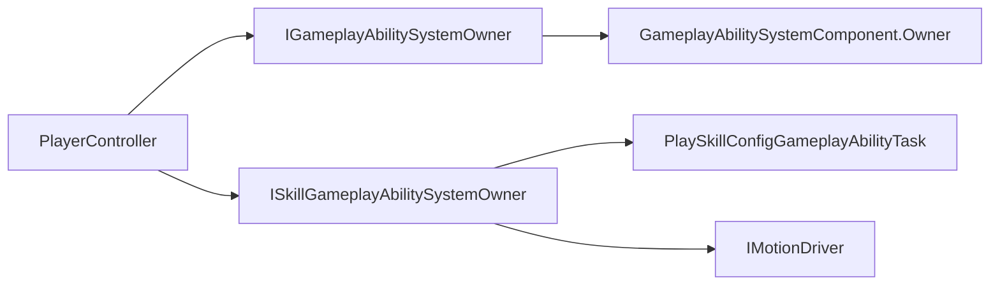

动态命中目标仍允许通过碰撞对象查找目标 ASC，因为目标对象在碰撞发生前并不是当前技能的稳定宿主依赖。纯 GAS 测试对象使用 `GameplayAbilitySystemTestOwner` 提供最小宿主；它不提供 SkillRuntimeHost，因此不能伪装成 SkillConfig 角色。

具体 Projectile GA 通过 `runtime.SourceOwner.RootTransform` 和 `runtime.SourceOwner.MarkerProvider` 解析生成位置。投射物的移动、碰撞与命中结算属于具体 GA 产生的投射物实例，不需要额外的 ASC Behaviour 包装或重复查询角色组件。

`GameplayAbilitySystemComponentOdinTester` 专门验证 ASC 集成周期：它在 Play Mode 为每个技能分别创建 Source/Target Mono ASC，由临时 ASC 自身推进 Unity 三阶段，并覆盖既有 GA 与 SkillConfig 自然完成、End、Cancel、立即重播。每个技能均有独立 Odin 按钮；完整套件调用相同场景实现，但在场景之间重建 ASC。`GameplayAbilityOdinTester` 只保留 GA Data、Runtime、Task 与事件的隔离测试。

AbilityTags Cancel 场景同时从当前 Ability Database 授予 SelfCast 与 Instant，并初始化 GameplayTagDatabase 供运行时解析层级关系。当前测试夹具使用 `CueTest.GA.Instant` 作为 SelfCast 的 AbilityTag，使用其父级 `CueTest.GA` 作为 Instant 的 CancelTag。SelfCast 先跨帧保持 Active，观察窗口最多占真实 WaitDuration 的 25%，确保 Instant 激活前读条尚未完成；随后 Instant 成功提交 Cost/Cooldown、发送 Activated、取消 SelfCast 并同步结束自身。取消后继续使用真实 ASC Tick 超过原读条时间，确认 SelfCast 不会延迟结算 Effects 或 Cue。

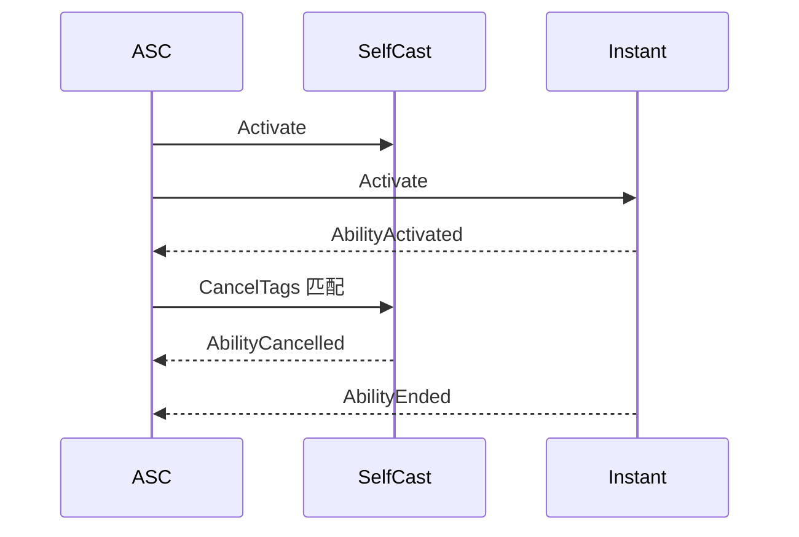

隔离的 `GameplayAbilityOdinTester` 用于验证 Controller 的匹配方向与事件规则；ASC Tester 则进一步覆盖真实 Mono ASC、真实 Tick、Attribute、Cue 和清理生命周期，二者不互相替代。

## ASC 真实周期可视化

`GameplayAbilitySystemComponentOdinTester` 在每个独立技能场景开始时创建蓝色 Source 和红色 Target，Target 默认位于 Source 前方三米。两者均使用真实 Mono ASC；Coroutine 只等待与断言，不重复手动推进。Attribute、Cooldown、Active GE/GA/Cue 和 Runtime 不会跨技能场景保留。

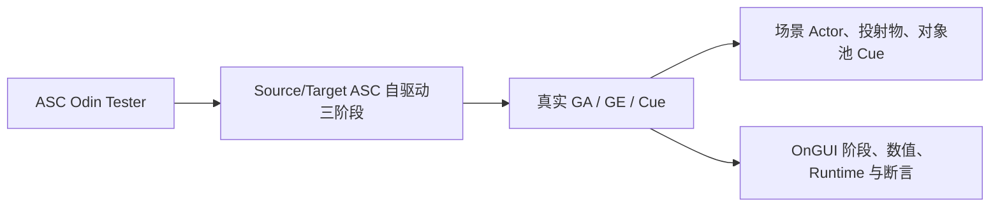

独立的 `GameplayAbilitySystemComponentTestVisualizer` 只读取 CurrentValue 和只读 Runtime 列表。Source 默认显示蓝色，Armor 增益期间变为绿色；Target Health 降低时短暂闪烁黄色。面板实时显示 Health、MP、Armor、Active GA、Active GE、Active Cue、当前阶段和 PASS/FAIL，不参与任何业务提交。

完整周期依赖 `GameplayAbilityDatabase` 与 `GameplayCueDatabase`。每个场景只检查当前 GA 的非空 CueTag；测试结束时通过 ASC 正式 `Clear` 路径清理 Active Cue，再解除静态观察事件并重置测试 Manager。

投射物场景使用相对 Tester 的 `Test World Offset` 建立独立测试通道。发射前通过物理查询检查 Source 到 Target 之间是否存在第三方 ASC；发现时输出具体对象和位置并停止当前投射物场景。命中断言同时检查专用 Target 的 Health 和 Cue Runtime 的实际 Target，避免投射物先命中其他角色后产生误报。

池化 Linear Projectile 的生成 Pose 由 `GameplayAbilityProjectileBehaviour.Initialize` 统一提交。Data 只解析 Marker、位置偏移和旋转；Behaviour 在 `running = false` 时恢复 Prefab Scale，先同步写入 `Transform` 与 `Rigidbody` Pose，再清零旧速度，全部运行快照完成后才允许 FixedUpdate。`Transform` Pose 保证插值刚体在生成当帧就能正确显示和查询，`Rigidbody` Pose 则保证下一物理帧从同一位置开始碰撞与 `MovePosition`；两者不能只写其一。

Linear Projectile 单项场景连续发射两次：第一次验证新实例，第二次验证对象池复用。Tester 记录 Transform/Rigidbody 初始位置、最后飞行位置、Target 位置、回收状态和 Prefab Scale；OnGUI 在投射物存续期间实时显示其世界位置。

## Editor 校验与刷新

GA Editor 的 Tag 字段与列表内部重复校验不依赖运行时 `GameplayTagManager`。
`AbilityTags` 与 `CancelTags` 之间允许有意匹配，以支持 SkillConfig 主动作通过公共标签替换旧 Runtime。

## Unity 三阶段与 SkillConfig

ASC 默认在 `Update` 中先推进 GE、再推进 GA 普通阶段；`FixedUpdate` 与 `LateUpdate`
只推进 GA。同步 Runtime 在激活调用栈内完成，异步 Runtime 才把三个阶段转发给 Root Task。

SkillConfig 类型的异步 Task 从 `Runtime.SourceOwner` 获取 `ISkillRuntimeHost`。Host 为每个角色长期持有唯一

SkillConfig 当前动作阶段通过 Task 写入 Source ASC：阶段使用 `State.Action.Skill.Phase.*`，打断状态使用 `State.Action.Skill.Interruptible/Uninterruptible`。所有 SkillConfig GA 的 ActivationTagQuery 禁止 `Uninterruptible`，使不可打断阶段在 Runtime 创建及 Cost/Cooldown 提交前拒绝新技能；可打断阶段仍由公共 `Ability.Action.Skill` CancelTag 替换旧 Runtime。Task 的全部终态都必须对称撤销其 Tag 计数。
`SkillRuntimeModule`，自身不实现 Unity 更新；当前 Running Task 在普通阶段调用 `Tick`，在延迟阶段
调用 `LateTick`。GAS 通过 AbilityTags、CancelTags 与 Runtime 生命周期决定替换和打断，Module 只负责
时间轴、轨道命中和资源清理。

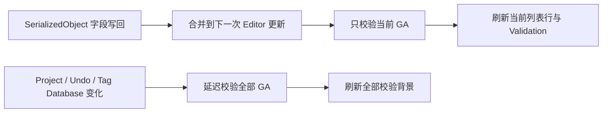

切换 GA 时必须先解除旧 `SerializedObject` 绑定和跟踪；页面释放时取消尚未执行的
`delayCall`，避免旧页面继续刷新。静置页面不会执行 GA 校验或扫描项目资产。
## 外部时序与技能根运动

ASC 不再实现 Unity `Update`、`FixedUpdate` 或 `LateUpdate`，正式角色由 `PlayerController` 统一推进普通、固定、动画根运动和延迟阶段。`UpdateAnimationMove` 与其他 GA 阶段一样沿 Active Runtime 和当前 Running Task 转发，但不推进 GE。

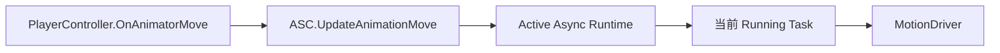

`SkillConfig.IsRootMotion` 是单个技能的作者配置。`PlaySkillConfigGameplayAbilityTask` 仅在该配置启用时直接调用角色 `MotionDriver.UpdateAnimationMove`；`SkillRuntimeHost` 仍只负责时间轴 Module，不参与角色移动。
