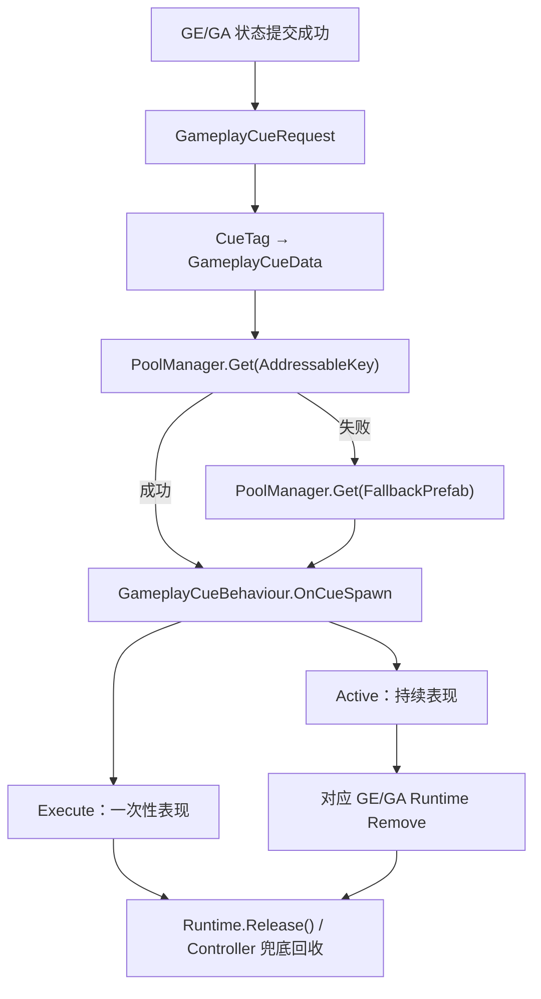
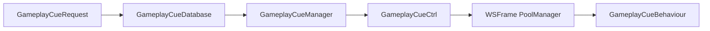
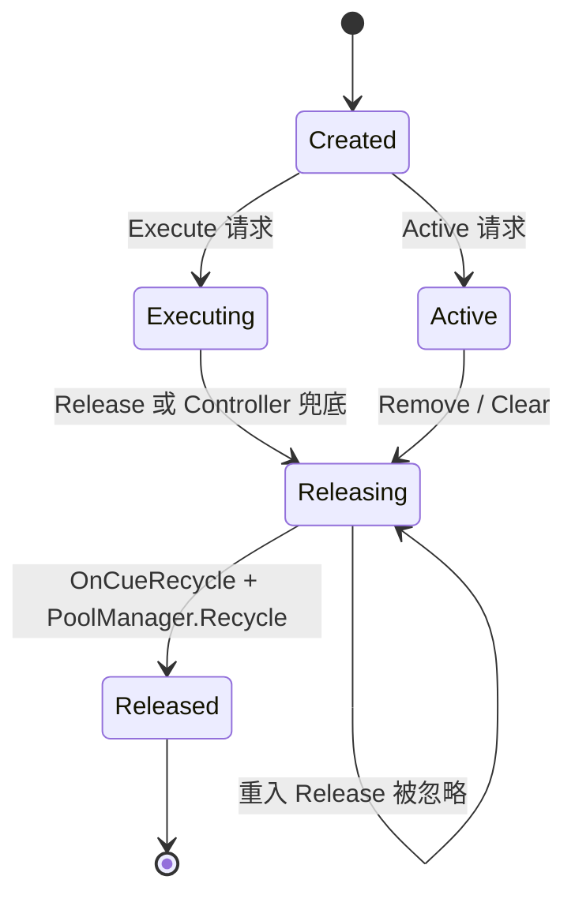
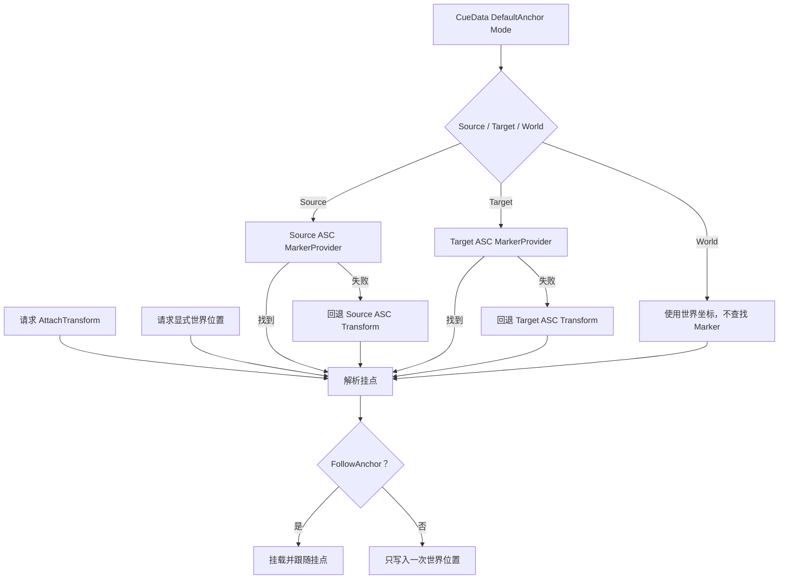
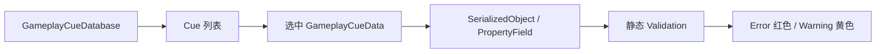

# GameplayCue 运行时设计

GameplayCue 是表现层事件，不参与 Attribute、GameplayEffect 或 GameplayAbility 的规则计算。GE/GA 只有在自己的状态提交成功后，才通过所属 ASC 发布 `GameplayCueRequest`；Cue 播放失败不会回滚已经完成的游戏状态。

## 数据与映射

`GameplayCueData` 是作者配置 SO，保存 `CueTag`、可选 `MarkerKey`、Addressable Key、Prefab 回退资源、默认 Anchor、局部位置/旋转和是否跟随挂点。它不保存运行时对象、来源 ASC 或激活状态。

`GameplayCueDatabase` 保存作者数据列表，并在初始化时构建 `Dictionary<GameplayTag, GameplayCueData>`。运行时只按稳定 TagId 查询，不根据字符串猜测 Cue。重复 CueTag、非法 CueTag 和空 CueData 在 Editor 提示问题；运行时重复项保留首次登记项。

## 事件与生命周期

ASC 内部的 `CueRequested` 是局部事件，`GameplayCueCtrl` 在 ASC 创建时订阅，在 ASC 销毁时解除。`Clear` 会回收表现但保留订阅，使同一个 ASC 在 Owner 再次显式 `Initialize` 后仍可使用；事件只携带本次 CueTag、Source、Target、GE/GA Runtime 以及可选的世界位置、旋转和动态挂点，不引入通用计算 Context。

生命周期如下：





`GameplayCueBehaviour` 挂在池化 Prefab/实例上。它不能直接 `Destroy` 自身，必须调用 `GameplayCueRuntime.Release()`。`Release()` 是表现脚本或外部句柄使用的释放请求；`GameplayCueCtrl` 自己处理 `TryRemove`、来源移除、`Clear` 和 Execute 兜底时，直接调用内部 `ReleaseRuntime()`，不再绕回公开入口。两条路径最终都进入同一个回收事务：先取得唯一释放权并移除 Controller 管理关系，持续 Cue 再执行一次 `OnRemove`，随后执行 `OnCueRecycle`、调用 `PoolManager.Instance.Recycle` 并标记 `IsReleased`。由于 `OnRemove` 发生时 Runtime 已不在 Controller 集合中，回调再次调用 `TryRemove` 或 `Release` 都不会递归释放。

释放流程是同步的，但 `OnRemove`、`OnCueRecycle` 和对象池回调仍可能在同一调用栈内再次发起释放。因此 Runtime 同时保存 `releasing` 和 `released`：前者表示回收事务正在执行，后者表示对象已经完成对象池归还；两者共同保证回调重入和重复释放都不会重复回收。`Clear` 每次处理当前 `liveCues` 的最后一项，不保留可能被同步回调破坏的旧列表索引。



GE 的 Instant 和 Periodic 成功结算发布 Execute；Duration/Infinite 首次应用发布 Active，叠层重应用不重复创建 Active，可发布 Execute；Runtime 最终移除发布 Remove。减少一层但 Runtime 仍存在时不发布 Remove。Passive GA 在启动时发布 Active，在 End/Cancel 时发布 Remove；Instant GA 在同步执行时发布 Execute；Projectile 在命中时发布 Execute。GA End/Cancel 不会自动移除它之前应用的 GE，因此不会误清理 GE Cue。

## 对象池与位置

CueController 不直接调用 `Instantiate` 或 `Destroy`。Addressable Key 优先，获取失败后使用 Fallback Prefab，两者都失败则记录错误并放弃本次表现。正式项目应使用 WSFrame PoolManager 的 Prewarm，避免首帧资源加载阻塞；Prefab 建议配置 `PoolObjectIdentity.PoolKey` 以保证回收定位稳定。

位置优先级为：请求动态挂点、请求显式世界位置、CueData 的 Marker 与 DefaultAnchor Mode。`DefaultAnchor Mode` 是默认挂载对象模式，不是 Marker 本身：当没有显式挂点或世界位置时，它决定使用 Source、Target 或 World。`DefaultAnchor = Source` 时，在 Source ASC 根节点的 `MarkerProvider` 中查找 `MarkerKey`；`DefaultAnchor = Target` 时，在 Target ASC 根节点的 `MarkerProvider` 中查找。Marker 解析失败时，才回退到 DefaultAnchor 指定的 ASC Transform；`DefaultAnchor = World` 时不查找 Marker，直接使用世界位置。`FollowAnchor` 为真时对象保持挂在解析出的 Marker 或 ASC Transform 下；否则只在生成时写入一次世界位置。Marker 和 DefaultAnchor 只影响表现位置，不参与 GE/GA 规则计算。



## Editor 与测试

GE/GA Editor 只绑定 `CueTags` 数组，CueTag 选择继续使用现有 GameplayTagPropertyDrawer，不直接保存 CueData 引用。Validator 检查空/非法/重复 CueTag；只有当前 CueDatabase 已初始化时才检查映射是否存在，避免编辑器未初始化运行时单例导致误报。

`GameplayCueOdinTester` 使用真实 ASC、CueDatabase 和 PoolManager，验证 Execute、Active/Remove、重复 Active 不创建第二个实例以及 Clear 回收。测试 Prefab 上挂 `GameplayCueProbeBehaviour`，由行为记录回调并主动释放一次性表现。另提供 Play Mode 下的“显示 Cue 可视化”按钮：生成 Active Cue 后默认保持 5 秒，输出 Cue 对象、父节点、位置和旋转，时间到期后回收到对象池；也可以通过“清理 Cue 可视化”立即移除。可视化需要使用带 Renderer、ParticleSystem 或其他可见表现的 Cue Prefab，Execute 的立即回收语义不因测试改变。
## Odin 真实 Actor 可视化测试

`GameplayCueOdinTester` 不再创建临时 ASC。测试器需要在 Inspector 中配置两个场景 Actor：`Source Actor` 和 `Target Actor`，测试器从两个 Actor 根节点取得 `GameplayAbilitySystemComponent`。请求统一发布到 Target ASC，Source ASC 只作为请求来源。

测试器使用四个独立的 `GameplayCueData`：

- `Source Cue`：`DefaultAnchor = Source`，验证 Source Marker 或 Source Transform。
- `World Cue`：`DefaultAnchor = World`，验证不挂载 Actor 的世界位置。
- `Target Cue`：`DefaultAnchor = Target`，验证 Target Marker 或 Target Transform。
- `Follow Cue`：使用 Source 或 Target Anchor，并开启 `FollowAnchor`，验证 Actor 移动时 Cue 同步移动。

Inspector 中可分别点击“显示 Source Cue”“显示 World Cue”“显示 Target Cue”和“显示 Follow Cue”，也可以点击“执行四类 Cue 可视化”同时观察四种结果。Active Cue 默认保持 5 秒，期间会输出对象名称、父节点、世界位置和旋转，结束后只回收本次测试创建的 Runtime。

Follow 测试会临时移动对应 Anchor Actor，验证完成后恢复其位置和旋转。测试器不会销毁外部 Actor，不调用 Source/Target ASC 的 `Clear()`，也不会影响场景中已有的 GE、GA、Attribute 或其他 Cue。点击“清理 Cue 可视化”可提前回收本次测试对象。

## Cue Editor 页面



Cue 编辑器作为 GAS 主窗口中的 `Cue` 选项卡存在，不创建第二个 `EditorWindow`。`GameplayCueDatabase` 是编辑器唯一权威来源，列表只显示当前 Database 的 `cues`。窗口顶部可以切换 Database，并通过 SessionState 恢复 Database、选中的 CueData 和搜索文本。

创建 CueData 时会在同一个编辑操作中自动注册到当前 Database；添加已有 CueData、从 Database 移除和将资产移入回收站是三个不同操作。编辑器不会自动扫描或静默注册孤立 CueData，也不会自动改变 Database 中的顺序。

详情页面直接使用 `SerializedObject` 和 `PropertyField` 绑定 CueTag、Addressable Key、Fallback Prefab、Anchor、偏移和 Follow Anchor。CueTag 的选择继续由现有 GameplayTagPropertyDrawer 负责。编辑器只做静态校验和资源定位，不加载 Addressable、不调用 PoolManager、不生成预览对象，也不执行 GameplayCueBehaviour。

列表行根据当前 Database 校验结果显示红色 Error 或黄色 Warning 背景。校验包括空引用、重复 CueTag、资源入口、Fallback Prefab 上的 GameplayCueBehaviour、PoolObjectIdentity.PoolKey 以及非法位置数据。运行时仍由 GameplayCueManager、GameplayCueCtrl 和 PoolManager 负责真正映射、生成、执行和回收。

## GE/GA 与 Cue 集成测试

`GameplayCueIntegrationOdinTester` 是独立的 Play Mode Odin 测试器，使用 Inspector 中提供的真实 Source Actor、Target Actor、GameplayAbilitySystemComponent、GameplayTagDatabase、GameplayCueDatabase 和 `GameplayAttributeTestSet`。测试器的 `Update` 只在测试运行期间调用两个 ASC 的 `Tick(Time.deltaTime)`，因此 Duration、Infinite、Periodic 和异步流程都使用真实帧推进。

测试器不会调用外部 ASC 的 `Clear()`，也不会销毁 Source/Target Actor。它只保存并清理本次创建的 GE Runtime、GA Runtime、Ability Handle 和 Cue Runtime。点击“检查 GE/GA Cue 配置”可以在执行前确认以下内容：

- TagDatabase 已配置，事件 CueTag 已存在并完成 Bake。
- CueDatabase 已初始化，并且每个事件 CueTag 都映射到 CueData。
- GE/GA 资产的 `CueTags` 包含测试器指定的事件 CueTag。
- GE 的 Duration 类型和 Period 配置符合当前测试场景。
- Fallback Prefab 存在 `GameplayCueVisualProbeBehaviour` 时，才能记录可视化回调。

本轮集成测试需要在 Inspector 中填写以下事件标签：

```text
CueTest.GE.Instant
CueTest.GE.Duration
CueTest.GE.Infinite
CueTest.GE.Periodic
CueTest.GA.Instant
CueTest.GA.Passive
CueTest.GA.Projectile
```

建议将 `GE_Test_PassiveArmor` 绑定到 Tester 的 Infinite GE 字段，因为它是无 RequiredTag 条件的 Infinite Armor 测试资产；将 `GE_Test_DurationStat`、`GE_Test_DurationPeriod` 和 `GE_Test_InstantFixed` 分别绑定到 Duration、Periodic 和 Instant 字段。GA 字段使用现有 `GA_Test_InstantSkill`、`GA_Test_PassiveSkill` 和 `GA_Test_SphereProjectile`。

事件标签必须分别配置到对应 GE/GA 的 `CueTags`，并在 CueDatabase 中注册对应的 CueData。测试器会直接报告缺失的 Tag、未 Bake 的 Tag、未注册的 CueData 或资产未声明 CueTag，不会静默跳过。

集成场景包含四类 GE/Cue 语义：

| 场景 | Period | 验证重点 |
| --- | ---: | --- |
| Instant | 0 | Attribute 立即结算、Execute Cue 和立即回收 |
| Duration | 0 | Active Cue 持续到期、GE 到期后 Remove Cue |
| Infinite | 0 | Active Cue 不自动到期，只能显式移除 |
| Duration + Periodic | 大于 0 | 周期 Attribute 结算和重复 Execute Cue，最终到期移除 |

GA 集成场景验证 Instant、Passive 和 Projectile：Instant 在同步执行中发布 Execute，Passive 在 Runtime 存续期间保持 Active Cue，Projectile 在真实 Trigger 命中时对 Target 应用 Effects 并在命中点发布 Execute Cue。

新增的 `GameplayCueVisualProbeBehaviour` 使用 `MaterialPropertyBlock` 修改 Renderer 的实例颜色，并通过局部 Scale 区分状态。Execute Cue 保持正式的立即回收语义，因此通过 Probe 回调记录；Duration、Infinite 和 Passive Cue 在生命周期内保持可见。对象回收时 Probe 会恢复材质属性、Scale 和计数，避免下一次测试继承旧状态。
