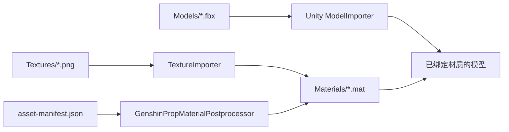

# 原神道具 Unity URP 资源

本目录由 `Tools/export_genshin_props.py` 从只读的 Blender 资产库生成。FBX 负责网格、层级和材质槽；PNG、JSON 与 Unity Editor 后处理器负责创建并绑定 URP/Lit 材质。



## 导出

在 PowerShell 中从仓库根目录执行：

```powershell
.\Tools\run_export.ps1
```

单个样例验证：

```powershell
.\Tools\run_export.ps1 -AssetFilter 'Apple' -Limit 1 -OutputRoot '.\BuildScratch\AppleSample'
```

## 导入 Unity

1. 确认目标项目已安装 Universal Render Pipeline。
2. 将整个 `UnityReadyAssets` 目录复制到目标项目的 `Assets` 下，不要只复制 FBX。
3. 等待脚本编译与资源导入完成；后处理器会配置贴图、生成 `Materials/*.mat` 并设置 FBX 外部材质映射。
4. 查看 `export-report.md`，重点复核透明材质和无 UV Mesh。

## 材质约定

- Diffuse 作为 URP Base Map，使用 sRGB。
- Normal 作为 Unity Normal Map，按 OpenGL 方向导入。
- SMBE 原图作为线性数据保留。
- `*_SpecGloss.png` 使用中性介电高光，Alpha 来自 SMBE 红通道 Smoothness。
- 仅在源节点明确连接 SMBE Alpha 且发光强度大于零时生成 `*_Emission.png`。
- 源透明材质默认先使用 Alpha Clipping，以避免大量道具出现透明排序问题；报告中会列出需要人工判断为 Transparent 的材质。

Blender 的 `GenshinPBR - SMBE` 是自定义复合高光模型，标准 URP/Lit 只能近似还原。原始 SMBE 贴图会保留，后续可替换为专用 Shader。
