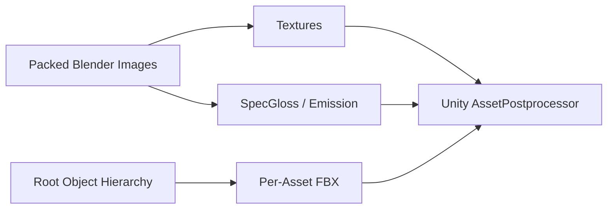

# 原神道具 Unity 导出报告

- 资产：191
- 材质：255
- 去重及派生后的贴图：645
- 无 UV Mesh：1
- 需复核透明材质：27
- 失败：0

## 数据流

## 需要人工复核的透明材质

- Area_Xm_Prop_XKC_Chengshidalishi_04
- Indoor_Dq_Build_Wood_01_T4.001
- Indoor_MdBuild_Knight_Ground01.001
- Indoor_MdBuild_Knight_Ground01.002
- Homeworld_Interior_Md_Room_Window_01
- Homeworld_Interior_Md_Room_Window_01.003
- Area_Dq_Build_Common_TsgWood_01
- Area_Dq_Prop_MS_DSObjectAll_01
- Area_Dq_Prop_MS_DSObjectAll_02
- Area_Dq_Build_MS_CityHouse_02
- Area_Dq_Light_MS_LampAll_03.002
- Area_Dq_Prop_MS_ObjectAll_01.003
- Area_Dq_Build_MS_CityHouse_01.001
- Area_Dq_Ajar_MS_BankaifangXC_01
- Area_Dq_Ajar_MS_BankaifangXC_02.002
- Area_Dq_Prop_MS_Bulian_01.001
- Area_Ly_Build_Common_Archway01
- Indoor_Dq_Build_Wood_01_T4.002
- Indoor_MdProps_ManorHouse01_Fireplace
- Area_Dq_Prop_Common_Tanwei_02
- Homeworld_Interior_Dq_Build_Wall_01.001
- Indoor_Dq_Build_Tatami_01_T4
- Homeworld_Interior_Dq_Build_Wall_01.002
- Indoor_Dq_Build_Tatami_01_T4.001
- Homeworld_Interior_Ly_Room_Floor_01.003
- Area_Mdcity_Edge02
- Area_Dq_Prop_MS_Dashehuima_01

## 警告

- 透明材质需在 Unity 复核：Area_Xm_Prop_XKC_Chengshidalishi_04
- 透明材质需在 Unity 复核：Indoor_Dq_Build_Wood_01_T4.001
- 透明材质需在 Unity 复核：Indoor_MdBuild_Knight_Ground01.001
- 透明材质需在 Unity 复核：Indoor_MdBuild_Knight_Ground01.002
- 透明材质需在 Unity 复核：Homeworld_Interior_Md_Room_Window_01
- 透明材质需在 Unity 复核：Homeworld_Interior_Md_Room_Window_01.003
- 透明材质需在 Unity 复核：Area_Dq_Build_Common_TsgWood_01
- 透明材质需在 Unity 复核：Area_Dq_Prop_MS_DSObjectAll_01
- 透明材质需在 Unity 复核：Area_Dq_Prop_MS_DSObjectAll_02
- Mesh 没有 UV：Fruit and Veggie Stall: Good Honest Flavor / Area_Dq_Prop_Common_TanWei_05_ShadowMesh
- 透明材质需在 Unity 复核：Area_Dq_Build_MS_CityHouse_02
- 透明材质需在 Unity 复核：Area_Dq_Light_MS_LampAll_03.002
- 透明材质需在 Unity 复核：Area_Dq_Prop_MS_ObjectAll_01.003
- 透明材质需在 Unity 复核：Area_Dq_Build_MS_CityHouse_01.001
- 透明材质需在 Unity 复核：Area_Dq_Ajar_MS_BankaifangXC_01
- 透明材质需在 Unity 复核：Area_Dq_Ajar_MS_BankaifangXC_02.002
- 透明材质需在 Unity 复核：Area_Dq_Prop_MS_Bulian_01.001
- 透明材质需在 Unity 复核：Area_Ly_Build_Common_Archway01
- 材质 Indoor_Dq_Prop_Lantern_01.002 的 Diffuse 与 SMBE 尺寸不同，未生成 Emission
- 材质 Indoor_Dq_Prop_Lantern_01_Unlit 的 Diffuse 与 SMBE 尺寸不同，未生成 Emission
- 透明材质需在 Unity 复核：Indoor_Dq_Build_Wood_01_T4.002
- 材质 Indoor_Dq_Prop_Lantern_01.001 的 Diffuse 与 SMBE 尺寸不同，未生成 Emission
- 透明材质需在 Unity 复核：Indoor_MdProps_ManorHouse01_Fireplace
- 透明材质需在 Unity 复核：Area_Dq_Prop_Common_Tanwei_02
- 透明材质需在 Unity 复核：Homeworld_Interior_Dq_Build_Wall_01.001
- 透明材质需在 Unity 复核：Indoor_Dq_Build_Tatami_01_T4
- 透明材质需在 Unity 复核：Homeworld_Interior_Dq_Build_Wall_01.002
- 透明材质需在 Unity 复核：Indoor_Dq_Build_Tatami_01_T4.001
- 透明材质需在 Unity 复核：Homeworld_Interior_Ly_Room_Floor_01.003
- 透明材质需在 Unity 复核：Area_Mdcity_Edge02
- 透明材质需在 Unity 复核：Area_Dq_Prop_MS_Dashehuima_01

## 失败

