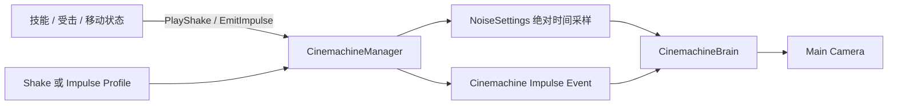
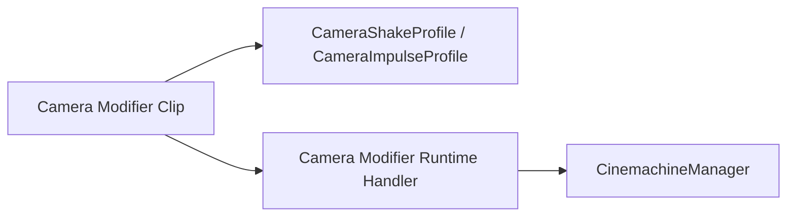

# Camera Shake System

## 系统分层



- `NoiseSettings`只定义震动波形，即各轴由哪些频率和幅度组成。
- `CameraShakeProfile`定义这类波形如何播放，包括整体幅度、频率倍率、生命周期和淡入淡出。
- `CameraImpulseProfile`定义单次冲击的标准波形、时长、方向和强度。
- `CinemachineManager`拥有请求、Handle、混合顺序和释放，不读取技能配置。
- `CinemachineBrain`仍负责最终镜头状态；Manager 每帧从 Brain 原始状态重新应用偏移，避免累计漂移。

## Noise 与 Impulse 的区别

持续 Noise 适合一段时间内不断存在的感觉：

- 奔跑时轻微手持抖动。
- 蓄力过程逐渐增强的震动。
- 载具、风暴或地震环境。

Impulse 适合某一时刻发生的冲击：

- 轻受击、重受击。
- 角色落地。
- 爆炸、砸地和后坐力。

不要用极短 Noise 模拟 Impulse。Impulse 自带冲击波形和事件包络，持续 Noise 则允许调用方随时改变强度并主动停止。

## 参数理解

### Amplitude

控制“震多远、转多大”。最终幅度为：

```text
NoiseSettings 原始幅度
× Profile.AmplitudeGain
× PlayShake(strength)
× 当前淡入淡出权重
```

### Frequency

控制波形推进速度，不改变空间幅度：

```text
sampleTime = elapsedSeconds × FrequencyGain
```

频率越大，震动变化越快；频率越小，镜头像缓慢摇摆。

### Seed

Seed 只改变噪声从哪个相位开始，不改变 Profile 参数。相同 Profile、Seed 和经过时间得到相同结果，因此后续时间轴可以复用这套采样实现进行 Scrub。

### Fade

- Fade In：开始时从零平滑提升。
- Fade Out：定时结束或手动 Stop 后平滑降到零。
- Immediate Stop：跳过 Fade Out，当帧移除。

## 场景配置

1. 场景中只保留一个负责 Gameplay 输出的 `CinemachineBrain`。
2. 将该 Brain 赋给 `CinemachineManager`。
3. 需要 Impulse 的 Gameplay VCam 添加 `CinemachineImpulseListener`。
4. Listener 的 Channel Mask 至少包含默认 Channel `1`。
5. Listener Gain 建议先使用 `1`，再从 Profile 调整强度。

持续 Noise 不要求 VCam 存在 `CinemachineBasicMultiChannelPerlin`。Manager 直接采样 `NoiseSettings`，避免运行时修改 VCam 组件和不同系统争抢同一 Perlin 配置。

## 调用示例

持续到主动停止：

```csharp
CameraShakeHandle running = CinemachineManager.Instance.PlayShake(
    runningProfile,
    strength: 1f,
    seed: actorId);

CinemachineManager.Instance.TrySetShakeStrength(running, 1.5f);
CinemachineManager.Instance.TryStopShake(running);
```

发射一次冲击：

```csharp
CameraImpulseHandle hit = CinemachineManager.Instance.EmitImpulse(
    heavyHitProfile,
    direction: Vector3.back,
    amplitude: 1f);
```

## 默认预设与学习方式

执行菜单：

```text
Tools/RPG/Camera/Create Default Shake Presets
```

生成目录：

```text
Assets/Settings/Camera/Shakes
```

初始预设包括轻受击、重受击、奔跑、蓄力、落地和爆炸。生成器只补充缺失资产，不覆盖已经调整的参数。

测试组件位于 [CameraShakeOdinTester.cs](../Test/CameraShakeOdinTester.cs)，完整的场景配置、操作步骤与验收项见 [CameraShakeTest.md](../Test/CameraShakeTest.md)。将组件挂到场景测试对象，在 Play Mode 中选择 Profile，通过 Odin 按钮观察：

- Sustained Noise 如何保持、改强度和停止。
- Seed 如何改变相位但保持参数一致。
- Impulse 如何在 Listener 上产生一次冲击。
- 取消一个 Handle 为什么不会清除其他来源的 Impulse。

## 后续时间轴接入

当前 Camera Modifier Track 仍保留旧的内嵌 Shake 数据。本阶段不要同时触发旧 Shake Clip 和新的 Profile，否则效果会叠加两次。

后续接入时：



持续 Clip 创建并更新 Shake Handle；单帧 Marker 发射 Impulse。Manager API 和 Profile 数据无需再次设计。
