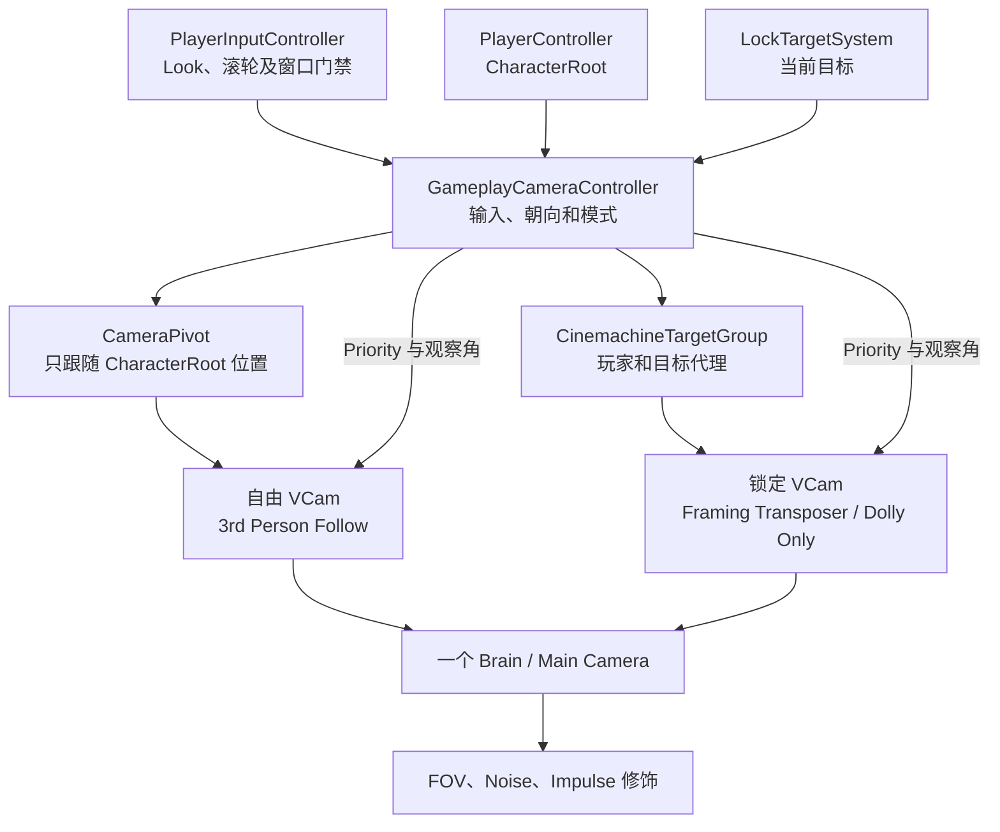

# Gameplay Camera

`GameplayCamera.prefab` contains one Main Camera, one CinemachineBrain, two Virtual Cameras and one Target Group. The free VCam handles direct third-person viewing. The locked VCam uses Cinemachine group framing to keep the player and current target visible. Both cameras blend through the same Brain, so gameplay FOV, Noise and Impulse modifiers remain on the final output.

## 镜头配置

- 自由 VCam 使用 `3rd Person Follow`。Camera Distance、Shoulder Offset、Vertical Arm Length、位置阻尼和碰撞均直接在该 Body 配置；Controller 从该 Body 读取初始距离。`Shoulder Offset Y` 是自由镜头高度，当前默认值为 `1.14m`；`CameraPivot` 位于玩家根节点位置，只承载观察旋转。
- 两台 VCam 的基础 FOV 均为 `60°`。Brain 镜头更新和 Blend 更新都使用 `LateUpdate`；Controller 在执行顺序 `50` 更新支点，Brain 在 `100` 输出，HUD 锁定标记在 `200` 投影。
- 锁定 VCam 的 Follow 和 LookAt 都指向 Prefab 内的 `CinemachineTargetGroup`，Body 为 `Framing Transposer`，不添加 Aim 旋转组件。LookAt 与 Follow 共享中心来提供 `CinemachineCollider` 需要的视线目标，观察旋转仍由 Controller 控制。Group Framing Mode 为 `Horizontal And Vertical`，Group Framing Size 为 `0.8`，Screen X/Y 为 `0.5`，Adjustment Mode 为 `Dolly Only`，Minimum/Maximum Distance 为 `3..8m`。
- 玩家构图代理由 CharacterRoot 位置加节点偏移驱动；锁定目标代理使用普通 Renderer 合并 Bounds 的中心和外接球半径。粒子、拖尾排除；无有效 Renderer 时采用节点回退偏移和 `0.5m` 半径。构图代理偏移仍由各自节点的 Prefab Transform 配置。
- 自由滚轮范围为 `1.5..8m`，每次 `0.5m`，平滑时间 `0.15s`。解锁时保留当前观察角，并回到进入锁定前的自由距离。
- 锁定朝向从玩家构图中心指向目标 Bounds 中心。俯仰限制为 `-30..60°`，角度平滑 `0.15s`；Cinemachine 负责目标组距离与位置阻尼。
- 锁定 VCam 的 `CinemachineCollider` 负责避障，Radius 为 `0.2m`、策略为 `Pull Camera Forward`，环境层沿用 `Default / TransparentFX / Water` 并忽略 Player Tag。
- 两台 VCam 优先级随锁定状态切换，Brain 使用专属 `GameplayCameraBlends` 资产执行 `0.25s Ease In Out` 过渡。技能编辑器从 Controller 的自由 VCam 引用读取参考 FOV；旧的单 VCam Prefab 仍可作为技能编辑器预览源。
- 输入实例通过 `PlayerInputController.InstanceChanged` 事件更新订阅，不在逐帧路径轮询单例。持久化镜头通过可取消的 UniTask 每 `0.25s` 等待 Player，使用实时延时，因此游戏暂停时仍可完成绑定；镜头停用会取消等待。
- 锁定、切换和解锁通过 `LockTargetSystem.LockTargetChanged` 驱动。Player 初次绑定或重建时同步一次系统当前目标；逐帧更新只刷新构图位置与朝向，不自行更改锁定业务状态。Player 丢失时只清理相机侧缓存，重新绑定后再同步目标系统。
- 窗口打开时 Player Map 按现有逻辑停用，因此 Look 和滚轮不再发送；目标组及锁定 VCam 继续自动跟踪。失焦、输入阻断和相机停用时光标恢复原状态。

## 场景使用

1. 将 `Assets/Scripts/CameraSystem/Prefabs/GameplayCamera.prefab` 放入 Gameplay 场景，每个运行时只放一个实例。
2. 按需在自由 VCam 调整第三人称偏移、距离、阻尼和碰撞；按需在锁定 VCam 调整 Group Framing、Dolly 距离和构图阻尼。
3. Controller、Brain、Camera、Target Group、自由与锁定 VCam、Third Person Follow 和两个代理节点都使用 Prefab 内部绑定；在自由 VCam 的 Body 中调整 Shoulder Offset Y 来改变镜头高度。
4. 技能时间轴工具栏继续选择同一 Gameplay Prefab；编辑器会取自由 VCam 的参考 FOV。

## Play Mode 验收

- 鼠标与手柄自由观察方向、俯仰限制及滚轮缩放范围正确；角色转身或切人时观察角不突变。
- 锁定时 Cinemachine 按玩家与目标组自动拉近或拉远，锁定期间滚轮继续切换目标；解锁时衔接当前角度和已选自由距离。
- 测试相距较远、身高差异明显、目标接近、目标 Renderer 缺失、玩家绕目标移动以及贴墙场景。
- 背包和任务窗口停用 Player Map 并释放光标，锁定构图继续跟随；窗口关闭、焦点恢复和 Time Scale 暂停不产生输入跳变。
- Player 延迟初始化、销毁重建、Time Scale 为零、镜头等待期间停用及快速重新启用，均不遗留绑定任务或重复事件订阅。
- 双 VCam Blend 期间碰撞、Brain 最终 FOV/Noise/Impulse 修饰及 HUD 投影正常，快速锁定/解锁不会反复优先级抖动。
- Prefab 保持一个 Main Camera、Brain 和 AudioListener，包含两台待机更新为 Never 的 VCam；场景及技能编辑器加载无丢失引用。
