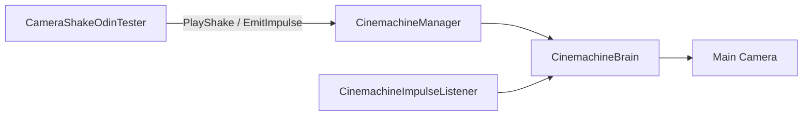

# Camera Shake 手动测试

## 测试目标

使用 [CameraShakeOdinTester.cs](CameraShakeOdinTester.cs) 调用真实的 `CinemachineManager` API，验证持续 Noise、瞬时 Impulse、Handle 生命周期和混合规则。



## 一、生成测试预设

在 Unity 菜单执行：

```text
Tools/RPG/Camera/Create Default Shake Presets
```

确认 `Assets/Settings/Camera/Shakes` 中存在：

- `Noise_Running`、`Noise_Charging`
- `Shake_Running`、`Shake_Charging`
- `Shake_LightHit`、`Shake_HeavyHit`
- `Shake_Landing`、`Shake_Explosion`

生成器只补充缺失资产，重复执行不应覆盖已经调整过的参数。

## 二、配置测试场景

1. 给 Main Camera 添加 `CinemachineBrain`。
2. 创建并启用一个 Gameplay Virtual Camera。
3. 给 Virtual Camera 添加 `CinemachineImpulseListener`，令 Channel Mask 包含 `1`，Gain 使用 `1`。
4. 创建 `CinemachineManager`，将 Main Camera 上的 Brain 拖入其 `Brain` 字段。
5. 创建测试 GameObject，挂载 `CameraShakeOdinTester`。
6. 进入 Play Mode 后再使用 Odin 按钮。

持续 Noise 不依赖 `CinemachineImpulseListener`；Impulse 缺少 Listener 时可以成功发射事件，但镜头不会表现冲击。

## 三、测试持续 Noise

在 Tester 中选择 `Shake_Running`，设置 Strength 为 `1`、Seed 为固定整数，然后点击“播放持续 Shake”。

依次验证：

1. 镜头持续产生轻微抖动。
2. 将 Strength 改为 `2`并点击“应用 Shake 强度”，抖动应明显增强。
3. 点击“淡出停止 Shake”，抖动按 Profile 的 FadeOut 平滑停止。
4. 重新播放后点击“立即停止 Shake”，抖动应当帧结束。
5. 更换 Seed 后波形相位改变；使用相同 Profile、Seed 和经过时间时采样结果保持一致。
6. 使用 `Shake_Charging`时，抖动应比 Running 更快且更明显。

### Timed Noise

复制一份持续 Profile，并设置：

```text
Lifetime = Timed
Duration = 2
Fade In = 0.2
Fade Out = 0.5
```

预期在 0–0.2 秒淡入，2 秒后进入淡出，并在约 2.5 秒完全结束。结束后再次调整或停止该 Handle，应返回 `false`。

## 四、测试 Impulse

选择 `Shake_LightHit`，设置 Amplitude 为 `1`、Direction 为 `(0, -1, -1)`，点击“发射 Impulse”。

依次比较：

- `Shake_LightHit`：轻微且短促。
- `Shake_HeavyHit`：更强并带有明显回弹。
- `Shake_Landing`：主要表现向下冲击。
- `Shake_Explosion`：强度更高、持续更久。
- Amplitude 从 `1`改为 `2`后，整体冲击强度应相应提高。

“取消 Impulse”只取消 Tester 最近一次发射且尚未结束的事件。为了观察取消效果，可以临时将 Profile Duration 调大。

## 五、测试混合规则

创建两个挂有 Tester 的 GameObject。

### Additive

两个 Profile 都使用 `Additive`，先后播放后，位置与旋转偏移应同时叠加。

### Exclusive

1. 先播放一个 Additive Shake。
2. 再播放一个 Exclusive Shake，后者应屏蔽更早创建的 Shake。
3. 再创建一个新的 Additive Shake，新请求应叠加在 Exclusive 之上。
4. 修改现有 Handle 的 Strength 不应改变其创建层级。

## 六、生命周期与回归检查

- Camera Transform 不会逐帧累计漂移。
- Stop、到期或释放后没有残留抖动。
- 切换 Virtual Camera 后仍以最新 Brain 状态为基础。
- `Time.timeScale = 0`时，Noise、持续时间和淡出冻结。
- 销毁 `CinemachineManager`时，只清理自身 Shake 和 Impulse，不影响其他系统发射的事件。
- FOV Modifier 与 Shake 可以同时生效，互不覆盖。
- Console 没有空 Brain、缺少 NoiseSettings、失效 Handle 或重复事件订阅异常。

