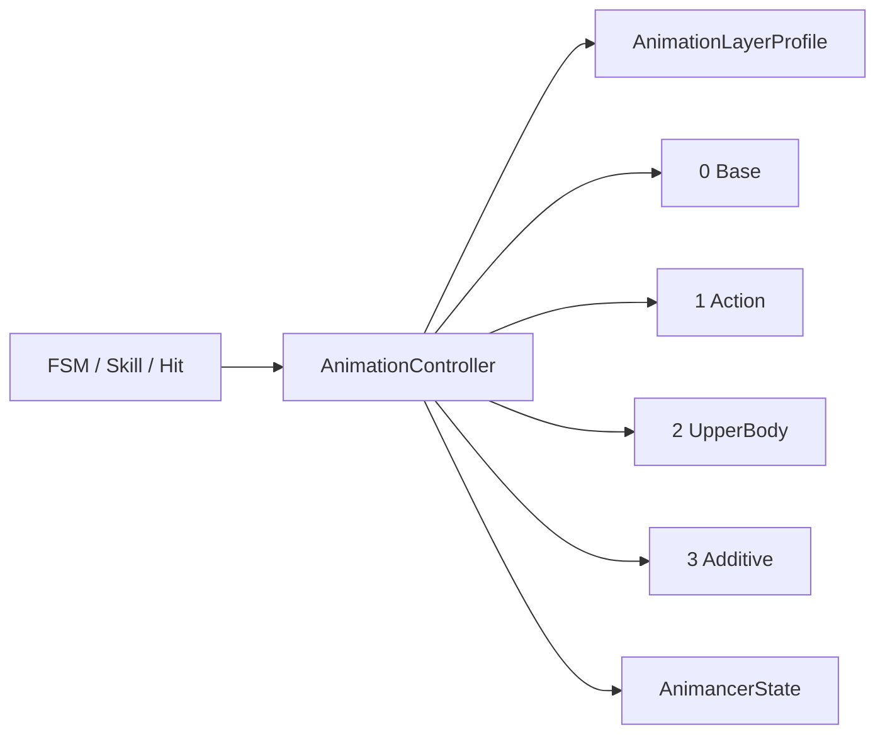

# Animancer 固定层动画系统

## 职责与流转



`AnimationController`是角色实例级服务，只统一语义层、播放入口、过渡和权重控制。它不判断能否打断、不自动返回 Idle、不应用 Root Motion，也不转发动画业务事件。

## 配置与使用

1. 创建 `RPG/Character/Animation Layer Profile`资产。
2. 在角色上配置 `Animator`、`AnimancerComponent`和`AnimationController`。
3. 将 Profile 赋给 Controller，按角色骨骼配置 Action、UpperBody 与 Additive 的 AvatarMask。
4. 外部系统在完成业务判断后调用固定层 API。

```csharp
AnimancerState state = animationController.Play(
    AnimationLayerType.Action,
    attackClip,
    0.1f,
    FadeMode.FromStart);

state.Speed = 1.2f;
state.Events(this).OnEnd = OnAttackEnd;
```

层结束行为由调用方决定：

```csharp
animationController.FadeLayer(AnimationLayerType.Action, 0f, 0.1f);
animationController.StopLayer(AnimationLayerType.Action);
```

`AnimationLayerType`数值直接对应 Animancer Layer Index，属于稳定运行时协议，不允许通过资产调整顺序。
