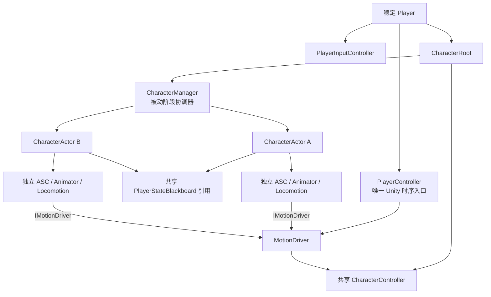
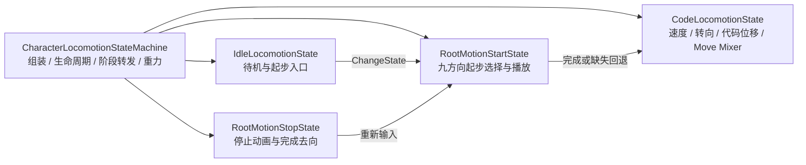
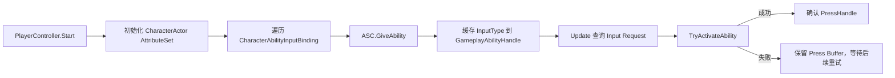
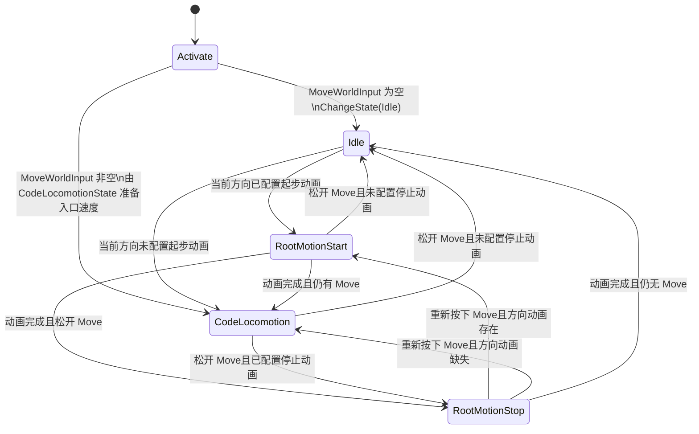
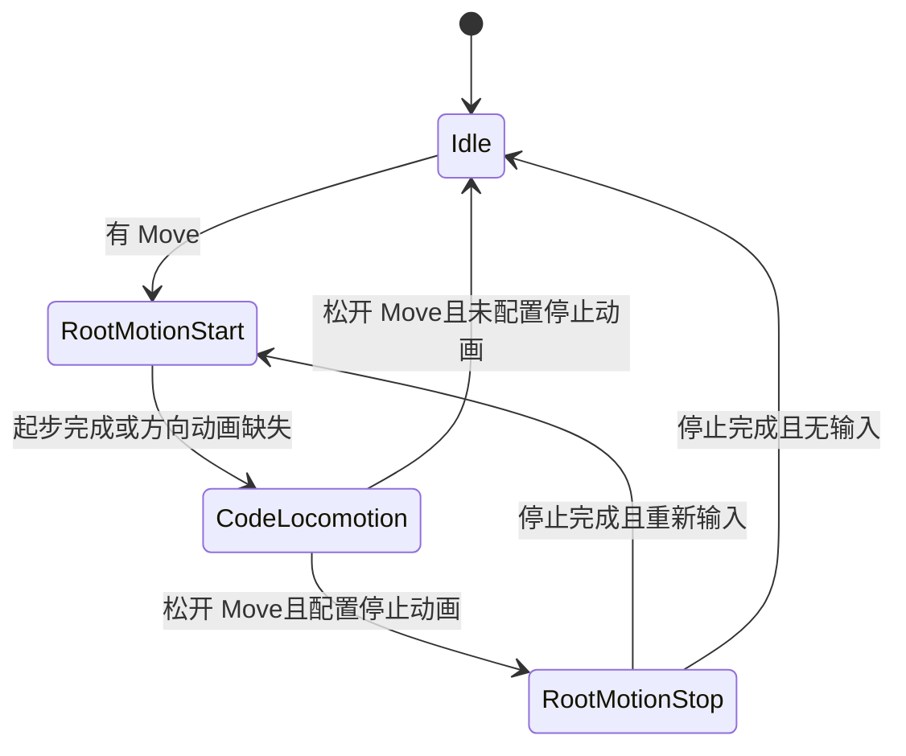
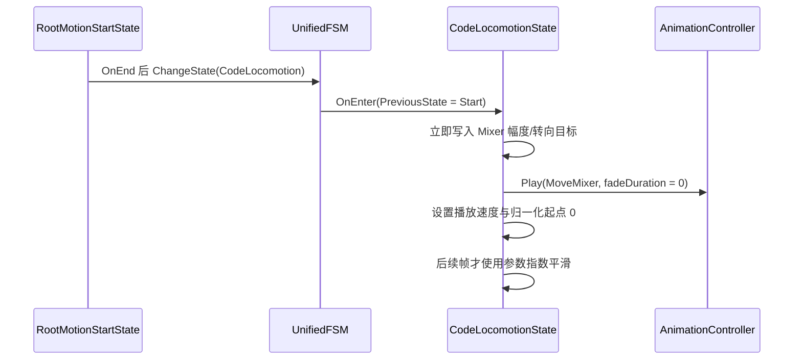

# 角色控制与运动架构

## 目标与稳定层级

Player 是跨场景稳定存在的玩家控制主体。CharacterRoot、共享 CharacterController、CharacterManager 和队伍 CharacterActor 一起常驻；切换角色只切换当前角色的表现与能力消费目标，不重建 Player 或输入链路。



- PlayerController 持有具体 MotionDriver 和唯一 PlayerStateBlackboard。
- 所有 CharacterActor 持有同一个 Blackboard 引用；它们不各自创建输入黑板。
- CharacterManager 不持有 MotionDriver、DialogueSystem、摄像机、交互检测或场景迁移服务。
- CharacterManager 可以接收 PlayerController 显式传入的输入缓冲区，但不把 PlayerInputController 保存为自己的生命周期依赖。
- CharacterManager 是 MonoBehaviour 仅为了挂在 CharacterRoot 和使用 Unity 序列化；它没有 Unity 生命周期回调。

Locomotion 使用 UnifiedFSM。`CharacterLocomotionStateMachine` 只负责状态树组装、角色与
`IMotionDriver` 依赖、启停、阶段转发和全状态共用的重力；具体状态各自持有本状态的动画、速度、
方向选择、参数平滑和状态转换数据。



## 显式阶段推进

CharacterManager 的阶段方法不会被 Unity 自动调用，全部由 PlayerController 在对应 Unity 生命周期中主动调用。方法使用 Tick/FixedTick/TryUpdate 命名，不定义 `Update`、`FixedUpdate`、`LateUpdate` 或 `OnAnimatorMove`。

```mermaid
sequenceDiagram
    participant Unity
    participant PC as PlayerController
    participant CM as CharacterManager
    participant Input as PlayerInputController
    participant Actor as Active CharacterActor
    participant MD as MotionDriver

    Unity->>PC: Update()
    PC->>CM: TickCharacters(deltaTime)
    PC->>Input: ArbiterManager.ArbitrateFrame(camera)
    PC->>CM: ProcessSwitchInputRequests(inputBuffer)
    PC->>CM: TickActiveCharacter(inputBuffer, deltaTime)

    Unity->>PC: FixedUpdate()
    PC->>CM: FixedTickActiveCharacter(fixedDeltaTime)
    CM->>Actor: FixedTickAbility + Locomotion.FixedTick
    PC->>MD: ResolveFixedMotion()

    Unity->>PC: LateUpdate()
    PC->>CM: LateTickCharacters(deltaTime)

    Unity->>Actor: OnAnimatorMove()
    Actor->>PC: ProcessAnimatorMotion(source, deltaPosition, deltaRotation)
    PC->>CM: TryUpdateAnimationMove(source)
    PC->>Actor: GAS/FSM receives Animator delta
    Actor->>MD: winning Handle submits AnimatorMotionSubmission
    PC->>MD: ResolveAnimatorMotion()
```

CharacterManager 提供以下内部接口：

| 阶段 | 接口 | 职责 |
| --- | --- | --- |
| 全队 ASC 普通帧 | `TickCharacters(float)` | 遍历所有角色并调用 `TickAbility` |
| 当前角色普通帧 | `TickActiveCharacter(IPlayerInputRequestBuffer, float)` | 处理技能 Request，再推进当前 Locomotion |
| 当前角色物理帧 | `FixedTickActiveCharacter(float)` | 推进当前 ASC FixedTick 和 Locomotion FixedTick |
| 全队/当前角色延迟帧 | `LateTickCharacters(float)` | 全队 ASC LateTick，当前 Locomotion LateTick |
| 当前 Animator 阶段 | `TryUpdateAnimationMove(CharacterActor)` | 校验来源并推进当前 GAS/FSM Animator 阶段 |

所有 deltaTime 都由 PlayerController 从 Unity 生命周期传入。CharacterManager 不读取 `Time.deltaTime`，也不执行 MotionDriver Resolve 或 `CharacterController.Move`。

## PlayerController 时序

### Awake

1. 解析 PlayerInputController、DialogueParticipant、CharacterRoot、CharacterManager 和共享 CharacterController。
2. 初始化 MotionDriver。
3. 创建唯一 PlayerStateBlackboard。
4. 调用 CharacterManager.Initialize 构建并校验队伍。
5. 为每个 CharacterActor 注入 CharacterRoot、MotionDriver、PlayerController 和同一个 Blackboard。
6. 预热所有角色 Idle 初始姿态；预热期间不激活 Locomotion、不推进 ASC、不提交运动。
7. 设置 MotionDriver ActiveOwner。
8. 创建 GameplayInputIntentArbiterManager，默认只注册 MoveInputIntentArbiter。
9. 初始化 LooseGameplayTagEventBridge 和 DialogueParticipant 动画目标。

PlayerController 的 `Start` 在所有角色和 ASC 完成 `Awake` 后执行：它先调用每个 CharacterActor 的
`InitializeRuntimeConfiguration` 导入 AttributeSet、授予配置 Ability，再激活当前角色 Locomotion。
这样 `Activate` 在持续 Move 场景下直接读取自身 GAS Speed 时，ASC 的运行时容器已经可用；
`CharacterActor.Start` 仍保留同一初始化方法作为独立实例启用时的幂等兜底。

### Update

1. `CharacterManager.TickCharacters(Time.deltaTime)` 推进全队 ASC，后台冷却和 GameplayEffect 持续时间继续。
2. `InputIntentArbiterManager.ArbitrateFrame(cameraTransform)` 转换需要复杂空间处理的连续 Move。
3. PlayerController 执行仍存在的对话/角色阻断门禁；通过后调用 `CharacterManager.ProcessSwitchInputRequests(inputController)`。
4. CharacterManager 重新读取切换后的 ActiveCharacter。
5. `CharacterManager.TickActiveCharacter(inputController, Time.deltaTime)` 让当前 CharacterActor 直接处理技能 Request，再推进 Locomotion。
6. Locomotion 通过 CharacterActor 的 Blackboard 引用读取 `MoveWorldInput`，不再由 PlayerController 注入移动参数。

### FixedUpdate

1. `CharacterManager.FixedTickActiveCharacter(Time.fixedDeltaTime)` 收集当前角色 GAS 和 Locomotion 的物理请求。
2. PlayerController 调用 `MotionDriver.ResolveFixedMotion()`。
3. 每个物理步最多执行一次 CharacterController.Move。

### LateUpdate

PlayerController 调用 `CharacterManager.LateTickCharacters(Time.deltaTime)`。该方法不执行额外移动。

### AnimatorMove

Unity 只调用 CharacterActor 同节点的无参数 `OnAnimatorMove`。CharacterActor 将来源和 Animator 增量交给 PlayerController 的普通方法 `ProcessAnimatorMotion`。PlayerController 调用 CharacterManager 验证来源、推进当前角色 GAS/FSM 动画阶段；只有业务通过有效 Handle 提交 `AnimatorMotionSubmission` 后，PlayerController 才调用无参 `MotionDriver.ResolveAnimatorMotion()`。MotionDriver 不查找 Animator，也不自动消费原始增量。

## Blackboard 与 Locomotion

PlayerStateBlackboard 是 Player 创建的稳定输入结果容器，CharacterActor 只持有引用：

```text
PlayerController.StateBlackboard
    ├── CharacterActor A.StateBlackboard
    ├── CharacterActor B.StateBlackboard
    └── CharacterActor C.StateBlackboard
```

Blackboard 保留：

- `MoveWorldInput`；
- 通用 Frame IntentTag；
- Intent 来源 Handle 映射；
- `IntentSourceConsumed` 消费回传链路。

技能和切人不再写入 Frame Intent。只有未来确实需要复杂输入转换、合并或上下文分析时，才使用通用 Intent 管线。

Locomotion 不保存独立的移动输入副本，也不再由 PlayerController 逐帧注入输入。各个具体状态通过
`CharacterActor.StateBlackboard.MoveWorldInput` 读取当前输入：Idle 负责起步入口判断，
RootMotionStart 负责九方向选择，CodeLocomotion 负责转向、位移和 Move Mixer 参数，停止与急转状态
只处理自己的动画生命周期。状态机不再保存这些状态专属的运行时字段。

## 输入职责

| 输入 | 处理者 | 结果 |
| --- | --- | --- |
| WASD/左摇杆 Move | MoveInputIntentArbiter | 镜头相对方向写入 `MoveWorldInput` |
| Primary/Secondary/Skill1-4 | CharacterActor | 直接查询 Request，成功激活后确认 PressHandle |
| CharacterSlot1-4 | CharacterManager | 直接查询 Request，按切换结果确认或保留 PressHandle |
| Choice 导航、提交、点击 | Unity EventSystem | 直接驱动交互 UI |
| 复杂未来输入 | 可选自定义 Arbiter | 写入通用 Frame Intent |

固定离散输入使用 `IPlayerInputRequestBuffer.TryGetRequest`，不遍历 `Requests` 列表。Press、Held 和 Release 保持独立生命周期，为后续蓄力技能提供 `HeldDuration`、`PhysicalState` 和 `ReleaseHandle`。

角色技能输入不经过 Frame Intent。`CharacterAbilityInputBinding` 同时声明固定输入槽位和该角色的初始 Ability；PlayerController.Start（以及 CharacterActor.Start 的幂等兜底）在 ASC 完成 Awake 后初始化属性并调用 ASC `GiveAbility`，缓存 `PlayerInputType` 到 `GameplayAbilityHandle`，然后在 Update 中直接查询 Request 并尝试激活。激活失败时不确认 PressHandle，允许 Cooldown、Cost 或其他 GAS 条件在 Buffer 有效期内继续重试。



## 角色切换

CharacterManager 处理槽位输入和队伍内部结果；PlayerController 只决定当前是否允许调用该接口，并负责切换事件外的稳定 Player 协调。

切换成功流程：

1. CharacterManager 查询槽位 Request。
2. CharacterManager 调用 `TrySwitchSlot`。
3. CharacterManager 对 Success、AlreadyActive、CharacterNotFound 直接确认 PressHandle；Busy 保留 Request。
4. CharacterManager 更新 ActiveCharacter 并发送一次 `ActiveCharacterChanged`。
5. PlayerController 释放旧角色 Locomotion 和 MotionDriver 请求。
6. PlayerController 设置新的 MotionDriver ActiveOwner。
7. PlayerController 激活新角色 Locomotion，并更新 DialogueParticipant 动画目标。
8. PlayerController 随后由 `TickActiveCharacter` 重新读取新角色，处理同帧尚未消费的技能 Request。

持续按住 Move 切人时，新角色 Locomotion 激活阶段直接读取共享 Blackboard 的 MoveWorldInput 并 `ChangeState(CodeLocomotion)`，不先进入 Idle，也不播放起步根运动。只有角色已经处于 Idle 后再次开始移动，才会选择起步动画。



切人不清理：

- `MoveWorldInput`；
- Blackboard Frame Intent；
- InputController 中其他尚未消费的 Request；
- Press 或 Release 的生命周期数据。

## MotionDriver 边界

GAS 和 Locomotion 只依赖 `IMotionDriver` 提交请求。MotionDriver 由 PlayerController 持有，只有 PlayerController 调用阶段开始和最终 Resolve 方法。

- CharacterManager 不持有 MotionDriver。
- CharacterManager 不调用 `ResolveFixedMotion` 或 `ResolveAnimatorMotion`。
- MotionDriver 负责请求优先级、通道竞争、Tag 限制和唯一 CharacterController.Move 出口。
- Locomotion 在提交代码移动前完成镜头方向和角色朝向的业务计算。
- 根运动是否消费由获胜运动控制请求决定。

`RootMotionStartState` 从 Idle 起步时按角色水平前向与 MoveWorldInput 的有符号夹角选择九方向起步动画：前向、左右 45°、90°、135°、180°。方向槽位缺失时直接进入 CodeLocomotion，不回退到前向或最近动画。RootReferenceSpeed 是配置的动画参考速度，GAS Speed 是业务目标速度，不再通过 Animator delta 运行时采样起步速度。

急转再次触发延迟在急转动画完成并返回 CodeLocomotion 时才开始计时。该延迟用于防止急转动画结束后立即重复播放，不在进入急转状态时提前消耗。

## Locomotion 状态职责



- `IdleLocomotionState` 只播放 Idle 并决定是否发起一次起步，不保存代码移动速度。
- `RootMotionStartState` 在进入时选择并缓存九方向 Transition；播放期间不因输入变化重选动画。
- `CodeLocomotionState` 自己保存当前速度、Move Mixer 参数和急转再次触发时间，并提交代码运动。
- `RootMotionStopState` 拥有停止动画选择、完成检测和退出去向；急转配置暂不接入运行时 FSM。
- `RootMotionLocomotionState` 只提供根运动控制权、动画完成检查和方向修正等真正共用能力。
- 新的角色启用周期由状态机向所有状态发送重置通知；状态机不解释或修改状态内部字段。

### Start 到 Move 的直接衔接

Start 动画的末段已经按 Move Loop 的起始姿态制作，因此正常完成后不再额外插入动画淡入。
`CodeLocomotionState` 通过 UnifiedFSM 的 `PreviousState` 判断是否刚从
`RootMotionStartState` 进入；不增加状态间通知、一次性标记或状态机业务回调。



直接衔接只覆盖本次从 Start 结束进入 Move 的播放调用；共享 Move Mixer 资源的默认
`FadeDuration` 不被修改，其他进入路径继续使用资源配置的淡入时间。移动参数平滑只作用于
Mixer 的幅度和转向参数，不能替代代码移动的加速度或角色实际转向。其配置值是指数平滑
时间常数：目标固定时经过该时间约完成当前差值的 63%，并非固定完成时间。

起步根运动方向修正的 `CorrectionSpeed` 是 Slerp 插值响应系数，单位为秒⁻¹（1/s），
不是度/秒。每次 Animator 求值使用“响应系数 × 本次求值时长”作为插值比例；值越大，
朝向目标跟随越快，值为 0 时保留动画自身根旋转但不追加代码方向修正。

## 状态与资源生命周期

- CharacterManager 初始化失败或 MarkerProvider 无效的角色不会进入可切换集合。
- 后台角色的 ASC 保持推进，但 Animator、Renderer 和 Locomotion 表现停用。
- 角色 Binding 中配置的 Ability 在 PlayerController.Start/CharacterActor.Start 初始化阶段授予各自 ASC；切换角色只切换当前 ASC 和表现，不共享 Ability Spec。
- PlayerController 禁用时停止自身阶段驱动、清理瞬时输入和停用当前 Locomotion；CharacterManager 不会因为仍是 enabled 而自行运行。
- 旧的场景迁移/玩家输入锁定布尔字段及 PlayerController 场景迁移事务 API 已移除。
- 后续场景和 UI 输入锁定通过禁用对应 InputActionMap 实现；CharacterRoot 传送和 CharacterController 管理由专门场景服务负责。

## 变更文件

本次输入和阶段边界修改涉及：

- `Character/PlayerController.cs`
- `Character/Runtime/CharacterManager.cs`
- `Character/Runtime/CharacterActor.cs`
- `Character/Locomotion/Runtime/CharacterLocomotionStateMachine.cs`
- `Input/Runtime/PlayerInputController.cs`
- `Game/Arbiter/GameplayInputIntentArbiterManager.cs`
- `Player.prefab`
- GameplayTag Database 与生成常量
- 输入与角色架构 Odin 测试器

## 验收重点

- CharacterManager 没有 Unity 生命周期方法，只有 PlayerController 显式调用 Tick 接口。
- 每个 ASC 阶段每帧只执行一次。
- CharacterManager 返回后 PlayerController 才执行 MotionDriver 最终结算。
- 所有 Actor 共享同一个 Blackboard，Locomotion 直接通过 Owner 读取 MoveWorldInput。
- 技能和切人不经过专用 Arbiter 或 IntentTag。
- Move 仍然正确完成镜头相对转换。
- `moveAction` 使用对象引用，已删除字符串回退字段。
- 场景和输入锁不再通过 PlayerController bool 分支实现。
