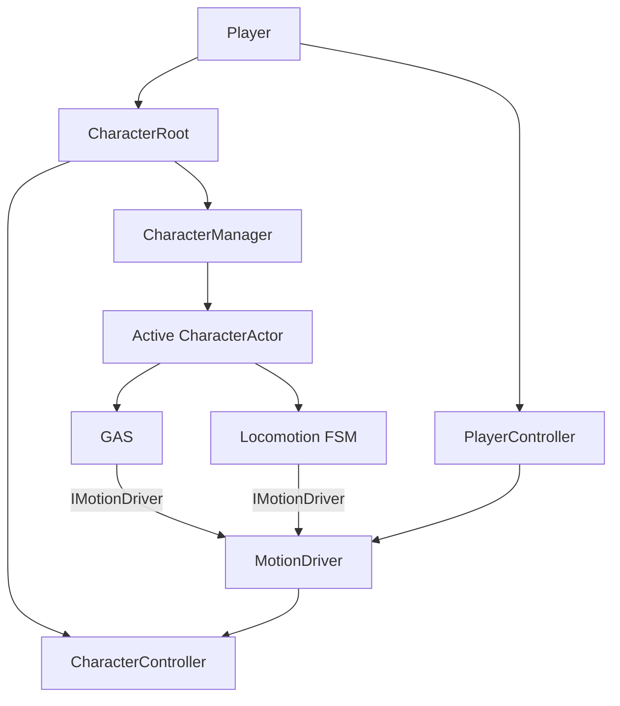
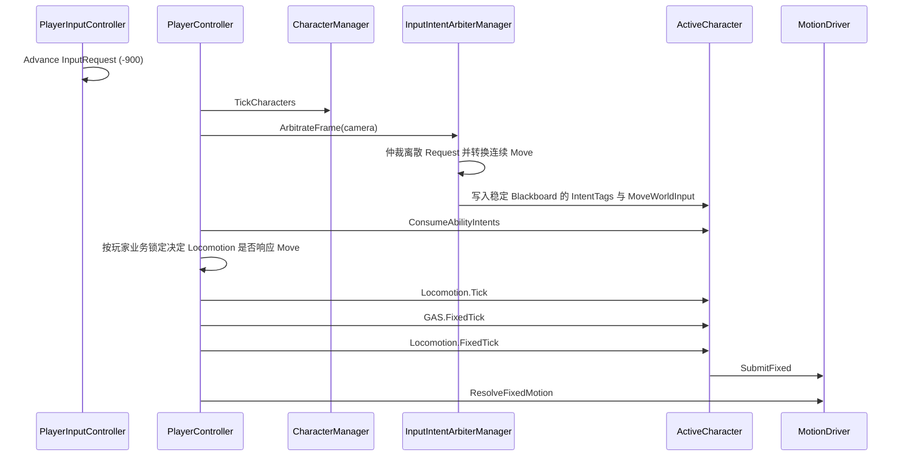
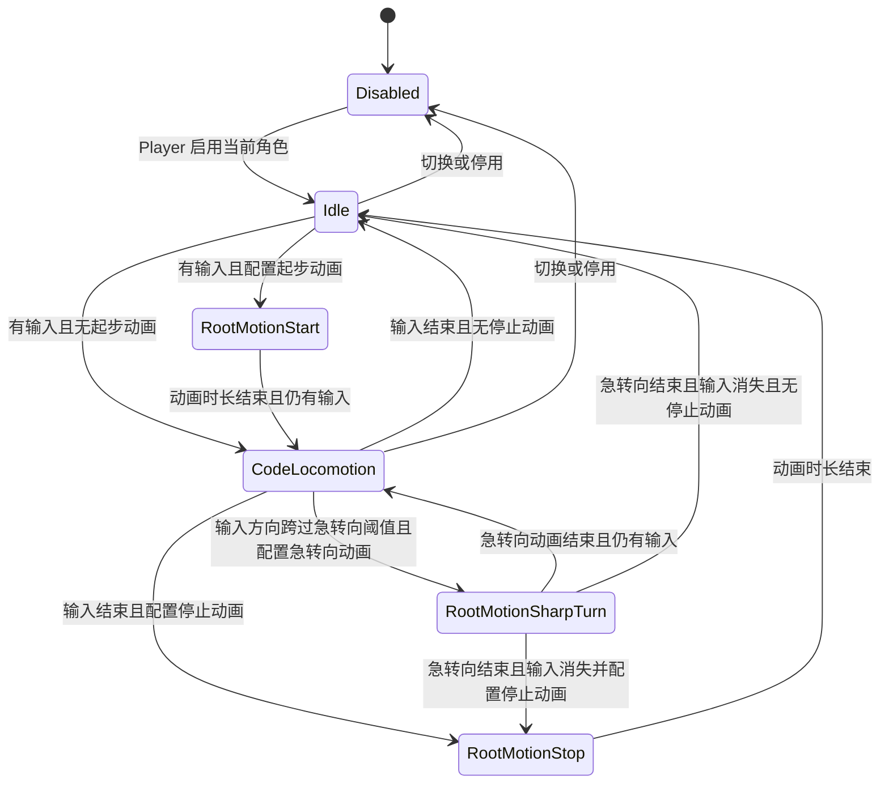

# 角色控制与运动架构

## 目标与依赖

Player 是跨场景稳定存在的控制主体；CharacterManager 只管理队伍角色；CharacterActor 持有独立 ASC、动画、Marker、技能宿主与 Locomotion；PlayerController 统一安排输入仲裁、GAS、Locomotion 与 MotionDriver 的调用顺序。



- PlayerController 持有具体 MotionDriver，并把 IMotionDriver 注入 CharacterActor。
- CharacterManager 完全不引用 MotionDriver、DialogueSystem、摄像机、交互检测或场景加载器。PlayerController 在队伍构建后注入每个角色的 IMotionDriver，并负责 FSM 启停。
- CharacterActor 是 IGameplayAbilitySystemOwner，GAS 不依赖 PlayerController。
- CharacterActor 自身实现同节点 Animator 的 OnAnimatorMove，只把自身身份和 Animator 增量交给稳定 PlayerController。
- CharacterController 位于 CharacterRoot，是 MotionDriver 唯一的最终位移出口。

## 输入与运动时序



PlayerStateBlackboard 是 Player 级稳定对象；角色切换只替换它代理的 ASC，保留 EnvironmentTags、当前帧 IntentTags 与连续 Move。IntentTags 仍由统一的帧末清理自然结束，不增加角色 Scope、版本号或切换专用失效标记。

## AnimatorMove

```mermaid
sequenceDiagram
    participant Animator
    participant Actor as CharacterActor
    participant PC as PlayerController
    participant GAS as Active GAS
    participant FSM as Locomotion FSM
    participant MD as MotionDriver
    participant CC as CharacterController

    Animator->>Actor: OnAnimatorMove()
    Actor->>PC: ProcessAnimatorMotion(source, deltaPosition, deltaRotation)
    PC->>GAS: UpdateAnimationMove
    PC->>FSM: UpdateAnimationMove
    PC->>MD: ResolveAnimatorMotion
    MD->>CC: Move(filteredRootMotion)
```

根运动是否消费由各通道当前获胜控制请求决定。Animator.applyRootMotion 保持启用以产生增量，但 CharacterActor 不直接应用增量。

## 仲裁与生命周期

- 通道：Horizontal、Vertical、Rotation。
- 优先级：Gravity、Locomotion、Skill、ForcedMotion。
- 每通道最高优先级获胜；同优先级后建立的有效请求获胜。
- 新请求释放后，之前仍有效的请求自动恢复。
- 同一获胜 Handle 的 Fixed 世界空间位移求和，旋转按提交顺序组合；位移方向由 Locomotion 在提交前计算。
- 非 ActiveOwner 请求不参与结算。
- horizontalMovementBlockedTags 在仲裁后清除 X/Z；allMovementBlockedTags 阻止全部位移和根旋转。
- 场景迁移由 PlayerController 暂停运动、禁用 CharacterController 并传送 CharacterRoot；后台 ASC 时间继续。

## 变更边界

实现涉及 PlayerController、PlayerStateBlackboard、CharacterActor/Manager、MotionDriver、MarkerProvider、LooseGameplayTag 桥接、PlaySkillConfigGameplayAbilityTask、角色 Prefab/测试场景与 Odin Tester。SkillConfig 和 GameplayAbilityData 不增加通用运动字段；旧 AnimatorMoveProvider 已删除。DirectionalLocomotionController 不进入正式架构。

## 失败边界与清理

- `ResolveFixedMotion` 使用 `finally` 清空瞬时提交；即使最终移动异常，也不会跨物理步复用旧位移。
- PlayerController 禁用时停用当前 Locomotion 并暂停 MotionDriver，重新启用时恢复 Idle；场景迁移主动清理瞬时提交。能力 Handle 仍由能力生命周期释放。
- 角色切换会释放旧 Owner 全部请求；非 ActiveOwner 请求即使存在也不能赢得任一通道。
- MarkerProvider 重建失败时 `IsValid=false`，CharacterManager 拒绝该角色进入可切换集合。
- Animator 必须与 CharacterActor 同节点；Actor 回调不直接 Move、不修改模型 Transform。

## 实际变更文件

- 控制与输入：`PlayerController.cs`、`PlayerInputController.cs`、`Game/Arbiter/GameplayInputIntentArbiterManager.cs`、`PlayerStateBlackboard.cs`、`LooseGameplayTagEventBridge.cs`、`Config/CharacterMovement.inputactions`。
- 角色：`Runtime/CharacterId.cs`、`CharacterDefinition.cs`、`CharacterActor.cs`、`CharacterManager.cs`、`CharacterSwitchStatus.cs`。
- 运动：`MotionDriver/IMotionDriver.cs`、`MotionDriver.cs`、`MotionTypes.cs`、`MotionControlRequest.cs`、`MotionControlHandle.cs`、`FixedMotionRequest.cs`、`SkillMotionGameplayAbilityTask.cs`。
- Locomotion：`Locomotion/Runtime` 下 UnifiedFSM 状态机、`PlayerFSMTransition.cs`、代码移动、起步、停止与急转向根运动状态。
- 表现与配置：`AnimationController.cs`、`IAnimationPlayer.cs`、`DialogueParticipant.cs`、`IMarkerProvider.cs`、`MarkerProvider.cs`、`PlaySkillConfigGameplayAbilityTask.cs`、`Assets/GAS_Light/AttributeSystem/Runtime/SetSO/GameplayAttributeSet.asset`。
- 资源与验证：`Prefab/OdetaCharacterActor.prefab`、`Prefab/RuskCharacterActor.prefab`、`Config/DefaultPlayerFSMTransition.asset`、`Player.prefab`、`TestInteractableScene.unity` 与三个 OdinTester。
- 设计同步：`Assets/Scripts/SkillSystem/Runtime/SkillRuntime.md`、`Assets/GAS_Light/设计md/GameplayAbilityGameplay.md`。

## 输入配置与技能消费

`Runtime/CharacterAbilityInputBinding.cs` 声明每个角色的输入类型、IntentTag、Ability 和阻断 Tag；`Runtime/CharacterInputIntentArbiter.cs` 动态读取 ActiveCharacter，不缓存旧角色。能力必须先被正常授予 ASC，消费者按 Data 查找 Spec，只有 TryActivateAbility 成功才确认 Intent 消费。没有授予或激活失败会保留缓冲请求，帧末只清除本帧 Intent。

连续移动由 PlayerInputController 采样 WASD/左摇杆；GameplayInputIntentArbiterManager 在 `ArbitrateFrame(cameraTransform)` 内无条件完成镜头相对世界方向转换，并把真实结果直接写入稳定 Blackboard。PlayerController 不再持有独立 Move 仲裁器，只按时序调用 Manager；随后由玩家业务锁定决定传给当前 UnifiedFSM 的是 Blackboard 原值还是零向量。Move 仲裁不读取 AbilityTags、EnvironmentTags、场景迁移或输入锁；是否最终执行由 Locomotion 请求和 MotionDriver 的控制权、Tag 限制决定。

镜头 Transform 是 PlayerController 传给输入仲裁 Manager 的可选帧级上下文，由未来的常驻摄像机系统提供；鼠标视角输入不进入本次移动仲裁链，也不会随角色切换重建。后续接入鼠标时只需让常驻摄像机更新自身 Transform，Manager 会在下一帧读取新的水平前方。

角色速度由当前 ASC 的 `GameplayAttributes.Attribute_Speed` 提供，单位为米/秒。角色包装 Prefab 可在 `initialAttributeSets` 配置初始数值模板，`CharacterActor.Start` 在 ASC 完成 Awake 后导入；测试包装使用包含 Speed=2 的默认 AttributeSet。`PlayerFSMTransition` 保存 Move Loop 一倍播放速度下的根运动参考速度，并可选择使用起步根运动期间测得的实际参考速度；Move 状态用当前速度除以本次选定参考速度调整 Move Loop 播放倍率，起步采样值只用于进入 Move 时的速度衔接。

`MotionDriver/SkillMotionGameplayAbilityTask.cs` 由具体异步 GA 的代码构造。速度为零且不消费根运动表示站桩；非零速度表示 Fixed 阶段代码移动；根运动模式仅持有消费权。它不调用 Resolve，也不读取 SkillConfig.IsRootMotion。Stop、Cancel、Complete 共用幂等释放入口。

## Locomotion 与队伍配置



FSM 在启用期间另持有 Gravity/Vertical 请求，所有状态退出释放自身请求；Disabled 也释放重力请求。Gravity 最终仍受全部位移阻断 Tag 约束。`DefaultPlayerFSMTransition` 配置 Idle、Move Mixer 和起步；停止／急转向片段可在 Inspector 补齐，缺失时状态立即完成而不会产生额外代码位移。

Player Prefab 直接包含 OdetaA、Rusk（逻辑 ID 为 Rusk）两个常驻实例，均有独立 ASC、动画和 Host。`Prefab/OdetaCharacterActor.prefab` 与 `Prefab/RuskCharacterActor.prefab` 为复用包装资源，`Config/TestCharacterA.asset`、`Config/TestCharacterB.asset` 可供从 Definition 构建队伍。不要同时配置同 ID 的直接子角色和 Definition，初始化会明确拒绝重复 ID。

`Config/CharacterOrigin.asset` 是测试角色必需 MarkerKey，实际 TransformMarker 配置在角色根上；不会运行时补造缺失节点。后台角色保留 GameObject/ASC，仅关闭 Animator 和 Renderer 表现。SkillRuntimeHost 仍应配置该角色自己的动画播放器和 MarkerProvider。

## 验证记录与尚需场景验收

- Unity 批量 Gate 的退出脚本等待超时，当前未完成实时 Unity MCP/Play Mode 检查。
- OdinTester 已提供 MotionDriver 仲裁、角色切换和 Locomotion 状态的手动入口；本轮未把未验证的 Play Mode 结果记录为通过。
- Prepare/Complete/Cancel 场景迁移、真实 Animator 根运动增量和跨场景持久化仍需在 Unity 中手动验收。
- 本轮唯一一次外部 Editor 构建在 Unity 尚未把新增脚本写入生成的 csproj 时执行，因缺少新类型条目失败；按项目约束未重复构建，待 Unity 完成刷新后应由 Unity 编译器重新验证。
- 原始动画是否包含非零 delta、技能动画与 Locomotion 过渡观感、完整业务 GA 的 Cost/Cooldown/取消流程、真实跨场景加载还需要完整 Play Mode 验收，不以脚本编译或模拟增量检查替代。
- 当前 Rusk 包装资源尚未完成实际材质、Avatar、Marker 和 Animator 的 Unity Inspector 验收；源模型资源未修改。
