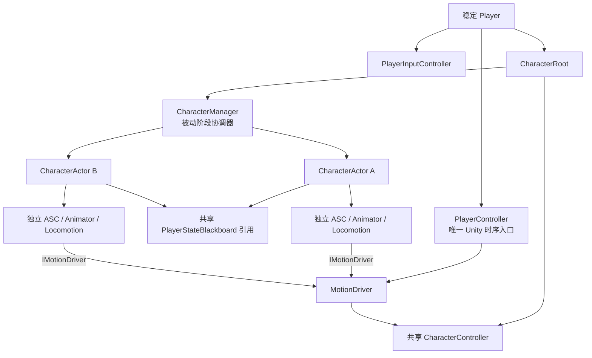
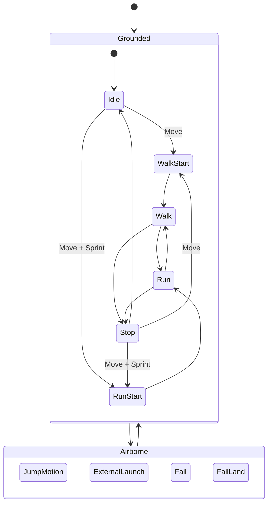
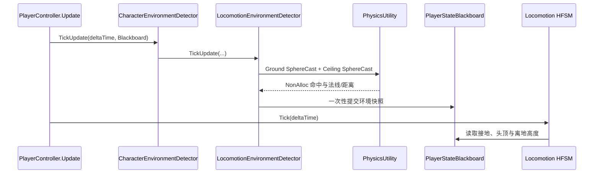
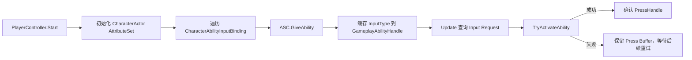
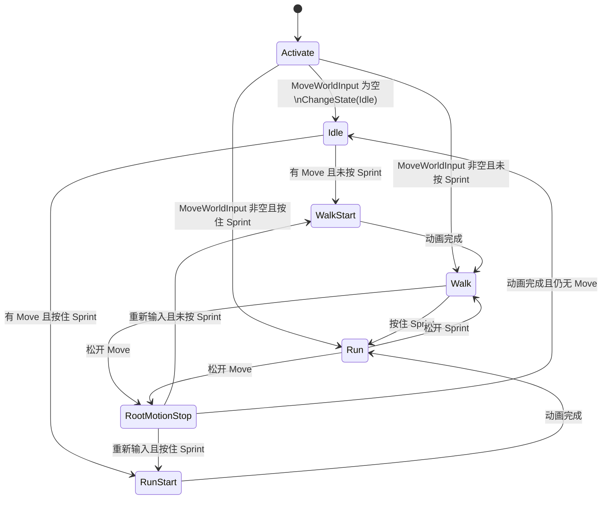
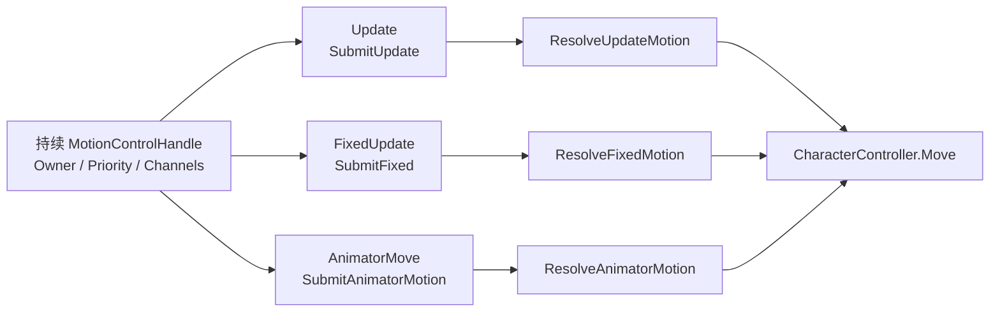
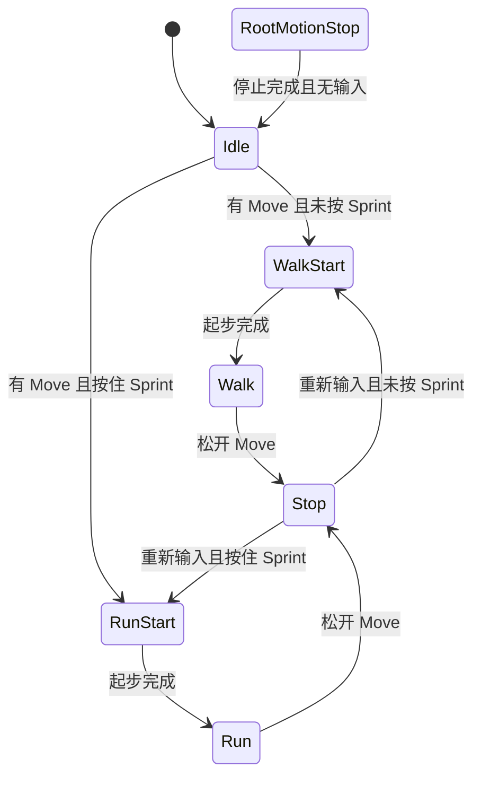
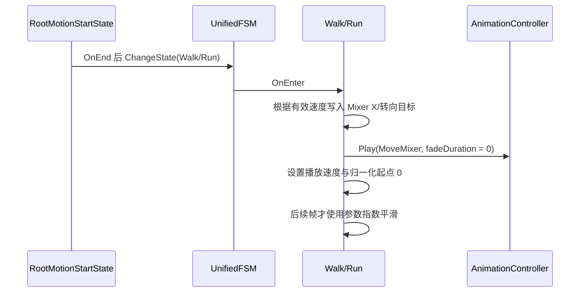
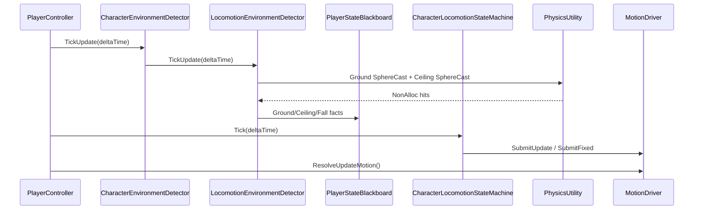
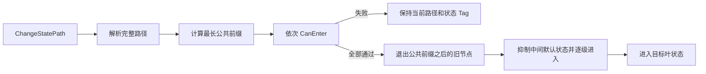

# 角色控制与运动架构

## 目标与稳定层级

Player 是跨场景稳定存在的玩家控制主体。CharacterRoot、共享 CharacterController、CharacterManager 和队伍 CharacterActor 一起常驻；切换角色只切换当前角色的表现与能力消费目标，不重建 Player 或输入链路。



- PlayerController 持有具体 MotionDriver 和唯一 PlayerStateBlackboard。
- 所有 CharacterActor 持有同一个 Blackboard 引用；它们不各自创建输入黑板。
- CharacterManager 不持有 MotionDriver、DialogueSystem、摄像机、交互检测或场景迁移服务。
- CharacterManager 可以接收 PlayerController 显式传入的输入缓冲区，但不把 PlayerInputController 保存为自己的生命周期依赖。
- CharacterManager 是 MonoBehaviour 仅为了挂在 CharacterRoot 和使用 Unity 序列化；它没有 Unity 生命周期回调。

Locomotion 使用 UnifiedFSM。`CharacterLocomotionStateMachine` 只负责状态树组装、角色与
`IMotionDriver` 依赖、启停、阶段转发和全状态共用的重力；具体状态各自持有本状态的动画、速度、
方向选择、参数平滑和状态转换数据。状态实例只注册在 UnifiedFSM 的 `StateMachine.States` 中，
Locomotion 外层不再维护第二份状态列表；重新激活时直接遍历这份唯一注册表发送状态重置通知。



`Grounded` 与 `Airborne` 是根状态机的两个兄弟子状态，Airborne 不包裹 Grounded。Grounded 内部不再增加无业务价值的 Move 子状态机：Walk、Run、WalkStart、RunStart 和 Stop 都是 Grounded 的直接叶节点。起步和停止的根运动通过显式 AnimatorMotionSubmission 提交；Walk/Run 的大角度方向变化继续由普通代码移动平滑处理。

## 显式阶段推进

CharacterManager 的阶段方法不会被 Unity 自动调用，全部由 PlayerController 在对应 Unity 生命周期中主动调用。方法使用 Tick/FixedTick/TryUpdate 命名，不定义 `Update`、`FixedUpdate`、`LateUpdate` 或 `OnAnimatorMove`。

```mermaid
sequenceDiagram
    participant Unity
    participant PC as PlayerController
    participant CM as CharacterManager
    participant Input as PlayerInputController
    participant Actor as Active CharacterActor
    participant MD as MotionDriver

    Unity->>PC: Update()
    PC->>CM: AdvanceAbilityFrame(deltaTime)
    PC->>Input: ArbiterManager.ArbitrateFrame(camera)
    PC->>CM: ProcessSwitchInputRequests(inputBuffer)
    PC->>CM: AdvanceActiveFrame(inputBuffer, deltaTime)
    PC->>MD: ResolveUpdateMotion()

    Unity->>PC: FixedUpdate()
    PC->>CM: AdvanceFixedStep(fixedDeltaTime)
    CM->>Actor: FixedTickAbility + Locomotion.FixedTick
    PC->>MD: ResolveFixedMotion()

    Unity->>PC: LateUpdate()
    PC->>CM: AdvanceLateFrame(deltaTime)

    Unity->>Actor: OnAnimatorMove()
    Actor->>PC: ProcessAnimatorMotion(source, deltaPosition, deltaRotation)
    PC->>CM: TryAdvanceAnimatorStep(source)
    PC->>Actor: GAS/FSM receives Animator delta
    Actor->>MD: winning Handle submits AnimatorMotionSubmission
    PC->>MD: ResolveAnimatorMotion()
```

CharacterManager 提供以下内部接口：

| 阶段 | 接口 | 职责 |
| --- | --- | --- |
| 全队 ASC 普通帧 | `AdvanceAbilityFrame(float)` | 遍历所有角色并调用 `TickAbility` |
| 当前角色普通帧 | `AdvanceActiveFrame(IPlayerInputRequestBuffer, float)` | 处理技能 Request，再推进当前 Locomotion |
| 当前角色物理帧 | `AdvanceFixedStep(float)` | 推进当前 ASC FixedTick 和 Locomotion FixedTick |
| 全队/当前角色延迟帧 | `AdvanceLateFrame(float)` | 全队 ASC LateTick，当前 Locomotion LateTick |
| 当前 Animator 阶段 | `TryAdvanceAnimatorStep(CharacterActor, deltaPosition, deltaRotation, evaluationDeltaTime)` | 校验来源并推进当前 GAS/FSM Animator 阶段 |

所有 deltaTime 都由 PlayerController 从 Unity 生命周期传入。CharacterManager 不读取 `Time.deltaTime`，也不执行 MotionDriver Resolve 或 `CharacterController.Move`。

## PlayerController 时序

### Awake

1. 解析 PlayerInputController、DialogueParticipant、CharacterRoot、CharacterManager 和共享 CharacterController。
2. 初始化 MotionDriver。
3. 创建唯一 PlayerStateBlackboard。
4. 调用 CharacterManager.Initialize 构建并校验队伍。
5. 为每个 CharacterActor 注入 CharacterRoot、MotionDriver、PlayerController 和同一个 Blackboard。
6. 预热所有角色 Idle 初始姿态；预热期间不激活 Locomotion、不推进 ASC、不提交运动。
7. 设置 MotionDriver ActiveOwner。
8. 创建 GameplayInputIntentArbiterManager，默认只注册 MoveInputIntentArbiter。
9. 初始化 LooseGameplayTagEventBridge 和 DialogueParticipant 动画目标。

PlayerController 的初始化任务在所有角色和 ASC 完成 `Awake` 后执行：它先调用每个 CharacterActor 的
`InitializeFromConfig` 导入 AttributeSet、授予配置 Ability，再激活当前角色 Locomotion。
这样 `Activate` 在持续 Move 场景下直接读取自身 GAS Speed 时，ASC 的运行时容器已经可用；
`CharacterActor.Start` 仍保留同一初始化方法作为独立实例启用时的幂等兜底。

### Update

1. `CharacterManager.AdvanceAbilityFrame(Time.deltaTime)` 推进全队 ASC，后台冷却和 GameplayEffect 持续时间继续。
2. `InputIntentArbiterManager.ArbitrateFrame(cameraTransform)` 转换需要复杂空间处理的连续 Move。
3. PlayerController 执行仍存在的对话/角色阻断门禁；通过后调用 `CharacterManager.ProcessSwitchInputRequests(inputController)`。
4. CharacterManager 重新读取切换后的 ActiveCharacter。
5. `CharacterManager.AdvanceActiveFrame(inputController, Time.deltaTime)` 让当前 CharacterActor 直接处理技能 Request，再推进 Locomotion。
6. Locomotion 通过 CharacterActor 的 Blackboard 引用读取 `MoveWorldInput`，Walk/Run 在 Update 阶段向 MotionDriver 提交普通移动。
7. PlayerController 调用 `MotionDriver.ResolveUpdateMotion()`，完成本次 Update 的控制权仲裁和唯一移动出口。

### Update 环境采样

`PlayerController.Update` 的第一步由 `CharacterEnvironmentDetector.TickUpdate` 统一推进环境检测。
它以 CharacterRoot 为宿主，使用 `PhysicsShapeData` 和 `PhysicsUtility.SphereCastNonAlloc` 查询地面与头顶，
并将接地、法线、距离、观测垂直速度、离地时间和本次离地高度一次性写入 Blackboard。
环境检测不读取 `CharacterController.isGrounded`，不调用 `Move`，也不决定 HFSM 状态；Locomotion 在同一帧随后读取这些事实。



头顶阻挡只限制主动上升，不替代重力或跳跃状态；跳跃在检测到头顶阻挡时不会确认 Jump Press。
环境检测器不需要每次切人或场景 Update 重置：CharacterRoot 不变，初始化时只建立第一采样的位移基线；
后续每个 Update 依靠相邻根节点位置计算观测垂直速度。场景系统若将 CharacterRoot 传送到新位置，
应在传送后重新初始化检测器以建立新的基线，而不是在普通切人流程中调用重置。

### FixedUpdate

1. `CharacterManager.AdvanceFixedStep(Time.fixedDeltaTime)` 收集当前角色 GAS、重力和其他固定步运动请求。
2. PlayerController 调用 `MotionDriver.ResolveFixedMotion()`。
3. 每个物理步最多执行一次 CharacterController.Move。

### LateUpdate

PlayerController 调用 `CharacterManager.AdvanceLateFrame(Time.deltaTime)`。该方法不执行额外移动。

### AnimatorMove

Unity 只调用 CharacterActor 同节点的无参数 `OnAnimatorMove`。CharacterActor 将来源和 Animator 增量交给 PlayerController 的普通方法 `ProcessAnimatorMotion`。PlayerController 调用 CharacterManager 验证来源、推进当前角色 GAS/FSM 动画阶段；只有业务通过有效 Handle 提交 `AnimatorMotionSubmission` 后，PlayerController 才调用无参 `MotionDriver.ResolveAnimatorMotion()`。MotionDriver 不查找 Animator，也不自动消费原始增量。

## Blackboard 与 Locomotion

PlayerStateBlackboard 是 Player 创建的稳定输入和环境事实容器，CharacterActor 只持有引用：

```text
PlayerController.StateBlackboard
    ├── CharacterActor A.StateBlackboard
    ├── CharacterActor B.StateBlackboard
    └── CharacterActor C.StateBlackboard
```

Blackboard 保留：

- `MoveWorldInput`；
- 通用 Frame IntentTag；
- Intent 来源 Handle 映射；
- `IntentSourceConsumed` 消费回传链路。
- `IsGrounded`、`GroundNormal`、`GroundDistance`；
- `IsCeilingBlocked`、`CeilingNormal`、`CeilingDistance`；
- `TimeSinceGrounded`、`ObservedVerticalSpeed`、`ObservedPlanarVelocity` 和 `CurrentFallHeight`。

技能和切人不再写入 Frame Intent。只有未来确实需要复杂输入转换、合并或上下文分析时，才使用通用 Intent 管线。

Locomotion 不保存独立的移动输入副本，也不再由 PlayerController 逐帧注入输入。各个具体状态通过
`CharacterActor.StateBlackboard.MoveWorldInput` 读取当前输入：Idle 负责起步入口判断，
RootMotionWalkStart 负责九方向选择，JumpMotion 只区分原地和向前起跳，
FallLand 根据 `CurrentFallHeight` 在配置的 1h/2h/3h 动画中选择，Walk/Run 负责转向、位移和 Move Mixer 参数，
停止与空中状态只处理自己的动画生命周期。状态机不再保存这些状态专属字段。

## 输入职责

| 输入 | 处理者 | 结果 |
| --- | --- | --- |
| WASD/左摇杆 Move | MoveInputIntentArbiter | 镜头相对方向写入 `MoveWorldInput` |
| Primary/Secondary/Skill1-4 | CharacterActor | 直接查询 Request，成功激活后确认 PressHandle |
| CharacterSlot1-4 | CharacterManager | 直接查询 Request，按切换结果确认或保留 PressHandle |
| Choice 导航、提交、点击 | Unity EventSystem | 直接驱动交互 UI |
| 复杂未来输入 | 可选自定义 Arbiter | 写入通用 Frame Intent |

固定离散输入使用 `IPlayerInputRequestBuffer.TryGetRequest`，不遍历 `Requests` 列表。Press、Held 和 Release 保持独立生命周期，为后续蓄力技能提供 `HeldDuration`、`PhysicalState` 和 `ReleaseHandle`。

角色技能输入不经过 Frame Intent。`CharacterAbilityInputBinding` 同时声明固定输入槽位和该角色的初始 Ability；PlayerController.Start（以及 CharacterActor.Start 的幂等兜底）在 ASC 完成 Awake 后初始化属性并调用 ASC `GiveAbility`，缓存 `PlayerInputType` 到 `GameplayAbilityHandle`，然后在 Update 中直接查询 Request 并尝试激活。激活失败时不确认 PressHandle，允许 Cooldown、Cost 或其他 GAS 条件在 Buffer 有效期内继续重试。



## 角色切换

CharacterManager 处理槽位输入和队伍内部结果；PlayerController 只决定当前是否允许调用该接口，并负责切换事件外的稳定 Player 协调。

切换成功流程：

1. CharacterManager 查询槽位 Request。
2. CharacterManager 调用 `TrySwitchSlot`。
3. CharacterManager 对 Success、AlreadyActive、CharacterNotFound 直接确认 PressHandle；Busy 保留 Request。
4. CharacterManager 更新 ActiveCharacter 并发送一次 `ActiveCharacterChanged`。
5. PlayerController 释放旧角色 Locomotion 和 MotionDriver 请求。
6. PlayerController 设置新的 MotionDriver ActiveOwner。
7. PlayerController 激活新角色 Locomotion，并更新 DialogueParticipant 动画目标。
8. PlayerController 随后由 `AdvanceActiveFrame` 重新读取新角色，处理同帧尚未消费的技能 Request。

持续按住 Move 切人时，新角色 Locomotion 激活阶段直接读取共享 Blackboard 的 MoveWorldInput 并进入 Walk 或 Run，
不先进入 Idle，也不播放起步根运动。角色从 Idle 或 Stop 重新开始移动时，根据 Sprint 选择 WalkStart 或 RunStart；
两种起步分别固定衔接 Walk/Run，再由 Walk↔Run Transition 处理后续 Sprint 变化。



切人不清理：

- `MoveWorldInput`；
- Blackboard Frame Intent；
- InputController 中其他尚未消费的 Request；
- Press 或 Release 的生命周期数据。

## MotionDriver 边界

GAS 和 Locomotion 只依赖 `IMotionDriver` 提交请求。MotionDriver 由 PlayerController 持有，只有 PlayerController 调用阶段开始和最终 Resolve 方法。

- CharacterManager 不持有 MotionDriver。
- CharacterManager 不调用 `ResolveUpdateMotion`、`ResolveFixedMotion` 或 `ResolveAnimatorMotion`。
- MotionDriver 负责请求优先级、通道竞争、Tag 限制和唯一 CharacterController.Move 出口。
- Locomotion 在提交代码移动前完成镜头方向和角色朝向的业务计算。
- 根运动是否消费由获胜运动控制请求决定。

MotionDriver 的持续控制权只有一套，但 Update、Fixed 和 AnimatorMove 的瞬时提交缓冲彼此独立：



每个阶段先按同一套 Owner、优先级、通道和建立顺序选择获胜 Handle，再只累计该 Handle
在当前阶段的提交。高优先级 Handle 如果占据通道但没有在当前阶段提交，结果就是零，
不会回退到低优先级 Locomotion。GAS 可以自行选择 `SubmitUpdate`、`SubmitFixed` 或
`SubmitAnimatorMotion`；MotionDriver 不理解技能类型和业务阶段。

`SubmitUpdate` 适合与输入和渲染帧同步的普通代码移动及 Locomotion 空中运动，`SubmitFixed` 适合
明确要求固定时间步的 GAS 技能或其他物理运动，`SubmitAnimatorMotion` 适合由 Animator 求值产生的根运动。
三类提交在对应 Resolve 完成后清空，不跨阶段复用；释放 Owner、停用或 Suspend 时也会
清理尚未结算的提交。

`RootMotionWalkStartState` 与 `RootMotionRunStartState` 分别负责 Walk/Run 起步。WalkStart 使用九方向动画并固定以 WalkReferenceSpeed 进入 Walk；RunStart 使用十个 Run 起步槽位，前向根据进入时脚相位选择 L0/R0，并固定以 RunReferenceSpeed 进入 Run。RunStart 自然结束时先读取结束姿态脚相位，写入 RunAsset 的 RunFeet 参数，再播放 Move Mixer。方向槽位缺失属于配置错误，初始化时直接报告，不再回退到代码移动。`WalkReferenceSpeed` 对应 Mixer X=1，`RunReferenceSpeed` 对应 X=2，GAS Speed 仍是实际运动目标。

## Locomotion 状态职责



- `IdleLocomotionState` 只播放 Idle 并决定是否发起一次起步，不保存代码移动速度。
- `RootMotionStartState` 由 WalkStart 与 RunStart 复用，在进入时选择并缓存各自方向 Transition；播放期间不因输入变化重选动画。自然结束时由具体子状态固定交给 Walk 或 Run，不在起步结束帧根据 Sprint 改投另一种起步。
- `WalkLocomotionState` 和 `RunLocomotionState` 共享连续 Move 运行时，保留速度和 Move Mixer 参数；两者切换时不重播或重置共享移动状态。
- `RootMotionStopState` 拥有停止动画选择、完成检测和退出去向。
- `RootMotionLocomotionState` 只提供根运动控制权、动画完成检查和方向修正等真正共用能力。
- 新的角色启用周期由状态机遍历 UnifiedFSM 的唯一 `States` 注册表向所有状态发送重置通知；状态机不解释或修改状态内部字段。

状态机只缓存外部阶段回调所必需的上下文：普通 `Tick` 的 `deltaTime`、AnimatorMove 的位移/旋转增量与求值时间。
Locomotion 的重力、Jump 和 ExternalLaunch 垂直运动都在普通 Update 提交；Fixed 阶段只转发明确使用固定步长的扩展逻辑。

### Start 到 Move 的直接衔接

Start 动画的末段已经按对应 Move Loop 的起始姿态制作，因此正常完成后不再额外插入动画淡入。
WalkStart 以 WalkReferenceSpeed 进入 Walk，RunStart 以 RunReferenceSpeed 进入 Run；
RunStart 在 ChangeState(Run) 前读取起步结束姿态的脚相位并写入 RunAsset 的 RunFeet 参数。
Walk/Run 进入后的 Sprint 变化继续由共享 GroundMoveRuntime 平滑处理。



直接衔接只覆盖本次从 Start 结束进入 Move 的播放调用；共享 Move Mixer 资源的默认
`FadeDuration` 不被修改，其他进入路径继续使用资源配置的淡入时间。当前 Mixer X 不再由 Walk/Run 状态固定写死，而是由 `CurrentSpeed × MoveInput.magnitude` 映射到 0~2；移动参数平滑只作用于 Y 转向参数，不能替代代码移动的加速度或角色实际转向。其配置值是指数平滑
时间常数：目标固定时经过该时间约完成当前差值的 63%，并非固定完成时间。

起步根运动方向修正的 `CorrectionSpeed` 是 Slerp 插值响应系数，单位为秒⁻¹（1/s），
不是度/秒。每次 Animator 求值使用“响应系数 × 本次求值时长”作为插值比例；值越大，
朝向目标跟随越快，值为 0 时保留动画自身根旋转但不追加代码方向修正。

## 环境事实、土狼时间与空中分支

`CharacterEnvironmentDetector` 位于 Player/CharacterRoot 侧，因为队伍角色共享同一个 CharacterRoot 世界位置。
它是 PlayerController 唯一接触的环境检测入口，当前显式组合 `LocomotionEnvironmentDetector`。
后续攀爬、贴墙和边缘检测作为同级子检测器加入总检测器，不让 PlayerController 逐个认识这些具体实现。
总检测器在 PlayerController 的 Update 开始采集环境事实，不决定状态：



Blackboard 记录 `IsGrounded`、`GroundNormal`、`GroundDistance`、`IsCeilingBlocked`、`CeilingNormal`、`CeilingDistance`、
`TimeSinceGrounded`、观测垂直速度、观测水平速度和 `CurrentFallHeight`。`LocomotionEnvironmentDetector` 使用以 CharacterRoot 为宿主的
`PhysicsShapeData` Sphere，并先在局部变量中完成一次完整采样，再一次性写入这些字段；它不读取 `CharacterController.isGrounded`。
初始化时只建立第一采样的位移基线，不在普通切人流程中重置检测器；未来场景传送服务若改变 CharacterRoot 世界位置，应重新初始化以避免跨传送计算虚假速度。
Locomotion 自己的 `verticalSpeed` 仍用于主动跳跃和重力，但不替代观测速度：高优先级外力可能覆盖 Vertical 通道。
土狼时间默认 0.12 秒；Jump 只在 Grounded 或离地累计时间仍在窗口内成功进入 `JumpMotion` 后确认 PressHandle。
外部弹射必须同时满足 GAS 的 `State.Movement.ExternalLaunch` 原因 Tag 和观测上升速度阈值，并优先于同帧主动 Jump。
`State.Movement.ExternalLaunch` 是外力来源的业务事实，不是当前 Locomotion 状态 Tag：负责跳板、击飞或其他外力的 GameplayEffect/GA 在外力有效期间维护它；进入 `ExternalLaunch` 后，叶状态再按自身配置维护 `State.Locomotion.Airborne.ExternalLaunch`。

主动跳跃只在进入 `JumpMotion` 时读取一次 `ObservedPlanarVelocity`：达到向前起跳阈值播放前跳，否则播放原地跳。
`JumpMotion`、`ExternalLaunch` 和 `Fall` 继承 `AirborneMotionState`，进入空中时续接实际水平惯性；有 Move 时按空中加速度和转向速度逐步跟随新方向，无 Move 时不主动清零水平速度。
外力弹射仍是一个 HFSM 叶状态，但其动画阶段先播放 `ExternalLaunchStartTransition`，Start 的 Animancer `OnEnd` 回调只在仍处于上升阶段时切换到 `ExternalLaunchLoopTransition`；若 Start 结束前已经进入下落，则直接由 `Fall` 覆盖表现。

地面与头顶配置必须使用 SphereCast。球心、半径和投射长度均以 CharacterRoot 局部配置换算到世界空间，环境检测过滤 CharacterRoot 及其子级 Collider；Gizmo 同时显示起点球、终点球和投射线。

Walk 与 Run 是独立叶状态，但共享 `GroundMoveRuntime`。从 Walk 切到 Run 或反向切换时保留当前速度和 Mixer 状态，X 按 WalkReferenceSpeed 到 RunReferenceSpeed 的有效速度区间连续变化，不再维护单独的档位过渡时间；Idle/Stop 根据 Sprint 分别使用 WalkStart 或 RunStart。大角度转向不会切换到额外根运动状态，继续由普通移动转向和 Move Mixer 处理。

Move Mixer 的 RotationY 是有限的非循环参数：先计算预计角色前向与世界 Move 方向的相对角度，将其限制在 `[-2, 2]`，再乘以 `EffectiveMoveSpeed / RunReferenceSpeed` 的权重，最后使用普通标量指数平滑。达到 RunReferenceSpeed 时使用完整角度范围，不能把 `-2` 与 `+2` 当作同一欧拉角环上的两个表示，否则镜头连续旋转跨过边界时会造成参数锁在一侧。

当 `RunReferenceSpeed=3` 时，有效速度 1.5 对应 `X=1`，2.25 对应 `X=1.5`，3 对应 `X=2`；只有超过 3 时才把 X 保持在 2 并提高整个 Mixer 的播放倍率。有效速度由当前代码速度乘以 Move 输入幅度得到，因此半推摇杆不会直接跳到 Run 档位。

FallLand 按实际选中的 1 米、2 米或 3 米动画读取独立的输入开放归一化时间。窗口开放前保持落地表现；开放后按 Jump 优先、Move 次之处理，Jump 只有完整 HFSM 路径成功才确认 Press，Move 直接续接 Walk/Run，不重复播放起步动画。

落地动画使用独立的 Animancer `TransitionAsset`，并由角色 AnimancerComponent 共享
`DefaultLocomotionTransitionLibrary`。从实际播放的 1 米、2 米、3 米落地 Transition 切换到 Move Mixer
时，Library 分别提供 `0.10s / 0.18s / 0.28s` 的来源专属淡入；未注册的内嵌 Transition 仍按自身 FadeDuration 播放，Start→Move 的显式零淡入入口不被 Library 覆盖。

## 状态 Tag 与路径预检

每个具体叶状态从 `PlayerFSMTransition` 读取自己的精确 Tag 和 `GameplayTagQuery`。进入时添加 Tag，退出时对称移除；
父级 Grounded/Airborne 只作为 HFSM 路径节点，不重复添加叶状态 Tag。`ChangeStatePath` 采用“收集路径 → 预检全部分歧目标 → 提交退出与进入”的事务边界：

当前默认 Transition 资产中的状态 Tag 和外力原因 Tag 仍为空值，待在 GameplayTagDatabase 中创建并烘焙对应层级后，再通过 Inspector 写入这些字段；空值只表示不启用该项 Tag 门禁，不会伪造一个无效 Tag。



因此 `Grounded.Walk → Grounded.Run` 会复用 `Grounded` 前缀，不会因为父状态相同而提前返回；只有完整路径完全相同时才返回 false。

## 状态与资源生命周期

- CharacterManager 初始化失败或 MarkerProvider 无效的角色不会进入可切换集合。
- 后台角色的 ASC 保持推进，但 Animator、Renderer 和 Locomotion 表现停用。
- 角色 Binding 中配置的 Ability 在 PlayerController.Start/CharacterActor.Start 初始化阶段授予各自 ASC；切换角色只切换当前 ASC 和表现，不共享 Ability Spec。
- PlayerController 禁用时停止自身阶段驱动、清理瞬时输入和停用当前 Locomotion；CharacterManager 不会因为仍是 enabled 而自行运行。
- 旧的场景迁移/玩家输入锁定布尔字段及 PlayerController 场景迁移事务 API 已移除。
- 后续场景和 UI 输入锁定通过禁用对应 InputActionMap 实现；CharacterRoot 传送和 CharacterController 管理由专门场景服务负责。

## 变更文件

本次输入和阶段边界修改涉及：

- `Character/PlayerController.cs`
- `Character/Runtime/CharacterManager.cs`
- `Character/Runtime/CharacterActor.cs`
- `Character/Environment/CharacterEnvironmentDetector.cs`
- `Character/Environment/LocomotionEnvironmentDetector.cs`
- `WSFrame/Utilities/PhysicsUtility/PhysicsUtility.cs`
- `WSFrame/Utilities/PhysicsUtility/PhysicsShapeData.cs`
- `Character/Locomotion/Runtime/CharacterLocomotionStateMachine.cs`
- `Character/Locomotion/Runtime/GroundedLocomotionStateMachine.cs`
- `Character/Locomotion/Runtime/AirborneLocomotionStateMachine.cs`
- `Character/Locomotion/Runtime/AirborneMotionState.cs`
- `Character/Locomotion/Runtime/GroundMoveLocomotionState.cs`
- `Character/Locomotion/Runtime/WalkLocomotionState.cs`
- `Character/Locomotion/Runtime/RunLocomotionState.cs`
- `WSFrame/FSM/UnifiedFSM/StateMachine.cs`
- `WSFrame/FSM/UnifiedFSM/IState.cs`
- `WSFrame/FSM/UnifiedFSM/IStateMachine.cs`
- `Input/Runtime/PlayerInputController.cs`
- `Game/Arbiter/GameplayInputIntentArbiterManager.cs`
- `Player.prefab`
- `Character/Config/DefaultPlayerFSMTransition.asset`
- `InteractionSystem/Test/TestScene/TestInteractableScene.unity`
- GameplayTag Database 与生成常量
- 输入与角色架构 Odin 测试器

## 验收重点

- CharacterManager 没有 Unity 生命周期方法，只有 PlayerController 显式调用 Tick 接口。
- 每个 ASC 阶段每帧只执行一次。
- CharacterManager 返回后 PlayerController 才执行 MotionDriver 最终结算。
- 所有 Actor 共享同一个 Blackboard，Locomotion 直接通过 Owner 读取 MoveWorldInput。
- 技能和切人不经过专用 Arbiter 或 IntentTag。
- Move 仍然正确完成镜头相对转换。
- `moveAction` 使用对象引用，已删除字符串回退字段。
- 场景和输入锁不再通过 PlayerController bool 分支实现。
