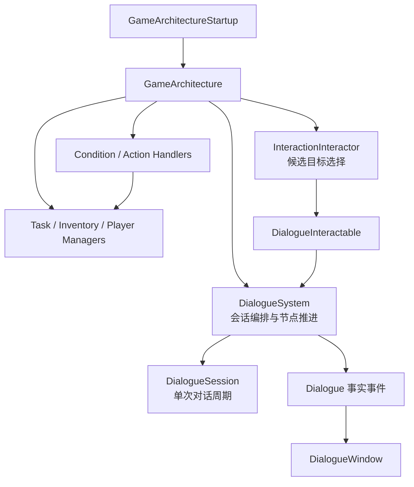
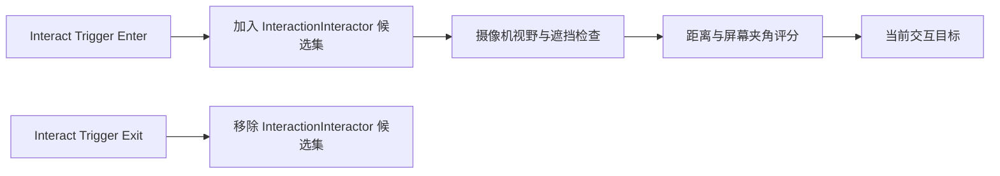
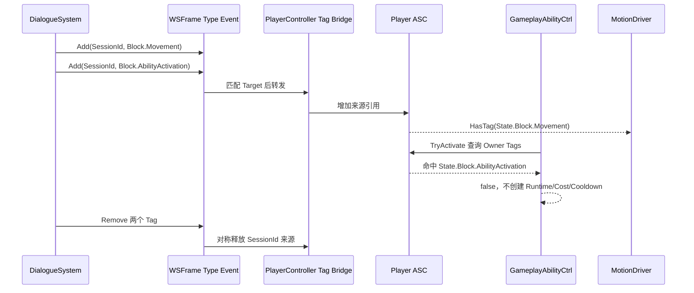

# 站桩式对话系统需求说明

> 文档状态：需求确认稿  
> 适用范围：单机 RPG、3D 站桩式 NPC 对话、ScriptableObject 对话图  
> 当前阶段：运行时与 GraphView 编辑器第一版已实现，运行时 UI 和业务 Handler 仍由业务模块接入

## 1. 产品目标与第一版范围

第一版提供一个“角色原地、UI 驱动、Speech/Choice 节点控制、3D 动画表现”的 NPC 对话系统。

### 1.1 第一版目标

- 玩家通过通用 `Interact` 目标开始 NPC 对话。
- 对话内容由 ScriptableObject 图资产配置。
- 支持 Speech、Choice 以及无类型配置的 Completed End；Condition 和 Action 配置在 Choice 内。
- 对话期间通过通用 LooseGameplayTag 事件请求 `State.Block.Movement` 与 `State.Block.AbilityActivation`，不创建对话专属 Tag。
- 使用现有 WSFrame `UIManager + WindowBase` 显示对话界面。
- 使用 `DialogueSession` 管理一次对话周期。
- 使用 `DialogueSystem` 作为对话系统入口和会话编排器。
- SpeechNode 可以配置 3D 说话人的全身 `AnimationClip` 和 `AudioClip` 语音。
- 对话图按照现有 WSFrame GraphView 扩展设计编辑器准备方案。

### 1.2 第一版明确不包含

- 不制作头像、Portrait、左右头像站位或头像资源加载。
- 不制作镜头切换、角色走位、转身、过场动画或镜头演出。
- 不保存对话中途进度。
- 不接入本地化 Key、打字机效果或语音等待/自动推进；VoiceClip 只负责按对白节点播放。
- 不内置任务、背包、奖励等业务 Handler。
- 不提供通用 Escape 或关闭按钮取消对话。
- 不通过禁用 PlayerController、Locomotion 或其他组件实现站桩。
- 不使用 UniTask、TaskCompletionSource 或异步等待式对话接口。

## 2. BusinessArchitecture 分层

对话系统和其他业务模块一起注册到同一个 `GameArchitecture` IOC 容器中。



### 2.1 DialogueSession

`DialogueSession` 表示并管理一次完整对话周期，不是全局 Manager。

负责：

- 当前会话 ID。
- 当前 `DialogueRequest`。
- 当前 `DialogueAsset`、`SpeechNode`、`ChoiceNode` 和运行状态。
- 当前 `IDialogueParticipantContext` 与 `SpeakerId` 绑定。
- 当前会话的 `SessionId` 作为 LooseGameplayTag 来源标识，系统只发布通用事件。
- `SpeechPresented`、`ChoicePresented` 和 `Ended` 事件。
- 会话结束时清理本会话启动的语音和动画；DialogueSystem 负责发布对称的 LooseGameplayTag Remove 请求，UI 通过事实事件关闭窗口。

不负责：

- 读取 Unity 输入。
- 扫描交互碰撞体。
- 直接查找任务、背包或角色 Manager。
- 直接操作 UI 控件。

### 2.2 DialogueSystem

`DialogueSystem` 是 BusinessArchitecture 中的系统入口，负责：

- 校验并启动对话。
- 创建、持有和释放当前 `DialogueSession`。
- 执行 `Advance` 和 `SelectChoice`。
- 读取 Speech/Choice 直接引用并推进节点。
- 调用 Condition 和 Action。
- 校验图结构、节点引用和 Handler 配置。
- 发布对话已经发生的事实事件。

`DialogueSystem` 不把 UI、输入和业务 Manager 引用写入 `DialogueAsset`。

### 2.3 InteractionInteractor

`InteractionInteractor` 是玩家侧通用交互选择逻辑，负责：

- 接收 `Interact` Trigger Enter/Exit 提供的候选目标。
- 从当前候选集合中执行摄像机视野检查。
- 执行遮挡检测。
- 根据距离和屏幕中心夹角计算目标评分。
- 选出最高分目标并显示通用交互提示。
- 在 Submit 输入时调用目标的交互入口。

Interactor 不直接配置 NPC 的交互碰撞体，也不理解 `DialogueAsset`。

### 2.4 Condition 与 Action

Condition 和 Action 是 `ChoiceNode` 的内容，不是独立图节点：

```csharp
protected override void OnInit()
{
    DialogueSystem dialogueSystem = this.GetSystem<DialogueSystem>();
    dialogueSystem.RegisterConditionHandler(new PlayerTagConditionHandler());
    dialogueSystem.RegisterActionHandler(new AcceptTaskActionHandler(taskManager));
}
```

第一版不使用运行时反射扫描和 UnityEvent。Condition/Action 定义由 `[SerializeReference]` 保存，Handler 按具体 C# 定义类型显式注册，缺失 Handler 视为配置错误。

## 3. 同步运行时 API

```csharp
DialogueStartResult TryStartDialogue(DialogueRequest request);
DialogueStepResult Advance();
DialogueStepResult SelectChoice(string choiceId);
```

### 3.1 TryStartDialogue

`TryStartDialogue` 负责启动或拒绝一段会话：

- 当前已有会话时返回 `Busy`。
- 请求、资产或参与者无效时返回 `InvalidRequest`。
- 图校验失败时返回 `InvalidGraph`。
- 成功后创建 `DialogueSession`，从 EntryNode 进入第一个 SpeechNode。
- 成功进入 SpeechNode 后发布 `DialogueSpeechPresentedEvent`。
- 成功后发布 `DialogueStartedEvent`。

### 3.2 Advance

`Advance` 只允许推进当前没有 Choice 的 SpeechNode：

- 当前没有会话时返回 `NotRunning`。
- 当前 SpeechNode 的 `Choices.Count > 0` 时返回 `ChoiceRequired`，即使同时配置了 `NextNode` 也不回退。
- 当前 SpeechNode 没有 Choice 时使用 `NextNode` 进入目标节点。
- 进入新的 SpeechNode 时发布 `DialogueSpeechPresentedEvent`。
- 进入 ChoiceNode 时发布 `DialogueChoicePresentedEvent`。
- 进入 EndNode 时结束会话并发布 `DialogueEndedEvent`。

### 3.3 SelectChoice

`SelectChoice` 只允许选择当前 SpeechNode 的 Choice：

- Choice 不存在时返回 `InvalidChoice`。
- Condition 不满足的 Choice 显示为置灰且不可选择。
- Choice 被选择后触发其 Actions。
- Action 不返回成功/失败状态，也不决定节点跳转；Handler 异常由 DialogueSystem 转换为 Failed。
- Actions 触发后立即进入 Choice 配置的 `TargetNode`。
- 缺失 Handler 或 Action 异常会结束会话并返回 Failed；Condition 不满足只返回置灰的 `ConditionFailed`。

### 3.4 事实事件

事件只表示已经发生的事实，不承担核心流程拼接：

- `DialogueStartedEvent`
- `DialogueSpeechPresentedEvent`
- `DialogueChoicePresentedEvent`
- `DialogueEndedEvent`

## 4. DialogueRequest 与 3D 参与者

一次对话使用强类型请求，不使用通用字典：

```csharp
public sealed class DialogueRequest
{
    public DialogueAsset Asset { get; }
    public IDialogueParticipantContext Initiator { get; }
    public IInteractable Target { get; }
    public IReadOnlyList<IDialogueParticipantContext> Participants { get; }
}
```

`IDialogueParticipantContext` 是玩家和 NPC 共用的最小参与者契约：

- `SpeakerId`：与 SpeechNode 匹配的稳定标识。
- `ParticipantObject`：参与者的场景对象，用于通用事件目标。
- `VoiceAudioSource`：对话专用语音 AudioSource，可为空。
- `AnimationPlayer`：动画播放接口，可为空。

`DialogueParticipant : MonoBehaviour` 是运行时默认实现。玩家和 NPC 均挂载该组件，分别配置自己的 SpeakerId、语音 AudioSource 和 `IAnimationPlayer`。Context 不包含 ASC、GameplayTag、任务 Manager 或 UI 引用。

Context 用于：

- 找到 SpeechNode 对应的 3D 说话人。
- 让 DialogueSession 调用对应角色的语音和动画接口。
- 让 Condition/Action 通过会话上下文访问参与者及已注入的业务服务。
- 允许同一个 DialogueAsset 被多个 NPC 复用。

DialogueAsset 只保存内容、节点引用和稳定标识，不持有场景中的玩家、NPC、ASC、Window 或 `IAnimationPlayer` 引用。

## 5. ScriptableObject 对话资产

DialogueAsset 使用 ScriptableObject 保存稳定对话图，并使用节点 SubAsset 保存节点对象：

```text
DialogueAsset
├─ DialogueId
├─ EntryNode
└─ Nodes[]
   ├─ EntryNode
   ├─ SpeechNode
   ├─ ChoiceNode
   └─ EndNode
```

节点使用稳定字符串 `NodeId`。节点跳转使用 `DialogueNode` 的直接 ScriptableObject 引用；`Nodes[]` 的 index 只用于资产枚举和编辑器顺序，不作为节点身份或跳转 ID。

### 5.1 EntryNode

- 每个 DialogueAsset 只能有一个入口。
- EntryNode 直接引用第一个 SpeechNode。

### 5.2 SpeechNode

`SpeechNode` 是一段可展示的 3D 对白，字段包括：

- `NodeId`：稳定字符串 GUID。
- `SpeakerId`：由 Editor SpeakerId 配置提供选择。
- `Text`：第一版直接保存字符串。
- `AnimationClip`：可选的全身说话动作。
- `VoiceClip`：可选的对白语音；由对应 Context 的 `VoiceAudioSource` 播放。
- `AnimationFadeDuration`：动画淡入时间。
- `NextNode`：无 Choice 时的线性后续节点。
- `Choices[]`：当前对白提供的 Choice 列表。

SpeechNode 只有一个容量为 `Multi` 的 `speech-output` 输出端口；编辑器根据目标类型把边恢复为 `NextNode` 或 `Choices[]`：

```text
SpeechNode
└─ speech-output -> ChoiceNode[0..N]
               └-> SpeechNode / EndNode（最多一个线性目标）
```

同一个 SpeechNode 只能选择一种输出模式：可以连接多个 ChoiceNode，或连接一个 SpeechNode/EndNode 作为线性目标。Choice 优先规则仍由运行时保证：有 Choice 时等待 `SelectChoice`，Choice 条件失败时不回退到 `NextNode`；编辑器和 Validator 都拒绝 Choice 与 NextNode 混用。

### 5.3 ChoiceNode

ChoiceNode 是 SpeechNode 的选项子节点，字段包括：

- `NodeId`：稳定字符串 GUID。
- `ChoiceId`：同一 SpeechNode 内稳定且唯一的选择标识。
- `Text`：选项显示文本。
- `Conditions[]`：决定当前选项是否可用。
- `Actions[]`：选择后触发的副作用动作。
- `TargetNode`：选择后直接进入的 SpeechNode 或 EndNode。

多个 Condition 全部使用 AND。Condition 不修改游戏状态，只负责判断并提供失败原因。

Action 的运行规则：

1. Choice 满足条件并被选择。
2. 按配置顺序触发 Actions。
3. Action 不返回成功/失败结果。
4. Action Handler 同步执行；异常由 DialogueSystem 捕获并结束会话为 Failed。
5. DialogueSession 立即进入 Choice 的 TargetNode。

### 5.4 EndNode

EndNode 不配置结束类型，也不允许存在后继连接。运行时进入任意 EndNode 都返回 `DialogueEndStatus.Completed`；Handler 缺失、Action 异常、非法节点和架构注销统一返回 `Failed`。拒绝任务、取消交易等业务语义由 Choice 的 Action 修改业务状态后进入普通 EndNode。

### 5.5 全身动画

SpeechNode 的 `AnimationClip` 通过参与者的 `IAnimationPlayer` 播放：

```csharp
animationPlayer.Play(
    AnimationLayerType.Action,
    speech.AnimationClip,
    speech.AnimationFadeDuration);
```

- 固定使用 `AnimationLayerType.Action`。
- `AnimationLayerProfile` 中的 Action 层配置为全身 Avatar Mask。
- 不允许 SpeechNode 修改动画层。
- 新 Speech 的动画替换当前会话在 Action 层启动的上一段对话动画。
- 新 Speech 进入时停止上一句语音并在对应 Participant 的专用 AudioSource 播放 VoiceClip；没有 VoiceClip 不报错。
- 配置了 VoiceClip 或 AnimationClip 但 Participant 缺少对应组件时记录错误并继续文本流程。
- Session 结束时停止或淡出由本会话启动的动画状态。
- 不处理镜头、移动、转身或角色站位演出。

## 6. 节点图校验与运行保护

编辑期或启动期必须校验：

- DialogueId 非空且稳定。
- EntryNode 唯一且目标有效。
- NodeId 非空且不重复。
- ChoiceId 在所属 SpeechNode 内不重复。
- SpeechNode 不能同时存在 `NextNode` 和非空 `Choices[]`；编辑器以 Choice 模式或线性模式二选一，运行时在合法资产中按对应模式推进。
- 所有 `NextNode`、`TargetNode` 引用存在。
- 每个 Choice 都有目标节点。
- EndNode 不允许存在后继连接。
- Condition/Action 列表中的每个 `[SerializeReference]` 定义不能为空。
- 每个定义的具体 C# 类型必须有已注册的 Handler；具体字段配置由定义和 Handler 自行校验。
- 至少有一个从 EntryNode 可达的 EndNode，且每个可达节点都存在通往 EndNode 的路径；允许有出口的循环。

节点图允许循环，因为循环必须经过玩家的 `Advance` 或 `SelectChoice`，并且必须存在可达 EndNode 的出口；图中不创建 ConditionNode/ActionNode，因而不需要自动节点步数限制。

## 7. 通用 Interact 与碰撞体

### 7.1 InteractionSystem 边界

通用交互代码位于独立的 `RPG.InteractionSystem`，不引用 `DialogueSystem`。它提供 `IInteractable`、`InteractionOption`、`Interact` 和 `InteractionInteractor`；对话系统只通过 `DialogueInteractable` 实现通用接口完成业务适配。

### 7.2 Interact 职责

`Interact` 是通用交互组件，只负责自己的交互碰撞体数据、Trigger 生命周期和交互目标契约，不依赖 DialogueAsset。

第一版使用 3D BoxCollider 作为标准交互体，并固定为 Trigger。`InteractionData` 配置：

- `Center`：碰撞体相对位置。
- `Size`：碰撞体大小。
- `Layer`：交互碰撞层。
- `Enabled`：是否参与交互。

`IsTrigger` 不作为配置字段，因为交互碰撞体必须是 Trigger。

### 7.3 候选目标来源

候选目标由 Trigger 生命周期提供，不再使用“根据碰撞体范围筛选”的描述：



Interactor 只在当前候选集合中进行视野、遮挡和评分处理：

1. `Interact` Trigger Enter 提供候选目标。
2. `Interact` Trigger Exit 移除候选目标。
3. 排除不在摄像机视野内的候选。
4. 通过物理射线排除被遮挡候选。
5. 根据距离和屏幕中心夹角计算评分。
6. 选择最高分目标并刷新提示。

距离只参与评分，不再作为碰撞体候选范围筛选条件。

### 7.4 对话交互适配

`DialogueInteractable` 或等价适配组件负责保存：

- DialogueAsset。
- NPC 的 `DialogueParticipant` 组件入口。
- 从交互发起者父级 `DialogueParticipant` 构建 Initiator Context。

它实现通用 `IInteractable`，在 `Interact` 选项被执行时构建 `DialogueRequest` 并调用 `DialogueSystem.TryStartDialogue`。

## 8. GAS LooseGameplayTag 与 Ability 全局阻断

对话不创建专属 Tag，也不把 ASC 塞进 Participant Context。`DialogueSystem` 只向发起者对象发布两个通用请求：

```text
State.Block.Movement
State.Block.AbilityActivation
```

请求携带 `Target`、`SourceId = DialogueSession.SessionId`、Tag 和 Add/Remove 操作。玩家侧 `PlayerController` 实现 `IGameplayAbilitySystemTagBridge`，由 `LooseGameplayTagEventBridge` 订阅 WSFrame Type Event，只接收属于该角色层级的请求并调用 ASC 的公开 `AddLooseGameplayTag` / `RemoveLooseGameplayTag`。DialogueSystem 不查找 ASC、不做 Tag 映射；没有事件桥接时纯对话仍可运行。

ASC 内部用 `SourceId + GameplayTag` 维护来源集合：重复 Add 不重复计数，只有对应来源存在时 Remove 才减少计数，底层继续使用 `GameplayTagCountContainer`，不开放 `MutableTags`。PlayerController 禁用或销毁时，桥接器注销事件并释放自身持有的来源。



### 8.1 MotionDriver 规则

`MotionDriver` 将 `State.Block.Movement` 作为固定基础规则：主动水平移动的 X/Z 被清零，但垂直重力结算保留；已有可配置的水平阻断 Tag 与全部移动阻断 Tag 继续生效。对话不直接禁用 PlayerController、Locomotion 或其他组件。

### 8.2 Ability 激活规则资产

新增共享 `GameplayAbilityActivationRules : ScriptableObject`，由 ASC 初始化时注入 `GameplayAbilityCtrl`。默认资产配置 `State.Block.AbilityActivation`。AbilityCtrl 复制规则集合，不持有可变资产数组；`TryActivate` 在查询 Spec、处理已有 Runtime 的 `RejectWhileActive/ToggleOff` 后，先检查任一全局阻断 Tag，再进入 Ability 自身条件、Cooldown 和 Cost 流程。命中时不创建 Runtime、不结算 Cost、不应用 Cooldown；ToggleOff 仍允许关闭已有 Runtime。

保留 `Initialize(attributeSets)` 旧重载作为空规则兼容入口；规则资产重载拒绝空资产。`Clear` 同时清除 AbilityCtrl 的规则快照，允许下一次初始化注入新规则。该规则不新增 `CanActivate` API，也不引用 DialogueSystem。

## 9. UI 表现

运行时 UI 使用现有 `UIManager + WindowBase`：

```text
UIManager
├─ DialogueWindow
└─ InteractionPromptWindow
```

DialogueWindow 显示：

- SpeakerName。
- SpeechNode 正文。
- ChoiceNode 选项列表。
- 条件失败时的置灰原因。

输入行为：

- 当前 SpeechNode 没有 Choice 时，Submit 调用 `Advance`。
- 当前 SpeechNode 有 Choice 时，Submit 或点击调用 `SelectChoice`。
- 有 Choice 时不能使用 Advance 默认推进。
- 不显示头像和左右站位。

## 10. GraphView 对话编辑器准备

编辑器参考现有路径：

`Assets/Scripts/WSFrame/UIToolkitExtensions/Editor/GraphView/`

使用 `WSGraphView`、`WSGraphNode` 和现有 GraphView 扩展接口，不直接重复实现 Unity GraphView 的基础画布能力。

### 10.1 编辑器 MVC 选型

GraphView 编辑器采用 MVC 为主，不创建共享的 `DialogueGraphEditorViewModel`。

Model：

- DialogueAsset 与节点 SubAsset。
- Graph 校验服务。
- Graph 结构命令服务。
- Editor-only `DialogueSpeakerIdSettings`。

View：

- `DialogueGraphEditorWindow`。
- `DialogueGraphView`。
- `DialogueGraphNodeView`。
- `DialogueGraphDetailsView`。
- `DialogueGraphValidationView`。
- `DialogueGraphSpeakerSettingsView`。

Controller：

- 创建和连接各 View。
- 将 GraphView 的点击、移动、连接和删除转换为 Graph 命令。
- 协调节点选择、详情刷新和校验刷新。
- 管理 Undo、Dirty、保存、绑定和解绑。
- 在窗口重建或目标切换后从 Model 恢复完整 View。

编辑器临时状态只保留轻量 UI State Model：

- 当前选中的 Graph。
- 当前选中的 Node。
- 当前校验消息。
- 当前运行时高亮 Node。
- 当前 SpeakerId 下拉内容。

只有当某个面板需要独立筛选、分页、多源组合或复杂派生数据时，才为该面板增加私有 ViewModel；不创建覆盖整个编辑器的共享 ViewModel。

### 10.2 SerializedObject 与 Undo

- 普通节点字段优先使用 `SerializedObject`、`SerializedProperty` 和 `PropertyField`。
- 切换节点时先解除旧绑定，再绑定新节点。
- 节点结构变化通过 Controller 和 Graph 命令服务修改。
- 结构变化使用 `Undo.RecordObject`、`EditorUtility.SetDirty` 和资产保存。
- Undo/Redo 后重新读取 Graph Model 并刷新 GraphView、Details 和 Validation。
- View 不保存业务数据副本，Graph Asset 是唯一数据来源。

### 10.3 GraphView 节点与接线

节点实现 `IGraphNodeContentProvider` 和 `IGraphPortProvider`，GraphView 实现：

- `IGraphConnectionPolicy`：限制节点接线方向和端口类型。
- `IGraphChangeListener`：接收节点移动、连接、断开和删除后的结果。
- `IGraphNodeInteractionListener`：接收点击和选择变化。
- `IGraphContextMenuProvider`：提供创建节点、删除节点和编辑操作菜单。
- `Port.Create<Edge>` 使用 Unity 2022.3 内置 DefaultEdgeConnector 提供拖线预览；节点选择逻辑跳过端口命中，避免拖线被误判为节点点击。
- 通用右键 `Layout` 提供水平/竖直对齐与均匀分布；Controller 使用 Undo 将布局后的视觉位置写回 `EditorPosition`，不重建画布。

接线规则：

- EntryNode 只能连接 SpeechNode。
- SpeechNode 只有一个 `speech-output`；可连接多个 ChoiceNode，或最多一个 SpeechNode/EndNode 作为 `NextNode`，两种输出模式互斥。
- ChoiceNode 的目标连接 SpeechNode 或 EndNode。
- 一个 ChoiceNode 只能归属于一个 SpeechNode。
- SpeechNode 的 Choice 输出与线性目标互斥；GraphView 在接线时拒绝混用，Validator 对已有非法资产报告 Error。
- 删除节点时同步清理所有直接 ScriptableObject 引用。
- 节点位置只用于编辑器布局，不参与运行时节点跳转。

### 10.4 SpeakerId Editor 配置

使用 Editor-only `ScriptableSingleton` 持久化预先定义的 SpeakerId：

```csharp
[FilePath("ProjectSettings/DialogueSpeakerIdSettings.asset", FilePathAttribute.Location.ProjectFolder)]
internal sealed class DialogueSpeakerIdSettings
    : ScriptableSingleton<DialogueSpeakerIdSettings>
{
    // 持久化预先定义的 SpeakerId 列表。
}
```

规则：

- 设置资产只服务 Editor，不进入 Runtime 程序集。
- 设置资产持有预先定义的 SpeakerId 列表。
- SpeechNode 编辑字段通过下拉列表选择 SpeakerId。
- SpeechNode 和 DialogueParticipant 的 `SpeakerId` 使用同一个 `[SpeakerId]` `PropertyDrawer`，只允许从设置列表、空值或历史未知值（显示 `Missing`）中选择，不允许手工输入。
- Graph 资产只保存最终选中的 SpeakerId 字符串。
- SpeakerId 删除或重命名时，Validation 面板报告受影响的 SpeechNode。
- Graph Inspector 使用普通 `PropertyField`，由 Drawer 统一处理多对象编辑、SerializedProperty 和 Undo；运行时不依赖 `DialogueSpeakerIdSettings`。

### 10.5 Editor 使用参考图

下面的内嵌 SVG 用于表示编辑器的大致使用关系；它是 Markdown 中的说明图，不是运行时 UI，也不替代 GraphView 实现：

<svg xmlns="http://www.w3.org/2000/svg" width="960" height="420" viewBox="0 0 960 420" role="img" aria-label="Dialogue GraphView 编辑器使用关系图">
  <defs>
    <marker id="dialogue-editor-arrow" viewBox="0 0 10 10" refX="9" refY="5" markerWidth="7" markerHeight="7" orient="auto-start-reverse">
      <path d="M 0 0 L 10 5 L 0 10 z" fill="#52606d" />
    </marker>
    <style>
      .dialogue-editor-box { stroke: #34495e; stroke-width: 2; rx: 12; }
      .dialogue-editor-title { font: 600 16px sans-serif; fill: #1f2933; text-anchor: middle; }
      .dialogue-editor-text { font: 13px sans-serif; fill: #52606d; text-anchor: middle; }
      .dialogue-editor-arrow { stroke: #52606d; stroke-width: 2; fill: none; marker-end: url(#dialogue-editor-arrow); }
      .dialogue-editor-dashed { stroke-dasharray: 7 5; }
    </style>
  </defs>

  <rect x="28" y="40" width="190" height="88" fill="#e8f1fb" class="dialogue-editor-box" />
  <text x="123" y="74" class="dialogue-editor-title">SpeakerId Settings</text>
  <text x="123" y="99" class="dialogue-editor-text">ScriptableSingleton</text>

  <rect x="28" y="270" width="190" height="88" fill="#e8f1fb" class="dialogue-editor-box" />
  <text x="123" y="304" class="dialogue-editor-title">DialogueAsset</text>
  <text x="123" y="329" class="dialogue-editor-text">Graph + Node SubAssets</text>

  <rect x="300" y="150" width="220" height="110" fill="#fff4d6" class="dialogue-editor-box" />
  <text x="410" y="188" class="dialogue-editor-title">EditorWindow</text>
  <text x="410" y="213" class="dialogue-editor-text">MVC Composition Root</text>
  <text x="410" y="235" class="dialogue-editor-text">Controller + UI State</text>

  <rect x="610" y="50" width="170" height="78" fill="#e6f6ed" class="dialogue-editor-box" />
  <text x="695" y="83" class="dialogue-editor-title">GraphView</text>
  <text x="695" y="106" class="dialogue-editor-text">Nodes + Edges</text>

  <rect x="610" y="170" width="170" height="78" fill="#e6f6ed" class="dialogue-editor-box" />
  <text x="695" y="203" class="dialogue-editor-title">DetailsView</text>
  <text x="695" y="226" class="dialogue-editor-text">SerializedObject Binding</text>

  <rect x="610" y="290" width="170" height="78" fill="#e6f6ed" class="dialogue-editor-box" />
  <text x="695" y="323" class="dialogue-editor-title">ValidationView</text>
  <text x="695" y="346" class="dialogue-editor-text">Graph Rules + Errors</text>

  <rect x="820" y="150" width="110" height="110" fill="#f2eafa" class="dialogue-editor-box" />
  <text x="875" y="188" class="dialogue-editor-title">Undo</text>
  <text x="875" y="213" class="dialogue-editor-text">Dirty</text>
  <text x="875" y="238" class="dialogue-editor-text">Save</text>

  <path d="M 218 84 C 260 84, 255 180, 300 180" class="dialogue-editor-arrow dialogue-editor-dashed" />
  <path d="M 218 314 C 260 314, 255 230, 300 230" class="dialogue-editor-arrow" />
  <path d="M 520 182 L 610 89" class="dialogue-editor-arrow" />
  <path d="M 520 205 L 610 209" class="dialogue-editor-arrow" />
  <path d="M 520 230 L 610 329" class="dialogue-editor-arrow" />
  <path d="M 780 209 L 820 209" class="dialogue-editor-arrow" />
  <path d="M 820 245 C 770 280, 680 390, 520 250" class="dialogue-editor-arrow dialogue-editor-dashed" />
</svg>

### 10.6 EditorWindow 最终面板外观参考

独立 HTML 参考稿：[DialogueGraphEditorPanelMockup.html](Editor/Style/DialogueGraphEditorPanelMockup.html)。

独立 HTML 参考稿包含以下最终面板分区：

- 顶部标题栏和工具栏：选择 `DialogueAsset`，执行保存、Undo/Redo、自动布局和校验。
- 左侧导航：节点树以及来自 Editor-only `ScriptableSingleton` 的 `SpeakerId` 列表。
- 中央 `GraphView`：展示 `EntryNode -> SpeechNode -> ChoiceNode/EndNode`，`Condition` 和 `Action` 只在 `ChoiceNode` 内容中显示。
- 右侧 Inspector：通过 `SerializedObject` 编辑 `NodeId`、`SpeakerId`、文本、全身 `AnimationClip`、`VoiceClip`、`NextNode` 和 Choices。
- 右侧 Inspector：上方为可滚动 Node Details，下方为独立可滚动 Validation；底部只显示当前选中节点、Dirty 状态和 Undo 可用状态。

该文件是静态视觉参考，不代表 UXML/USS 的最终实现代码；当前 Unity `EditorWindow` 使用两个嵌套的 `CustomTwoPanelSplitView` 实现左导航、中央 GraphView 和右 Inspector 的可调宽度布局，并使用 MTWY 对话编辑器的深色主题。`DialogueGraphEditorWindow` 只负责加载 UXML、创建 `DialogueGraphEditorView`、`DialogueGraphView` 和 `DialogueGraphEditorController`；Controller 负责资产、Graph 变更、选择、Inspector、SpeakerId、Validation 和状态协调。GraphView 将纯 UI 创建 API 与用户变更通知 API 分开，重建只调用 `ClearGraphView`、`AddGraphNodeView` 和 `AddGraphEdgeView`，不再使用通知抑制作用域，也不会反向修改 Model。普通节点编辑、移动、接线、断线、创建和删除使用局部刷新，不重建整个画布。GraphNode 根节点的四方向边框宽度在普通、Hover、原生选中和业务选中状态保持固定，只切换颜色，不改变节点尺寸或外层 margin。

## 11. Handler 注册与失败语义

Condition 和 Action Handler 由 BusinessArchitecture System 显式注册：

```text
GameArchitecture
    -> Register DialogueSystem
    -> Register 业务 Manager / System
    -> System.OnInit 注册 Condition / Action Handler
```

第一版只定义按具体定义类型注册的通用注册表，不内置任务、背包或奖励 Handler。

错误分类：

- `Busy`：已有对话会话。
- `InvalidRequest`：参与者或资产无效。
- `InvalidGraph`：资产节点图校验失败。
- `InvalidChoice`：选项不存在或已置灰。
- `MissingHandler`：Condition/Action Handler 未注册。
- `AutomaticStepLimitExceeded`：保留为历史兼容错误码，不用于当前 Speech/Choice 运行流程。
- `Failed`：缺失 Handler、Action 异常、参与者销毁、Architecture 注销或其他会话级运行时异常。

Action 不返回失败状态；DialogueSystem 捕获 Action Handler 异常并结束会话为 Failed。业务 Handler 仍由 BusinessArchitecture System 显式注册，不内置任务、背包或奖励实现。

## 12. 对话进度、取消和结束结果

### 12.1 进度

- 不保存当前 NodeId。
- 每次开始对话都从 EntryNode 开始。
- 任务完成、剧情 Flag、奖励领取等永久结果由外部业务系统保存。

### 12.2 取消

运行时不提供通用 Escape 或关闭按钮取消，也不保留 Canceled End 状态。拒绝任务、取消交易等业务结果由 Choice Action 负责修改业务状态，然后进入普通 Completed EndNode。若需要真正取消会话，第一版通过业务图设计为失败 Action 或架构注销路径，不引入通用取消 API。

以下情况结束为 Failed：

- 玩家或 NPC 被销毁。
- Architecture 注销。
- 图资产或参与者运行时无效。

所有结束路径都必须：

1. 关闭对话窗口。
2. 隐藏交互提示。
3. DialogueSystem 发布本会话对应的 LooseGameplayTag Remove 请求。
4. 清理本会话启动的语音和全身动画状态。
5. 发布 `DialogueEndedEvent`。

## 13. 验收场景与后续扩展边界

### 13.1 验收场景

- NPC 的 `Interact` 配置可以调整 Trigger 碰撞体中心和大小。
- Trigger Enter/Exit 正确维护 InteractionInteractor 候选集合。
- Interactor 不把碰撞体范围再次当作筛选步骤。
- 多个候选目标按视野、遮挡和评分选择当前目标。
- Submit 可以启动对应 DialogueAsset。
- SpeechNode 可以同步推进到下一个 SpeechNode 或 EndNode。
- SpeechNode 可以展示多个 ChoiceNode。
- 条件不满足的 Choice 显示为置灰且不可选择。
- Choice Action 触发后不等待成功状态并进入 TargetNode。
- Action Handler 异常会被 DialogueSystem 转换为 Failed。
- SpeechNode 可以播放指定参与者的全身 AnimationClip。
- 任意 EndNode 都以 Completed 正常结束会话；缺失 Handler 或 Action 异常以 Failed 结束。
- 对话期间两个通用 LooseGameplayTag 请求按 SessionId 对称生效和移除。
- `State.Block.Movement` 阻止水平移动但保留重力；`State.Block.AbilityActivation` 在 `TryActivate` 中统一阻断新 Ability。
- Completed、Failed 都会清理 UI、来源 Tag、语音和动画状态。
- 节点图循环只能由玩家操作产生，不触发自动节点死循环。
- `NodeId` 使用稳定字符串 GUID，节点重排不影响直接引用。
- GraphView 可以创建、移动、连接、删除节点并执行 Undo/Redo。
- GraphView Details 使用 SerializedObject 绑定节点字段。
- SpeakerId 下拉从 Editor-only ScriptableSingleton 读取。
- SpeechNode 与 DialogueParticipant 使用同一 SpeakerId PropertyDrawer；历史未知值显示 Missing 且不被静默覆盖。
- SpeechNode VoiceClip 在对应 Participant AudioSource 播放；推进、选择、结束和失败立即停止当前语音。
- 重复或失效 SpeakerId、NodeId 和节点引用能在 ValidationView 中报告。
- 对话系统不使用 UniTask。

### 13.2 后续扩展

- GraphView 编辑器的自动布局、批量编辑和运行时节点高亮。
- SpeakerId 显示名、颜色和动画默认配置。
- 本地化 Key 和多语言文本。
- 语音和打字机效果。
- 动画 Transition、动画事件和更复杂的 3D 演出。
- 对话会话存档和断点恢复。
- 任务、背包、奖励等正式业务 Handler。
- 镜头、角色朝向、表情和过场演出。
