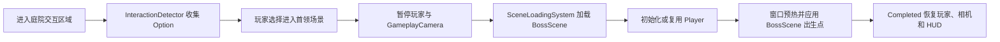
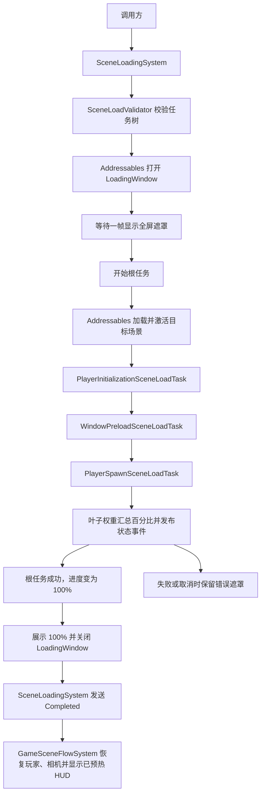

# RPG 场景加载流程

WSFrame 组合加载按职责分为 `Loading/Flow`（流程控制与展示契约）、`Loading/Execution`（Context、Tracker、场景模块、校验器和任务）及 `Loading/Data`（配置、数据库和快照）。框架入口和接入细节见下方文档链接。

通用任务执行由 WSFrame 的 [`SceneLoadingSystem`](../../../WSFrame/SceneSystem/Loading/SceneLoading_README.md) 提供。RPG 的 ConfigInstaller 调用 `SceneLoadingSystem.RegisterDatabase`，由系统在注册时验证数据库并建立 SceneId 索引；`GameArchitecture` 注册系统实例并注入 `GameSceneLoadingPresentation`。玩家初始化、出生点定位、窗口预加载和场景入口仍由 RPG 实现。系统查询配置后执行其嵌套任务树；运行状态与 Addressables 句柄保存在本次运行时对象内，不写入任务资产。

项目窗口准备由 `WindowPreloadSceneLoadTask` 直接调用 UIManager 完成，按六个窗口的真实完成数量汇报进度。窗口预热会创建窗口并触发 `OnAwake` 与 Controller 初始化，因此必须在 `PlayerInitializationSceneLoadTask` 之后执行。HUD、Choice、Dialogue、Bag、Character 和装备培养窗口均在正式场景流程中预热；Choice 和 Dialogue 的内部 View 初始化完成后，后续任务才会继续。

GameStart 场景由显式放置的 WSFrameRoot、UIRoot、UICamera、UIEventSystem 和常驻 GameplayCamera 组成。`GameStartEntry` 打开 `GameStartWindow`，开始按钮调用现有 `SceneLoadingSystem.LoadAsync`。庭院激活后，角色初始化任务进入准备门禁，唯一 `PlayerSpawnPoint` 的世界位姿定位共享 CharacterRoot。完整任务树成功并完成加载界面收尾后，`SceneLoadingSystem` 发送 `Completed`；RPG 的 `GameSceneFlowSystem` 订阅该事件，恢复玩家和 GameplayCamera，关闭开始窗口并显示已预热的 HUD。

```mermaid
flowchart LR
    A[GameStartEntry] --> B[显示 GameStartWindow]
    B --> C[开始按钮]
    C --> D[显示 LoadingWindow]
    D --> E[AddressableSceneLoadTask：Single 加载庭院]
    E --> F[PlayerInitializationSceneLoadTask]
    F --> G[WindowPreloadSceneLoadTask：初始化六个业务窗口]
    G --> H[PlayerSpawnSceneLoadTask：应用唯一出生点]
    H --> I[显示 100% 并关闭 LoadingWindow]
    I --> J[SceneLoadingSystem 发送 Completed]
    J --> K[GameSceneFlowSystem 恢复玩家与 GameplayCamera]
    K --> L[关闭开始窗口并显示已预热的 HUD]
```



## GameStart、庭院与 BossScene

GameStart 作为 Build Settings 的启动场景，节点结构固定为：

```text
GameStart
├─ WSFrameRoot                         # 架构、ConfigInstaller 与 UIManager
├─ UIRoot                              # UIManager 识别后复用并常驻
├─ UICamera                            # UIManager 识别后复用并叠加到 Main Camera
├─ UIEventSystem                       # UIManager 识别后复用并常驻
├─ GameplayCamera                      # 唯一 Main Camera、CinemachineBrain 与两台 VCam
│  └─ Main Camera
└─ GameStartEntry                      # 显式引用 GameplayCameraController
```

`UIRoot`、`UICamera` 和 `UIEventSystem` 均直接放入 GameStart 场景；UIManager 会识别已存在的对象并避免重复创建。GameplayCamera 根节点跨场景常驻，开始界面和场景准备期间进入 Presentation 模式，全部任务成功后切回 FreeLook；没有第二台 GameStart Camera，也不需要庭院相机。

庭院中配置的 `SceneTransitionInteractable : InteractableObject` 绑定 `scene.boss` 和 Trigger `BoxCollider`。玩家移动根节点进入出生点前方的盒体时，现有 `InteractionDetector` 显示“进入首领场景”选项；选择后才调用 `SceneLoadingSystem.LoadAsync`。提交前会再次检查交互范围、玩家就绪状态和加载互斥。



庭院场景保留静态环境，并包含以下入口与角色节点：

```text
UnityReadyMarketCourtyard
├─ LevelStaticEnvrionment
├─ GameplaySceneBootstrap             # 仅直接打开庭院时补齐缺失的框架根和相机
├─ SceneLoadingEntry                  # scene.7f32e78d
├─ Player                             # initializeOnStart = false
├─ PlayerSpawnPoint                   # 场景内恰好一个；Transform +Z 是角色前方
└─ BossSceneTransition                # 约在出生点 +Z 5m，BoxCollider 为 Trigger
```

GameStart 创建并常驻的 WSFrameRoot、UIRoot、UICamera、UIEventSystem 和 GameplayCamera 会跨 Single 场景切换复用；Player 在庭院首次初始化后常驻，并在进入 BossScene 时复用。正常从 GameStart 进入庭院时 Bootstrap 不会重复创建框架或相机；直接打开庭院时 Bootstrap 使用显式 Prefab 引用补齐缺失的 WSFrameRoot 与 GameplayCamera。`PlayerSpawnSceneLoadTask` 只在 Addressables 目标场景激活且 Player 初始化完成后查询目标场景根层级，按 CharacterRoot 原点应用出生位置和水平化后的 +Z 朝向。

BossScene 只保存关卡内容，不作为独立 Play Mode 启动入口，也不放置框架、UI、相机或 Player 的副本：

```text
BossScene
├─ Environment
│  ├─ Plane
│  └─ Directional Light
├─ Boss_Odetta
└─ PlayerSpawnPoint                 # (0, 0.13, 0)，本地 +Z 朝向
```

`scene.boss` 使用 Single 模式与 `Scene/BossScene` Addressables 地址，并加入 `SceneLoadDatabase`。它复用庭院的根 Sequence：加载并激活 BossScene、复用已就绪 Player、复用已预热窗口、定位到 BossScene 的 PlayerSpawnPoint；随后统一完成 LoadingWindow 收尾并由 `GameSceneFlowSystem` 恢复玩家、相机和 HUD。BossScene 不需要 `GameplaySceneBootstrap` 或 `SceneLoadingEntry`。

本项目使用 `Assets/SceneLoadAssets/SceneLoadDatabaseConfigProvider.asset` 引用 `SceneLoadDatabase.asset`，并已将 Provider 加入 `FrameworkConfigRootNode`。ConfigInstaller 会在 `GameArchitecture` 初始化前完成注册。



## 首次配置

1. 在 Unity Addressables Groups 窗口把目标场景加入 Addressables，并将对应 Scene 资产放进 Addressables 场景组。新流程通过 Addressables 读取场景，不从 Build Settings 额外复制一份场景资源。
2. 在 Project 窗口创建 `WSFrame/Scene Loading/Database` 和 `RPG/Config/Scene Load Database` 资产；把数据库赋给 Provider。
3. 打开 `WSFrame/Global Setting → ConfigInstaller`，确认 `SceneLoadDatabaseConfigProvider` 已加入配置注册树。Provider 注册时调用 `SceneLoadingSystem.RegisterDatabase`，校验空配置、空 SceneId 和重复 ID，并建立运行时查询索引。
4. 打开 `WSFrame/Global Setting → SceneSystem`，选择数据库，创建或加入 SceneLoadConfig。填写稳定且唯一的 `SceneId`、显示名称、Addressables 场景引用和 Single/Additive 模式。Reference 是场景加载依据；Unity 场景名称从其引用自动生成，只用于加载结果校验和直接打开场景时匹配。
5. 当前庭院配置的根 Sequence 按顺序运行场景激活、角色初始化、窗口准备和出生点定位：

```text
根 Sequence
├─ AddressableSceneLoadTask
├─ PlayerInitializationSceneLoadTask
├─ WindowPreloadSceneLoadTask
└─ PlayerSpawnSceneLoadTask
```

每份切场景配置恰好包含一个 `AddressableSceneLoadTask`。一个 `ParallelSceneLoadTask` 中的其他分支不能依赖同组场景加载结果；场景加载完成并且 Parallel 所有分支结束后，后续 Sequence 才获得目标场景就绪条件。

## 加载界面、百分比与事件

RPG 架构将 `GameSceneLoadingPresentation` 注入 `SceneLoadingSystem`。它通过 WindowConfig 和 Addressables 中的 `LoadingWindow` 显示全屏遮罩。界面按 `Assets/Scripts/WSFrame/UISystem/Template/TemplateWindow.prefab` 构建，CanvasScaler 参考分辨率为 640×360；完整 UGUI 布局和控件引用保存在 `Assets/Prefabs/UI/Window/LoadingWindow.prefab`。蒙德徽记和七元素图标来自 `Assets/Res/SourceRes/UI/Loading/`，进度使用快照真实百分比扩展元素彩色层的 RectMask2D 裁剪宽度，灰色底图与彩色图始终重合。若项目改动了 Addressables 配置，需确认 `UIPrefab` 组仍包含 `LoadingWindow` 地址。

总体百分比根据任务树中所有叶子任务的 `ProgressWeight` 加权计算；默认每个叶子权重为 1，场景任务通过 Addressables 操作进度更新。组合任务只提供状态，不重复计入权重。流程运行中最高显示 99%，只有根任务成功后才变为 100%。失败不会显示成功百分比，加载窗口保留异常摘要；取消则显示取消状态，两者都需由用户关闭提示。

```csharp
using RPG.Game;
using WS_Modules.SceneModule;
using UnityEngine;
using WS_Modules.CustomEventSystem;

SceneLoadingSystem loading = GameArchitecture.Interface.GetSystem<SceneLoadingSystem>();
IUnRegister progressRegistration = loading.RegisterSnapshotChanged(args =>
{
    float percent = args.Snapshot.Progress * 100f;
    Debug.Log($"{args.Snapshot.DisplayName}: {percent:0}%");
});
IUnRegister taskRegistration = loading.RegisterTaskChanged(args =>
{
    Debug.Log($"{args.Task.ReferencePath}: {args.Task.TaskName} ({args.Task.Progress:P0})");
});

// 在调用方生命周期结束时配对注销。
progressRegistration.UnRegister();
taskRegistration.UnRegister();
```

`RegisterSnapshotChanged` 会在整体进度、场景就绪状态或流程终态变化时提供 `SceneLoadExecutionSnapshot`；`RegisterTaskChanged` 提供任务引用路径和局部进度。另可订阅 `RegisterCompleted`、`RegisterFailed`、`RegisterCancelled`，或直接读取最近一次 `CurrentSnapshot`。成功快照先报告 100%，加载展示收尾后才发送 `RegisterCompleted`，供 RPG 显示已预热的 HUD 并恢复玩家与相机。快照只读且共享给 UI 和外部订阅者；事件回调异常会记录日志，不会中断加载。

## 调用与直接打开场景

```csharp
using RPG.Game;
using WS_Modules.SceneModule;
using UnityEngine.SceneManagement;

SceneLoadingSystem loading = GameArchitecture.Interface.GetSystem<SceneLoadingSystem>();
Scene targetScene = await loading.LoadAsync("scene.market");

// 仅卸载本次统一流程通过 Addressables Additive 加载并持有的场景。
await loading.UnloadSceneAsync(targetScene);
```

需要独立进入 Play Mode 的场景，在场景中添加 `SceneLoadingEntry` 并填写数据库里的 `SceneId`。统一流程进入该场景时，入口按正在执行的 SceneId 或 Addressables 已持有的具体 Scene 实例识别来源，不会重复初始化；直接打开场景时，它会复用同一任务树并让 AddressableSceneLoadTask 校验当前 Scene，而不重新加载。接入统一任务树的玩家 Prefab 必须关闭 `initializeOnStart`，由 `PlayerInitializationSceneLoadTask` 统一控制角色准备门禁。窗口预加载由 `WindowPreloadSceneLoadTask` 直接调用 UIManager；取消流程只取消任务等待，不撤销已开始的窗口实例化或 Unity 场景加载副作用。

## 失败与校验

Editor 面板中的“校验全部”、配置详情校验和 Runtime 使用同一份 `SceneLoadValidator`。它会报告空任务、循环引用、SceneId 或场景引用问题、场景加载节点数量，以及玩家初始化等前置依赖错误。Sequence 在首个失败后停止；Parallel 等待已启动的全部分支收尾后再传播失败。失败会携带场景 ID 和任务引用路径抛给调用方；已完成的分支副作用不会自动回滚，也不会自动切回旧场景。

SceneSystem 面板支持 Undo/Redo 的字段和结构编辑。移除引用只更改当前容器；删除配置或任务资产只将选中的单个资产移入 Unity 回收站，并保留其任务子树资产。其他位置仍指向被删除资产的引用可能变为 Missing；回收站删除不由 Ctrl+Z 恢复，需要从 Unity 回收站还原。

SceneSystem 面板负责编辑场景配置库与任务树。首次接入或复制到其他项目时，按上述步骤确认 Provider、场景引用及 Addressables 场景组；运行时窗口资源包括 `LoadingWindow` 与 `GameStartWindow`。
