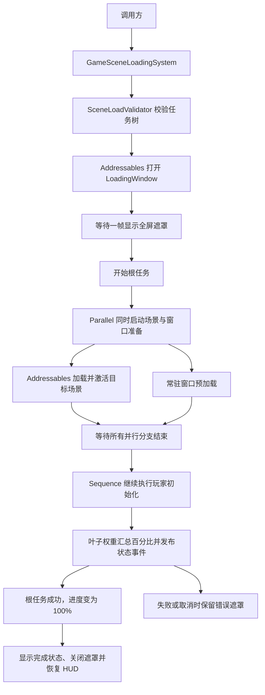

# RPG 场景加载流程

RPG 统一入口由 `GameSceneLoadingSystem` 提供。它先校验配置，再执行场景配置资产里的嵌套任务树；运行状态与 Addressables 句柄保存在本次运行时对象内，不写入任务资产。



## 首次配置

1. 在 Unity Addressables Groups 窗口把目标场景加入 Addressables，并将对应 Scene 资产放进 Addressables 场景组。新流程通过 Addressables 读取场景，不从 Build Settings 额外复制一份场景资源。
2. 在 Project 窗口创建 `WSFrame/Scene Loading/Database` 和 `RPG/Config/Scene Load Database` 资产；把数据库赋给 Provider。
3. 打开 `WSFrame/Global Setting → ConfigInstaller`，将 `SceneLoadDatabaseConfigProvider` 加入现有配置注册树，保证 `GameArchitectureStartup` 初始化后可以读取场景配置。
4. 打开 `WSFrame/Global Setting → SceneSystem`，选择数据库，创建或加入 SceneLoadConfig。填写稳定且唯一的 `SceneId`、显示名称、Addressables 场景引用和 Single/Additive 模式。Reference 是场景加载依据；Unity 场景名称从其引用自动生成，只用于加载结果校验和直接打开场景时匹配。
5. 在配置树中创建根 Sequence。以下结构让目标场景加载和窗口预加载同时开始，等待两个分支结束后再初始化玩家：

```text
根 Sequence
├─ Parallel：进入场景与公共 UI 准备
│  ├─ AddressableSceneLoadTask
│  └─ WindowPreloadSceneLoadTask
└─ PlayerInitializationSceneLoadTask
```

每份切场景配置恰好包含一个 `AddressableSceneLoadTask`。一个 `ParallelSceneLoadTask` 中的其他分支不能依赖同组场景加载结果；场景加载完成并且 Parallel 所有分支结束后，后续 Sequence 才获得目标场景就绪条件。

## 加载界面、百分比与事件

RPG 架构将 `GameSceneLoadingPresentation` 注入 `GameSceneLoadingSystem`。它通过 WindowConfig 和 Addressables 中的 `LoadingWindow` 显示全屏遮罩。界面按 `Assets/Scripts/WSFrame/UISystem/Template/TemplateWindow.prefab` 构建，CanvasScaler 参考分辨率为 640×360；完整 UGUI 布局和控件引用保存在 `Assets/Prefabs/UI/Window/LoadingWindow.prefab`。蒙德徽记和七元素图标来自 `Assets/Res/SourceRes/UI/Loading/`，进度使用快照真实百分比扩展元素彩色层的 RectMask2D 裁剪宽度，灰色底图与彩色图始终重合。若项目改动了 Addressables 配置，需确认 `UIPrefab` 组仍包含 `LoadingWindow` 地址。

总体百分比根据任务树中所有叶子任务的 `ProgressWeight` 加权计算；默认每个叶子权重为 1，场景任务通过 Addressables 操作进度更新。组合任务只提供状态，不重复计入权重。流程运行中最高显示 99%，只有根任务成功后才变为 100%。失败不会显示成功百分比，加载窗口保留异常摘要；取消则显示取消状态，两者都需由用户关闭提示。

```csharp
using RPG.Game;
using RPG.Game.Loading;
using UnityEngine;
using WS_Modules.CustomEventSystem;

GameSceneLoadingSystem loading = GameArchitecture.Interface.GetSystem<GameSceneLoadingSystem>();
IUnRegister progressRegistration = loading.RegisterSnapshotChanged(args =>
{
    float percent = args.Snapshot.Progress * 100f;
    Debug.Log($"{args.Snapshot.DisplayName}: {percent:0}%");
});
IUnRegister taskRegistration = loading.RegisterTaskChanged(args =>
{
    Debug.Log($"{args.Task.ReferencePath}: {args.Task.TaskName} ({args.Task.Progress:P0})");
});

// 在调用方生命周期结束时配对注销。
progressRegistration.UnRegister();
taskRegistration.UnRegister();
```

`RegisterSnapshotChanged` 会在整体进度、场景就绪状态或流程终态变化时提供 `SceneLoadExecutionSnapshot`；`RegisterTaskChanged` 提供任务引用路径和局部进度。另可订阅 `RegisterCompleted`、`RegisterFailed`、`RegisterCancelled`，或直接读取最近一次 `CurrentSnapshot`。快照只读且共享给 UI 和外部订阅者，事件回调异常会记录日志，不会中断加载。

## 调用与直接打开场景

```csharp
using RPG.Game;
using RPG.Game.Loading;
using UnityEngine.SceneManagement;

GameSceneLoadingSystem loading = GameArchitecture.Interface.GetSystem<GameSceneLoadingSystem>();
Scene targetScene = await loading.LoadAsync("scene.market");

// 仅卸载本次统一流程通过 Addressables Additive 加载并持有的场景。
await loading.UnloadSceneAsync(targetScene);
```

需要独立进入 Play Mode 的场景，在场景中添加 `SceneLoadingEntry` 并填写数据库里的 `SceneId`。统一流程进入该场景时，入口按正在执行的 SceneId 或 Addressables 已持有的具体 Scene 实例识别来源，不会重复初始化；直接打开场景时，它会复用同一任务树并让 AddressableSceneLoadTask 校验当前 Scene，而不重新加载。

PlayerController 和 GameWindowPreloadService 保留默认开启的自动启动设置，以兼容尚未接入统一流程的旧场景。只有在目标场景已经配置 `SceneLoadingEntry` 和对应任务后，才关闭相应组件的 `initializeOnStart` 或 `preloadOnStart`。多个调用方会等待各自服务持有的共享完成信号；取消某个场景流程只取消该调用方等待，不撤销已启动的角色、窗口或 Unity 场景加载副作用。

## 失败与校验

Editor 面板中的“校验全部”、配置详情校验和 Runtime 使用同一份 `SceneLoadValidator`。它会报告空任务、循环引用、SceneId 或场景引用问题、场景加载节点数量，以及玩家初始化等前置依赖错误。Sequence 在首个失败后停止；Parallel 等待已启动的全部分支收尾后再传播失败。失败会携带场景 ID 和任务引用路径抛给调用方；已完成的分支副作用不会自动回滚，也不会自动切回旧场景。

SceneSystem 面板支持 Undo/Redo 的字段和结构编辑。移除引用只更改当前容器；删除配置或任务资产只将选中的单个资产移入 Unity 回收站，并保留其任务子树资产。其他位置仍指向被删除资产的引用可能变为 Missing；回收站删除不由 Ctrl+Z 恢复，需要从 Unity 回收站还原。

SceneSystem 面板负责编辑场景配置库与任务树。首次接入或复制到其他项目时，按上述步骤确认 Provider、场景引用及 Addressables 场景组；加载窗口 Prefab 是本模块唯一新增的运行时 UI 资源。
