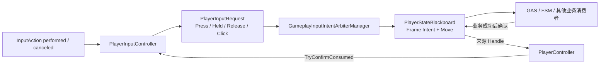
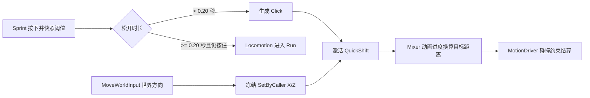
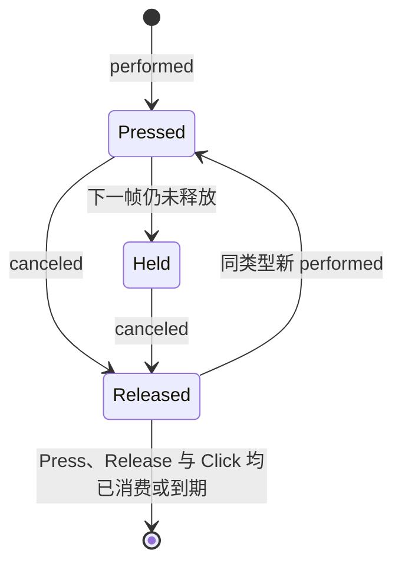
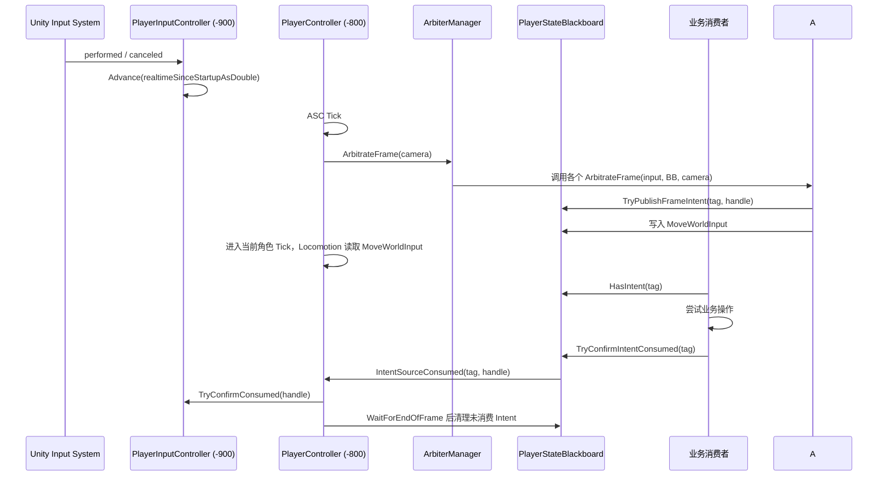

# 玩家输入预处理系统

## 1. 系统定位

本系统位于 Unity Input System 与 GAS、FSM 等业务系统之间，负责维护可跨帧重试的真实 Request，并为需要转换的连续输入提供分析策略。并非所有输入都必须先转换成 Intent。

它不是按键队列，也不会直接向 ASC 写入 Gameplay Tag。系统的数据流分为三层：

- `PlayerInputBinding`：每个输入独立的 ScriptableObject，拥有身份、交付模式及四项时长。
- `PlayerInputRequest`：保存一次物理手势，以及独立的 Press、Release、Click 缓冲阶段。
- `GameplayInputIntentArbiter`：仅对需要空间转换、合并或上下文分析的输入生成 Blackboard 结果。
- `PlayerStateBlackboard`：保存当前帧 Intent、来源 Handle 和连续 Move，并在业务成功后把消费确认回传到来源 Request。



## 2. 使用说明

### 2.1 场景组件

玩家对象需要位于同一节点的组件：

- `PlayerInputController`：监听 Input Action，管理 Request。
- `PlayerController`：创建 `PlayerStateBlackboard` 和 `GameplayInputIntentArbiterManager`，执行仲裁及帧末清理。
- `CharacterManager` 与角色 Actor：提供当前角色配置；角色 ASC 仍由角色自身持有。

`PlayerController` 会在 `Awake` 解析同一 Player 上的 `PlayerInputController`；缺少该组件时会立即暴露配置错误。CharacterManager 和 CharacterActor 在 PlayerController 的显式 Tick 阶段直接读取输入 Request。

### 2.2 配置输入绑定

在 `Assets/Scripts/Input/Bindings` 为每个动作创建独立 `PlayerInputBinding` 资产，再将资产引用加入 `PlayerInputController.bindings`。每项配置包括：

| 字段 | 含义 |
| --- | --- |
| `Action` | 需要监听的 `InputActionReference` |
| `InputType` | Request 使用的逻辑输入类型 |
| `PressBufferDuration` | Press 阶段可跨帧重试的真实时间 |
| `ReleaseBufferDuration` | Release 阶段可跨帧重试的真实时间 |
| `ClickMaxHeldDuration` | 短按 Click 与持续按住的分界；松开耗时严格小于该值才产生 Click |
| `ClickBufferDuration` | 松开后 Click 阶段可跨帧重试的真实时间 |
| `DeliveryMode` | `BufferedRequest` 进入 Request 生命周期；`ImmediateNotification` 只转发 performed |

约束如下：

- 至少配置一个绑定资产；`Reset` 只将四个时长恢复为默认值，不改 Action、InputType 或 DeliveryMode。
- Action 引用不能为空。
- 同一个 Action 不能重复绑定。
- 同一个 `PlayerInputType` 不能重复绑定。
- 四个时长必须是有限非负数，不存在 Controller 全局默认值或 `0` 回退。
- 每次按下会将该绑定当前的四个时长复制进本次 Request；手势期间编辑 SO 不会改变本次手势的 Click 边界或缓冲期限。
- 每个 `BufferedRequest` 都可以产生 Click，不另设短按/长按开关；业务消费者决定是否使用 Click 阶段。
- Sprint 的 `ClickMaxHeldDuration` 为 `0.20s`：小于阈值松开会生成冲刺 Click；按住达到阈值后仍保持按下则进入奔跑，之后松开不再生成 Click。
- `ImmediateNotification` 不创建 Request，因此不会产生 Press、Release 或 Click Handle；SO 上的时长只为配置结构保持一致，不参与即时转发。

对于需要从按下瞬间开始累计 `HeldDuration` 的技能，建议使用普通 Button Action。若给 Action 配置 Input System 的 `Hold` Interaction，`performed` 可能到达阈值后才触发，此时系统记录的起点将不再是物理按下瞬间。

### 2.3 注册仲裁器

仲裁器是普通 C# 策略，不是 `MonoBehaviour`。运行时默认仲裁器由 Manager 统一注册；额外业务策略仍可由组件在启用、禁用时注册和注销：

```csharp
private GameplayInputIntentArbiter arbiter;

private void Awake()
{
    arbiter = new CombatInputArbiter();
}

private void OnEnable()
{
    playerController.InputIntentArbiterManager.RegisterArbiter(arbiter);
}

private void OnDisable()
{
    playerController.InputIntentArbiterManager.UnregisterArbiter(arbiter);
}
```

Manager 按注册顺序调用每个策略。每个策略直接读取 `PlayerInputController` 的持续输入或 Request，并把自己的结果写入 Blackboard；Manager 不执行 Request 匹配、Tag 检查或业务状态过滤。

生产 Arbiter 不遍历 `Requests` 列表。对于固定离散输入，业务使用 `PlayerInputController.TryGetRequest(inputType, out request)` 通过输入类型索引查询；`Requests` 列表只供调试界面展示。当前默认策略只有需要镜头转换的 Move，技能由 CharacterActor 直接处理，角色槽位由 CharacterManager 直接处理，交互选择由 EventSystem 处理。

### 2.4 业务消费 Intent

业务消费者从 `PlayerController.StateBlackboard` 查询 Intent。只有业务操作真正成功后，才调用 `TryConfirmIntentConsumed`：

```csharp
if (!blackboard.HasIntent(activateSkillIntent))
    return;

bool accepted = TryActivateCurrentSkillSlot();
if (accepted)
    blackboard.TryConfirmIntentConsumed(activateSkillIntent);
```

消费规则：

- 成功：确认 Intent，黑板移除该 Intent，并使用来源 Handle 清除对应 Request 阶段。
- 失败：不要确认。Intent 会在帧末消失，但 Request 会在剩余 Buffer 内继续参与下一帧仲裁。
- 查询本身不等于消费，`HasIntent` 不会改变任何状态。
- 同一个具体 Intent Tag 默认应只有一个业务所有者，避免多个消费者先执行再竞争确认。

### 2.4.1 简单离散输入直接消费

技能和角色切换不经过 Blackboard Frame Intent。业务按固定 InputType 查询 Request，并在操作成功后直接确认对应阶段句柄：

```csharp
if (!inputController.TryGetRequest(
        PlayerInputType.Skill1,
        out IReadOnlyPlayerInputRequest request) ||
    !request.HasBufferedPress)
    return;

if (TryActivateSkill())
    inputController.TryConfirmConsumed(request.PressHandle);
```

CharacterManager 对 CharacterSlot1-4 使用同样的查询方式；切换成功、已是当前角色或空槽位时确认 Press，Busy 时保留 Request 以便缓冲期重试。简单业务不创建 Ability 或 CharacterSwitch IntentTag。

### 2.5 长按与蓄力

长按不需要单独的 Held Tag。具体技能业务直接读取 Request 的物理状态和持续时间即可：

```csharp
if (!inputController.TryGetRequest(PlayerInputType.Skill1,
        out IReadOnlyPlayerInputRequest request) ||
    !request.HasBufferedPress ||
    request.PhysicalState != PlayerInputPhysicalState.Held ||
    request.HeldDuration < chargeThreshold)
    return;

// 这里由蓄力 Ability 自己记录开始/释放，不经过通用 Intent Arbiter。
```

释放后 `HeldDuration` 会保留，因此具体蓄力 Ability 可以根据最终按住时长决定释放普通技能、蓄力技能或取消技能。Press 和 Release 是两个独立阶段，消费 Press 不会自动消费 Release。短于阈值的手势在释放时另创建 Click 阶段，Click 有自己的 Handle 与 Buffer；三种阶段可独立消费或到期。

Sprint 的业务消费规则是：CharacterCombatSystem 仅在短按释放后尝试 Sprint 绑定的 QuickShift，并消费 Click；角色 Blackboard 仅在同一个 Request 仍物理按住且 `HeldDuration >= ClickMaxHeldDuration` 时把 Sprint 视为奔跑。两个判断都读取 Request 中同一份 SO 快照，避免边界不一致。QuickShift 激活时冻结当前 `MoveWorldInput` 的水平世界方向，通过 SetByCaller 参数传给冲刺 Task；无移动输入时 Task 采用角色正前方。Task 使用方向 Mixer、按动画进度提交固定目标距离，由 MotionDriver 负责正常碰撞结算。



### 2.6 调试

`GameplayInputOdinTester` 可使用真实键鼠或手柄检查 InputAction 路径；Odin 按钮“验证 Click 手势生命周期”则以合成手势时间验证配置快照、阈值边界、长按、阶段消费、过期与手势替换。它还提供：

- `Manual`：通过 OnGUI 按钮模拟业务成功后的确认。
- `Interval`：每隔指定真实时间确认当前 Intent。
- `HeldThreshold`：达到按住阈值后才发布并确认测试 Intent。
- Odin 按钮“切换 Input OnGUI”：测试完成后可关闭调试面板，不影响输入链路。

## 3. 扩展说明

### 3.1 增加新的输入类型

1. 在 `PlayerInputType` 中增加枚举值。
2. 在 Input Actions 资产中创建或选择对应 Action。
3. 在玩家对象的 `PlayerInputController.bindings` 中显式绑定。
4. 如果输入只需固定业务查询，直接在对应业务中调用 `TryGetRequest`；只有需要转换或合并时才实现 Arbiter。
5. 只有接入 Frame Intent 的复杂输入才配置对应 Gameplay Tag，并由业务消费者处理。

Move、Look 等连续值输入不加入当前离散 Request 模型，也不产生可确认消费的 Handle。Move 由 `MoveInputIntentArbiter` 从 `PlayerInputController.MoveInput` 读取，转换为镜头相对世界方向后写入 Blackboard 的连续字段；未来的 Look 可沿用独立连续字段，但需要先明确采样、死区和视角所有权。

### 3.2 增加新的仲裁器

继承 `GameplayInputIntentArbiter`，实现唯一的 `ArbitrateFrame`：

```csharp
public sealed class CombatInputArbiter : GameplayInputIntentArbiter
{
    protected internal override void ArbitrateFrame(
        PlayerInputController inputController,
        PlayerStateBlackboard blackboard,
        Transform cameraTransform)
    {
        if (!inputController.TryGetRequest(PlayerInputType.Skill1,
                out IReadOnlyPlayerInputRequest request) ||
            !request.HasBufferedPress)
            return;

        blackboard.TryPublishFrameIntent(activateSkillSlot1Intent, request.PressHandle);
    }
}
```

仲裁器只负责分析需要转换的输入并写入 Blackboard，不应：

- 直接消费 Request。
- 读取或修改 ASC、EnvironmentTag 或 MotionDriver 状态。
- 根据对话、场景迁移或输入锁清零玩家输入。
- 在仲裁遍历期间注册或注销仲裁器。

技能和角色切换不属于该 Arbiter 协议：它们由 CharacterActor、CharacterManager 直接读取 Request，不调用 `TryPublishFrameIntent`。

`TryPublishFrameIntent` 的返回值只用于当前策略的同步控制，不发送发布诊断事件。业务确认后的来源 Handle 仍由 `IntentSourceConsumed` 回传给持有黑板与输入组件的 `PlayerController`，以保证意图分析和 Request 生命周期相互独立。

### 3.4 扩展业务消费者

消费者可以是 GAS、Locomotion/FSM 或其他仍接入 Blackboard 的业务模块；交互选择由 Unity EventSystem 驱动，不走这条 Intent 消费协议。接入 Blackboard 的消费者都应遵循相同提交协议：

1. 查询 Intent。
2. 尝试业务操作。
3. 业务成功后确认消费。
4. 业务失败时保留 Request 的跨帧重试机会。

如果未来确实需要多个系统竞争同一个 Intent，应增加 Claim/Commit 协议，在执行副作用之前决定唯一所有者；不要让多个消费者先执行，再依赖 `TryConfirmIntentConsumed` 的返回值处理冲突。

### 3.5 同名 Intent 的合并规则

`GameplayTagContainer` 只保存唯一 Tag，而 `PlayerStateBlackboard.intentSources` 额外保存该 Tag 对应的全部来源 Handle。

因此，同一帧多个 Request 被仲裁为同一个 Intent 时：

- `IntentTags` 中只出现一个 Tag。
- `intentSources` 中记录全部来源 Handle。
- 一次确认会消费该 Intent 的全部合并来源。

如果业务不希望合并，必须使用不同的 Intent Tag，而不是只依赖不同的 Request Handle。

## 4. 核心逻辑说明

### 4.1 Request 生命周期



一次 `performed`：

- 创建或复用对应 `PlayerInputType` 的 Request。
- 手势版本自增。
- 物理状态设为 `Pressed`。
- `HeldDuration` 从零开始。
- 创建新的 Press Handle 和 Press Buffer。
- 快照该绑定四个时长配置。
- 清除上一手势遗留的 Release 与 Click 阶段。

之后仍保持按住时，Request 在下一帧转为 `Held`。这个转换不会创建新 Request、不会更换 Press Handle，也不会重置 Press Buffer。

一次 `canceled`：

- 物理状态设为 `Released`。
- 创建同一手势版本的独立 Release Handle 和 Release Buffer。
- 若按住真实时间小于该手势的 `ClickMaxHeldDuration`，同时创建独立 Click Handle 和 Click Buffer；达到或超过阈值不创建 Click。
- 不修改 Press Handle、Press Pending 或 Press 剩余时间。
- 保留最终 `HeldDuration` 供 Release 仲裁使用。

Press、Release 和 Click 可以独立处于 Pending，并分别消费或到期。只有物理状态已经是 `Released`，且三个阶段都不再 Pending 时，Controller 才移除整个 Request。新手势会替换上一手势未完成的 Release 与 Click 阶段，并使旧 Handle 失效。

### 4.2 Buffer 与时间

Controller 在每次 `Update` 中通过 `Time.realtimeSinceStartupAsDouble` 对照 InputAction 回调的绝对时间戳更新：

- `HeldDuration`。
- Press Buffer 剩余时间。
- Release Buffer 剩余时间。
- Click Buffer 剩余时间。

因此 `Time.timeScale = 0` 时输入缓冲仍会到期；使用回调时间戳也避免在按下或松开后立刻完整扣除当前帧的 `deltaTime`。

Buffer 的意义是允许同一个 Request 阶段在多个帧中重复仲裁。Intent 本身不跨帧；跨帧的是 Request 的 Pending 状态和剩余 Duration。

### 4.3 Handle 与旧请求隔离

`InputRequestHandle` 由三部分组成：

| 字段 | 作用 |
| --- | --- |
| `InputType` | 定位对应输入类型 |
| `GestureVersion` | 区分同一输入类型的不同手势 |
| `Stage` | 区分 Press、Release 或 Click 阶段 |

只有 Handle 的三部分都匹配当前 Request，且对应阶段仍然 Pending，消费确认才会成功。旧手势 Handle、错误阶段 Handle、已消费 Handle 和已过期 Handle 都不能改变当前 Request。

### 4.4 每帧执行顺序



`PlayerInputController` 的执行顺序为 `-900`，`PlayerController` 为 `-800`。普通默认顺序的 `Update` 消费者会在仲裁完成后读取本帧 Intent。帧末清理只移除临时 Intent 和来源映射，不会误认为业务已经消费 Request。

输入测试面板显示当前 Intent、连续 Move 和 Press/Release/Click 消费结果。发布过程没有独立诊断事件；`TryPublishFrameIntent` 的返回值只在仲裁策略内部用于同步处理。自动模式中当前 Intent 变为 `false`，表示该帧意图已被业务确认或帧末清理。

### 4.5 数据所有权

| 数据 | 所有者 | 生命周期 |
| --- | --- | --- |
| Input Action 身份与时间配置 | 每项 `PlayerInputBinding` SO | 资产生命周期；时长在每次按下时快照 |
| Input Action 监听映射 | `PlayerInputController` | 组件生命周期 |
| Request 与 Buffer | `PlayerInputController` | 一次物理手势及其待消费阶段 |
| 仲裁器顺序 | `GameplayInputIntentArbiterManager` | PlayerController 生命周期 |
| Intent Tags | `PlayerStateBlackboard` | 当前帧 |
| MoveWorldInput | `PlayerStateBlackboard` | 当前帧连续输入事实 |
| Intent 来源 Handle | `PlayerStateBlackboard` | 与对应帧级 Intent 相同 |

## 5. 常见问题

### Intent 为什么不能一直留在黑板？

Intent 表示“本帧仲裁结果”，不是角色持久状态。一直保留会让消费者在没有新仲裁的情况下重复执行。未消费 Intent 在帧末清除，来源 Request 决定下一帧是否仍有资格重新生成 Intent。

### 为什么 TagContainer 之外还需要 `intentSources`？

TagContainer 只能回答某个 Tag 是否存在，不能记录它由哪个 Request、哪个手势版本、哪个阶段产生。消费确认必须依赖来源 Handle，才能准确清除 Press、Release 或 Click，并拒绝旧手势确认。

### Press 和 Held 为什么共用一个 Press 阶段？

Held 是物理状态的持续变化，不是第二次输入。Pressed 转 Held 不应刷新 Buffer 或生成新 Handle，否则长按期间会不断延长 Press 的有效期。

### Release 为什么拥有独立 Buffer？

快速点击后，Press 可能仍在等待可用条件，而 Release 与 Click 已经发生。三个独立窗口允许业务分别处理开始、释放和短按语义，互不覆盖。

### 禁用组件时会发生什么？

`PlayerInputController` 会退订并停用 Action，同时清空全部 Request。`PlayerController` 会停止消费回调、停止帧末协程，并清理当前帧 Intent 与连续 Move 快照。
