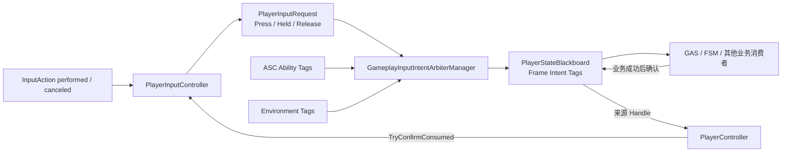
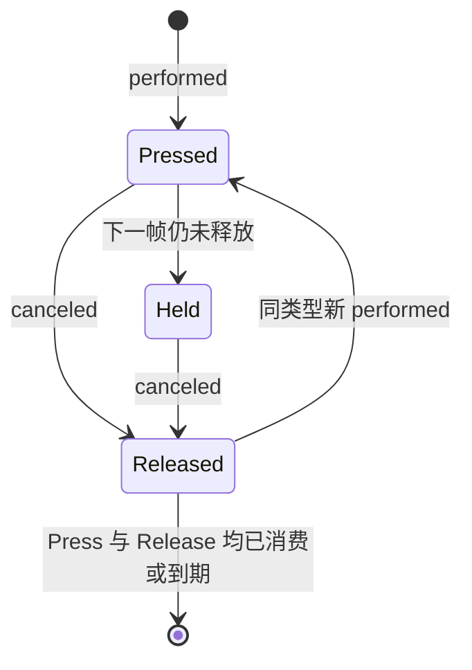
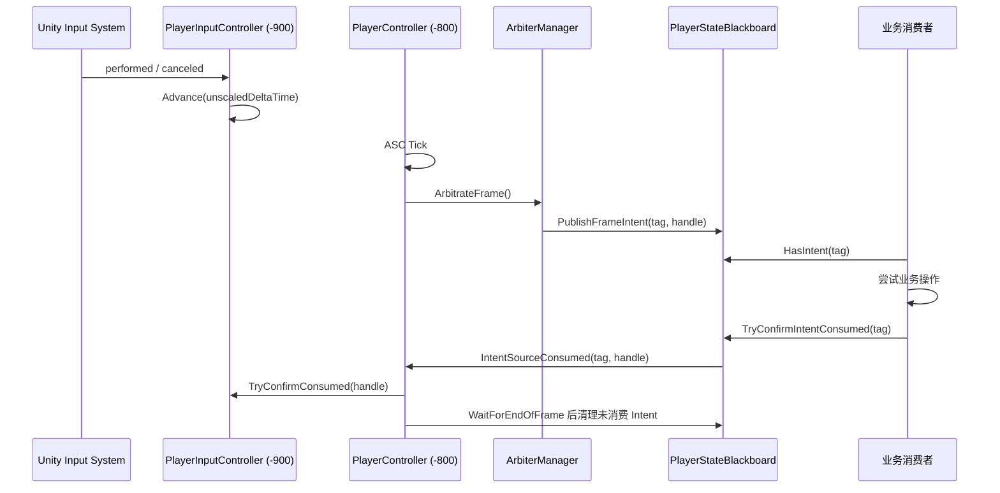

# 玩家输入预处理系统

## 1. 系统定位

本系统位于 Unity Input System 与 GAS、FSM 等业务系统之间，负责把一次真实输入整理为可跨帧重试、可结合玩家状态仲裁、可在业务成功后确认消费的输入意图。

它不是按键队列，也不会直接向 ASC 写入 Gameplay Tag。系统的数据流分为三层：

- `PlayerInputRequest`：保存一次物理手势，以及独立的 Press、Release 缓冲阶段。
- `GameplayInputIntentArbiter`：结合 Request、ASC 状态和环境状态，判断当前帧应产生什么 Intent。
- `PlayerStateBlackboard`：保存当前帧 Intent，并在业务成功后把消费确认回传到来源 Request。



## 2. 使用说明

### 2.1 场景组件

玩家对象需要位于同一节点的组件：

- `PlayerInputController`：监听 Input Action，管理 Request。
- `PlayerController`：创建 `PlayerStateBlackboard` 和 `GameplayInputIntentArbiterManager`，执行仲裁及帧末清理。
- `GameplayAbilitySystemComponent`：向黑板提供只读 Ability Tag 状态。

`PlayerController` 已通过 `RequireComponent` 要求存在 `PlayerInputController`。

### 2.2 配置输入绑定

在 `PlayerInputController.bindings` 中显式添加 `PlayerInputBinding`。每项配置包括：

| 字段 | 含义 |
| --- | --- |
| `Action` | 需要监听的 `InputActionReference` |
| `InputType` | Request 使用的逻辑输入类型 |
| `PressBufferDuration` | Press 阶段可跨帧重试的真实时间 |
| `ReleaseBufferDuration` | Release 阶段可跨帧重试的真实时间 |

约束如下：

- 至少配置一个绑定。
- Action 引用不能为空。
- 同一个 Action 不能重复绑定。
- 同一个 `PlayerInputType` 不能重复绑定。
- Duration 必须是有限非负数。
- 绑定中的 Duration 为 `0` 时使用 Controller 的对应默认值。

对于需要从按下瞬间开始累计 `HeldDuration` 的技能，建议使用普通 Button Action。若给 Action 配置 Input System 的 `Hold` Interaction，`performed` 可能到达阈值后才触发，此时系统记录的起点将不再是物理按下瞬间。

### 2.3 注册仲裁器

仲裁器是普通 C# 策略，不是 `MonoBehaviour`。业务组件负责创建实例，并在启用、禁用时向所属玩家的 Manager 注册和注销：

```csharp
private GameplayInputIntentArbiter arbiter;

private void Awake()
{
    arbiter = new CombatInputArbiter();
}

private void OnEnable()
{
    playerController.InputIntentArbiterManager.RegisterArbiter(arbiter);
}

private void OnDisable()
{
    playerController.InputIntentArbiterManager.UnregisterArbiter(arbiter);
}
```

Manager 按注册顺序执行策略。同一个 Request 阶段只采用第一个成功返回 Intent 的仲裁器，因此注册顺序就是优先级顺序。

### 2.4 业务消费 Intent

业务消费者从 `PlayerController.StateBlackboard` 查询 Intent。只有业务操作真正成功后，才调用 `TryConfirmIntentConsumed`：

```csharp
if (!blackboard.HasIntent(activateSkillIntent))
    return;

bool accepted = TryActivateCurrentSkillSlot();
if (accepted)
    blackboard.TryConfirmIntentConsumed(activateSkillIntent);
```

消费规则：

- 成功：确认 Intent，黑板移除该 Intent，并使用来源 Handle 清除对应 Request 阶段。
- 失败：不要确认。Intent 会在帧末消失，但 Request 会在剩余 Buffer 内继续参与下一帧仲裁。
- 查询本身不等于消费，`HasIntent` 不会改变任何状态。
- 同一个具体 Intent Tag 默认应只有一个业务所有者，避免多个消费者先执行再竞争确认。

### 2.5 长按与蓄力

长按不需要单独的 Held Tag。仲裁器读取 Request 的物理状态和持续时间即可：

```csharp
protected override bool TryResolveIntent(
    IReadOnlyPlayerInputRequest request,
    PlayerInputRequestStage stage,
    PlayerStateBlackboard stateBlackboard,
    out GameplayTag intentTag)
{
    intentTag = chargeSkillIntent;

    return stage == PlayerInputRequestStage.Press &&
           request.PhysicalState == PlayerInputPhysicalState.Held &&
           request.HeldDuration >= chargeThreshold;
}
```

释放后 `HeldDuration` 会保留，因此 Release 仲裁可以根据最终按住时长决定释放普通技能、蓄力技能或取消技能。Press 和 Release 是两个独立阶段，消费 Press 不会自动消费 Release。

### 2.6 调试

`GameplayInputOdinTester` 使用真实键鼠或手柄输入，不制造 performed、canceled 或 Request。它提供：

- `Manual`：通过 OnGUI 按钮模拟业务成功后的确认。
- `Interval`：每隔指定真实时间确认当前 Intent。
- `HeldThreshold`：达到按住阈值后才发布并确认 Intent。
- Odin 按钮“切换 Input OnGUI”：测试完成后可关闭调试面板，不影响输入链路。

## 3. 扩展说明

### 3.1 增加新的输入类型

1. 在 `PlayerInputType` 中增加枚举值。
2. 在 Input Actions 资产中创建或选择对应 Action。
3. 在玩家对象的 `PlayerInputController.bindings` 中显式绑定。
4. 在仲裁器中定义该输入在不同状态下产生的 Intent。
5. 为 Intent 配置对应 Gameplay Tag，并由业务消费者处理。

Move、Look 等连续值输入不适合直接加入当前离散 Request 模型。它们应继续由连续输入通道处理，除非先明确定义采样、死区、方向变化和消费语义。

### 3.2 增加新的仲裁器

继承 `GameplayInputIntentArbiter`，实现 `TryResolveIntent`：

```csharp
public sealed class CombatInputArbiter : GameplayInputIntentArbiter
{
    protected override bool TryResolveIntent(
        IReadOnlyPlayerInputRequest request,
        PlayerInputRequestStage stage,
        PlayerStateBlackboard stateBlackboard,
        out GameplayTag intentTag)
    {
        intentTag = GameplayTag.Empty;

        if (stage != PlayerInputRequestStage.Press)
            return false;

        if (stateBlackboard.AbilityTags.HasTag(blockInputTag))
            return false;

        if (request.InputType != PlayerInputType.Skill1)
            return false;

        intentTag = activateSkillSlot1Intent;
        return intentTag.IsValid;
    }
}
```

仲裁器只负责判断和返回 Tag，不应：

- 直接发布 Intent。
- 直接消费 Request。
- 修改 ASC Tag。
- 在仲裁遍历期间注册或注销仲裁器。

Intent 发布由 Manager 统一处理；业务确认后的来源 Handle 由持有黑板与输入组件的 `PlayerController` 回传，以保证仲裁判断和生命周期协调相互独立。

### 3.3 扩展环境状态

环境检测模块通过以下接口维护黑板状态：

```csharp
blackboard.AddEnvironmentTag(inWaterTag);
blackboard.RemoveEnvironmentTag(inWaterTag);
```

环境 Tag 使用计数容器，同一 Tag 可以有多个来源。每个来源进入时增加一次，退出时移除一次。仲裁器只读取 `EnvironmentTags`，不应直接维护环境检测生命周期。

### 3.4 扩展业务消费者

消费者可以是 GAS、FSM、交互系统或其他业务模块，但都应遵循相同提交协议：

1. 查询 Intent。
2. 尝试业务操作。
3. 业务成功后确认消费。
4. 业务失败时保留 Request 的跨帧重试机会。

如果未来确实需要多个系统竞争同一个 Intent，应增加 Claim/Commit 协议，在执行副作用之前决定唯一所有者；不要让多个消费者先执行，再依赖 `TryConfirmIntentConsumed` 的返回值处理冲突。

### 3.5 同名 Intent 的合并规则

`GameplayTagContainer` 只保存唯一 Tag，而 `PlayerStateBlackboard.intentSources` 额外保存该 Tag 对应的全部来源 Handle。

因此，同一帧多个 Request 被仲裁为同一个 Intent 时：

- `IntentTags` 中只出现一个 Tag。
- `intentSources` 中记录全部来源 Handle。
- 一次确认会消费该 Intent 的全部合并来源。

如果业务不希望合并，必须使用不同的 Intent Tag，而不是只依赖不同的 Request Handle。

## 4. 核心逻辑说明

### 4.1 Request 生命周期



一次 `performed`：

- 创建或复用对应 `PlayerInputType` 的 Request。
- 手势版本自增。
- 物理状态设为 `Pressed`。
- `HeldDuration` 从零开始。
- 创建新的 Press Handle 和 Press Buffer。
- 清除上一手势遗留的 Release 阶段。

之后仍保持按住时，Request 在下一帧转为 `Held`。这个转换不会创建新 Request、不会更换 Press Handle，也不会重置 Press Buffer。

一次 `canceled`：

- 物理状态设为 `Released`。
- 创建同一手势版本的独立 Release Handle 和 Release Buffer。
- 不修改 Press Handle、Press Pending 或 Press 剩余时间。
- 保留最终 `HeldDuration` 供 Release 仲裁使用。

Press 和 Release 可以同时处于 Pending，并分别消费或到期。只有物理状态已经是 `Released`，且两个阶段都不再 Pending 时，Controller 才移除整个 Request。

### 4.2 Buffer 与时间

Controller 在 `Update` 中使用 `Time.unscaledDeltaTime` 推进：

- `HeldDuration`。
- Press Buffer 剩余时间。
- Release Buffer 剩余时间。

因此 `Time.timeScale = 0` 时输入缓冲仍会到期，自动测试的真实时间逻辑也能继续运行。

Buffer 的意义是允许同一个 Request 阶段在多个帧中重复仲裁。Intent 本身不跨帧；跨帧的是 Request 的 Pending 状态和剩余 Duration。

### 4.3 Handle 与旧请求隔离

`InputRequestHandle` 由三部分组成：

| 字段 | 作用 |
| --- | --- |
| `InputType` | 定位对应输入类型 |
| `GestureVersion` | 区分同一输入类型的不同手势 |
| `Stage` | 区分 Press 或 Release 阶段 |

只有 Handle 的三部分都匹配当前 Request，且对应阶段仍然 Pending，消费确认才会成功。旧手势 Handle、错误阶段 Handle、已消费 Handle 和已过期 Handle 都不能改变当前 Request。

### 4.4 每帧执行顺序



`PlayerInputController` 的执行顺序为 `-900`，`PlayerController` 为 `-800`。普通默认顺序的 `Update` 消费者会在仲裁完成后读取本帧 Intent。帧末清理只移除临时 Intent 和来源映射，不会误认为业务已经消费 Request。

输入测试面板会同时显示三种结果：`Current Intent` 只表示当前帧是否仍存在未确认 Tag；`Last Publication` 表示仲裁管理器最近一次发布尝试及其来源 Handle；`Last Press/Release Confirmation` 则分别显示黑板确认结果和 `PlayerInputController` 实际接受的 Request 阶段数量。因此自动模式中当前 Intent 变为 `false`，并不代表 Intent 没有发布，必须结合最近发布和消费记录判断完整链路。

### 4.5 数据所有权

| 数据 | 所有者 | 生命周期 |
| --- | --- | --- |
| Input Action 绑定 | `PlayerInputController` | 组件生命周期 |
| Request 与 Buffer | `PlayerInputController` | 一次物理手势及其待消费阶段 |
| 仲裁器顺序 | `GameplayInputIntentArbiterManager` | PlayerController 生命周期 |
| Ability Tags | ASC | GAS 生命周期，黑板只读代理 |
| Environment Tags | `PlayerStateBlackboard` | 环境来源计数生命周期 |
| Intent Tags | `PlayerStateBlackboard` | 当前帧 |
| Intent 来源 Handle | `PlayerStateBlackboard` | 与对应帧级 Intent 相同 |

## 5. 常见问题

### Intent 为什么不能一直留在黑板？

Intent 表示“本帧仲裁结果”，不是角色持久状态。一直保留会让消费者在没有新仲裁的情况下重复执行。未消费 Intent 在帧末清除，来源 Request 决定下一帧是否仍有资格重新生成 Intent。

### 为什么 TagContainer 之外还需要 `intentSources`？

TagContainer 只能回答某个 Tag 是否存在，不能记录它由哪个 Request、哪个手势版本、哪个阶段产生。消费确认必须依赖来源 Handle，才能准确清除 Press 或 Release，并拒绝旧手势确认。

### Press 和 Held 为什么共用一个 Press 阶段？

Held 是物理状态的持续变化，不是第二次输入。Pressed 转 Held 不应刷新 Buffer 或生成新 Handle，否则长按期间会不断延长 Press 的有效期。

### Release 为什么拥有独立 Buffer？

快速点击后，Press 可能仍在等待可用条件，而 Release 已经发生。两个独立窗口允许业务分别处理“尝试开始”和“尝试结束”，互不覆盖。

### 禁用组件时会发生什么？

`PlayerInputController` 会退订并停用 Action，同时清空全部 Request。`PlayerController` 会停止消费回调、停止帧末协程，并重置 Intent 与 Environment 状态。
