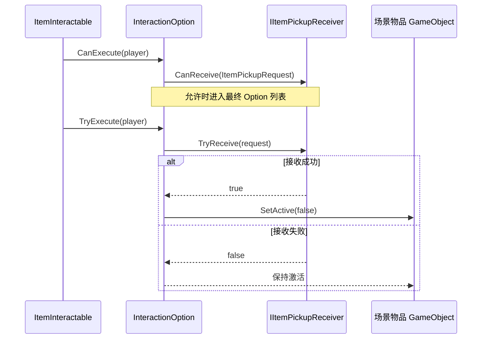

# 交互系统扩展指南

返回：[交互系统入口](../ReadMe.md) · [技术文档](InteractionSystem_Technical.md) · [使用文档](InteractionSystem_Usage.md)

本指南面向新增 RPG 交互业务的程序开发者。扩展的目标是“增加 Provider 和 Option”，而不是让业务组件直接操作 ChoiceWindow 或修改玩家输入循环。

## 1. 选择扩展方式

### 1.1 继承 `InteractableObject`

适用于交互对象、交互中心就是当前组件所在 GameObject 的场景组件，例如物品、机关、采集点：

```csharp
public sealed class ChestInteractable : InteractableObject
{
    private InteractionOption openOption;

    private void Awake()
    {
        openOption = new InteractionOption(
            new InteractionOptionId(GetInstanceID(), "Open"),
            "打开",
            gameObject,
            transform,
            priority: 0,
            maxDistance: 2f,
            CanOpen,
            TryOpen);
    }

    public override void CollectInteractionOptions(
        in InteractionQueryContext context, List<InteractionOption> results)
    {
        if (openOption != null) results.Add(openOption);
    }

    private bool CanOpen(GameObject interactor) => /* 读取实时业务状态 */ true;
    private bool TryOpen(GameObject interactor) => /* 修改业务状态 */ true;
}
```

### 1.2 直接实现 `IInteractable`

适用于 Provider 所在节点不是实际交互对象，或一个组件需要自定义 `InteractionObject`、`InteractionOrigin` 的场景，例如 NPC 根节点上的对话适配器。`DialogueInteractable` 就是直接实现 `IInteractable` 的示例。

```csharp
public sealed class NpcActionProvider : MonoBehaviour, IInteractable
{
    [InfoBox("请将 Provider 放在交互 Collider 节点或其父节点，并配置 ActionRoot。")]
    [SerializeField] private Transform actionRoot;

    public GameObject InteractionObject => gameObject;
    public Transform InteractionOrigin => actionRoot != null ? actionRoot : transform;

    public void CollectInteractionOptions(
        in InteractionQueryContext context, List<InteractionOption> results)
    {
        // 追加缓存的 Option，不在扫描热路径中 new。
    }
}
```

通过 `GetComponent`、`GetComponentInParent` 或 `GetComponentInChildren` 获取的依赖，应在 Inspector 使用 Odin `InfoBox` 说明组件类型、查找范围和缺失前提；运行时仍需在真正使用前校验依赖。

## 2. 创建 Option 的规则

### 2.1 单 Option

一个 Provider 可以只缓存一个 Option，例如 `DialogueInteractable` 的 `Dialogue`，或 `ItemInteractable` 的 `Pickup`。

```text
Awake
  → 构造 InteractionOption
  → 保存到字段
CollectInteractionOptions
  → 将同一个 Option 引用追加到 results
```

### 2.2 多 Option

一个 Provider 可以贡献多个独立动作，例如 NPC 同时提供对话、交易和查看任务：

```text
NpcProvider
├── Dialogue Option   ActionId = "Dialogue"
├── Shop Option       ActionId = "Shop"
└── Quest Option      ActionId = "Quest"
```

每个 Option 必须有不同的 `ActionId`。Provider 实例 ID 由 `GetInstanceID()` 提供，因此最终 ID 只保证当前运行期间稳定。

### 2.3 同对象多个 Provider

同一个 NPC 可以分别挂载 `DialogueInteractable`、`ShopInteractable` 和 `QuestInteractable`。Detector 会沿 Collider 父级收集全部 `IInteractable`，PlayerInteractor 再按 `InteractionOptionId` 去重。

不要依赖 Provider 被 HashSet 收集的顺序。最终顺序由 `Priority` 降序和 `InteractionOptionId` 升序决定。

## 3. ActionId、缓存与执行校验

`ActionId` 是 Provider 内部动作身份，不是显示文字，也不是存档 ID：

- 推荐使用稳定常量，如 `"Dialogue"`、`"Pickup"`、`"Shop"`。
- 不要使用随机数、当前时间或显示名称拼接作为 ActionId。
- 显示名称可以随本地化和产品调整，ActionId 不应因此改变。
- Option 应在 `Awake` 或配置完成时缓存，扫描时只追加引用。
- `CanExecute` 必须读取实时业务状态。
- `TryExecute` 必须能在执行时再次校验，并只在实际成功时返回 `true`。

```csharp
private bool CanTrade(GameObject interactor)
{
    return interactor != null && merchantState != null && merchantState.CanTrade;
}

private bool TryTrade(GameObject interactor)
{
    // 即使 UI 刚刚显示过，也必须再次确认库存、货币和 NPC 状态。
    return CanTrade(interactor) && merchantState.TryOpenShop(interactor);
}
```

## 4. 现有业务扩展模式

### 4.1 对话

`DialogueInteractable`：

- 配置 `DialogueAsset` 和 NPC `participantRoot`。
- 缓存一个 `Dialogue` Option。
- `CanExecute` 检查对话资源、玩家参与者、NPC 参与者和 DialogueSystem。
- 执行时以 `DialogueSystem.TryStartDialogue(...).Succeeded` 作为成功条件。
- `DialogueRequest.Target` 记录当前 `IInteractable` Provider。

对话业务不应在 UI Controller 中拼装 `DialogueRequest`，也不应让 ChoiceWindow 直接依赖 DialogueSystem。

### 4.2 物品拾取

`ItemInteractable` 缓存一个 `Pickup` Option，并将请求交给玩家对象上的 `IItemPickupReceiver`：



`ItemPickupRequest` 包含物品定义、数量和来源对象。当前系统不实现背包；背包组件只需实现 `IItemPickupReceiver`，并挂在 Player 根对象上。

### 4.3 商店、任务和采集

建议沿用同样结构：

1. 一个 Provider 负责收集该业务的 Option。
2. 每个动作使用稳定 ActionId。
3. `CanExecute` 只判断当前是否可用。
4. 执行回调调用业务系统，并返回真实成功结果。
5. 业务状态变化后等待下一次 Detector 扫描刷新列表；默认最多滞后 `0.1s`。

如果一个动作需要长时间异步执行，应由业务系统管理异步状态，Option 的执行回调只在命令已被业务系统成功接收时返回成功，并避免重复提交。

## 5. 扩展筛选、排序和输入

### 5.1 修改筛选或排序

统一筛选和排序位于 `PlayerInteractor`。新增规则时保持以下边界：

- Detector 只负责空间粗筛，不放入业务条件。
- Provider 负责贡献候选，不自行决定其他 Provider 的优先级。
- `CanExecute == false` 的 Option 不进入最终列表。
- MaxDistance 只能收紧 Detector 范围，不能扩大 Detector 已经排除的范围。
- 任何新排序字段都必须提供稳定的最终比较条件，不能依赖 HashSet 顺序。
- 只有列表 ID 顺序或选中 ID 改变时才发送对应事件。

当前版本明确不启用 Viewport、遮挡、镜头关注度和距离评分；若未来恢复这些规则，应同步更新技术文档、测试和产品排序预期。

### 5.2 增加交互输入

ChoiceWindow 的交互输入直接走 Unity EventSystem：

```text
UI Navigate / Submit
→ EventSystem Selection / Button Submit
→ ChoiceWindowView
→ InteractionUIController
→ PlayerInteractor.Select / SubmitSelected
```

新增 UI 导航方向或提交方式时，优先配置 Button 的 `Navigation` 和 InputSystem UI Action；不需要增加
`PlayerInputType`、Gameplay Tag 或 PlayerStateBlackboard 消费逻辑。旧的交互 Intent 仲裁类型仅为兼容
非 UI 场景保留，当前不会由 `GameplayInputIntentArbiterManager` 自动注册。详细规则见技术文档中的
ChoiceWindow 输入章节。

## 6. 扩展 UI 与预加载

领域层不依赖 Window、View 或 ViewModel。若需要另一种 UI 表现：

- 订阅 `PlayerInteractor.OptionsChanged` 和 `SelectionChanged`。
- 只投影展示所需的数据，如名称、ID 和选中索引。
- 通过 View 的 `SelectionRequested` 同步 UI EventSystem 选中项，不在 PlayerInteractor.Update 中读取输入黑板。
- 点击后先调用 `PlayerInteractor.Select(optionId)`，成功后再调用 `SubmitSelected()`。
- 不在 UI 中重复执行 MaxDistance、CanExecute 或业务逻辑。

ChoiceWindow 当前由 Window 组装 `ChoiceWindowView` 和 `InteractionUIController`。若替换窗口，应保持 Controller 的领域绑定和生命周期对称。

场景级预热服务应实现 `IScenePreloadTask`；窗口统一实现 `IWindowPreloadService`。新增对象池或资源预热任务时，向未来场景加载编排器提供同一个 `PreloadAsync()` 契约，不要让业务交互组件直接管理全局窗口加载。

相关框架文档：[WSFrame UI](../../WSFrame/UISystem/Core/UISystem_Documentation.md)、[ConfigInstaller](../../WSFrame/ConfigInstaller/ConfigInstaller_Usage.md)。

## 7. 常见错误

### 每次扫描 `new InteractionOption`

会增加 GC 和对象引用变化，可能使选择保持和 UI 刷新变得不稳定。应缓存 Option，只让 `CollectInteractionOptions` 追加引用。

### 用显示名称作为唯一 ID

本地化或文案调整会破坏选择保持。使用稳定的 ActionId。

### 在 UI 中执行业务校验

会造成键盘、手柄和点击三条路径行为不一致。统一由 `CanExecute` 与 `TryExecute` 管理。

### 接收器失败后停用物品

`TryReceive` 返回 `false` 时必须保持场景物品激活，只有真实接收成功才调用 `SetActive(false)`。

### 直接销毁拾取物

当前约定是停用而非销毁，以便未来接入对象池。

### 把 Window 预加载当作显示

`PreLoadWindowAsync` 只应完成实例和 View 初始化。显示由 `PopUpWindowAsync` 控制，零 Option 时使用 `HideWindow` 保留常驻实例。
