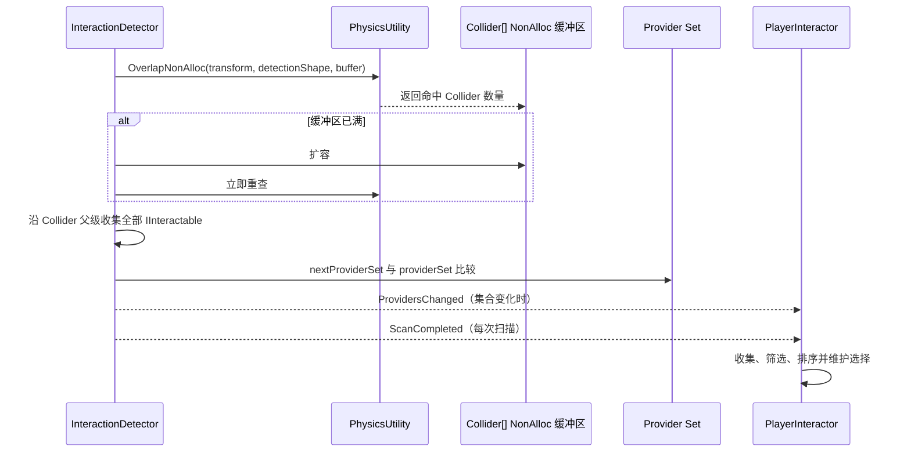
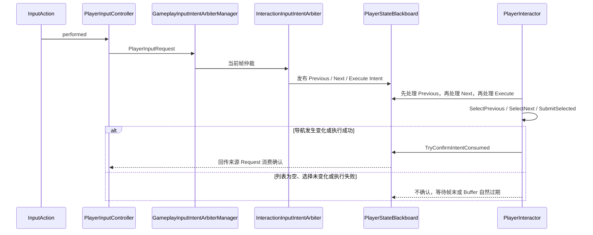
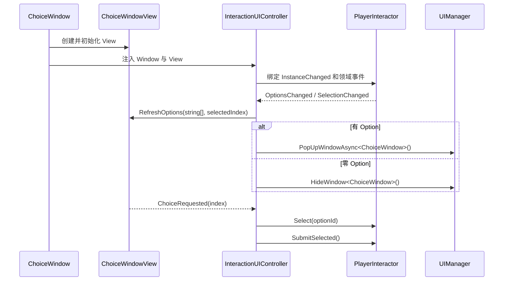
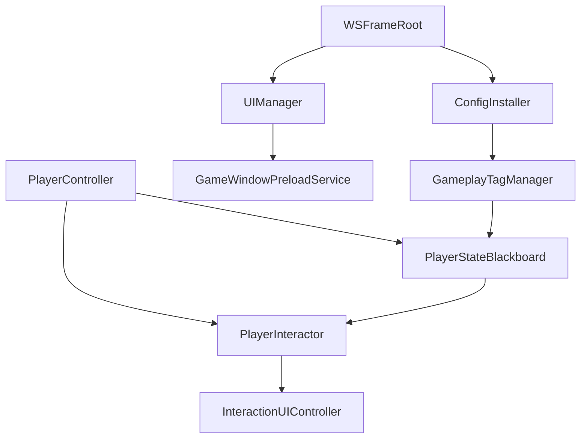

# 交互系统技术文档

返回：[交互系统入口](../ReadMe.md) · [扩展指南](InteractionSystem_ExtensionGuide.md) · [使用文档](InteractionSystem_Usage.md)

## 1. 系统定位

交互系统将“发现附近对象”和“执行一个具体动作”拆开：Detector 只负责空间候选发现，Provider 负责贡献 Option，PlayerInteractor 负责最终筛选、排序和选择，Option 负责业务校验与执行。

```mermaid
flowchart LR
    Shape[PhysicsShapeData<br/>可编辑检测形状] --> Detector[InteractionDetector]
    Detector --> Providers[IInteractable Provider 集合]
    Providers --> Collect[CollectInteractionOptions]
    Collect --> Options[InteractionOption 列表]
    Options --> Filter[有效对象 / MaxDistance / CanExecute]
    Filter --> Sort[Priority 降序<br/>InteractionOptionId 升序]
    Sort --> Interactor[PlayerInteractor]
    Interactor --> DomainEvents[OptionsChanged / SelectionChanged]
    DomainEvents --> Controller[InteractionUIController]
    Controller --> View[ChoiceWindowView]
    Input[InputAction] --> Arbiter[InteractionInputIntentArbiter]
    Arbiter --> Blackboard[PlayerStateBlackboard]
    Blackboard --> Interactor
    Interactor --> Execute[InteractionOption.TryExecute]
```



当前版本是本地单玩家系统。它不负责网络同步、多人抢占、服务端校验、失败原因展示或置灰选项。

## 2. 核心职责与契约

| 类型 | 职责 | 不负责的内容 |
| --- | --- | --- |
| `InteractionDetector` | 使用 `PhysicsShapeData` 查询 Collider、收集 Provider、去重并周期通知 | 不创建 Option，不执行 Action，不决定最终 UI 顺序 |
| `IInteractable` | 提供交互对象、交互中心，并向调用方集合贡献一个或多个 Option | 不直接提供统一的 `Interact` 命令 |
| `InteractableObject` | 为 MonoBehaviour Provider 提供自身 `GameObject` 和 `Transform` 默认实现 | 不承载具体业务执行逻辑 |
| `InteractionOption` | 保存展示数据、空间约束、业务校验和执行回调 | 不管理 UI 行实例，不保存玩家选择 |
| `InteractionOptionId` | 由 Provider Unity 运行时实例 ID 与稳定 `ActionId` 组成，用于去重、排序和保留选择 | 不作为存档 ID，不保证跨运行稳定 |
| `InteractionQueryContext` | 向 Provider 传递玩家对象、玩家 Transform 和查询摄像机 | 不代表最终筛选结果 |
| `PlayerInteractor` | 收集、硬筛选、排序、选择、执行并发布领域事件 | 不负责窗口资源加载和 UI 行创建 |
| `InteractionUIController` | 将领域 Option 投影为字符串和 ID，并协调 ChoiceWindow 显隐 | 不执行距离、遮挡或业务判断 |

### 2.1 Provider 与 Option 的边界

一个 Provider 可以贡献多个 Option；同一个 GameObject 也可以挂载多个 Provider。Detector 从命中 Collider 的父级链收集全部 `IInteractable`，不限定为 `InteractableObject`。

Provider 应长期缓存不会变化的 Option 对象。周期扫描只把缓存引用追加到调用方列表，避免热路径持续创建命令对象。Option 内部的 `CanExecute` 和 `TryExecute` 可以读取实时业务状态。

### 2.2 Option 执行契约

`PlayerInteractor` 刷新列表时调用 `CanExecute`。用户点击或输入执行时，`InteractionOption.TryExecute` 会再次调用 `CanExecute`，通过后才调用执行回调：

```text
扫描刷新 → CanExecute
用户选择 → 保存 SelectedOption
用户执行 → CanExecute 再校验 → Execute
成功     → 由业务入口确认对应 Intent
失败     → 不确认输入消费
```

因此，刷新时可用不代表执行时一定成功；执行入口必须保持幂等和实时校验。

## 3. Detector 扫描流程

### 3.1 形状与查询

`InteractionDetector` 直接持有 `PhysicsShapeData`，支持 Box、Sphere、Capsule 和 Sector。形状的局部位置、旋转、尺寸以及 Gizmo 开关由 `PhysicsShapeData` 和现有 Inspector/Scene Handle 工具管理。



NonAlloc 缓冲区满时会扩容并立即重查，不能把“返回数量等于容量”当作完整结果。Provider 使用当前 Set 与下一轮 Set 对比，多个 Collider 命中同一个 Provider 时只保留一份。

### 3.2 两类扫描事件

- `ProvidersChanged`：只有 Provider 集合实际发生变化时发送，适合观察进入、离开范围。
- `ScanCompleted`：每次扫描完成都发送，即使 Provider 集合没有变化；`PlayerInteractor` 依靠它刷新动态 `CanExecute` 和 `MaxDistance`。

扫描间隔当前默认为 `0.1s`。`StartDetect()` 会立即扫描，`PauseDetect()` 会停止扫描、清空 Provider，并发送一次空状态刷新。`startDetectOnEnable` 是序列化启动配置，运行时暂停状态单独保存在 `isDetecting`，暂停不会改写 Inspector 配置。

## 4. PlayerInteractor 刷新、筛选与选择

### 4.1 刷新时机

`PlayerInteractor.Update()` 只消费当前帧的输入 Intent，不再逐帧调用 `RefreshOptions()`。Option 列表由 Detector 的 `ScanCompleted` 驱动，因此 Provider 集合不变时，业务状态仍会在下一次扫描时重新筛选。

### 4.2 硬筛选顺序

当前最终列表只保留同时满足以下条件的 Option：

1. `InteractionObject` 和 `InteractionOrigin` 有效。
2. 玩家到 `InteractionOrigin` 的距离没有超过 `MaxDistance`；零表示不额外收紧 Detector 范围。
3. `CanExecute(player)` 返回 `true`。

当前版本不启用 Viewport、遮挡和镜头关注度筛选。Detector 的形状负责 Provider 粗筛，Option 的 `MaxDistance` 负责进一步收紧范围。

### 4.3 稳定排序与选择保持

排序顺序固定为：

1. `Priority` 降序。
2. `InteractionOptionId` 升序。

刷新前保存当前 Option ID。刷新后若 ID 仍存在则保留选择；原选择消失时选新的第一项；首次出现列表时选择第一项。`SelectPrevious()` 和 `SelectNext()` 首尾循环。

只有最终 Option ID 顺序发生变化时才发送 `OptionsChanged`；只有选中 ID 发生变化时才发送 `SelectionChanged`。这两个事件都不会因为重复刷新而无条件发送。

## 5. 输入 Intent 链

交互输入采用“请求产生 Intent、业务成功后确认消费”的输入模型。默认交互导航使用 `InteractionPrevious`、`InteractionNext`，执行使用现有 `Interact` 映射到 `Interaction.Execute`。



导航只有真正改变选择时才确认消费；执行只有 `SubmitSelected()` 成功时才确认消费。`GameplayTagDatabase` 由 `GameplayTagDatabaseConfigProvider` 通过 ConfigInstaller 在业务使用前注册，否则黑板无法正常写入交互 Intent。

## 6. ChoiceWindow MVC 与预加载

`ChoiceWindow` 是 Window 层的 MVC 组合根：它创建 View 和 Controller，并在销毁时释放二者。`ChoiceWindowView` 负责异步加载 `OptionChoice` prefab，第一次创建三行，后续扩容并复用；零选项时隐藏窗口但不销毁窗口和行。



当前 ChoiceWindow 不读取 `InteractionOption.Icon`。领域层保留图标字段供未来 View 使用，ChoiceWindow 只投影 Option 名称和选中索引；`OptionChoice` prefab 中的 ChatIcon 是固定装饰。

`GameWindowPreloadService` 通过 `IWindowPreloadService : IScenePreloadTask` 依次预加载 HUD、Choice 和 Dialogue，并等待 ChoiceWindow 的三行 View 初始化完成。预加载只初始化，不自动显示窗口。

停止运行时，`WSFrameRoot` 先调用 `UIManager.Shutdown()`，窗口统一释放 Controller、View、行实例和资源，避免玩家销毁事件刷新已经被 Unity 销毁的 UI 行。

## 7. 依赖、性能与边界



- 物理查询和 Provider 列表尽量复用缓冲区；缓冲区扩容只在容量不足时发生。
- Provider 集合、Option ID 集合和最终 Option 列表均由玩家侧长期复用。
- UI 文本和 ID 投影由 Controller 复用 `List<string>` 与 `List<InteractionOptionId>`。
- `InteractionOption` 不能作为跨运行存档对象；其 ID 包含 Unity 运行时实例 ID。
- 当前系统只支持本地单玩家，一个 `PlayerInteractor` 对应一个 UI 绑定实例。

相关框架说明：[WSFrame UI 文档](../../WSFrame/UISystem/Core/UISystem_Documentation.md)、[输入预处理文档](../../Input/PlayerInputPreprocessing.md)、[ConfigInstaller 使用文档](../../WSFrame/ConfigInstaller/ConfigInstaller_Usage.md)。
