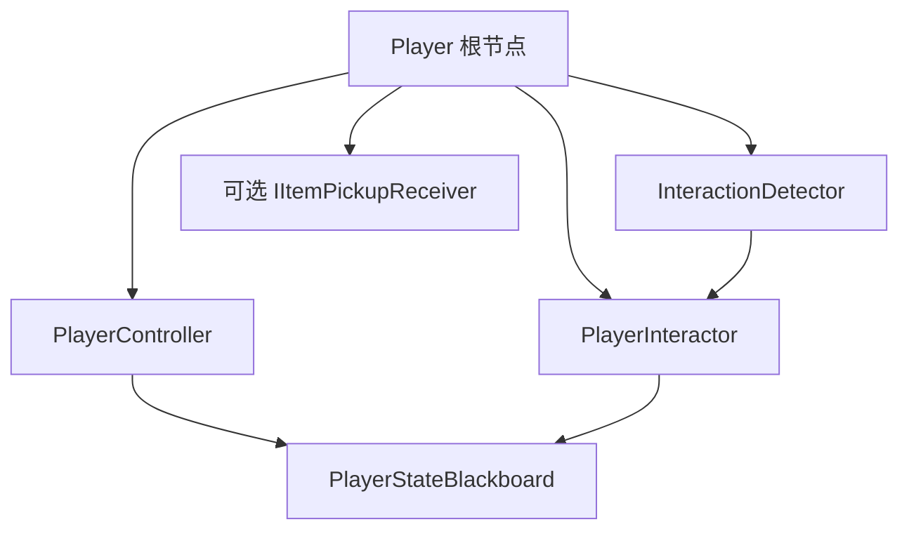
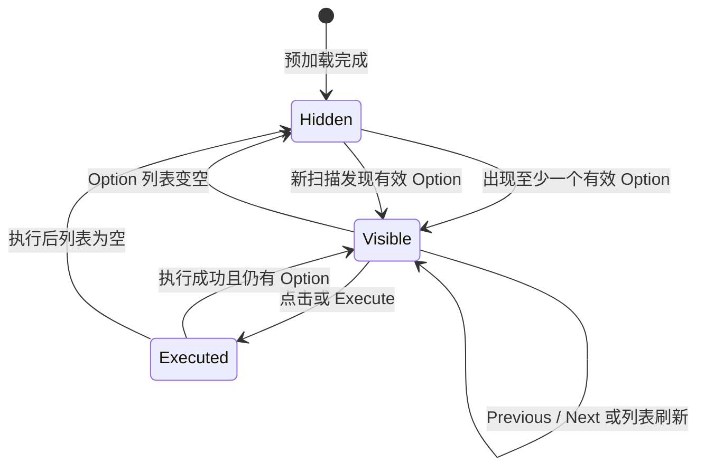

# 交互系统使用文档

返回：[交互系统入口](../ReadMe.md) · [技术文档](InteractionSystem_Technical.md) · [扩展指南](InteractionSystem_ExtensionGuide.md)

本文面向场景设计、策划和测试人员，说明如何在场景中配置交互检测、对话、物品拾取和交互选项窗口。

## 1. 玩家节点配置

交互系统要求 `InteractionDetector` 与 `PlayerInteractor` 位于玩家根节点。当前 `PlayerInteractor` 是玩家单例，并从同一根节点读取 `PlayerController` 的 `PlayerStateBlackboard`；不要只把它挂在玩家的 `Interactor` 子节点上。



配置检查：

- `PlayerController`：提供移动和输入黑板。
- `InteractionDetector`：提供交互区域和 Provider 候选扫描。
- `PlayerInteractor`：收集、筛选、排序和执行当前玩家的 Option。
- `PlayerInteractor.detector`：通常引用同一根节点上的 `InteractionDetector`；为空时会尝试从同节点获取。
- `PlayerInteractor.viewCamera`：可配置主摄像机。当前版本只把它传给查询上下文，不执行 Viewport、遮挡或镜头评分筛选。
- 物品拾取场景还需要玩家根节点上的背包或接收组件实现 `IItemPickupReceiver`。

如果玩家由场景或对象池替换，保持新实例的 `PlayerInteractor` 仍位于根节点；窗口 Controller 会通过 `PlayerInteractor.InstanceChanged` 自动重新绑定。

## 2. 配置 InteractionDetector

### 2.1 检测形状

在 `InteractionDetector` 的 `Detection Shape` 中选择形状。当前支持：

| 类型 | 适用场景 | 主要参数 |
| --- | --- | --- |
| Box | 走廊、房间或矩形工作台 | `Size` |
| Sphere | 角色周围的通用交互半径 | `Radius` |
| Capsule | 纵向角色空间或窄长区域 | `Radius`、`Height` |
| Sector | 扇形视野或朝向区域 | `OuterRadius`、`InnerRadius`、`Height`、`Angle` |

None 和 Ray 不能用于 Detector。形状尺寸必须是有限且有效的正数；Capsule 的高度至少为两个半径，Sector 的内半径不能大于外半径。

常用配置示例：

```text
Type          = Sphere
Local Position= (0, 0.8, 0)
Radius        = 8
Draw Gizmos   = true
Scan Interval = 0.1
```

### 2.2 LayerMask、Trigger 和扫描

`Detection Mask` 决定哪些 Collider 能成为候选。物理查询当前使用 `QueryTriggerInteraction.Collide`，因此目标 Trigger Collider 也会参与检测。目标 Collider 可以在 Provider 的子节点上，Detector 会沿父级收集所有 `IInteractable`。

`Initial Buffer Size` 是 NonAlloc 查询的起始容量。命中数量达到容量时，Detector 会扩容并立即重查，不会静默截断候选。扫描间隔必须是有限正数，默认 `0.1s`。

### 2.3 Gizmo 与 Scene Handle

`PhysicsShapeData` 的 `Can Draw Gizmos` 开启后，即使未选中玩家，也可以在 Scene View 看到交互区域。选中 Detector 后使用 Inspector 的“开始编辑”按钮进入形状编辑，再使用 Scene View 的 Move、Rotate、Scale Handle 调整局部位置、旋转和尺寸。修改会记录 Unity Undo/Redo，并能作为 Prefab Override 保存。

检测区域只是 Provider 粗筛范围。`InteractionOption.MaxDistance` 可以进一步缩短某个 Option 的有效距离，但不能让它超出 Detector 命中范围。

## 3. 配置可交互对象

### 3.1 对话

在 NPC 的交互 Collider 节点或其父节点添加 `DialogueInteractable`：

1. 配置 `Dialogue Asset`。
2. 配置 `Participant Root`，通常指向 NPC 的角色根节点。
3. 确认 NPC 根节点或父级存在 `DialogueParticipant`。
4. 确认玩家根节点存在玩家 `DialogueParticipant`。
5. 确认 DialogueSystem 已由项目架构启动。
6. 运行时进入 Detector 形状，HUD 中出现“对话” Option。

对话 Option 的可用性由资源、玩家参与者、NPC 参与者和 DialogueSystem 共同决定。启动失败时 Option 不会被执行成功确认。

### 3.2 物品拾取

在物品的 Collider 节点或其父节点添加 `ItemInteractable`：

1. 配置 `Item Definition`。
2. 配置 `Quantity`、`Option Display Name`、`Priority` 和可选的 `Max Distance`。
3. 确认玩家根节点存在实现 `IItemPickupReceiver` 的组件。
4. 进入检测区域后，只有 `CanReceive` 返回 `true` 时才显示拾取 Option。
5. 执行时会再次调用 `TryReceive`；接收成功后物品 `GameObject` 被停用，失败则保持激活。

场景物品默认使用稳定 ActionId `Pickup`。当前约定是停用而不是销毁，便于未来对象池或重新激活流程接入。

### 3.3 多选项对象

一个对象可以同时挂载多个 Provider，也可以由一个 Provider 贡献多个 Option。例如 NPC 可以同时拥有对话、商店和任务 Provider。最终顺序由 `Priority` 降序、`InteractionOptionId` 升序决定，不要依赖组件在 Inspector 中的顺序或物理命中顺序。

## 4. 交互输入与 ChoiceWindow

### 4.1 默认操作

当前输入资产中的交互导航和执行如下：

| 操作 | `PlayerInputType` | 默认绑定 |
| --- | --- | --- |
| 上一项 | `InteractionPrevious` | 键盘 `Up Arrow`、`1`；手柄 D-Pad Left |
| 下一项 | `InteractionNext` | 键盘 `Down Arrow`、`2`；手柄 D-Pad Right |
| 执行 | `Interact` | 输入资产中 `Interact` 对应的绑定；测试配置通常为键盘 `G` |

输入经过 `PlayerInputController`、`GameplayInputIntentArbiter` 和 `PlayerStateBlackboard` 后才由 `PlayerInteractor` 消费。导航先于执行处理；只有选择发生变化或 Option 执行成功时才确认消费输入请求。

### 4.2 窗口行为

`GameWindowPreloadService` 会在跨场景保留的 WSFrameRoot 上依次预加载 HUD、Choice 和 Dialogue 窗口，并等待 ChoiceWindow 首次创建三个 `OptionChoice` 行。预加载完成后窗口保持隐藏，不会因为预加载自动显示。



ChoiceWindow 只展示 Option 名称和选中高亮。鼠标点击行时，Controller 先按行索引调用 `PlayerInteractor.Select(optionId)`，选择成功后再调用 `SubmitSelected()`；无效索引或已消失的 Option 不会提交其他行。Option 的 Icon 字段当前不投影到该窗口。

## 5. 运行时控制

可在需要时从玩家侧调用：

| API | 用途 |
| --- | --- |
| `StartDetect()` | 开启检测并立即扫描，恢复场景或重新启用组件时使用 |
| `PauseDetect()` | 停止扫描、清空 Provider 和 Option，并刷新为空状态 |
| `ScanNow()` | 不等待扫描间隔，立即按当前形状重新查询，适合测试和业务状态变化后的主动刷新 |

Detector 的 `StartDetect()` 与 `PlayerInteractor.StartDetect()` 都会立即扫描。正常情况下优先调用玩家侧 API，使 Detector 和最终 Option 状态一起恢复。

## 6. Odin Tester

将 `InteractionSystemOdinTester` 挂到测试场景中的任意活动 GameObject，确保它位于 `Tests` 目录对应的运行时程序集可见范围内，然后在 Inspector 中使用 Odin Button。测试器用于手动观察：

- 当前 Detector 形状、检测状态和 Provider 数量。
- 胶囊/体积扫描命中与 NonAlloc 扩容结果。
- 多 Collider 去重、父级 Provider 和多 Provider 收集。
- 多 Option 的排序、选择保持、首尾循环和执行结果。
- Pause/Resume 后的清空与立即恢复。
- ItemPickupReceiver 的允许、拒绝和成功停用行为。

测试前先确认场景存在玩家根节点、Detector 形状有效、目标 Collider 位于 `Detection Mask`，并且 `GameplayTagDatabaseConfigProvider` 已在 ConfigInstaller 中引用正确的 GameplayTagDatabase。

## 7. 常见问题

| 现象 | 检查项 |
| --- | --- |
| 没有显示 Option | Detector 是否在扫描；形状是否有效；LayerMask 是否包含目标；Collider 父级是否存在 Provider；`CanExecute`/`CanReceive` 是否返回 `true` |
| 上下键无法切换 | `PlayerInteractor` 是否在玩家根节点；`GameplayTagDatabase` 是否已由 ConfigInstaller 初始化；Input Action 是否绑定到 `InteractionPrevious`/`InteractionNext` |
| Option 顺序异常 | 检查 `Priority`；同优先级由运行时 `InteractionOptionId` 排序，不要依赖场景组件顺序 |
| 物品无法拾取 | `Item Definition` 是否配置；玩家根节点是否有 `IItemPickupReceiver`；`CanReceive` 是否允许；容量不足时 `TryReceive` 是否返回 `false` |
| 窗口没有显示 | 是否已创建并初始化 UIManager；GameWindowPreloadService 是否运行；是否仍有有效 Option；零 Option 时窗口会被 Hide 而不是销毁 |
| 停止运行时报 UI 错误 | 确认使用当前 WSFrameRoot 的统一 `UIManager.Shutdown()` 流程；不要在外部提前销毁 ChoiceWindow 或 OptionChoice 行 |

## 8. 场景交付检查清单

- 玩家根节点包含 `PlayerController`、`InteractionDetector` 和 `PlayerInteractor`。
- Detector 形状、尺寸、LayerMask、扫描间隔和 Gizmo 已配置并在 Scene View 验证。
- 每个 Provider 的交互 Collider 可被 Detector 命中，Provider 位于 Collider 父级链上。
- 对话资源和参与者、物品定义和接收器均已配置。
- 多 Option 的 Priority、显示名称和稳定 ActionId 已确认。
- 键盘/手柄上一项、下一项和执行输入已在 Play Mode 测试。
- `GameplayTagDatabaseConfigProvider` 已注册到 ConfigInstaller，交互 Intent 可以写入黑板。
- ChoiceWindow 预加载后创建三个初始行，零 Option 时隐藏，重新出现 Option 时复用同一窗口。
- 测试了 Option 列表动态变化、点击选择、执行失败和停止运行释放流程。

相关文档：[WSFrame UI 文档](../../WSFrame/UISystem/Core/UISystem_Documentation.md)、[玩家输入预处理文档](../../Input/PlayerInputPreprocessing.md)、[对话系统需求文档](../../DialogueSystem/DialogueSystem_Requirements.md)、[ConfigInstaller 使用文档](../../WSFrame/ConfigInstaller/ConfigInstaller_Usage.md)。
