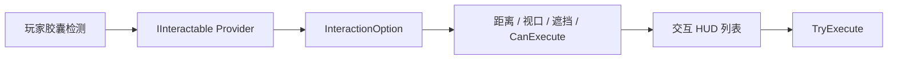
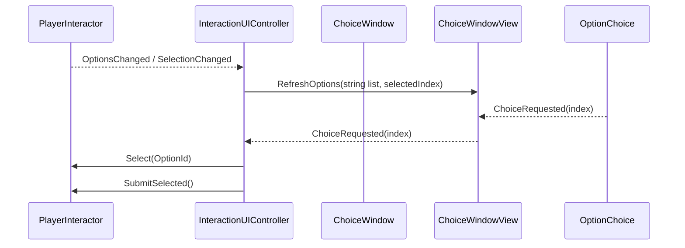

# 交互系统

## 运行流程

`IInteractable` 是交互选项 Provider，不再直接代表一次可执行行为。一个 Provider 可以贡献多个 `InteractionOption`，同一个场景对象也可以挂载多个 Provider。

`InteractableObject` 是可选便利基类，只提供自身 `GameObject` 和 `Transform` 作为默认交互对象；业务组件也可以直接实现 `IInteractable`。

`InteractionOption` 才是 UI 展示和最终执行的最小单位。Provider 负责缓存并收集 Option，`PlayerInteractor` 负责统一距离、视口、遮挡、业务可用性筛选及稳定排序，UI 只负责展示和选中状态。

## Provider 示例

`DialogueInteractable` 直接实现 `IInteractable`，贡献一个 `Dialogue` Option。后续商店、任务和采集系统可以各自作为 Provider，或由同一个 Provider 贡献多个 Option。

## 接入约束

- `InteractionDetector` 与 `PlayerInteractor` 应挂载在玩家对象上；检测器依赖同节点 `CharacterController`。
- 目标 Collider 可以位于 Provider 的子物体上，检测器会沿父级收集全部 `IInteractable`。
- `CanExecute == false` 的 Option 不进入 HUD 列表。
- `InteractionOptionId` 使用 Provider 运行时实例 ID 和稳定 ActionId，只保证当前运行期间稳定，不作为存档 ID。

## ChoiceWindow 接入

`ChoiceWindow` 是 MVC 组合根，只负责组装和释放 `ChoiceWindowView` 与 `InteractionUIController`。View 第一次异步加载时预创建三个 `OptionChoice`，后续按需扩容并复用行；零 Option 时由 `UIManager` 隐藏窗口，不销毁窗口实例。

项目窗口脚本位于 `Assets/Scripts/Game/Runtime/UI`，不再属于 WSFrame.UI 框架程序集。`IWindowPreloadService` 实现通用的 `IScenePreloadTask`，统一预加载 HUD、Choice 和 Dialogue 窗口，未来对象池等系统可以复用同一场景预热任务契约。

## 物品 Provider

`ItemInteractable` 贡献一个 `Pickup` Option。它不直接依赖背包实现，而是将 `ItemPickupRequest` 交给玩家对象上的 `IItemPickupReceiver`。只有接收器成功提交后，场景物品才会被停用。
