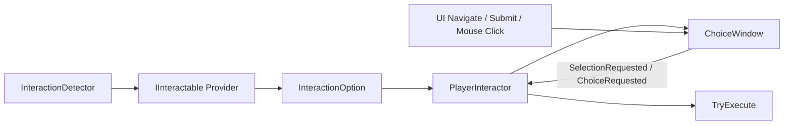

# 交互系统

交互系统负责从玩家可编辑的物理检测区域发现 `IInteractable` Provider，收集多个 `InteractionOption`，完成可用性筛选、稳定排序、输入选择和统一执行。UI 只展示当前最终列表，不承担距离或业务校验。

## 文档导航

| 文档 | 面向读者 | 内容 |
| --- | --- | --- |
| [技术文档](Documentation/InteractionSystem_Technical.md) | 核心系统维护者 | 扫描、筛选、输入、UI 生命周期、预加载和性能边界 |
| [扩展指南](Documentation/InteractionSystem_ExtensionGuide.md) | 业务程序开发者 | Provider、Option、对话、拾取、商店、任务和 UI 扩展模板 |
| [使用文档](Documentation/InteractionSystem_Usage.md) | 场景、策划和测试人员 | 玩家配置、Detector 编辑、对象接入、按键、Odin Tester 和排障 |

## 术语速查

- **Provider**：实现 `IInteractable`、负责贡献一个或多个 Option 的交互来源。
- **InteractionObject**：Provider 所属的场景 `GameObject`，用于表达目标对象归属。
- **Option**：真正可被选择和执行的 `InteractionOption`，例如 `Dialogue` 或 `Pickup`。
- **ActionId**：Provider 内部动作的稳定身份，例如 `Dialogue`、`Pickup`；与显示名称和存档 ID 不同。
- **Interactor**：玩家侧的 `PlayerInteractor`，负责最终列表、选中项和执行。

## 当前版本边界

Detector 使用 `PhysicsShapeData` 做 Provider 粗筛，支持 Box、Sphere、Capsule 和 Sector。`PlayerInteractor` 当前按 `MaxDistance` 与 `CanExecute` 硬筛选，再按 `Priority` 降序、`InteractionOptionId` 升序排序；不启用 Viewport、遮挡、镜头关注度或距离评分。

ChoiceWindow 当前只显示 Option 名称和选中高亮，领域层保留的 `InteractionOption.Icon` 暂不投影到该窗口。上下移动、提交和鼠标点击统一使用 Unity EventSystem；系统面向本地单玩家，不包含网络同步、多人抢占、失败原因展示和置灰选项。

## 相关系统

- [WSFrame UI 系统](../WSFrame/UISystem/Core/UISystem_Documentation.md)：`UIManager`、`WindowBase`、预加载和关闭生命周期。
- [玩家输入预处理](../Input/PlayerInputPreprocessing.md)：Input Request、Intent 仲裁和消费确认。
- [对话系统需求](../DialogueSystem/DialogueSystem_Requirements.md)：`DialogueInteractable` 与 DialogueSystem 的业务边界。
- [ConfigInstaller 使用说明](../WSFrame/ConfigInstaller/ConfigInstaller_Usage.md)：GameplayTagDatabase 的初始化依赖。
