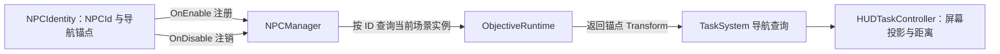

# NPC 身份注册与任务导航

`NPCController` 处理 NPC 的战斗、属性和技能。`NPCIdentity` 则为剧情或任务可定位的场景 NPC 提供稳定 ID 与导航锚点，不要求 NPC 挂载战斗控制器。

在 NPC 场景对象上添加 `NPCIdentity`，填入唯一、区分大小写的 `NPCId`，并显式指定 `navigationAnchor`。NPC 可以在层级中创建一个头顶空节点作为锚点。`NPCManager` 由 `GameArchitecture` 注册；NPCIdentity 在启用期间注册，在禁用或场景卸载时注销。

同一时刻每个 NPCId 只允许一个已注册实例。同 ID 的第二个对象不会覆盖已注册 NPC，并会报告配置冲突。空 ID、格式无效的 ID 或缺少锚点时拒绝注册。Manager 只保留当前场景实例，不保存 NPC 状态或场景引用到存档。

配置了 NPCId 的对话 ObjectiveRuntime 在启动监听时从 GameArchitecture 获取并缓存 NPCManager，之后按 ID 查询当前锚点。任务层按当前阶段配置顺序选择首个未完成且有导航意图的目标；若选中的 NPC 当前未注册，查询失败，HUD 隐藏指示标且不切换到后续目标。NPC 随后注册后，HUD 的下一次查询会取得新锚点 Transform。NPCManager 未注册时，导航目标在订阅对话事件前明确启动失败。
