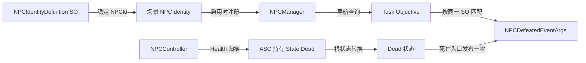
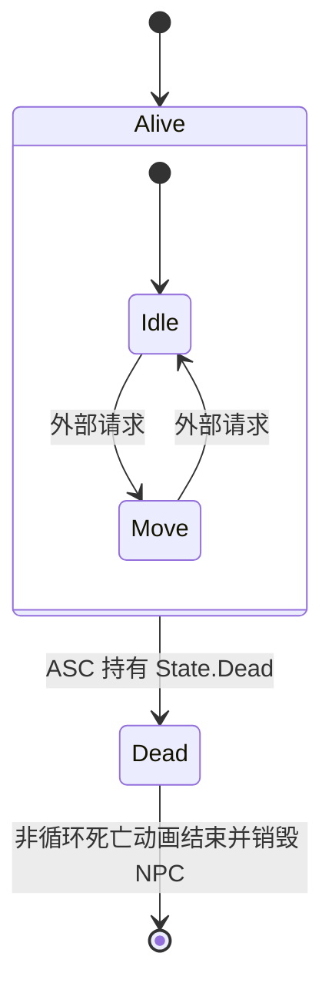

# NPC 身份、导航与战斗死亡

`NPCIdentityDefinition` 是 NPC、任务目标与场景实例共同引用的身份资产；场景上的 `NPCIdentity` 通过它注册当前 NPC，并提供导航锚点。`NPCController` 负责战斗属性、技能、运动和 Alive/Dead 生命周期。

## 身份与导航

在场景 NPC 上添加 `NPCIdentity`，并从 Inspector 选择 `NPCIdentityDefinition`；不再手工输入 NPCId。SO 序列化的 `identityId` 是唯一运行时身份，Inspector 只读显示；SO 名称只作为易读名称。新身份由 Editor 自动生成 GUID 字符串，重命名、移动或 Unity `.meta` GUID 变化都不会改变身份。

已有 Rusk、Arlecchino、ANPC 和 Boss Odetta 的旧业务字符串已直接迁入各自的 `identityId`，保证现有 NPC 查询、对话 Toggle 存档和 JSON 数据继续匹配；不再保留 `legacyId` 或运行时回退。Editor 资产处理器只把所属 `.meta` GUID 存作隐藏的复制来源记录：能确认复制关系时为复制品生成新身份，原件不变；来源不明确的重复 ID 会报错且不自动改写。NPCManager 只保留当前已启用场景实例，不保存 NPC 状态或 Transform 到存档。同一身份同时只能注册一个 NPC。`navigationAnchor` 可显式指定；未指定时使用 `NPCIdentity` 所在节点的 Transform。

任务的对话完成目标和击败目标都引用 `NPCIdentityDefinition`，运行时将 `identityId` 解析为既有 `NPCId` 值类型，再由 NPCManager 查询当前场景锚点。NPC 暂未加载时导航查询返回不可用，不会改变目标进度。

## Alive / Dead 状态

`NPCController` 在初始属性和资源初始化后订阅 ASC 的 `AttributeChanged`。监听器只在 Health 首次从正数降至非正数时添加 `State.Dead` Loose Tag；`NPCController.IsDead` 直接通过 ASC 精确查询该 Tag，根状态机在下一次 `Update` 检查 `Alive → Dead`。`FixedUpdate` 保留死亡与 HitStop 判断，因此死亡 Tag 添加后物理阶段立即短路；Dead 状态清理与动画在根状态机更新时开始。HitStop 期间根状态机仍会检查死亡 Transition，死亡动画继续遵循原有 HitStop 动画暂停行为。

进入 `Dead` 时，控制器添加现有 `State.Block.AbilityActivation`，强制取消全部活动 Ability Runtime 但保留已授予技能与属性，释放运动占用并关闭角色层级中的碰撞体；随后从 NPCManager 注销身份并发布一次 `NPCDefeatedEventArgs`。没有 `NPCIdentity` 的战斗测试对象仍可死亡，但不会推进需要稳定身份的任务。

`NPCConfig.DeathTransition` 配置非循环死亡动画。死亡状态在 Base 层播放它并订阅 Animancer 的结束回调；HitStop 仍生效时，动画图继续按原有暂停逻辑等待恢复。动画播放结束后销毁 NPCController 所在 NPC 根对象，不做透明度淡出、不使用计时器，也不在普通场景卸载或提前销毁时补发击败事件。

### Odetta 击败任务

`TaskNPCDefeatedObjectiveDefinition` 在所属任务阶段激活期间订阅 NPC 击败事件，仅匹配目标身份并增加进度；停止阶段监听后不再响应，也不补记接取前的击败。目标导航通过 NPCManager 动态查询当前 Odetta 实例，不将场景 Transform 序列化进任务记录。

正式任务 `side_defeat_boss_odetta`（“击败 Odetta”）已加入 TaskDatabase，配置一次击败目标，无自动接取、无前置条件、无奖励。目标完成后进入现有可领奖状态；空奖励批次可以完成领取并关闭任务。
