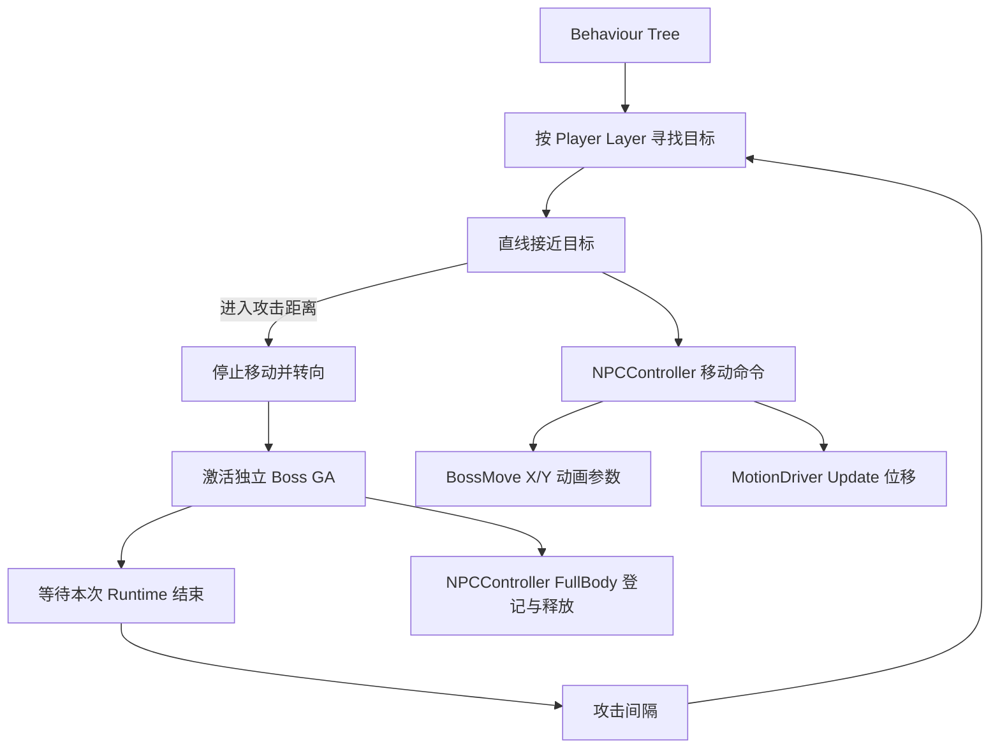

# Boss 行为树追击与攻击：移除独立 NPC Arbiter，接入二维移动动画

## 适用范围与覆盖说明

本文件保留 NPC 等级属性基础改造完成后要实施的 Boss 行为树方案。它不属于当前基础改造的运行时代码范围；先完成 NPC 成长 Profile、Boss 等级初始化和 Boss GA 副本，再开始本计划。

此前的最小战斗闭环计划采用定点作战、直接复用玩家 Attack1。后续确认将它修订为直线追击，并在当前基础改造中为 Boss 独立复制四段 GA。另有一项明确覆盖：早期方案建议移除攻击前置转向 Task，**后续行为树实施时暂缓移除**。Boss GA 先完整保留玩家 GA 的 Task 顺序与设置，包括现有攻击转向 Task；树负责为 Boss 提供目标与攻击入口，待后续单独确认后再讨论转向 Task 是否需要角色差异化。

本计划最终目标是“发现玩家 → 直线接近 → 到攻击距离停下 → 转向并释放 Boss GA → 等待结束 → 重新判断”。不实现寻路、绕障、持续仇恨或新的目标系统。

## 实施计划

### NPC 执行与 FullBody 生命周期

- 删除 `NPCActionArbiter.cs`。由 `NPCController` 直接实现 `IFullBodyActionArbiter` 与 `IFullBodyActionRegistrationOwner`，保留当前 Runtime、注册编号和幂等释放行为；`NPCActor.FullBodyActionArbiter` 返回 Controller。
- 保留 `IsFullBodyActionOccupied` 查询，供树节点和移动执行使用。登记 FullBody GA 时立即停止追击并释放 Locomotion 运动 Handle；技能结束或取消后释放占据，由行为树下一轮重新发出移动命令。
- 不改变共用 `PlaySkillConfigGameplayAbilityTask` 的注册契约，也不把树节点的 `Running` 状态当作所有技能占据的权威记录。树外激活的 GA 同样能阻止追击。
- 为 Controller 增加 `TryMoveTo(Transform target, float stopDistance)` 与 `StopMove()`。移动命令跨帧保存，Controller 每帧使用目标最新位置执行；目标失效、到达距离、FullBody 占据或 Controller 停用时清理命令和 Handle。
- 使用 Locomotion 优先级，通过 MotionDriver 提交水平 Update 位移与朝向。默认移动速度 **2.5 米/秒**，单帧位移限制在剩余接近距离内，遵循 CharacterController 碰撞。保留现有 HitStop 暂停约束。

### BossMove 二维动画

- `NPCConfig` 增加 Y 参数与移动速度，将 Boss 配置接到现有 `BossMove.asset`、`BossMoveX.asset`、`BossMoveY.asset`。
- 接入现有二维 Mixer，补齐参数引用和六个 Inplace 素材的采样点，使用“X 向右、Y 向前”的角色局部方向约定：

| 现有素材 | Mixer X/Y |
|---|---|
| 前走 | `(0, 1)` |
| 前右 45° | `(0.7071, 0.7071)` |
| 右走 | `(1, 0)` |
| 后左 45° | `(-0.7071, -0.7071)` |
| 左走 | `(-1, 0)` |
| Idle | `(0, 0)` |

- Move 状态播放 BossMove，参数来自实际期望移动方向的局部水平投影；追击时转向目标，朝向稳定后主要使用前走采样。停止移动时参数归零并进入 Idle。
- Inplace 动画只提供表现，Locomotion 不提交 Animator 根位移，避免与程序位移叠加。
- 本次实际修改移动状态枚举时，将其改为 `E_BossLocomotionStateId`，保留原序列化数值，并同步直接引用和测试组件。

### 行为树与黑板

- 使用独立 External Behavior Tree，树变量保存 `Target`；搜索范围、停止距离和等待时间使用节点或共享变量配置。初版不新增业务黑板类。
- 树按以下结构执行：`Repeater → Selector → 攻击 Sequence / 短等待`。攻击 Sequence 为“寻找玩家 → 接近 → 停止并转向 → 激活 GA 并等待 → 攻击间隔”。
- 默认搜索范围 **8 米**、攻击距离 **2.5 米**、空闲重试间隔 **0.2 秒**、技能结束后间隔 **0.8 秒**。使用已有 Player Layer，按非 Trigger CharacterController 查找最近目标；目标为稳定的 CharacterRoot。
- 接近节点返回 `Running`，持续检查目标有效性与距离；离开搜索范围或目标失效时返回失败并停止移动。遇到墙体时受碰撞约束，不增加寻路、绕障或脱困逻辑。
- 激活节点只保存自己启动的 Runtime：`Active → Running`、`Ended → Success`、`Cancelled 或激活失败 → Failure`。攻击期间不因目标离开范围自动取消 GA；树节点退出也不批量取消其他技能。

### Boss GA 与场景

- 使用当前基础改造新增的独立 `GA_Boss_Odetta_Attack_1～4`。其 Task 顺序与玩家对应技能保持一致，不在本计划中移除攻击转向前置 Task。Boss 的目标由行为树提供；攻击 Task 的方向语义按后续单独确认处理。
- Boss Config 授予 Boss GA，不授予玩家 GA；能力身份通过现有 Ability Bake 独立分配，不复用玩家 GA 的 AbilityId。
- Boss prefab 绑定行为树，技能攻击检测 Mask 设为 Player。沿用已存在的 Player Layer；玩家只核对稳定碰撞根的 Layer，不递归修改动态角色模型。
- 在 `TestInteractableScene` 放置 Boss 实例，初始位于玩家约 4 米外的空地，保留原交互测试对象。

## 预计文件

预计修改的现有文件：

- `Assets/Scripts/NPC/Runtime/NPCController.cs`
- `Assets/Scripts/NPC/Runtime/NPCActor.cs`
- `Assets/Scripts/NPC/Runtime/NPCConfig.cs`
- `Assets/Scripts/NPC/Runtime/BossLocomotionStateMachine.cs`
- `Assets/Scripts/NPC/Test/BossOdinTester.cs`
- `Assets/Scripts/NPC/Config/Boss_Odetta_Config.asset`
- `Assets/Res/UsedRes/Animation/BossMove.asset`
- `Assets/Prefabs/NPC/Boss_Odetta.prefab`
- `Assets/Scripts/InteractionSystem/Test/TestScene/TestInteractableScene.unity`
- `Assets/GAS_Light/AbilitySystem/Runtime/Database/GameplayAbilityDatabase.asset`

预计新增文件：

- `Assets/Scripts/NPC/Runtime/BehaviourTree/FindPlayerByLayer.cs`
- `Assets/Scripts/NPC/Runtime/BehaviourTree/MoveToTarget.cs`
- `Assets/Scripts/NPC/Runtime/BehaviourTree/FaceTarget.cs`
- `Assets/Scripts/NPC/Runtime/BehaviourTree/ActivateNpcAbility.cs`
- `Assets/Prefabs/NPC/AI/Boss_Odetta_BT.asset`

当前基础改造已新增的四个 `GA_Boss_Odetta_Attack_*.asset` 作为此阶段依赖，不在行为树阶段重复创建。`BossMoveX.asset` 与 `BossMoveY.asset` 为现有资源。若前置任务已完成 Player Layer 配置，本计划不重复修改 `Player.prefab`。实施前核对用户尚未保存的 Mixer 配置，并保留工作区其他改动。

## 验证

- 行为树：范围外 Idle；发现玩家后追击；到攻击距离停止；一次只启动一个攻击 Runtime；技能结束后重新判断；失去目标或树中断时不残留追击命令。
- 移动：BossMove 参数引用与采样正确，移动速度与停止距离符合配置，墙体碰撞阻止穿透，不叠加根位移；HitStop 期间不移动。
- 生命周期：树内与树外激活 FullBody GA 都停止追击；正常结束、取消、停用与销毁后，占据和 MotionDriver Handle 正确释放。
- 攻击：Boss 朝向玩家，技能攻击检测能够命中 Player Layer；玩家普攻和全局锁定行为不受影响。
- 使用 Unity Gate 集中修改和资源配置，只 Refresh 一次；Unity 编译空闲后最多执行一次标准 `Assembly-CSharp-Editor.csproj` 构建。Play Mode 行为独立报告。
