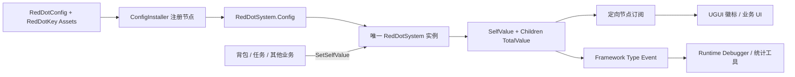
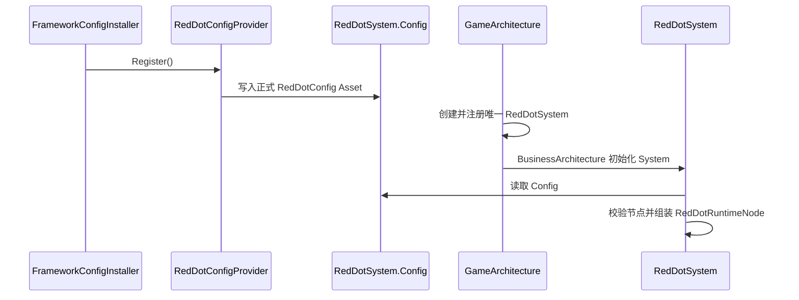
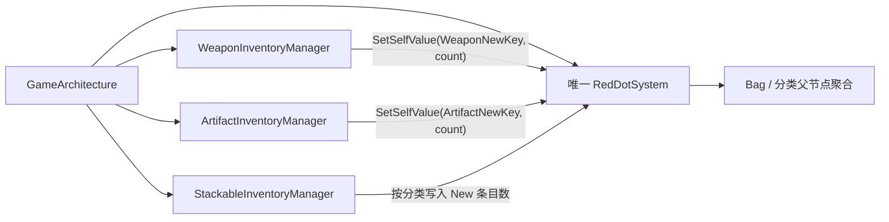

# RedDotSystem 架构与使用说明

> 文档状态：红点核心、Bag 五类 New 节点、Editor 节点设置页、Runtime Debugger 和临时 UGUI 徽标已经落地。
> 运行时命名空间：`RPG.RedDotSystemNS`；Editor 命名空间：`RPG.RedDotSystemNS.Editor`。
> 当前实现不新增 `HotDotSystem`，项目内只有一个 `RedDotSystem` 实例和一棵正式 `RedDotConfig` 树。

本文说明当前代码已经提供的红点能力、配置方式、业务接入边界和排查方法。任务、邮件、技能等其他业务可以复用同一个系统，但尚未因为本文档而自动获得业务节点或数据源。

## 1. 设计边界

红点系统只负责把业务写入的非负整数组织成一棵可聚合的树，并把最终值变化通知给 UI 或调试工具。它不负责推断业务规则，也不直接订阅背包、任务、邮件或技能事件。

当前边界如下：

- 节点结构属于静态配置，节点身份是独立 `RedDotKey` Asset 的引用/GUID。
- 运行时数值属于 `RedDotSystem` 实例，不写回节点 Asset，不进入存档。
- 业务系统直接调用 `SetSelfValue`；如果业务需要从事件计算数量，应由业务适配器订阅事件后再调用该 API。
- 父节点可以拥有自己的 `SelfValue`，同时继续聚合直接子节点。
- UI 只订阅需要的具体节点，不扫描或轮询整棵树。
- 全局观察者使用 WSFrame BusinessArchitecture 的 Type Event，不建立第二个全局红点 EventBus。
- Edit Mode 不创建、不访问 `GameArchitecture.Interface`，Runtime Debugger 只能在 Play Mode 工作。



## 2. 代码与资源位置

### 2.1 Runtime

```text
Assets/Scripts/RedDotSystem/Runtime/
├─ Core/
│  ├─ RedDotKey.cs
│  ├─ RedDotContracts.cs
│  └─ RedDotSystem.cs
├─ Config/
│  ├─ RedDotConfig.cs
│  ├─ RedDotConfigProvider.cs
│  └─ Assets/
│     ├─ RedDotConfig.asset
│     ├─ RedDotConfigProvider.asset
│     └─ Nodes/                 # 每个节点一个独立 Asset
└─ UI/
   └─ RedDotUGUIBadge.cs
```

Bag 业务的叶节点映射位于：

```text
Assets/Scripts/ItemSystem/Runtime/Config/
├─ BagRedDotConfig.cs
└─ Assets/
   └─ BagRedDotConfig.asset

Assets/Scripts/RedDotSystem/Runtime/Config/
├─ RedDotBusinessConfig.cs
├─ RedDotBusinessConfigProvider.cs
└─ Assets/
   └─ RedDotBusinessConfigProvider.asset
```

### 2.2 Editor

```text
Assets/Scripts/RedDotSystem/Editor/
├─ RedDotEditorWindow.cs
├─ RedDotEditorWindow.uxml
├─ RedDotEditorWindow.uss
├─ NodeSettings/
│  ├─ RedDotNodeSettingsView.cs
│  ├─ RedDotNodeSettingsController.cs
│  ├─ RedDotNodeSettingsViewData.cs
│  └─ RedDotConfigOwnershipFinder.cs
├─ Debugger/
│  ├─ RedDotDebuggerView.cs
│  ├─ RedDotDebuggerController.cs
│  └─ RedDotDebuggerNodeViewData.cs
└─ Settings/
   └─ RedDotEditorSettings.cs
```

Editor 菜单入口是：

```text
Tools/RPG/Red Dot Editor
```

窗口包含 `节点设置` 和 `Runtime Debugger` 两个页签。菜单入口为 `Tools/RPG/Red Dot Editor`，由 `RedDotEditorWindow.Open()` 提供，不影响运行时 Asset 或 GUID。

节点设置页的项目级新建目录偏好保存在 `ProjectSettings/RedDotEditorSettings.asset`。默认目录是
`Assets/Scripts/RedDotSystem/Runtime/Config/Assets/Nodes`；路径必须是以 `Assets/` 开头的项目相对路径，编辑器会统一规范化为 `/`，目录不存在时需要先使用“创建目录”。该设置只影响新节点 Asset 的保存位置，不参与运行时配置和节点身份。

## 3. 静态配置模型

### 3.1 RedDotKey：一个节点一个 Asset

`RedDotKey` 是 `ScriptableObject`，不是字符串值类型。每个节点都拥有独立的 `.asset` 文件，业务引用保存的是 Asset 引用，因此节点改名、移动或 Asset 文件重命名不会改变业务身份。

它只序列化三个字段：

```csharp
string SegmentName;
RedDotKey Parent;
int SiblingOrder;
```

语义：

- `Parent == null` 表示根节点。
- `SegmentName` 只表示当前层级名称，不能包含 `/` 或 `\\`。
- `SiblingOrder` 只影响同级显示和稳定计算顺序。
- `DerivedPath` 由 Parent 链推导，例如 `Bag/Weapon/New`；它是展示、搜索和诊断信息，不是运行时身份。
- Children 不序列化，由 Config 中所有节点的 Parent 引用反向组装。

节点约束在 Runtime 初始化和 Editor 操作中都必须满足：

- 节点名称不能为空、不能是纯空白，也不能包含路径分隔符。
- 根节点之间不能重名。
- 同一 Parent 下不能有相同 `SegmentName`。
- Parent 不能形成循环。
- Parent 必须属于同一套 `RedDotConfig`。
- 同一个 `RedDotKey` 只能被一套 Config 拥有。

### 3.2 RedDotConfig：节点清单，不保存运行时状态

`RedDotConfig` 只保存该红点树拥有的 `RedDotKey` 引用列表：

```csharp
IReadOnlyList<RedDotKey> NodeKeys { get; }
bool Contains(RedDotKey key);
```

它不保存：

- Children 列表；
- `SelfValue`、`TotalValue` 或 Dirty 状态；
- Debug Override；
- 背包、任务或其他业务数据；
- 存档快照。

这样可以保证 Editor 修改 Asset 后，下一次 Play Mode 由运行时重新组装，而不会把上一次运行的数值带入配置。

### 3.3 ConfigInstaller 注入链路

`RedDotConfigProvider` 继承 WSFrame 的 `ConfigRegisterNodeBase`。它不创建系统实例，只在 ConfigInstaller 执行 `Register()` 时写入静态入口：

```csharp
RedDotSystem.Config = config;
```

启动顺序必须保持为：



`RedDotSystem.OnInit()` 在 Config 缺失时直接抛出初始化顺序错误，不创建空树，也不等到第一次业务写入时动态补节点。`OnDeinit()` 只清理当前实例的运行时节点、Dirty 集合、临时 Override 和定向事件，不主动清空静态 Config。

`RedDotBusinessConfigProvider` 是所有业务节点映射配置的唯一入口：

- `RedDotBusinessConfig` 是业务配置的共同 ScriptableObject 基类；Bag、Task、Mail 等业务各自拥有独立配置 Asset。
- Provider 序列化一个 `List<RedDotBusinessConfig>`，按具体配置类型建立唯一索引，并通过 `GetConfig<T>()` 提供查询。
- Provider 不创建第二个红点系统、不保存 Count，也不向 UI 提供节点路径。
- 当前列表只包含 `BagRedDotConfig.asset`；以后接入任务或邮件时，只需新增对应配置类型和 Asset 并加入列表。
- Provider 只负责索引和重复类型检查，不承担业务节点语义校验；正式节点树的结构校验仍由 `RedDotSystem.OnInit()` 完成，业务 Manager 使用已配置的节点引用。

`RedDotConfigProvider` 和 `RedDotBusinessConfigProvider` 都应挂在 `FrameworkConfigRootNode` 的 ConfigInstaller 子节点中，并保持业务 Provider 排在节点树 Provider 之后。若任一 Provider 未注册，错误应在架构初始化阶段暴露，而不是由 UI 静默隐藏。

## 4. RedDotSystem 运行时模型

### 4.1 RedDotRuntimeNode 的职责

`RedDotRuntimeNode` 是 `RedDotSystem` 的私有嵌套类型，不是 Asset，也不对业务公开。它把静态 Asset 转换成当前 Play Mode 的可变计算状态：

```text
RedDotKey Asset
├─ SegmentName
├─ Parent
└─ SiblingOrder

RedDotRuntimeNode
├─ Key
├─ Parent / Children
├─ SelfValue
├─ TotalValue
├─ DebugSelfOverrideValue
└─ TreeOrder / Depth
```

使用运行时节点的原因是：

- 静态节点 Asset 不被运行时数值污染；
- Parent/Children 只在初始化时组装；
- Dirty、Override、TotalValue 只属于当前系统实例；
- 退出 Play Mode 后这些状态自然消失；
- 架构重新初始化时可以从同一 Config 重新构建完整树。

### 4.2 数值规则

每个节点都可以拥有业务自身值，包括有 Children 的父节点：

```text
EffectiveSelfValue = HasDebugOverride
    ? DebugSelfOverrideValue
    : SelfValue

TotalValue = EffectiveSelfValue
    + 所有直接子节点的 TotalValue 之和
```

例如：

```text
Bag.SelfValue = 1
Bag/Weapon.SelfValue = 2
Bag/Weapon/New.SelfValue = 3

Bag/Weapon.TotalValue = 2 + 3 = 5
Bag.TotalValue = 1 + 5 = 6
```

`GetSelfValue()` 返回业务写入值，不受 Debug Override 影响；`GetValue()` 返回最近一次 Flush 已提交的 `TotalValue`。因此业务写入后，直到帧末 Flush 或 Debugger 主动 Flush 前，UI 查询到的聚合值仍可能是上一批已提交结果。

### 4.3 Dirty 与 Flush

业务调用 `SetSelfValue()` 或调试调用 `DebugSetSelfOverride()` 后，节点加入 Dirty 集合，并安排一次 UniTask `LastPostLateUpdate` 刷新：

1. 同一帧重复写入同一节点只保留一个 Dirty 项。
2. Flush 收集 Dirty 节点和所有祖先。
3. 按深度从后代到祖先重算，确保子节点结果先于父节点。
4. 所有受影响节点计算完成后，再统一发送变化事件。
5. 只有 `PreviousTotalValue != CurrentTotalValue` 的节点才通知。

Debugger 的“立即 Flush”调用同一套 `FlushDirtyNodes()` 实现，不复制计算规则，也不绕过事件流程。

### 4.4 事件与订阅

红点变化只有一种消息结构：

```csharp
public readonly struct RedDotValueChangedEvent
{
    public RedDotKey Key { get; }
    public int PreviousValue { get; }
    public int CurrentValue { get; }
}
```

对于每个变化节点，通知顺序固定为：

```text
EventCenterModule<RedDotKey> 定向事件
    ↓
this.SendEvent(RedDotValueChangedEvent) 全局 Type Event
```

业务 UI 或徽标订阅具体节点：

```csharp
using RPG.RedDotSystemNS;

IUnRegister unregister = redDotSystem.RegisterValueChanged(
    bagWeaponKey,
    changedEvent => RefreshBadge(changedEvent.CurrentValue));

// 组件/窗口/Controller 生命周期结束时
unregister.UnRegister();
```

需要观察所有节点的 Debugger 或统计工具订阅 Framework Type Event：

```csharp
IUnRegister unregister = EventSystem.Register_Type<RedDotValueChangedEvent>(
    typeof(RedDotValueChangedEvent),
    HandleRedDotValueChanged);
```

同一个消费者不应为了同一刷新目的同时注册定向事件和全局事件，否则一个变化可能被重复处理。红点核心不提供 `RegisterAnyValueChanged`、静态 C# event、全局 EasyEvent 或新的 Red Dot EventBus。

## 5. 运行时公开 API

| API | 用途 | 约束 |
|---|---|---|
| `SetSelfValue(RedDotKey key, int value)` | 写入业务自身值 | 允许任意已注册节点；值不能小于零；自动 Mark Dirty |
| `GetSelfValue(RedDotKey key)` | 读取业务自身值 | 不应用 Debug Override |
| `GetValue(RedDotKey key)` | 读取最近一次 Flush 的聚合值 | 返回 `TotalValue` |
| `HasNode(RedDotKey key)` | 判断节点是否已由 Config 注册 | 不创建节点 |
| `MarkDirty(RedDotKey key)` | 强制重算节点及祖先 | 只接受已注册节点 |
| `RegisterValueChanged(...)` | 订阅单个节点变化 | 返回 `IUnRegister` |

未注册节点不会被动态创建。空节点引用、负值或配置错误应尽早抛出异常，调用方不能把错误静默转换成零。

不提供 `SetCount` 别名。Bag 业务也统一使用 `SetSelfValue`，避免在通用核心中引入业务专用命名。

## 6. Bag 红点接入

### 6.1 当前树结构

正式配置包含 11 个独立节点 Asset：

```text
Bag
├─ Weapon
│  └─ New
├─ Artifact
│  └─ New
├─ DevelopmentExperienceItem
│  └─ New
├─ Food
│  └─ New
└─ DevelopmentItem
   └─ New
```

`BagRedDotConfig` 继承 `RedDotBusinessConfig`，只保存五个供背包 Manager 写入的叶节点引用：

| 业务分类 | 写入节点 | 计数语义 |
|---|---|---|
| Weapon | `Bag/Weapon/New` | New Definition 的数量 |
| Artifact | `Bag/Artifact/New` | New Definition 的数量 |
| DevelopmentExperienceItem | `Bag/DevelopmentExperienceItem/New` | `IsNew == true` 的条目数量 |
| Food | `Bag/Food/New` | `IsNew == true` 的条目数量 |
| DevelopmentItem | `Bag/DevelopmentItem/New` | `IsNew == true` 的条目数量 |

父节点 `Bag` 和五个分类节点不由 Manager 直接写入，保持自身值为零，由 `RedDotSystem` 自动聚合。未来同一分类增加其他红点原因时，可以继续挂到分类父节点下而不改变分类 UI 的订阅目标。

`BagRedDotConfig` 只服务于业务 Manager，不是 UI 配置。UI 不读取业务 Provider，也不从业务配置推导节点；需要显示哪个节点由 Prefab 上的 `RedDotUGUIBadge.key` 直接引用对应的 `RedDotKey` Asset 决定。

### 6.2 Manager 写入边界

`GameArchitecture` 通过构造函数把同一个 `RedDotSystem` 和对应 `RedDotKey` 注入 Manager：



Weapon 和 Artifact：

- 添加单件或批量实例成功后刷新 New Definition 数量；
- 移除实例后，如果某 Definition 不再拥有实例则减少 New 数量；
- `AcknowledgeNew` 后刷新数量；
- `RestoreState` 后刷新数量；
- 等级、经验、锁定、精炼和装备者变化不修改 Definition New Count。

Stackable：

- `AddItem` / `AddItems` 成功提交后，按受影响分类各刷新一次；
- `ConsumeItem` / `ConsumeItems` 成功提交后，按受影响分类各刷新一次；
- `AcknowledgeNew` 后刷新对应分类；
- `RestoreState` 后一次刷新三个可堆叠分类；
- 计数是 New 条目数量，不是 `Quantity` 总和；
- 批量业务状态全部写入后才写红点，并在原有库存事件之前发布完成后的状态。

四个状态 Manager 通过 `GameArchitecture.Interface.GetManager<T>()` 获取，已不再依赖旧的 `.Instance` 访问方式。`ItemManager` 仍是 Definition 数据库，不属于本红点接入迁移范围。

## 7. UGUI 徽标

### 7.1 RedDotUGUIBadge

`RedDotUGUIBadge` 是可以直接挂在 UGUI Prefab 上的通用红点组件。它的序列化引用必须显式配置，业务配置 Provider 不参与 UI 绑定：

```text
RedDotUGUIBadge
├─ RedDotKey key
├─ GameObject visualRoot
├─ bool showValue
└─ TMP_Text valueText (可选)
```

生命周期：

1. `OnEnable()` 校验引用。
2. 通过 `GameArchitecture.Interface.GetSystem<RedDotSystem>()` 获取唯一系统。
3. 调用 `RegisterValueChanged(key, handler)`。
4. 调用 `GetValue(key)` 立即绘制当前值。
5. `OnDisable()` 释放 `IUnRegister`。

显示规则：

```text
value <= 0  → 隐藏 VisualRoot
value > 0   → 显示红点图标
showValue == false 或 valueText == null
            → 只显示图标，不显示数字
showValue == true 且 valueText != null
1..99       → 显示实际数字
value > 99  → 显示 99+
```

当前正式 UI 使用 `Assets/Res/UsedRes/UI/UI_Img_Red.png` 作为 Background Sprite，默认 `showValue = false`，因此只显示图标。红点系统内部仍保存并聚合整数；不显示数字只是 UI 的表现策略，不会改变 `SelfValue`、`TotalValue`、Dirty、Flush 或事件。

徽标只订阅定向节点事件，不再同时订阅 Framework 全局事件。`visualRoot` 必须是徽标宿主之外的子节点，这样隐藏徽标时不会把负责订阅的组件一起禁用。Background Image 和可选文字均关闭 Raycast，不能阻挡按钮点击。

### 7.2 当前 Bag/HUD 绑定方式

`Assets/Prefabs/UI/ItemUI/RedDotBadge.prefab` 是共享的徽标视觉模板，但徽标实例直接放置在宿主 Prefab 中并手动覆盖 `key`：

| UI 位置 | 直接绑定的 `RedDotKey` Asset |
|---|---|
| HUD Bag 按钮 | `Bag.asset` |
| Weapon 页签 | `Bag_Weapon.asset` |
| Artifact 页签 | `Bag_Artifact.asset` |
| DevelopmentExperienceItem 页签 | `Bag_DevelopmentExperienceItem.asset` |
| Food 页签 | `Bag_Food.asset` |
| DevelopmentItem 页签 | `Bag_DevelopmentItem.asset` |

徽标作为按钮的直接或视觉子节点存在，不由 `HUDWindowController`、`BagWindowController` 或任何业务配置在运行时创建/销毁。分类按钮观察分类父节点，而不是直接观察 `New` 叶节点，方便以后增加其他红点原因后继续自动聚合。宿主启用时组件读取当前聚合值并订阅，宿主禁用时释放句柄；Controller 不持有 Badge 状态。

## 8. Red Dot Editor

### 8.1 节点设置页

节点设置页在 Edit Mode 可用，不访问 `GameArchitecture.Interface`。它编辑的是静态 Asset：

- 手动选择或新建 `RedDotConfig`；
- 选择新建节点 Asset 的项目相对目录；
- 创建目录、创建根节点、创建子节点；
- 修改 `SegmentName`；
- 通过 Parent ObjectField、TreeView 拖拽或工具栏上移/下移调整 Parent 和 `SiblingOrder`；
- 右侧输入目标父节点路径，例如输入 `Bag/Weapon`，当前节点成为该路径节点的最后一个直接 Child；
- 路径非法、路径不存在、自身、后代或同级重名时拒绝修改，错误 HelpBox 显示约 3 秒后自动隐藏；
- 普通删除只允许没有 Children 的节点；
- 删除整个子树会把目标及后代从 Config 移除，并按后代到祖先顺序移入系统回收站。

节点拖拽只修改被拖节点自己的 Parent；后代仍然引用原 Parent，不逐个改写。迁移、Parent 字段和排序共用 Controller 的校验与 Undo 事务。当前删除流程不扫描外部业务引用，也不弹确认框；业务中的 Missing 引用由业务自行发现和修复。

### 8.2 Runtime Debugger 页

Runtime Debugger 只在 Play Mode 连接系统：

- `EnteredPlayMode` 后通过 `GameArchitecture.Interface.GetSystem<RedDotSystem>()` 取得系统；
- 连接前释放旧订阅，避免重复注册；
- 订阅 `RedDotValueChangedEvent` 全局 Type Event；
- 收到事件后读取完整快照并恢复当前 Asset 选中项；
- `ExitingPlayMode`、进入 Edit Mode 或窗口关闭时释放订阅并清空快照；
- Edit Mode 不初始化、不访问 `GameArchitecture`，所有运行时修改按钮禁用。

可用调试操作：

- 立即 Flush；
- 刷新快照；
- 对任意节点设置 `SelfValue` 临时 Override；
- `+1`、`-1`、设为 `0`、设为输入值；
- 清除单个或全部 Override；
- Mark Dirty；
- 复制派生路径；
- Ping `RedDotKey` Asset。

Override 只覆盖当前节点的自身值，仍然参与子节点聚合；退出 Play Mode 后自动消失，不修改业务 SelfValue、节点 Asset、Config 或存档。

## 9. 典型接入示例

### 9.1 业务写入

```csharp
using RPG.RedDotSystemNS;

public sealed class MailManager
{
    private readonly RedDotSystem redDotSystem;
    private readonly RedDotKey unreadMailKey;

    public void RefreshUnreadCount(int unreadCount)
    {
        redDotSystem.SetSelfValue(unreadMailKey, unreadCount);
    }
}
```

业务不应直接修改 `RedDotRuntimeNode`、`RedDotConfig.NodeKeys` 或内部 Dictionary，也不应通过字符串路径临时创建节点。

### 9.2 UI 定向订阅

```csharp
private IUnRegister redDotUnregister;

private void Bind(RedDotSystem redDotSystem, RedDotKey key)
{
    redDotUnregister = redDotSystem.RegisterValueChanged(key, OnRedDotChanged);
    Render(redDotSystem.GetValue(key));
}

private void OnDisable()
{
    redDotUnregister?.UnRegister();
    redDotUnregister = null;
}
```

绑定时应注册定向事件并立即读取当前值，窗口/组件销毁时必须注销。对于 MonoBehaviour，不能通过关闭挂有订阅组件的宿主来隐藏徽标。

## 10. 生命周期与错误排查

| 现象 | 首先检查 |
|---|---|
| `Config 尚未注入` | `RedDotConfigProvider` 是否位于 `FrameworkConfigRootNode`，且 ConfigInstaller 先于 GameArchitecture 执行 |
| `RedDotBusinessConfigProvider` 查询失败 | Provider 是否已在 ConfigInstaller 注册，列表是否包含对应的业务配置类型 |
| `找不到已注册红点节点` | 业务传入的 `RedDotKey` 是否属于正式 `RedDotConfig`，是否引用了错误 Config 的 Asset |
| 写入后 UI 暂时没有变化 | 是否尚未到 `LastPostLateUpdate`，或需要在 Debugger 中点击“立即 Flush”验证 |
| 徽标没有显示 | `key`、`visualRoot` 是否显式绑定；当前值是否为零；组件宿主是否被错误禁用。`valueText` 为空或 `showValue=false` 不会影响图标显隐 |
| Play Mode 重复刷新 | 是否重复绑定 `RegisterValueChanged` 或未在 `OnDisable`/`Dispose` 中释放 `IUnRegister` |
| Editor 修改后运行时仍是旧树 | 保存 Asset 后重新进入 Play Mode，确认 ConfigInstaller 注入的是当前 Config |

退出 Play Mode 时，`RedDotSystem` 清理运行时状态和定向事件；WSFrame 全局 Type EventSystem 不由红点系统清空，订阅方必须自行释放句柄。

## 11. 当前不包含的能力

以下内容不属于当前已落地的 RedDotSystem：

- `HotDotSystem` 或第二个 Bag 专用红点系统；
- `SetCount` 业务别名；
- 自动扫描背包/任务数据并推断红点数量；
- 红点数值单独存档；
- 任务、邮件、技能的正式业务叶节点和适配器；
- Editor 对外部业务引用的扫描和修复；
- Edit Mode 运行时调试；
- 修改 `Architecture<T>`、`BusinessArchitecture` 或 `GameArchitectureStartup` 的公开 API。

如果未来接入任务红点，应由任务 Manager 或任务适配器根据 `UnreadTaskIds` 计算数量，再调用同一个 `RedDotSystem.SetSelfValue`；不要把任务规则放进红点核心。

## 12. 相关文档

- [任务、红点系统与存档系统架构说明](../TaskSystem/TaskRedDotSaveSystem_Architecture.md)
- [TaskSystem 需求说明](../TaskSystem/TaskSystem_Requirements.md)
