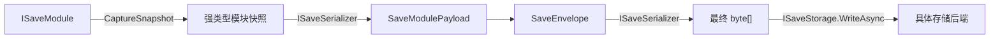

# 存档系统数据模型与接口契约实施计划

> 文档状态：待实施  
> 实施阶段：存档系统第一阶段  
> 目标命名空间：`RPG.SaveSystem`

## 1. 目标与范围

本阶段只建立通用存档系统的数据模型与接口契约，为后续本地文件存储、序列化、保存编排、版本迁移和业务模块接入提供稳定边界。

本阶段包含：

- 槽位 ID 与模块 ID 值类型。
- 槽位最小摘要、模块载荷与总存档容器。
- 结构化成功/失败结果。
- 可替换的存储与序列化接口。
- 非泛型模块运行时契约与泛型模块基类。
- 非泛型迁移运行时契约与泛型迁移基类。
- 模块缺失策略和显式恢复依赖。

本阶段不包含：

- 本地文件、云存储、数据库等具体 `ISaveStorage` 实现。
- Newtonsoft.Json 或其他 `ISaveSerializer` 实现。
- 保存请求队列、后台线程编排和自动保存触发器。
- 迁移注册表、迁移链查找和迁移执行器。
- 快照恢复拓扑排序执行器。
- 完整性校验、加密、混淆或备份文件。
- 任务、背包、玩家等具体业务快照。
- BusinessArchitecture 注册、UI、ViewModel 和 Odin 测试器。

## 2. 总体数据流

每个业务模块负责产生自己的强类型快照，存档编排器通过非泛型接口统一收集。模块快照先独立序列化为字节载荷，再装入总存档容器；总存档容器最后被序列化为交给存储后端的字节数据。



加载方向与保存方向相反：


## 3. 数据模型

### 3.1 `SaveSlotId`

`SaveSlotId` 是槽位的不可变内部标识，不使用角色名或文件名作为身份。

职责：

- 使用 `readonly struct` 并实现 `IEquatable<SaveSlotId>`。
- 内部保存规范化 GUID 字符串。
- 提供创建新 ID、严格解析、`TryParse`、`ToString`、相等与比较运算。
- 使用 `StringComparison.Ordinal` 比较规范化值。
- 默认值表示无效 ID；公开入口不得把默认值当作真实槽位。

### 3.2 `SaveModuleId`

`SaveModuleId` 是业务模块在存档中的长期稳定标识，例如：

```text
player
inventory
task
```

职责：

- 使用 `readonly struct` 并实现 `IEquatable<SaveModuleId>`。
- 拒绝 `null`、空白值和非法标识格式。
- 使用区分大小写的 Ordinal 比较，不在运行时静默改变调用方提供的 ID。
- 模块改名属于存档兼容性变化，必须通过迁移明确处理。

### 3.3 `SaveSlotSummary`

第一版只保留选档与诊断所需的最小摘要：

```text
SaveSlotSummary
├─ SlotId
├─ CharacterName
├─ SavedAtUtcUnixMilliseconds
└─ FormatVersion
```

约束：

- 保存时间使用 UTC Unix 毫秒 `long`，显示层负责转换为本地时间。
- `FormatVersion` 是总存档容器版本，必须为正整数。
- 第一版不加入游玩时间、场景、章节、任务完成数或无类型扩展字典。

### 3.4 `SaveModulePayload`

`SaveModulePayload` 保存一个业务模块已经序列化后的内容：

```text
SaveModulePayload
├─ ModuleId
├─ Version
└─ Payload: byte[]
```

约束：

- `Version` 是模块独立版本，必须为正整数。
- `Payload` 不携带 JSON、Newtonsoft 或具体存储介质语义。
- 空载荷、无效模块 ID 和非正版本均属于无效存档数据。

### 3.5 `SaveEnvelope`

`SaveEnvelope` 是一次完整角色存档的根数据：

```text
SaveEnvelope
├─ Summary: SaveSlotSummary
└─ Modules: List<SaveModulePayload>
```

模块集合规则：

- 使用 `List<SaveModulePayload>`，不使用固定字段或自定义 Key 的 Dictionary。
- 构建时按 `ModuleId` 升序排列，使序列化结果稳定。
- 加载时必须检查 `ModuleId` 唯一性，再建立临时查询字典。
- `SaveEnvelope` 是纯数据，不负责排序、校验、序列化、迁移或恢复。

## 4. 结果与失败语义

### 4.1 `SaveErrorCode`

第一版错误码至少覆盖：

- `None`
- `InvalidSlotId`
- `SlotNotFound`
- `UnsupportedFormatVersion`
- `SerializationFailed`
- `DeserializationFailed`
- `StorageReadFailed`
- `StorageWriteFailed`
- `StorageDeleteFailed`
- `DuplicateModule`
- `MissingModule`
- `UnsupportedModuleVersion`
- `MissingMigration`
- `InvalidSnapshot`
- `RestoreFailed`
- `Unknown`

错误码用于 UI、日志与调用方稳定分支，不依赖异常消息文本做业务判断。

### 4.2 `SaveResult` 与 `SaveResult<T>`

结果类型提供：

- `IsSuccess`
- `ErrorCode`
- 诊断消息。
- 可选原始异常，仅供日志和诊断。
- 泛型成功值。
- 集中的成功与失败工厂方法。

规则：

- 槽位不存在、读取失败、反序列化失败等预期边界失败返回结构化 Result。
- 重复模块注册、泛型快照类型不匹配等内部契约破坏直接抛出异常。
- `CancellationToken` 取消继续传播 `OperationCanceledException`，不转换为普通失败 Result。
- 不使用 `bool + out string error` 传递失败。

## 5. 存储与序列化契约

### 5.1 `ISaveStorage`

`ISaveStorage` 使用 `UniTask` 与 `CancellationToken`，只处理槽位和最终字节，不理解 `SaveEnvelope` 或业务模块。

公开操作：

```text
ListSlotIdsAsync
ReadAsync
WriteAsync
DeleteAsync
```

契约：

- `ListSlotIdsAsync` 返回存储后端可识别的全部槽位 ID。
- `ReadAsync` 返回指定槽位的最终字节。
- `WriteAsync` 同时承担新建与覆盖，并保证原子提交语义。
- 写入失败时，调用方可以依赖旧的已提交存档不被部分覆盖。
- 本地文件实现可在内部使用临时文件替换；数据库和云端可使用各自事务机制。
- 接口不暴露 `tmp`、文件路径、文件扩展名或提交步骤。

### 5.2 `ISaveSerializer`

`ISaveSerializer` 负责对象与字节数据之间的转换：

```text
Serialize(object value, Type type) -> SaveResult<byte[]>
Deserialize(byte[] payload, Type type) -> SaveResult<object>
```

同时提供泛型扩展方法，供类型已知的调用方使用：

```text
Serialize<T>(T value)
Deserialize<T>(byte[] payload)
```

约束：

- 接口不暴露 `JObject`、JSON 字符串或第三方序列化设置。
- 具体实现负责把序列化异常转换为对应结构化 Result。
- 反序列化结果类型不匹配时返回 `DeserializationFailed`。

## 6. 模块快照契约

### 6.1 `ISaveModuleSnapshot`

`ISaveModuleSnapshot` 是业务快照 DTO 的标记接口。快照必须是可独立序列化的纯数据，不能持有：

- `UnityEngine.Object`
- Manager、System、ViewModel 或 Service 实例。
- 委托、事件订阅或运行时句柄。
- ScriptableObject 配置对象引用。

### 6.2 `ISaveModule`

非泛型接口用于让编排器保存不同快照类型的模块集合。

公开契约：

```text
ISaveModule
├─ ModuleId
├─ CurrentVersion
├─ CurrentSnapshotType
├─ MissingModulePolicy
├─ RestoreDependencies
├─ CaptureSnapshot()
├─ CreateDefaultSnapshot()
├─ ValidateSnapshot(snapshot)
└─ RestoreSnapshot(snapshot)
```

职责：

- `CaptureSnapshot` 在主线程采集当前模块的不可变快照。
- `ValidateSnapshot` 只校验，不修改模块状态。
- `RestoreSnapshot` 仅接收已经完成反序列化、迁移和校验的当前版本快照。
- `RestoreDependencies` 使用明确 `SaveModuleId` 声明，不依赖注册顺序或整数优先级。
- 后续执行器根据依赖拓扑排序，并检测缺失依赖和循环。

### 6.3 `SaveMissingModulePolicy`

模块缺失策略包含：

- `CreateDefault`：旧存档缺少该模块时调用 `CreateDefaultSnapshot`。
- `Required`：缺少该模块时拒绝加载并返回 `MissingModule`。

禁止把 `null` 快照传给业务模块并让其自行猜测含义。

### 6.4 `SaveModule<TSnapshot>`

泛型抽象基类负责把统一运行时接口安全转发到强类型业务实现：

```text
ISaveModule.CaptureSnapshot
→ CaptureTypedSnapshot

ISaveModule.ValidateSnapshot
→ 类型检查
→ ValidateTypedSnapshot

ISaveModule.RestoreSnapshot
→ 类型检查
→ RestoreTypedSnapshot
```

约束：

- `TSnapshot` 必须实现 `ISaveModuleSnapshot`。
- 错误快照类型属于内部契约破坏，立即抛出明确异常。
- `Required` 模块调用默认快照入口时应立即暴露错误。
- 具体业务模块不需要使用 `object` 或重复编写类型转换代码。

## 7. 版本迁移契约

### 7.1 `ISaveMigration`

非泛型迁移接口用于未来迁移执行器管理异构迁移集合：

```text
ISaveMigration
├─ ModuleId
├─ FromVersion
├─ ToVersion
├─ SourceSnapshotType
├─ TargetSnapshotType
└─ Migrate(sourceSnapshot)
```

规则：

- 一次迁移只负责同一模块的相邻版本，例如 `v1 -> v2`。
- `ToVersion` 必须等于 `FromVersion + 1`。
- 迁移输入和输出都是纯快照数据，不得修改运行中的业务模块。
- 当前阶段不实现迁移查找、链式执行或注册冲突检查。

### 7.2 `SaveMigration<TSource, TTarget>`

泛型迁移基类负责：

- 暴露源/目标快照类型。
- 在非泛型入口校验实际输入类型。
- 将调用转发到强类型 `MigrateTyped`。
- 拒绝 `null`、错误类型和非法版本区间。

## 8. 代码组织与预计文件

本阶段不修改现有文件，预计新增：

```text
Assets/Scripts/SaveSystem/
├─ SaveSystemDataContracts_Plan.md
└─ Runtime/
   ├─ Data/
   │  ├─ SaveIdentifiers.cs
   │  ├─ SaveDataModels.cs
   │  └─ SaveResults.cs
   ├─ Contracts/
   │  ├─ ISaveStorage.cs
   │  └─ ISaveSerializer.cs
   ├─ Modules/
   │  └─ SaveModuleContracts.cs
   └─ Migration/
      └─ SaveMigrationContracts.cs
```

第一阶段不新增 asmdef，沿用项目当前业务脚本的 `Assembly-CSharp` 边界。

## 9. 编码规范

- 所有新增类、结构体、接口和枚举添加中文 XML 文档注释。
- 所有方法与构造函数添加 XML 文档注释，并按需包含参数、返回值、类型参数和异常说明。
- 关键类型检查、原子写入契约、恢复副作用和异步/线程约束添加中文 `//` 注释。
- 多职责文件按“值类型”“数据模型”“错误结果”“接口”“泛型适配基类”等职责使用成对 Region。
- XML 注释紧邻声明或位于特性列表之前。
- 不增加宽泛 `try/catch`、静默 fallback 或 `out string error`。

## 10. 验收标准

### 10.1 数据契约

- `SaveSlotId` 能创建、解析和稳定比较规范 GUID。
- `SaveModuleId` 能稳定比较并拒绝非法值。
- `SaveEnvelope` 可表达最小槽位摘要和多个格式无关模块载荷。
- 模块载荷不依赖 JSON、Newtonsoft、文件系统或 UnityEngine。

### 10.2 接口契约

- `ISaveStorage` 使用 `UniTask + CancellationToken`，并明确原子写入保证。
- `ISaveSerializer` 同时支持运行时 Type 与泛型调用。
- 异构模块可统一存入 `IReadOnlyList<ISaveModule>`。
- 具体模块可通过 `SaveModule<TSnapshot>` 全程使用强类型快照。
- 模块可以声明缺失策略和显式恢复依赖。
- 迁移接口可表达连续的强类型单步迁移。

### 10.3 完成检查

- 编译检查全部新增类型和泛型约束。
- 检查所有新增类型、方法和构造函数均有 XML 文档注释。
- 检查 Region 正确配对，且注释没有与实现行为冲突。
- 核对实际 Git 变更只包含本阶段新增文件，不覆盖工作树中的其他用户改动。

## 11. 后续阶段

完成本数据契约层后，再分别规划：

1. Newtonsoft 默认序列化器。
2. 本地文件原子存储实现。
3. 保存编排、请求合并与后台写盘。
4. 模块注册、恢复依赖拓扑和迁移执行器。
5. 任务系统、玩家系统和背包系统快照。
6. Odin Button 手动集成测试。
