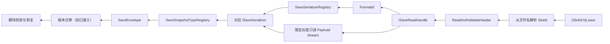

# SaveSystem 存档系统使用文档

> 文档状态：当前实现
>
> 适用范围：JSON Payload + `.save` 单文件容器 + 本地文件存储
>
> 目标命名空间：`RPG.SaveSystem`

本文档描述当前存档系统的使用方式、核心数据流和扩展边界。当前版本已经可以完成：

- 使用强类型模块快照构建 `SaveEnvelope`。
- 使用 Newtonsoft JSON 生成可读 UTF-8 Payload。
- 使用自描述 `.save` 容器保存到本地正式目录。
- 通过 `SaveManager` 统一编排保存、加载、列举和删除。
- 通过 `ISaveStorage` 读取、列举和删除槽位。
- 通过 `SaveSerializerRegistry` 和 `SaveSnapshotTypeRegistry` 恢复完整 Envelope。
- 通过 Odin 测试器执行基础往返测试。
- 通过编辑器 JSON 查看器直接查看 `.save` 中的 JSON Payload。

XML、MemoryPack、云端存储、数据库存储和保存请求队列尚未提供具体实现，但都可以沿用本文档第三节的扩展边界。

## 1. 使用方法

### 1.1 正式目录和文件名

本地正式目录为：

```text
Application.persistentDataPath/Saves
```

目录名由 `SaveStorageDefaults.LocalDirectoryName` [SaveStorageDefaults](./Runtime/Storage/SaveStorageDefaults.cs) 统一提供。每个槽位使用一个文件：

```text
{SaveSlotId:N}.save
```

`.save` 不是纯 JSON 文件，而是：

```text
[固定容器头][JSON Payload]
```

因此不能直接把整个 `.save` 当作 JSON 打开；需要先经过 `ISaveStorage.OpenReadAsync` 校验并取得限定长度的 Payload Stream。

### 1.2 定义模块快照

模块快照只保存纯数据，不持有 Unity 对象、文件句柄、管理器引用或其他运行时服务：

```csharp
[Serializable]
public sealed class PlayerSnapshot : ISaveModuleSnapshot
{
    public int Level { get; set; }
    public List<string> UnlockedIds { get; set; } = new List<string>();
}
```

为模块分配长期稳定的 `ModuleId` 和正整数版本：

```csharp
SaveModuleId playerModuleId = new SaveModuleId("player");
const int playerSnapshotVersion = 1;
```

模块 ID 一旦写入正式存档，不应因为类名、命名空间或程序集重构而改变。

### 1.3 组装并使用 `SaveManager`

业务层不直接操作 `SaveEnvelope`、Payload Stream 或容器头。项目级 `GameArchitecture` 一次性显式组装存储、序列化器和 SaveManager：

```csharp
string saveDirectory = Path.Combine(
    Application.persistentDataPath,
    SaveStorageDefaults.LocalDirectoryName);

var jsonSerializer = new NewtonsoftJsonSaveSerializer();
var storage = new LocalFileSaveStorage(saveDirectory);
var serializerRegistry = new SaveSerializerRegistry(
    new ISaveSerializer[] { jsonSerializer });
var snapshotTypeRegistry = new SaveSnapshotTypeRegistry();

RegisterManager(new SaveManager(
    new SaveManagerOptions(jsonSerializer.FormatId, 1),
    storage,
    serializerRegistry,
    snapshotTypeRegistry));
```

需要其他业务 Manager 的 `ISaveModule` 在同一 Architecture 的 System 中注册：

```csharp
protected override void OnInit()
{
    SaveManager saveManager = this.GetManager<SaveManager>();
    ITaskManager taskManager = this.GetManager<ITaskManager>();
    saveManager.RegisterModule(new TaskSaveModule(taskManager));
}
```

常用业务调用只有四个入口：

```csharp
SaveResult saveResult = await saveManager.SaveAsync(
    new SaveRequest(slotId, "Player"));

SaveResult<SaveLoadResult> loadResult = await saveManager.LoadAsync(slotId);
SaveResult<IReadOnlyList<SaveStorageEntry>> slots =
    await saveManager.ListSlotsAsync();
SaveResult deleteResult = await saveManager.DeleteAsync(slotId);
```

Manager 由 BusinessArchitecture 管理生命周期，自动生成 UTC 保存时间和当前格式版本。业务调用方不传取消令牌；Architecture 注销时取消 Manager 的内部异步操作。保存、加载、列举和删除共享单一操作通道，冲突请求返回 `OperationBusy`。

`OperationCompleted` 只用于刷新 UI、日志或埋点，不能用多个监听器拼接保存流程；业务流程仍以 `SaveResult` 为准。

### 1.3.1 启动层

首个启动场景放置 `GameArchitectureStartup`，并与 `WSFrameRoot` 同时存在：

```text
GameArchitectureStartup.Awake
    -> GameArchitecture.InitArchitecture()
    -> RegisterManager(SaveManager)
    -> Manager.Init
    -> System.Init
```

启动组件执行顺序为 `-900`，`WSFrameRoot` 执行顺序为 `-1000`。业务架构注销时，先注销 System，再注销 Manager，SaveManager 会在 `OnDeinit` 中取消未完成的存档操作。

### 1.4 直接构建 `SaveEnvelope`（底层诊断用）

所有模块快照先装入 `SaveModuleData`，再按 `ModuleId` 排序后组成 `SaveEnvelope`：

```csharp
SaveSlotId slotId = SaveSlotId.CreateNew();
SaveModuleId playerModuleId = new SaveModuleId("player");

var playerSnapshot = new PlayerSnapshot
{
    Level = 10,
    UnlockedIds = new List<string> { "weapon.sword", "skill.dash" }
};

var modules = new List<SaveModuleData>
{
    new SaveModuleData(playerModuleId, 1, playerSnapshot)
};

var envelope = new SaveEnvelope(
    new SaveSlotSummary(
        slotId,
        "Player",
        DateTimeOffset.UtcNow.ToUnixTimeMilliseconds(),
        1),
    modules);
```

`SaveEnvelope` 是数据容器，不负责业务校验、迁移、恢复依赖或排序；这些职责由存档编排层和模块层完成。

### 1.5 保存 JSON 存档（底层实现说明）

下面示例展示完整的 JSON、本地容器和原子文件写入链路：

```csharp
string saveDirectory = Path.Combine(
    Application.persistentDataPath,
    SaveStorageDefaults.LocalDirectoryName);

var serializer = new NewtonsoftJsonSaveSerializer();
var storage = new LocalFileSaveStorage(saveDirectory);

using (var payload = new MemoryStream())
{
    SaveResult serializeResult = await serializer.SerializeAsync(
        envelope,
        payload,
        cancellationToken);

    if (!serializeResult.IsSuccess)
    {
        // 使用 serializeResult.ErrorCode、Message 和 Exception 记录失败。
        return;
    }

    // WriteAsync 从当前 Position 开始读取 Payload，必须回到起始位置。
    payload.Position = 0;
    SaveResult writeResult = await storage.WriteAsync(
        slotId,
        serializer.FormatId,
        payload,
        cancellationToken);
}
```

`LocalFileSaveStorage.WriteAsync` 会在同目录创建临时文件，完整写入并 Flush 后再原子替换正式 `.save`。存储器不会关闭调用方传入的 Payload Stream。

### 1.6 读取并恢复 `SaveEnvelope`（底层实现说明）

读取分为三步：打开并校验容器、按 `FormatId` 选择序列化器、按 `ModuleId + Version` 恢复快照类型：

```csharp
var jsonSerializer = new NewtonsoftJsonSaveSerializer();
var serializerRegistry = new SaveSerializerRegistry(
    new ISaveSerializer[] { jsonSerializer });

var snapshotTypeRegistry = new SaveSnapshotTypeRegistry();
snapshotTypeRegistry.Register<PlayerSnapshot>(
    new SaveModuleId("player"),
    1);

SaveResult<ISaveReadHandle> openResult = await storage.OpenReadAsync(
    slotId,
    cancellationToken);

if (!openResult.IsSuccess)
{
    // 使用 openResult.ErrorCode、Message 和 Exception 处理容器或文件错误。
    return;
}

using (ISaveReadHandle handle = openResult.Value)
{
    SaveResult<ISaveSerializer> serializerResult =
        serializerRegistry.Resolve(handle.FormatId);
    if (!serializerResult.IsSuccess)
    {
        return;
    }

    SaveResult<SaveEnvelope> loadResult =
        await serializerResult.Value.DeserializeAsync(
            handle.Content,
            snapshotTypeRegistry,
            cancellationToken);
}
```

`using` 不能省略。释放 `ISaveReadHandle` 会同时释放底层文件流和限定 Payload Stream；序列化器只读取 Stream，不拥有也不关闭它。

### 1.7 列举槽位和处理损坏条目

```csharp
SaveResult<IReadOnlyList<SaveStorageEntry>> result =
    await storage.ListEntriesAsync(cancellationToken);

if (result.IsSuccess)
{
    foreach (SaveStorageEntry entry in result.Value)
    {
        if (entry.IsAvailable)
        {
            Debug.Log($"{entry.SlotId}: {entry.FormatId}, {entry.PayloadLength} bytes");
        }
        else
        {
            Debug.LogWarning(
                $"损坏槽位 {entry.SlotId}: {entry.ErrorCode}, {entry.Message}");
        }
    }
}
```

目录不存在时返回空列表。单个损坏槽位不会阻止其他可用槽位被列出。

### 1.8 使用 Odin 基础测试器

测试组件位置：

```text
Assets/Scripts/SaveSystem/Test/SaveSystemOdinTester.cs
```

通过 TestCenter 加载 `SaveSystemOdinTester` 后，可使用以下按钮：

- `运行基础往返测试`：写入并读取固定测试槽位，比较摘要、模块和有序 List 字段。
- `列出正式存档`：只读列出正式目录中的可用和损坏槽位。
- `打开正式存档目录`：在系统文件浏览器中打开 `persistentDataPath/Saves`。
- `删除保留测试槽位`：只删除固定测试槽位，不影响其他正式存档。
- `打印测试配置`：输出目录、测试槽位、JSON 格式和测试模块版本。

基础测试使用的保留槽位为：

```text
fffffffffffffffffffffffffffffffe.save
```

### 1.9 使用 JSON 可视化查看器

在 Unity 菜单打开：

```text
SaveSystem/JSON 存档查看器
```

查看器会：

1. 列出正式 `Saves` 目录中的全部可用和损坏槽位。
2. 显示 SlotId、容器版本、FormatId、Payload 长度和错误信息。
3. 只允许读取 `State = Available` 且 `FormatId = "json"` 的槽位。
4. 直接读取限定 Payload Stream，不执行业务快照类型恢复。
5. 严格解码 UTF-8，拒绝 BOM、空 Payload、多个 JSON 根值和非法 JSON。
6. 以只读缩进文本显示 JSON，不创建 `.json` sidecar，也不写回 `.save`。

查看器适合检查实际文件内容；游戏运行时加载仍应使用上一节的 `DeserializeAsync`，因为运行时读取需要恢复强类型快照。

## 2. 核心逻辑

### 2.1 SaveManager 职责边界

`SaveManager` 是唯一面向业务的存档编排入口，负责把已有模块串成完整闭环：


Manager 不拥有业务模块状态，也不创建 Unity 对象；模块只负责快照采集、校验和恢复。启动层负责构造依赖并保存 Manager 引用。

### 2.2 Manager 保存流程

保存时先在调用方线程完成所有模块快照采集，再进入序列化和文件写入阶段。这样后台 I/O 不会访问运行中的 Unity 对象或业务 Manager。

1. 检查生命周期和单操作互斥状态。
2. 按 `ModuleId` 顺序调用 `CaptureSnapshot`。
3. 创建摘要和 `SaveEnvelope`。
4. 解析默认 `FormatId` 对应的序列化器。
5. 序列化到内存流并回到 Payload 起点。
6. 由 Storage 写入临时文件并原子替换正式文件。
7. 返回 `SaveResult` 并发送完成通知。

### 2.3 Manager 加载流程

加载不会调用接取、领奖或进度增加等普通业务 API。所有模块在恢复前完成解析、迁移和校验；未知模块、重复模块、缺失迁移或高版本模块直接拒绝加载。

恢复顺序由 `ISaveModule.RestoreDependencies` 计算拓扑序，同层模块按 `ModuleId` 的 Ordinal 顺序执行。验证阶段失败时不修改当前运行状态；恢复阶段异常返回 `RestoreFailed`。

### 2.4 核心数据模型


| 类型               | 职责             | 关键约束                                           |
| ------------------ | ---------------- | -------------------------------------------------- |
| `SaveSlotId`       | 存档槽位身份     | 非空 GUID，规范化为`N` 格式，使用 Ordinal 比较     |
| `SaveModuleId`     | 业务模块稳定身份 | 小写字母开头，最多 64 个字符，区分大小写           |
| `SaveSlotSummary`  | 选档所需最小摘要 | 槽位、角色名、UTC Unix 毫秒、总存档格式版本        |
| `SaveModuleData`   | 模块版本和快照   | `ModuleId + Version + ISaveModuleSnapshot`         |
| `SaveEnvelope`     | 完整存档根对象   | `Summary + List<SaveModuleData>`                   |
| `SaveStorageEntry` | 列举槽位的元数据 | `Available` 或 `Corrupted`，不反序列化业务 Payload |

快照实际 CLR 类型不能通过 Newtonsoft `$type` 或完整 C# 类型名持久化，而是由 `SaveSnapshotTypeRegistry` 根据 `ModuleId + Version` 显式解析。

### 2.5 保存数据流

```mermaid
flowchart LR
    Module["业务模块"] --> Snapshot["强类型快照"]
    Snapshot --> ModuleData["SaveModuleData"]
    ModuleData --> Envelope["SaveEnvelope"]
    Envelope --> Serializer["NewtonsoftJsonSaveSerializer"]
    Serializer --> Payload["UTF-8 JSON Payload Stream"]
    Payload --> Storage["LocalFileSaveStorage"]
    Storage --> Header["写入固定容器头"]
    Header --> Temp["同目录 .tmp 文件"]
    Temp --> Commit["Flush 后原子替换"]
    Commit --> File["{SlotId:N}.save"]
```



序列化器只负责 Envelope 与 Payload Stream；存储器只负责容器头、文件边界和原子提交。两者通过 `FormatId` 和 Stream 解耦。

### 2.6 读取数据流



容器层在返回 `ISaveReadHandle` 前会校验：

- 8 字节 Magic：`RPGSAVE\0`。
- 容器版本是否受支持。
- 文件名 SlotId 与头部 SlotId 是否一致。
- FormatId UTF-8 长度是否在 1–128 字节内。
- Payload 是否截断或存在尾部垃圾。

长度校验只能发现边界错误，不代表内容完整性校验；当前版本没有校验值、加密或备份文件。

### 2.7 单文件容器布局

```text
{SaveSlotId:N}.save
├─ Magic                  8 字节 ASCII "RPGSAVE\0"
├─ ContainerVersion       UInt16 小端，当前为 1
├─ SlotId                 32 字节 ASCII GUID N 格式
├─ FormatIdByteLength     UInt16 小端
├─ PayloadLength          Int64 小端
├─ FormatId               1–128 字节 UTF-8
└─ Payload                精确 PayloadLength 字节
```

JSON、XML 和 MemoryPack 只替换 Payload 内容，扩展名始终为 `.save`，不能用扩展名判断序列化格式。

### 2.8 JSON 序列化规则

`NewtonsoftJsonSaveSerializer` 当前使用：

- `FormatId = "json"`。
- UTF-8 无 BOM，严格解码。
- camelCase 属性名。
- 缩进格式。
- `CultureInfo.InvariantCulture`。
- `TypeNameHandling.None`，不写入 `$type`。
- `SaveSlotId`、`SaveModuleId` 和 `SaveModuleData` 专用转换器。
- 反序列化时只允许一个根 JSON 值，根值之后只能有空白。

这里有两种不同的“读取 JSON”：

1. 运行时 `DeserializeAsync`：恢复完整 `SaveEnvelope` 和强类型模块快照。
2. 编辑器查看器：只读取和格式化原始 JSON，不要求模块类型已经注册。

### 2.9 Stream 和生命周期规则

- 序列化器从调用方传入 Stream 的当前 `Position` 开始读写。
- 序列化器不会关闭调用方传入的 Stream。
- `ISaveStorage.WriteAsync` 不关闭调用方传入的 Payload Stream。
- `ISaveReadHandle` 拥有 `Content`，释放 Handle 必须同时释放底层 Stream。
- 取消操作传播 `OperationCanceledException`，不把取消伪装成成功或普通失败。
- 本地写入使用 `.tmp` 后原子替换，避免进程中断留下半写正式存档。
- SaveManager 不向业务暴露取消令牌；BusinessArchitecture 注销 Manager 时取消内部操作。
- SaveManager 不关闭外部注入的 Storage、序列化器、模块或迁移对象。

### 2.10 失败处理

常用错误码及处理方向：


| 错误码                                     | 含义                   | 建议处理                      |
| ------------------------------------------ | ---------------------- | ----------------------------- |
| `SlotNotFound`                             | 槽位不存在             | 视为新档或提示用户            |
| `InvalidContainerMagic`                    | 文件不是本容器格式     | 标记损坏，不尝试 JSON 回退    |
| `UnsupportedContainerVersion`              | 容器版本未知           | 等待对应容器迁移或升级程序    |
| `SlotIdMismatch`                           | 文件名与头部身份不一致 | 拒绝加载，避免串档            |
| `InvalidFormatId`                          | 格式标识非法           | 标记损坏                      |
| `PayloadTruncated`                         | Payload 短于声明长度   | 标记损坏                      |
| `TrailingPayloadData`                      | Payload 后有未声明数据 | 标记损坏                      |
| `UnknownSerializerFormat`                  | 没有注册对应序列化器   | 安装/注册格式实现，不默认回退 |
| `DeserializationFailed`                    | Payload 无法解析       | 记录异常和槽位信息            |
| `OperationBusy`                            | Manager 已有操作执行   | 等当前操作完成后重试          |
| `UnknownModule`                            | 存档包含未注册模块     | 更新模块注册或拒绝该存档      |
| `MissingMigration`                         | 缺少相邻版本迁移       | 注册完整迁移链                |
| `MigrationFailed`                          | 迁移执行或结果错误     | 修复迁移实现后重试            |
| `SnapshotCaptureFailed`                    | 模块采集快照失败       | 检查模块运行状态和契约        |
| `StorageReadFailed` / `StorageWriteFailed` | 文件或后端 I/O 失败    | 根据业务决定重试或提示        |

## 3. 扩展方法

### 3.1 增加新的序列化格式

实现 `ISaveSerializer`，保持现有 Envelope、模块快照和存储接口不变：

```csharp
public sealed class XmlSaveSerializer : ISaveSerializer
{
    public string FormatId => "xml";

    public UniTask<SaveResult> SerializeAsync(
        SaveEnvelope envelope,
        Stream destination,
        CancellationToken cancellationToken)
    {
        // 从 destination.Position 写入 XML，不关闭 destination。
    }

    public UniTask<SaveResult<SaveEnvelope>> DeserializeAsync(
        Stream source,
        ISaveSnapshotTypeResolver snapshotTypeResolver,
        CancellationToken cancellationToken)
    {
        // 从 source.Position 读取 XML，不关闭 source。
    }
}
```

应用启动时注册：

```csharp
var serializerRegistry = new SaveSerializerRegistry(
    new ISaveSerializer[]
    {
        new NewtonsoftJsonSaveSerializer(),
        new XmlSaveSerializer()
    });
```

未知 `FormatId` 必须直接返回 `UnknownSerializerFormat`，不能静默使用 JSON。

### 3.2 增加新的存储后端

实现 `ISaveStorage` 时保持以下边界：

- `ListEntriesAsync` 只列出槽位和容器元数据，不解析业务快照。
- `OpenReadAsync` 在返回 Handle 前完成容器头和 Payload 边界校验。
- `ISaveReadHandle.Content` 必须是限定长度的只读 Stream。
- `WriteAsync` 负责容器头和原子提交语义。
- `DeleteAsync` 只删除指定 `SaveSlotId`。
- 存储层不引用 Newtonsoft、XML 节点或业务模块类型。

内存、数据库、云端实现可以改变物理介质，但不能把序列化逻辑塞进存储器；Payload 仍由 `ISaveSerializer` 负责。

### 3.3 增加业务模块和快照版本

新增模块时：

1. 定义实现 `ISaveModuleSnapshot` 的纯数据 DTO。
2. 分配稳定 `SaveModuleId`。
3. 使用 `SaveModule<TSnapshot>` 实现强类型采集、默认快照、校验和恢复。
4. 在 `SaveSnapshotTypeRegistry` 注册 `ModuleId + Version -> SnapshotType`。
5. 将模块数据按 `ModuleId` 稳定排序后放入 `SaveEnvelope.Modules`。

模块缺失策略：

- `SaveMissingModulePolicy.Required`：缺失时拒绝恢复。
- `SaveMissingModulePolicy.CreateDefault`：由模块创建默认快照后继续恢复。

快照不应持有 `MonoBehaviour`、`ScriptableObject`、场景对象、事件订阅或临时缓存。

### 3.4 增加版本迁移

迁移使用相邻版本的一步转换：

```csharp
public sealed class PlayerV1ToV2Migration
    : SaveMigration<PlayerSnapshotV1, PlayerSnapshotV2>
{
    public PlayerV1ToV2Migration()
        : base(new SaveModuleId("player"), 1)
    {
    }

    protected override PlayerSnapshotV2 MigrateTyped(PlayerSnapshotV1 source)
    {
        return new PlayerSnapshotV2
        {
            Level = source.Level,
            Experience = 0
        };
    }
}
```

迁移只处理纯数据，不直接修改运行中模块状态。恢复顺序应为：

```text
反序列化旧快照
→ 按模块版本执行连续迁移
→ 按恢复依赖排序
→ ValidateSnapshot
→ RestoreSnapshot
```

`SaveMigrationRegistry` 在启动时校验迁移是否重复、是否连接相邻版本；`SaveManager` 加载时负责查找完整链并在全部模块恢复前完成迁移。

每次操作开始时由 `SaveModuleRegistry` 冻结当前注册快照，检查重复 ModuleId、缺失依赖、自依赖和循环依赖，并计算采集顺序与恢复拓扑顺序。

新增模块或迁移可由同一 Architecture 的 System 在运行时注册；每次操作开始时会复制注册列表，避免保存/加载过程中集合变化影响当前操作。

### 3.5 扩展 JSON 查看器

当前查看器只显示 `FormatId = "json"`。扩展其他格式时建议增加独立查看器或格式查看接口：

- XML：读取 Payload 后使用 XML 文本查看器。
- MemoryPack：显示容器头和二进制摘要，不把二进制强行当作文本。
- 云端存储：复用同一查看窗口的数据接口，不让窗口直接访问云 SDK。

查看器始终保持只读，不提供修改、保存、删除或覆盖正式存档的入口。

### 3.6 扩展检查清单

新增格式、存储或模块时确认：

- 是否保持稳定 `FormatId`、`ModuleId` 和版本号。
- 是否保持 Stream 当前 Position 和所有权规则。
- 是否正确传播 `CancellationToken`。
- 是否没有引入 `$type` 或完整 CLR 类型名持久化。
- 是否能返回结构化 `SaveErrorCode`。
- 是否不会把业务校验或恢复逻辑放入容器层。
- 是否通过 `SaveManager` 对外提供保存、加载、列举和删除，而不是让业务直接依赖底层模块。
- 是否为新增公共类型、方法和构造函数添加中文 XML 文档。

## 4. 当前文件定位

```text
Assets/Scripts/SaveSystem/
├─ SaveSystemDataContracts_Plan.md       当前使用文档
├─ Runtime/
│  ├─ Data/                              值类型、Envelope、结果类型
│  ├─ Container/                         `.save` 容器协议和编解码
│  ├─ Contracts/                         存储与序列化接口
│  ├─ Modules/                           模块与快照契约
│  ├─ Serialization/                     JSON、注册表、类型解析
│  ├─ Manager/                           统一保存、加载、删除编排
│  ├─ Storage/                           本地文件、Handle、限定 Stream
│  └─ Migration/                         迁移接口、注册表和泛型基类
├─ Test/                                 Odin 手动测试组件
└─ Editor/                               JSON 可视化查看器及 UI 资源

Assets/Scripts/Game/Runtime/Architecture/
├─ GameArchitecture.cs                    项目级 BusinessArchitecture
└─ GameArchitectureStartup.cs             Unity 场景启动与注销入口
```

当前版本的核心验收方式是：运行 Odin 基础往返测试，确认固定测试槽位可写入和恢复；再打开 JSON 查看器，确认 `.save` 的容器头不会混入 JSON、Payload 可读、损坏条目有明确错误码且 Handle 生命周期正确。
