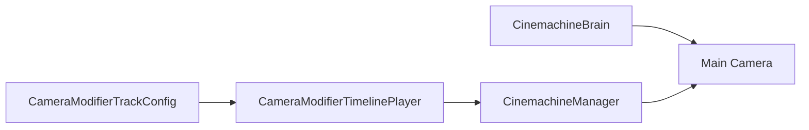

# Camera Modifier System

Camera Modifier V1 只修改 Gameplay Brain 的最终输出，不负责切换镜头。

## 使用方法

1. 在技能时间轴轨道面板右键添加“摄像机修饰轨道”。
2. 使用轨道“+”添加 Modifier Clip，在 Inspector 选择 FOV 或 Shake。
3. FOV 的 Scale 是运行时权威值；Value 仅由工具栏 Gameplay 镜头 Prefab 的参考 FOV 换算。
4. 在场景中的 CameraSystemRoot 挂载 `CinemachineManager`，配置 Gameplay `CinemachineBrain`。
5. 技能执行实例创建 `CameraModifierTimelinePlayer`，逐帧调用 `SampleFrame`，结束时调用 `Dispose`。

后创建的 Player 位于更高层。Exclusive 会屏蔽该通道中更早创建的请求，之后创建的 Additive 仍可叠加。
