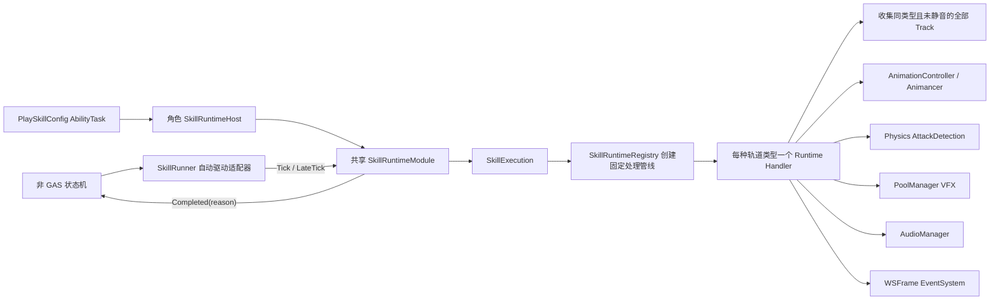
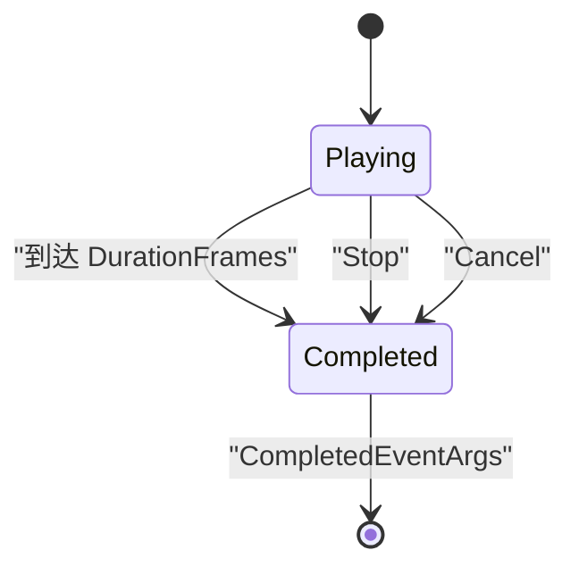
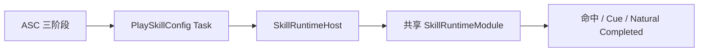

# SkillConfig 运行时播放器

## 依赖与流转



`SkillRuntimeModule`负责技能时间轴状态和单次执行所有权，但不依赖 `MonoBehaviour`或任何全局更新器。调用方必须按 Unity 阶段分别调用 `Tick(deltaTime)`和`LateTick()`；同一个 Module 只能由一个调用方驱动，避免重复推进帧、事件和攻击检测。

`SkillRunner`只是在 `Update/LateUpdate`中转发帧驱动的默认 MonoBehaviour 适配器。是否能释放、是否能打断以及结束后进入哪个状态，均由外部状态机决定。动画 Handler 通过角色 `IAnimationPlayer`在固定语义层播放，并在技能结束时有意不停止该层或恢复 Locomotion。

每次 `SkillExecution`都会创建 ActionPhase、Animation、AttackDetection、VFX、Audio 和 Event 六个独立 Handler。每个 Handler 在初始化时按 `SkillConfig.Tracks`物理顺序收集自己的全部同类型未静音轨道；执行期间 Config 视为不可变，不会动态重新收集。不同技能执行不会共享命中记录、特效实例或音频句柄。

不同轨道类型按固定管线顺序执行，同类型轨道则保持时间轴中的物理顺序。因此上下调整同类型轨道可以改变动画和阶段等优先级，但跨类型排列不会改变运行时系统阶段。

## 初始化与播放

```csharp
SkillActorContext actor = new(
    ownerGameObject,
    ownerGameObject.transform,
    animationController,
    AnimationLayerType.Action,
    markerProvider);

SkillAttackSettings attack = new(
    targetLayerMask,
    QueryTriggerInteraction.Ignore,
    targetFilter);

runner.Initialize(actor, attack);
runner.HitDetected += OnSkillHit;
runner.Completed += OnSkillCompleted;

SkillStartResult result = runner.TryPlay(
    new SkillPlayRequest(skillConfig, currentWeaponRoot, currentWeaponTip));
```

Module 同一时间只允许一个活动执行。装备系统负责选择当前武器，并在每次 Play 时传入刀根和刀尖；SkillConfig 不绑定具体武器。

## 手动驱动接入

GAS 角色通过 `SkillRuntimeHost` 长期持有一个共享 Module，并由当前 Running Task 生命周期驱动：

```csharp
SkillRuntimeHost host = source.GetComponent<SkillRuntimeHost>();
host.TryPlay(skillConfig);

// AbilityTask 的普通更新阶段。
host.Tick(deltaTime);

// AbilityTask 的 Late 更新阶段；最终帧攻击检测和自然结束在这里完成。
host.LateTick();
```

Module 常驻，但每次播放仍创建独立的 `SkillExecution`和六类 Handler。一个角色同一时刻只执行一个 SkillConfig 主动作；AbilityTask 必须使用 Source 上的共享 Host，不为每次激活创建并行 Module。`SkillRunner` 继续服务非 GAS 场景，不能与 Host 驱动同一个 Module。

## 结束语义



- `Natural`：完整处理最后有效帧及其 LateUpdate 检测后结束。
- `Stopped`：停止时间轴，VFX 尾迹和已开始音频允许自然结束。
- `Cancelled`：立即回收本次执行仍持有的 VFX 与音频。
- 三种路径都只发送一次 `Completed`；事件发送前 Module 已清空当前执行，可在回调中启动下一技能。

## 攻击检测

```text
LayerMask → 排除 Owner 层级 → ISkillAttackTargetFilter → Clip 内目标去重 → HitDetected
```

LayerMask 负责 Physics 层粗筛选；`ISkillAttackTargetFilter`负责阵营、死亡、无敌或 GameplayTag 等业务规则。同一目标在一个 AttackDetection Clip 内只发布一次，新 Clip 可以再次命中。

## Odin 手动测试

GAS 集成基准使用现有 30 FPS、35 帧 `SkillConfig.asset`。ASC Tester 验证自然完成、End、Cancel、
立即重播、命中 Effect 与命中点 Execute Cue。占用共享 Host 的主动技能统一配置
`Ability.Action.Skill` 到 `AbilityTags` 与 `CancelTags`；配置第二个 SkillConfig GA 后可执行互相打断测试。

阶段 Handler 会在普通逻辑帧中先发布动作阶段变化，`PlaySkillConfigGameplayAbilityTask` 再将它投影为 Source ASC 的 `State.Action.Skill.Phase.*` 与 `Interruptible/Uninterruptible` 引用计数 Tag。SkillConfig GA 禁止在 `Uninterruptible` 存在时激活，因此拒绝发生在 Cost/Cooldown 提交前；Natural、End、Cancel 和 Clear 都会对称撤销阶段 Tag。



在场景对象上挂载 `SkillRuntimeOdinTester`，配置 Runner、Owner、Origin、Animancer、SkillConfig 和可选武器节点，然后依次使用：

1. `初始化 Runner`
2. `播放技能`
3. `打印运行状态`
4. `Stop 技能`或`Cancel 技能`

测试组件整体由 `#if UNITY_EDITOR`包裹，不进入 Player 构建。
