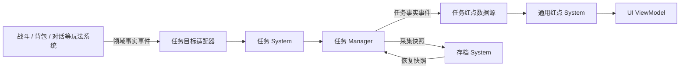
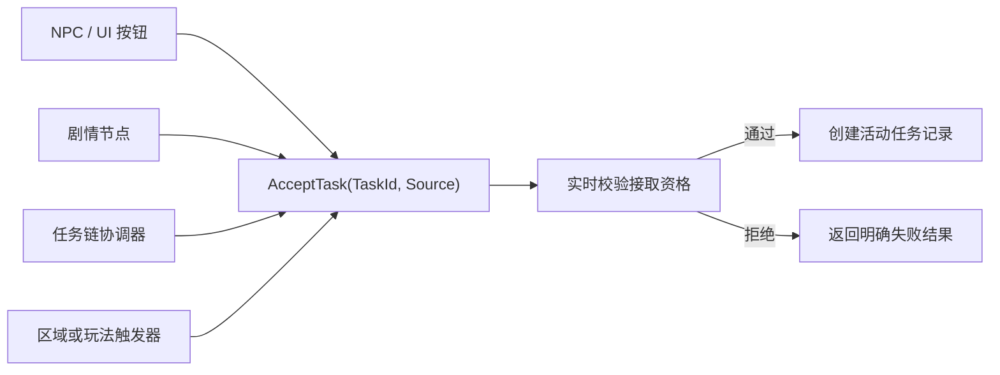
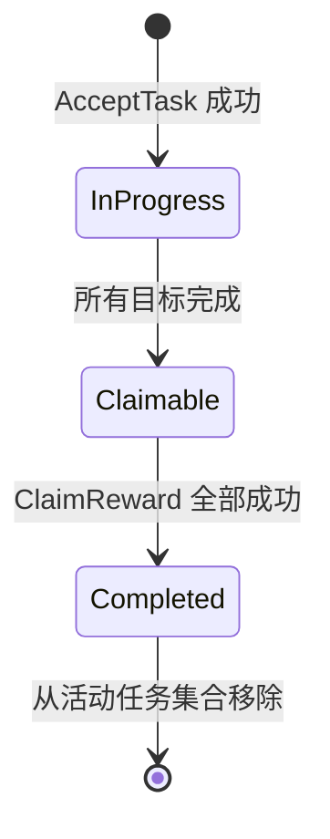
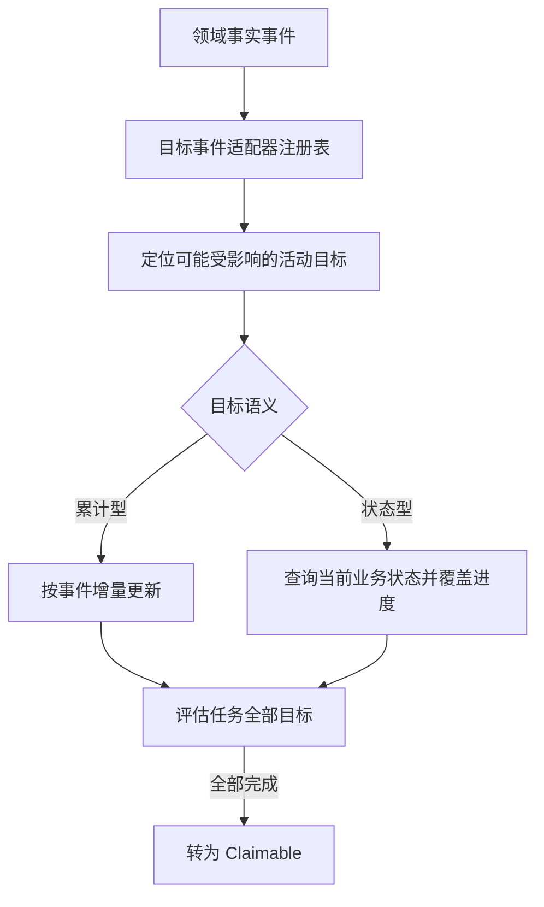
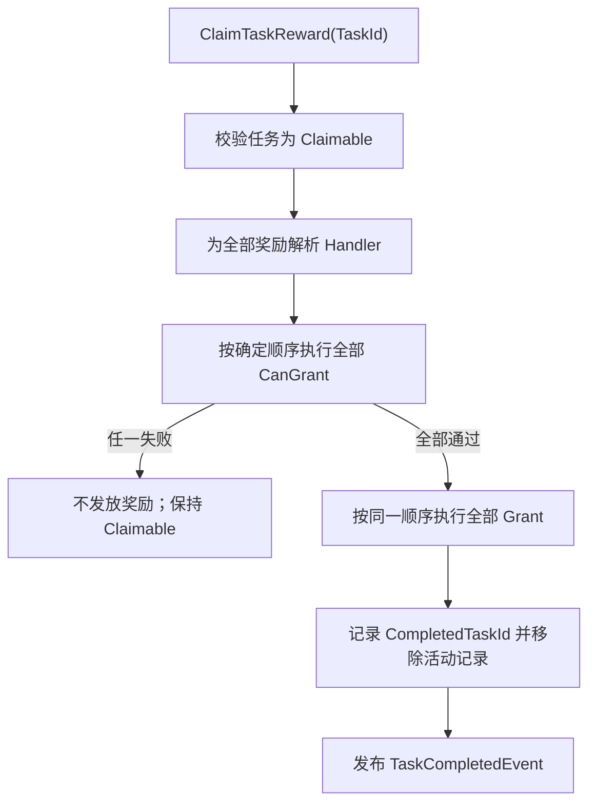
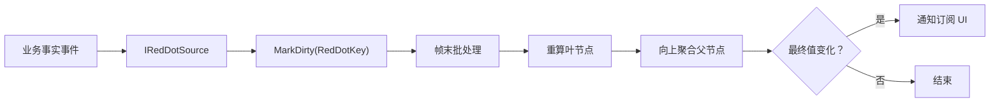
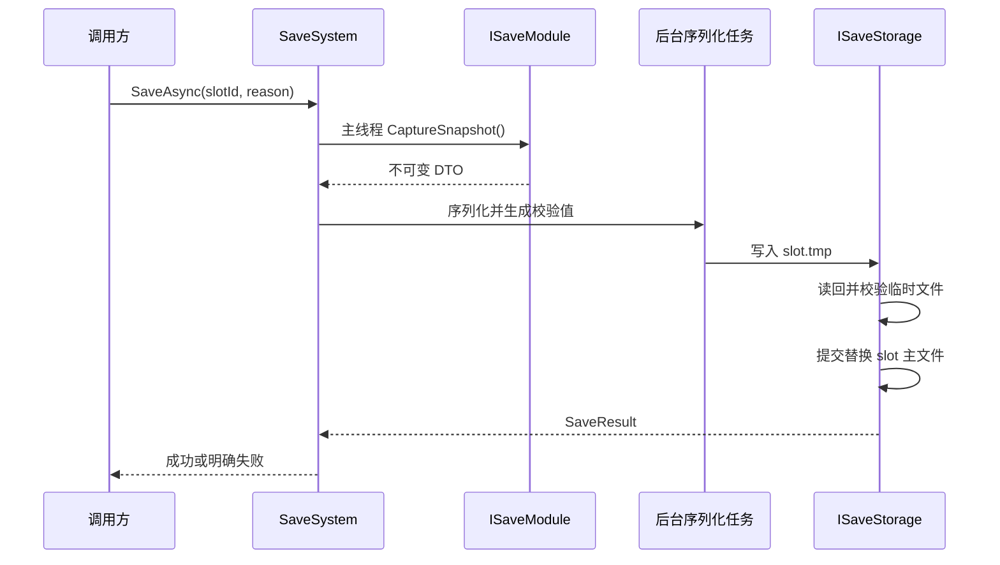
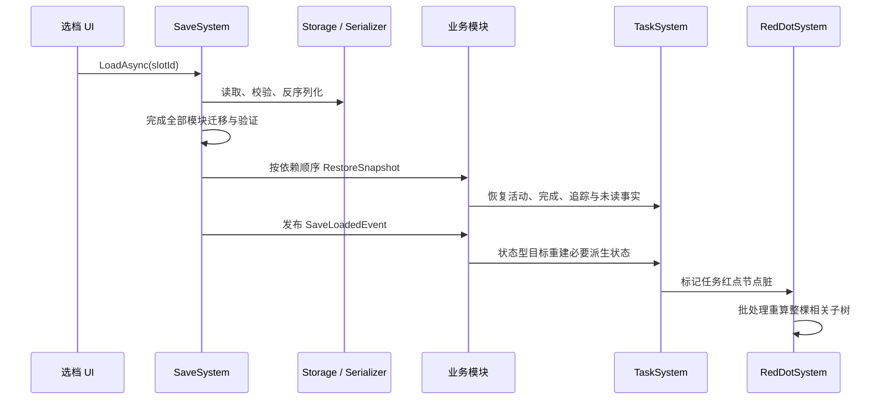

# 任务系统、红点系统与存档系统架构设计（讨论稿）

> 文档状态：第一版讨论稿  
> 适用范围：单机 RPG、一次性主线/支线任务、全局通用红点、本地多角色存档  
> 当前阶段：需求与架构讨论，尚未进入代码实现

## 1. 设计目标

本设计同时规划三个相互协作但保持独立边界的业务系统：

- **任务系统**：承载一次性任务的接取、目标进度、奖励领取、完成记录与单任务追踪。
- **红点系统**：提供可供任务、背包、邮件、技能等业务复用的树状提示能力。
- **存档系统**：编排各业务模块的版本化快照，并通过可替换的存储、序列化和完整性校验接口持久化多角色槽位。

三个系统共同遵守以下原则：

1. 核心有序流程由 `Command` / `System` 协调，不依靠多个事件监听器拼接事务。
2. 事件只表达已经发生的事实，例如任务已接取、目标进度已变化、奖励已领取。
3. 任务系统不依赖具体战斗、背包、对话或 UI 实现。
4. 红点系统不直接修改业务数据，也不持有 View、Window 或 ViewModel。
5. 存档只保存恢复业务所需的最小事实，不序列化运行时配置对象和派生状态。



## 2. 已确认的产品需求

### 2.1 任务范围

- 第一版提供通用任务框架，支持主线、支线等可扩展分类。
- 第一版任务均为一次性任务，不支持每日、每周、无限重复或周期实例。
- 玩家可同时接取多个任务。
- 任一时刻只允许追踪一个任务，供 HUD 与导航系统使用。
- 第一版不支持任务失败、放弃或重新接取。
- 一个任务内的多个目标采用 **AND** 规则，全部完成后任务才可领取。
- 任务完成后手动领取奖励。

### 2.2 接取语义

所有任务使用同一个任务模型和同一个接取 API，不区分“自动任务类”和“手动任务类”。

所谓自动或手动，只表示不同调用方在不同时间调用统一 API：



- `Source` 用于日志、调试或未来埋点，不参与任务规则。
- 接取触发策略不进入任务核心配置；NPC、剧情或任务链等调用方决定何时尝试接取。
- 接取 API 统一负责校验配置、接取资格、重复接取和已完成状态。
- 存档恢复使用专用恢复入口，不能调用接取 API 重放历史，避免重复副作用。

### 2.3 任务可用性与生命周期

未接取任务的 `Locked` / `Available` 是查询结果，不是持久化生命周期：

- `Locked`：尚未接取，且当前不满足全部接取条件。
- `Available`：尚未接取，且当前满足全部接取条件。

活动任务只使用以下生命周期：



- `InProgress`：已接取，至少一个目标尚未完成。
- `Claimable`：全部目标完成，等待领取奖励。
- `Completed`：作为状态转换事实存在；转换完成后不保留完整活动记录，只记录完成 ID。
- `AcceptTask` 每次实时计算开放条件，UI 查询与实际接取使用同一判断逻辑。
- 状态型目标在接取时立即查询；若全部目标已经满足，任务可在同一接取流程中直接进入 `Claimable`。

> 当前默认：`Locked` / `Available` 动态计算且不存档，不实现“首次开放后永久解锁”。若未来需要永久解锁，应将其建模为单独的持久化业务事实。

### 2.4 任务完成后的数据清理

奖励领取成功后：

1. 从活动任务集合删除该任务。
2. 清除任务目标进度。
3. 若该任务正在追踪，则清除 `TrackedTaskId`。
4. 将 `TaskId` 加入 `CompletedTaskIds`。
5. 从 `UnreadTaskIds` 删除该任务。
6. 发布任务完成事实事件。

已完成任务只保存 `TaskId`，用于防止重复接取、判断前置条件、驱动剧情与保证奖励不会重复领取。

## 3. 任务系统架构

### 3.1 配置模型

第一版采用集中式 `ScriptableObject` 数据库：

```text
TaskDatabase
└─ TaskDefinition[]
   ├─ TaskId                 显式稳定字符串，例如 main.chapter01.001
   ├─ CategoryId             类型化分类 ID，例如 Main、Side
   ├─ 标题、描述及展示数据
   ├─ UnlockConditions[]     SerializeReference，多项 AND
   ├─ Objectives[]           SerializeReference，多项 AND
   └─ Rewards[]              SerializeReference
```

设计约束：

- `TaskId` 必须唯一且长期稳定，禁止使用数组下标或资产实例 ID 作为存档标识。
- `TaskCategoryId` 是类型化稳定值；第一版内置 `Main`、`Side`，以后可集中注册新分类。
- 开放条件、任务目标和奖励只保存声明式配置，由对应 Handler 注册表解释。
- 运行时存档不保存 `TaskDefinition` 或 `SerializeReference` 配置对象。
- 编辑器校验至少覆盖重复 ID、空 ID、空 Handler 类型、非法目标数量、非法奖励数值和不存在的任务引用。

### 3.2 开放条件

开放条件使用可扩展定义与处理器：

```text
IUnlockConditionDefinition
        ↓ 由类型查找
IUnlockConditionHandler<TDefinition>
        ↓
Evaluate(context, definition) -> bool
```

- 同一任务的多个开放条件全部满足时才可接取。
- 第一版不提供嵌套 AND / OR 表达式。
- 条件处理器可查询任务完成记录、角色等级、背包状态或其他业务只读接口。
- 开放条件只负责回答“现在能否接取”，不负责主动调用接取 API。
- 自动接取由剧情节点、任务链协调器等外部调用方完成。

### 3.3 目标进度模型

第一版同时支持两类目标语义：

#### 累计型目标

- 消费接取之后发生的领域事实事件，例如击杀、对话、制作或交付行为。
- 默认不追溯任务接取前的历史行为。
- 处理器根据事件载荷匹配目标并增加进度，进度上限截断到需求值。

#### 状态型目标

- 查询另一个业务系统的当前状态，例如持有物品数量、角色等级或已装备物品。
- 接取任务时立即查询一次。
- 收到相关业务事实事件后重新查询，而不是盲目累加。
- 接取前已经满足的部分会立即反映在目标进度中。



任务核心不能直接依赖怪物、物品、对话等具体类型。适配器负责将各领域事件路由给相应目标处理器。

### 3.4 Manager、System、Command 与 Query

建议按现有 `WS_Modules.BusinessArchitecture` 分工：

- `ITaskManager`：持有活动任务、完成 ID、追踪 ID、未读 ID，并提供收窄的状态修改 API。
- `ITaskSystem`：协调接取、目标刷新、奖励领取和跨 Manager 的有序流程。
- `AcceptTaskCommand`：接取任务。
- `ClaimTaskRewardCommand`：预检并发放全部奖励，完成任务。
- `TrackTaskCommand`：切换或清除当前追踪任务。
- `AcknowledgeTaskCommand`：确认具体任务已经查看。
- Query：查询任务详情、分类列表、接取资格、当前追踪任务及红点数据源所需集合。

业务修改成功后发布 Type 事实事件，例如：

- `TaskAcceptedEvent`
- `TaskObjectiveProgressChangedEvent`
- `TaskBecameClaimableEvent`
- `TaskCompletedEvent`
- `TrackedTaskChangedEvent`
- `TaskAcknowledgedEvent`

事件载荷至少包含稳定 `TaskId`；进度变化事件还应包含目标索引或稳定目标 ID、旧值与新值。

### 3.5 追踪规则

- 多个任务可以同时处于 `InProgress` 或 `Claimable`。
- `TrackedTaskId` 最多保存一个活动任务 ID。
- `Claimable` 任务继续保持追踪，便于 HUD 引导玩家领奖。
- 领取完成后清除追踪，不自动猜测下一个任务。
- UI 可显式调用追踪命令切换任务。

### 3.6 奖励处理器注册表

奖励定义与发放逻辑分离：

```text
ItemRewardDefinition       -> ItemRewardHandler
CurrencyRewardDefinition   -> CurrencyRewardHandler
ExperienceRewardDefinition -> ExperienceRewardHandler
```

领取流程：



第一版一致性契约：

- 所有预检完成前不能产生奖励副作用。
- 同一单线程领取调用内，`CanGrant` 成功后对应 `Grant` 必须成功。
- 缺少 Handler 或非法奖励配置属于开发/配置错误，应立即暴露，不能伪造成功。
- 背包已满等可预期失败返回结构化失败原因，任务保持 `Claimable`。
- 不支持部分发放、邮件补发或奖励回滚。

## 4. 红点系统架构

### 4.1 通用能力

红点系统为独立的全局通用树，不只服务任务 UI：

- 节点使用不可变、类型化 `RedDotKey` 标识。
- 禁止业务代码散落裸字符串路径。
- 节点值为非负整数；UI 使用 `value > 0` 显示普通红点，也可显示具体数字。
- 父节点默认对子节点计数求和。
- 数据源收到业务事件后只标记相关叶节点为脏。
- 同帧末统一重新计算脏节点及祖先节点。
- 只有最终值实际变化时才发送通知。
- UI 绑定时先查询当前值，再订阅变化；解绑时释放 `IUnRegister`。



### 4.2 业务状态与未读提示

第一版同时支持两类提示，但二者必须使用不同叶节点：

- **业务状态提示**：由当前业务事实决定，例如可领取任务数量；不能通过点击按钮直接强行清除。
- **未读提示**：由持久化确认状态决定，例如新接取但尚未点击查看的任务。

任务未读规则：

- 接取成功后将 `TaskId` 加入 `UnreadTaskIds`。
- 未读状态按任务实例记录。
- 玩家点击具体任务条目时调用 `AcknowledgeTask(TaskId)`。
- 确认成功后从 `UnreadTaskIds` 删除该 ID，并发布确认事件。
- 打开任务总窗口、切换页签或红点组件自行刷新都不能隐式清除未读。
- 任务领取完成时确保从未读集合删除。

### 4.3 建议的任务红点节点

```text
Task
├─ New
│  ├─ Main
│  └─ Side
└─ Claimable
   ├─ Main
   └─ Side
```

- `New/{Category}`：对应分类下 `UnreadTaskIds` 的数量。
- `Claimable/{Category}`：对应分类下可领取活动任务的数量。
- 分类和具体任务的关系由任务红点数据源查询任务系统，不由红点核心理解。

> **待确认：任务根节点计数语义**  
> 同一任务可能同时属于 `New` 和 `Claimable`。若默认对子节点求和，任务入口显示的是“提示事项数”；若按 `TaskId` 去重，显示的是“涉及提示的任务数”。在实现前需二选一。当前文档不固定该行为。

## 5. 存档系统架构

### 5.1 存档范围与槽位

- 第一版支持多个角色槽位。
- 槽位使用不可变内部 GUID `SaveSlotId`，角色展示名可修改且不参与文件定位。
- 选档摘要包含角色名、最后保存时间、游玩时长、当前场景或章节、任务完成数和存档格式版本。
- 支持列出、新建、覆盖、加载和删除槽位。
- 第一版不保留上一份成功备份，也不提供多个恢复点。
- 主档损坏或迁移失败时将槽位标记为损坏，不能静默创建新档或覆盖原文件。

### 5.2 接口隔离

业务模块只依赖高层 `ISaveService`。存档编排层将可替换能力拆分为：

- `ISaveStorage`：槽位枚举、读取、临时写入、提交、删除。
- `ISaveSerializer`：存档容器与字节数据之间的序列化/反序列化。
- `ISaveIntegrity`：生成和验证内容完整性校验值。
- `ISaveModule`：业务模块的快照采集与恢复入口。
- `ISaveMigration`：模块版本之间的单步迁移。

默认实现：

- 存储：`Application.persistentDataPath` 下的本地文件。
- 序列化：项目已有 Newtonsoft.Json 能力。
- 完整性：对规范化存档内容计算校验值，不加密、不混淆。

以后可独立替换为二进制序列化、SQLite、云存储或其他介质，而不修改任务与红点业务模块。

### 5.3 存档容器与模块快照

```text
SaveEnvelope
├─ FormatVersion
├─ SlotSummary
├─ SavedAtUtc
├─ Integrity
└─ Modules
   ├─ TaskSnapshot(version, payload)
   ├─ PlayerSnapshot(version, payload)
   ├─ InventorySnapshot(version, payload)
   └─ ...
```

任务模块最小快照：

```text
TaskSaveSnapshot
├─ Version
├─ ActiveTasks
│  ├─ TaskId
│  ├─ State: InProgress | Claimable
│  └─ ObjectiveProgress[]
├─ CompletedTaskIds
├─ TrackedTaskId
└─ UnreadTaskIds
```

约束：

- 已完成任务不保存完整进度或奖励数据。
- `Locked` / `Available` 不存档，加载后重新派生。
- 红点树最终计数不存档；未读业务事实由任务快照保存，加载后红点重新计算。
- 配置内容不复制进存档，只保存稳定 ID 和必要运行时事实。

### 5.4 保存流程与并发规则



- 所有 Unity 对象和业务 Manager 状态都在主线程采集。
- 后台任务只接触不可变快照 DTO、序列化器、校验器和存储接口。
- 保存 API 返回 `UniTask<SaveResult>`，调用方可展示保存中、成功或失败状态。
- 保存触发包括显式保存和关键节点自动保存；退出回调不是唯一可靠保存点。
- 同时只能有一次磁盘写入。
- 写入期间的新保存请求合并为一个待保存标记；当前写入结束后重新在主线程采集最新状态并再保存一次。
- 不排队保存每一个过期中间快照，也不允许较旧快照覆盖较新快照。

### 5.5 原子提交与无备份策略

单槽位使用主文件和临时文件：

```text
slot.json    已提交主存档
slot.tmp     本次写入中的临时文件
```

提交顺序：

1. 将完整新内容写入临时文件。
2. 刷新写入并读回临时文件。
3. 校验完整性、格式版本和基本容器结构。
4. 通过存储接口将临时文件原子替换为主文件。
5. 提交失败时保留原主文件，并返回失败。

由于第一版明确不保留备份，主文件自身校验失败后槽位直接进入损坏状态。删除损坏槽位必须由玩家或上层明确操作，不能由加载流程自动执行。

### 5.6 版本迁移

- 存档容器具有整体格式版本。
- 每个模块快照具有独立模块版本。
- 模块注册连续单步迁移器，例如 `Task v1 -> v2`、`Task v2 -> v3`。
- 加载时先验证容器，再为每个模块按顺序补齐迁移链。
- 缺少任何必要迁移步骤时拒绝加载，且不改变当前运行状态。
- 迁移在临时内存对象上完成；所有模块都成功迁移与校验后才进入恢复阶段。
- 删除或更名 `TaskId` 时必须提供明确的任务快照迁移，禁止静默生成空任务。

### 5.7 加载与恢复顺序



- 恢复不能调用普通接取、进度增加或领奖 API。
- 恢复过程中不逐条发送正常玩法事件，避免弹窗、音效、奖励或自动保存副作用。
- 全部模块恢复成功后统一发布一次 `SaveLoadedEvent`。
- 状态型目标可在加载完成阶段根据已恢复的背包、玩家等模块重新查询。
- 红点最终值在恢复完成后统一重建。
- 任一模块恢复前验证失败时，不得部分覆盖当前运行状态。

## 6. UI 与 MVVM 边界

- View 只处理控件绑定、点击与展示。
- ViewModel 通过 Query 构建任务列表、详情、目标进度、追踪状态和红点值。
- 用户点击接取、领奖、追踪或任务条目时，ViewModel 发送对应 Command。
- 点击具体任务条目后，ViewModel 在确认目标条目有效时发送 `AcknowledgeTaskCommand`。
- ViewModel 保存红点订阅返回的 `IUnRegister`，并在释放时注销。
- Manager、System、任务目标处理器和红点数据源均不得依赖 View、Window 或 ViewModel。

## 7. 失败语义与防御边界

预期的业务拒绝使用结构化结果返回，例如：

- 任务不存在。
- 已经接取或已经完成。
- 开放条件不满足。
- 当前状态不可领奖。
- 背包容量不足。
- 存档槽位不存在或已损坏。
- 当前存在无法合并的加载/保存操作。

开发契约错误应尽早暴露，不应静默失败：

- 重复 `TaskId`。
- 缺少条件、目标或奖励 Handler。
- 快照模块 ID 重复。
- 缺少版本迁移链。
- 存档中引用不存在且未迁移的任务 ID。
- `CanGrant` 成功后 `Grant` 仍失败。

禁止用宽泛 `try/catch` 吞掉业务不变量错误，也不使用 `out string error` 沿调用链传递错误。

## 8. 测试与验收场景

### 8.1 任务系统

- 未满足开放条件时接取被拒绝；条件满足后同一 API 接取成功。
- NPC、剧情、任务链等不同调用方使用同一接取入口。
- 重复接取活动任务或已完成任务被拒绝。
- 累计目标只统计接取后匹配的领域事件。
- 状态目标在接取时读取现有业务状态，并在相关变化后重查。
- 多目标必须全部完成后才进入 `Claimable`。
- 接取瞬间所有状态目标已满足时立即进入 `Claimable`。
- 奖励任一预检失败时零发放且任务保持 `Claimable`。
- 全部奖励成功后只记录完成 ID，并清除活动进度、追踪和未读。
- 多任务并行时切换追踪不改变其他任务进度。

### 8.2 红点系统

- 新接取任务增加对应分类的未读计数。
- 打开任务窗口不清除未读；点击具体任务条目才确认该任务。
- 可领取状态产生独立业务红点，点击不能直接清除。
- 同帧多次业务变化只在批处理后通知最终值。
- 值未变化时不发送重复通知。
- UI 绑定时可立即读到当前值，解绑后不再收到变化。
- 父节点按既定聚合规则正确更新。

### 8.3 存档系统

- 多槽位使用 GUID 隔离，角色改名不改变槽位定位。
- 保存时主线程采集快照，后台不访问 Unity 对象或 Manager。
- 连续保存请求在当前写入后只补存一次最新状态。
- 临时文件序列化或校验失败时不覆盖原主文件。
- 主档校验失败时槽位标记损坏，不静默重开。
- 旧版本按模块迁移链顺序升级；缺少迁移时保持当前运行状态不变。
- 加载不会重复接取任务、增加进度、发放奖励或播放正常业务副作用。
- 加载完成后状态型目标与红点派生状态正确重建。

## 9. 第一版明确不包含

- 日常、周常、周期重置和无限重复任务。
- 任务失败、放弃、重新接取和任务互斥。
- 目标 OR 分组、嵌套表达式和阶段式目标。
- 自动选择下一个追踪任务。
- 部分奖励发放、奖励回滚和邮箱补发。
- 红点轮询刷新。
- 云存档、存档加密、轻量混淆和多个历史恢复点。
- 存档损坏后的自动重置。
- 任务编辑器专用窗口；第一版可先使用 ScriptableObject Inspector 与校验器。

## 10. 实施前待确认

1. **任务根红点计数**：显示 `New + Claimable` 的提示事项数，还是按 `TaskId` 去重后的提示任务数。
2. **关键节点自动保存清单**：至少应明确任务领奖完成、场景切换和暂停菜单退出等触发点中哪些属于第一版。
3. **模块恢复依赖顺序**：待玩家、背包、场景等业务模块成型后，补充具体拓扑顺序。
4. **存档删除交互**：删除正常或损坏槽位是否需要二次确认，由选档 UI 需求确定。

## 11. 预计实施文件范围

当前仅形成架构文档。进入实现阶段后，预计新增以下职责目录，具体文件名在编码计划中再锁定：

```text
Assets/Scripts/TaskSystem/
├─ Runtime/Config
├─ Runtime/Core
├─ Runtime/Conditions
├─ Runtime/Objectives
├─ Runtime/Rewards
├─ Runtime/Events
└─ Tests

Assets/Scripts/RedDotSystem/
├─ Runtime/Core
├─ Runtime/Sources
└─ Tests

Assets/Scripts/SaveSystem/
├─ Runtime/Core
├─ Runtime/Storage
├─ Runtime/Serialization
├─ Runtime/Migration
└─ Tests
```

测试采用项目约定的 Odin Button 手动测试组件时，必须放在 `Test` 或 `Tests` 目录且位于任何 `Editor` 文件夹之外。
