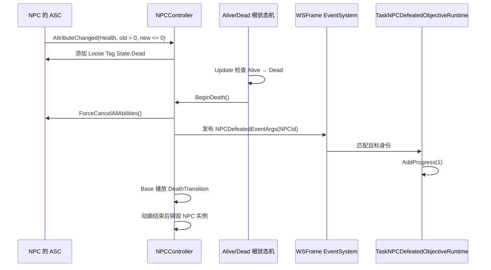

# 任务系统架构与数据模型

> 文档状态：任务生命周期 v2、首个正式玩法目标（完成指定对话资源）和基础运行时任务面板已接入；NPC/剧情接取调用方与进阶查询能力仍待接入。
> 范围：任务配置、玩家任务状态、分层运行时、任务快照及与奖励系统的交互。

产品需求和后续能力见 [TaskSystem_Requirements.md](TaskSystem_Requirements.md)。通用奖励流程见 [RewardSystem_Architecture.md](../RewardSystem/RewardSystem_Architecture.md)。

## 1. 职责与对象关系

静态配置、玩家任务集合和单条任务执行分别由两个系统入口与分层运行时承担：`TaskConfigManager` 查询配置；`TaskSystem` 管理活动任务和跨任务事实；`TaskRuntime` 持有单条任务的权威 `TaskRecord`，并管理当前阶段。

~~~mermaid
flowchart TD
    Provider["TaskDatabaseConfigProvider"] --> Config["TaskConfigManager"]
    Config --> Database["TaskDatabase"]
    Database --> Definition["TaskDefinition"]
    Caller["NPC / 对话 / 剧情调用方"] -->|TaskId| System["TaskSystem"]
    System -->|创建并持有| Task["TaskRuntime"]
    Task --> Record["TaskRecord 唯一可存档状态"]
    Task -->|当前阶段| Stage["TaskStageRuntime"]
    Stage --> Objective["ObjectiveRuntime ITaskObjectiveRuntime"]
    Objective -->|受限上下文更新| Record
    Task -->|阶段变化事件| Events["EventSystem"]
    System -->|采集与恢复| Snapshot["TaskSaveSnapshot v2"]
~~~

| 对象 | 持有内容 | 生命周期 | 主要职责 |
| --- | --- | --- | --- |
| `TaskConfigManager` | 已校验的 `TaskDatabase` | 业务配置会话 | 注入配置、校验并按 `TaskId` 查询定义 |
| `TaskSystem` | 活动 `TaskRuntime`、完成 ID、追踪 ID、未读 ID | GameArchitecture 会话 | 资格查询、统一接取、领奖、全局任务事实与快照 |
| `TaskRuntime` | `TaskDefinition` 引用、唯一 `TaskRecord`、当前 `TaskStageRuntime` | 接取成功至领奖完成 | 推进单条任务阶段、写入目标进度、进入 Claimable |
| `TaskStageRuntime` | 当前 `TaskStageDefinition`、目标进度引用、目标运行时订阅 | 当前阶段执行期间 | 启停本阶段全部目标监听并检查阶段完成 |
| `ITaskObjectiveRuntime` | Definition 创建的目标监听实例 | 所属阶段执行期间 | 接收领域事件并通过受限上下文提交目标进度及可选导航查询 |
| `TaskSaveSnapshot` | 活动 Record 快照及全局任务事实 | 保存或加载时 | 与配置引用、运行时对象和事件句柄隔离的 v2 DTO |

`TaskRecord` 归对应的 `TaskRuntime` 所有。阶段和目标运行时只引用其当前阶段进度，不复制玩家进度数据。任务进入 `Claimable` 后，`TaskRuntime` 和 Record 继续保留，阶段监听停止；领奖成功后 `TaskSystem` 才移除该实例并记录完成 ID。

## 2. 静态配置与存档字段

~~~mermaid
classDiagram
    class TaskConfigManager {
        TaskDatabase database
        TryGetDefinition(TaskId)
    }
    class TaskDatabase {
        TaskDefinition[] definitions
        TaskId to TaskDefinition index
    }
    class TaskDefinition {
        TaskId taskId
        TaskCategoryId categoryId
        string title
        string description
        TaskConditionDefinition[] unlockConditions
        TaskStageDefinition[] stages
        RewardDefinition[] rewards
    }
    class TaskSystem {
        TaskRuntime[] activeTasks
        TaskId[] completedTaskIds
        TaskId trackedTaskId
        TaskId[] unreadTaskIds
    }
    class TaskRuntime {
        TaskDefinition definition
        TaskRecord record
        TaskStageRuntime currentStageRuntime
    }
    class TaskRecord {
        TaskId taskId
        TaskStageId currentStageId
        TaskLifecycleState state
        TaskObjectiveProgress[] objectiveProgress
    }
    class TaskStageRuntime {
        TaskStageDefinition definition
        ITaskObjectiveRuntime[] objectiveRuntimes
    }
    TaskConfigManager --> TaskDatabase
    TaskDatabase "1" o-- "*" TaskDefinition
    TaskSystem "1" o-- "*" TaskRuntime
    TaskRuntime "1" *-- "1" TaskRecord
    TaskRuntime "1" o-- "0..1" TaskStageRuntime
~~~

静态配置由每任务一个 `TaskDefinition` 资产组成。`TaskDatabase` 按稳定 `TaskId` 建索引并校验任务、阶段、目标、条件和奖励配置。阶段按资产列表顺序执行；一个阶段的目标全部完成后才切换。`TaskCategoryId` 使用固定字符串表，当前登记 `main` 和 `side`。

任务 v2 快照字段如下：

| 快照对象 | 字段 | 来源 |
| --- | --- | --- |
| `TaskRecordSnapshot` | `TaskId`、`CurrentStageId`、`State`、`ObjectiveProgress[]` | 各活动 `TaskRuntime.Record` |
| `TaskObjectiveProgressSnapshot` | `ObjectiveId`、`Current`、`Required` | 当前阶段 Record 中的目标进度 |
| `TaskSaveSnapshot` | `ActiveTasks`、`CompletedTaskIds`、`TrackedTaskId`、`UnreadTaskIds` | `TaskSystem` 持有的任务集合事实 |

快照不包含 Definition、Handler、TaskRuntime、StageRuntime、ObjectiveRuntime、事件订阅或 Unity 对象引用。进行中任务与 Claimable 任务都在每次保存时采集；已领奖任务仅以完成 ID 保存。

## 3. 生命周期与事件顺序

### 3.1 查询和接取

所有来源只提交 `TaskId` 和 `TaskAcceptSource` 到 `TaskSystem.TryAcceptTask`。System 查询 `TaskConfigManager`，评估条件并验证各阶段 Handler；随后创建拥有初始 Record 的 TaskRuntime，启动首阶段监听，再将其加入活动集合、标记未读并发送接取事件。

~~~mermaid
sequenceDiagram
    participant Caller as 任务来源
    participant System as TaskSystem
    participant Config as TaskConfigManager
    participant Runtime as TaskRuntime
    participant Stage as TaskStageRuntime
    Caller->>System: TryAcceptTask(TaskId, source)
    System->>Config: 查询任务定义
    System->>System: 校验资格和 Handler
    System->>Runtime: 创建 Definition 与 Record
    Runtime->>Stage: 启动第一阶段
    Stage-->>Runtime: 目标监听建立成功
    Runtime-->>System: 任务运行实例可用
    System->>System: 加入活动集、设置未读
    System-->>Caller: 触发 TaskAcceptedEventArgs
~~~

资格不满足、重复接取和已完成任务返回结构化拒绝。缺失 Handler 或非法配置明确报错。首阶段监听创建失败时释放部分订阅并移除临时任务实例。

### 3.2 目标进度与阶段推进

目标运行时向所属 TaskRuntime 提交进度；TaskRuntime 校验阶段运行时仍为当前实例后，更新 Record 并发送进度事件。目标订阅停用或阶段切换后，旧上下文的回调因阶段实例不匹配而失效。

当前阶段所有目标完成后，TaskRuntime 按以下顺序处理：

1. 让旧阶段运行时失效并停止全部目标订阅。
2. 在同一 Record 中初始化下一阶段目标进度。
3. 建立并启动新的 `TaskStageRuntime` 和 ObjectiveRuntime。
4. 新阶段监听建立成功后发送阶段变化事件。

最后阶段完成时，TaskRuntime 停止阶段监听，将 Record 状态改为 `Claimable`，依次发送状态变化与可领奖事件，并保留 TaskRuntime 等待领奖。

### 3.3 事件调用方式

任务事件在实际事实提交位置直接调用 WSFrame `EventSystem.EventTrigger_Type`；每次调用前用 `Debug.Log` 记录发起对象和事件名称，日志不打印事件参数。事件载荷继续携带订阅者所需的任务、阶段和进度字段。

- `TaskRuntime` 发送目标进度、阶段变化、状态变化和可领奖事件。
- `TaskSystem` 发送接取、完成、追踪变化和确认查看事件。
- 完成状态与奖励已提交后的订阅者异常会被记录；异常不撤销到账事实，也不恢复领取资格。

### 3.4 奖励领取

~~~mermaid
sequenceDiagram
    participant Caller as UI 或业务调用方
    participant System as TaskSystem
    participant Reward as RewardSystem
    participant Runtime as TaskRuntime
    participant Observer as 事件订阅者
    Caller->>System: TryClaimReward(TaskId)
    System->>Runtime: 确认 Record 为 Claimable
    System->>Reward: 准备整包奖励
    alt 预检拒绝
        Reward-->>System: 结构化拒绝
        System-->>Caller: 保留 Claimable 任务
    else 预检成功
        System->>Reward: 提交玩家奖励数据
        System->>System: 移除 TaskRuntime 并记完成、清理追踪与未读
        System->>Observer: 发送任务完成通知
        System->>Reward: 发布奖励领域通知
        System-->>Caller: 领奖成功
    end
~~~

TaskSystem 的领奖保护覆盖准备、提交及通知，通知回调中的重复领奖会被拒绝。钱包和库存更新成功后先提交任务完成事实，再触发任务与奖励通知。

## 4. 存档、恢复与系统边界

`TaskSaveModule` 的稳定模块 ID 为 `task`，版本为 v2。采集时 `TaskSystem` 从每个活动 TaskRuntime 提取 Record；恢复时先校验快照、Definition、阶段和目标需求，再构造新的 Record 与 TaskRuntime，完整成功后替换当前集合。已有运行实例在替换后停止监听。

所有 SaveModule 恢复完成并收到成功 Load 通知后，TaskSystem 为 InProgress 实例启动当前 StageRuntime；Claimable 实例不建立阶段监听。加载不调用接取、发放奖励或发送普通任务生命周期事件。保持 v2 字段格式；当前无已使用槽位，不提供 v1 迁移。

~~~mermaid
flowchart LR
    Save["SaveManager"] -->|恢复任务 v2 快照| System["TaskSystem"]
    Config["TaskConfigManager"] -->|解析 TaskId 和阶段| System
    System -->|创建但暂不监听| Runtime["TaskRuntime + TaskRecord"]
    Save -->|所有模块加载成功| System
    System -->|只为 InProgress 重建| Stage["TaskStageRuntime"]
~~~

| 入口 | 持有的数据 | 负责的流程 |
| --- | --- | --- |
| `TaskConfigManager` | 静态 `TaskDatabase` | 配置验证和任务定义查询 |
| `TaskSystem` | 活动 TaskRuntime 集合与跨任务状态 | 接取、领奖、追踪、未读、完成、防重入和存档 |
| `TaskRuntime` | 一条任务的 Definition 引用和 Record | 当前阶段进度、阶段切换和 Claimable 状态 |
| `TaskStageRuntime` | 当前阶段目标运行时和订阅 | 目标监听建立、释放和阶段完成判断 |

目录组织：

~~~text
Assets/Scripts/TaskSystem/
├─ Runtime/Config/           TaskConfigManager、TaskDatabase、TaskDefinition、TaskCategoryCatalog
├─ Runtime/Conditions/
│  ├─ Definitions/           TaskConditionDefinition 及具体条件
│  ├─ Interfaces/            ITaskConditionHandler
│  ├─ Handlers/              条件解释器
│  └─ Registries/            TaskConditionHandlerRegistry
├─ Runtime/Objectives/
│  ├─ Definitions/           TaskObjectiveDefinition
│  └─ Interfaces/            目标 Runtime、导航能力及受限上下文契约
├─ Runtime/Core/             TaskSystem、TaskRuntime、TaskStageRuntime
├─ Runtime/Data/             TaskRecord、命令结果和稳定 ID
├─ Runtime/Events/           任务事实事件载荷
├─ Runtime/Save/             v2 快照与 TaskSaveModule
└─ Test/                     Odin 手动验证入口
~~~

## 5. 新增能力与其他系统接入

Objective Definition 直接创建各任务实例独有的 Runtime；新增目标类型放在 `RPG.TaskSystemNS` 对应的 Definitions 目录，并在 Definition 中实现工厂方法。任务层不依赖反射扫描，也不需要 Objective Handler 注册表。

| 扩展内容 | 继承或实现 | 放置和登记方式 |
| --- | --- | --- |
| 新任务目标配置 | 继承 [TaskObjectiveDefinition](Runtime/Objectives/Definitions/TaskObjectiveDefinition.cs)，实现 `CreateRuntime()` 并在校验时先调用 `base.Validate()` | 放入 `Runtime/Objectives/Definitions/`；在任务资产对应阶段的目标列表中配置 |
| 完成指定对话资源 | 使用 [`TaskDialogueCompletedObjectiveDefinition`](Runtime/Objectives/Definitions/TaskDialogueCompletedObjectiveDefinition.cs)，引用 `DialogueAsset`、设置 `Required`，可选引用 `NPCIdentityDefinition` 作为导航来源 | 在阶段目标列表配置；Definition 直接创建对话 Runtime |
| 击败指定 NPC | 使用 [`TaskNPCDefeatedObjectiveDefinition`](Runtime/Objectives/Definitions/TaskNPCDefeatedObjectiveDefinition.cs)，引用 `NPCIdentityDefinition` 并设置击败次数 | 阶段激活时监听 `NPCDefeatedEventArgs`；按 NPC 稳定身份匹配并可通过 NPCManager 导航 |
| 目标运行时 | 实现 [ITaskObjectiveRuntime](Runtime/Objectives/Interfaces/ITaskObjectiveRuntime.cs)，需要导航时实现 `ITaskObjectiveNavigationProvider` | 由对应 Definition 创建；阶段 Runtime 管理监听生命周期 |
| 新接取条件配置 | 继承 [TaskConditionDefinition](Runtime/Conditions/Definitions/TaskConditionDefinition.cs) 并实现自己的 `Validate()` | 放入 `Runtime/Conditions/Definitions/`；在任务资产的接取条件列表中配置 |
| 条件 Handler | 实现 [ITaskConditionHandler](Runtime/Conditions/Interfaces/ITaskConditionHandler.cs) | 放入 `Runtime/Conditions/Handlers/`；在 [TaskConditionHandlerRegistry](Runtime/Conditions/Registries/TaskConditionHandlerRegistry.cs) 的 `RegisterDefault()` 中调用 `Register<TDefinition>()` |

目标扩展的创建和进度流如下：

~~~mermaid
flowchart LR
    Definition[TaskObjectiveDefinition] -->|CreateRuntime(context)| Runtime[自定义 ObjectiveRuntime]
    Stage[TaskStageRuntime] -->|StartListening / StopListening| Runtime
    Event[玩法事件] --> Runtime
    Runtime -->|AddProgress / SetProgress| Context[ITaskObjectiveRuntimeContext]
    Context --> Record[TaskRuntime 持有的 TaskRecord]
~~~

当前正式目标是完成指定的 `DialogueAsset`。Definition 直接创建 [`TaskDialogueCompletedObjectiveRuntime`](Runtime/Objectives/Handlers/TaskDialogueCompletedObjectiveRuntime.cs)；Runtime 只在当前阶段订阅 `DialogueEndedEvent`，并同时要求 `Status == Completed` 与 `Session.Request.Asset` 引用相同。开始对话、Failed 结束、其他资源及接取前的历史对话都不计数。`Required` 默认为 1；任务 v2 快照仍只保存当前阶段的目标进度，恢复监听不会重放结束事件。可选 `NPCIdentityDefinition` 只用于导航定位，不改变完成判定。对话结束事件由 [`DialogueSystem`](../DialogueSystem/Runtime/DialogueSystem.cs) 在会话资源清理后通过 WSFrame `EventSystem` 发布。

击败目标通过 `TaskNPCDefeatedObjectiveDefinition` 引用 `NPCIdentityDefinition`，由 [`TaskNPCDefeatedObjectiveRuntime`](Runtime/Objectives/Handlers/TaskNPCDefeatedObjectiveRuntime.cs) 在所属阶段启动时订阅 `NPCDefeatedEventArgs`。仅匹配同一身份且发生在监听期间的死亡会累计进度；阶段完成、停止或任务清理时注销监听，不补记接取之前的历史。导航仍只在运行时通过 NPCManager 查询当前场景锚点，快照仅保存既有目标进度，不保存 Transform 或 NPC 场景引用。

NPC 身份的作者配置来自 `NPCIdentityDefinition` SO，不手填 NPCId；其 `identityId` 是唯一持久化字段。新身份由 Editor 自动生成 GUID 字符串；Rusk、Arlecchino、ANPC 与 Boss Odetta 的原 NPCId 字符串已直接迁入此字段，兼容已有 JSON 和对话 Toggle 存档。资产重命名、移动或 meta GUID 变化不改变运行时身份；隐藏的 Editor 所属 GUID 仅用于确认复制来源，可确认的复制品获得新的 `identityId`，来源不明的重复身份会报错且不自动改写。击败任务 `side_defeat_boss_odetta` 已加入 TaskDatabase，要求击败一次 Odetta，无自动接取、前置条件和奖励；无奖励任务仍沿现有 Claimable/领取流程完成，空奖励批次不改变玩家物品与货币。

~~~mermaid
sequenceDiagram
    participant Dialogue as DialogueSystem
    participant Center as EventSystem
    participant Objective as TaskDialogueCompletedObjectiveRuntime
    participant Context as ITaskObjectiveRuntimeContext
    participant Runtime as TaskRuntime
    Dialogue->>Dialogue: 释放表现资源、锁和当前 Session
    Dialogue->>Center: 发布 DialogueEndedEvent
    Center->>Objective: 派发结束事实
    Objective->>Objective: 检查 Completed 和 DialogueAsset 引用
    Objective->>Context: AddProgress(1)
    Context->>Runtime: 更新当前 TaskRecord 并检查阶段
~~~

以下示例类型放在 `RPG.TaskSystemNS` 命名空间中。目标 Definition 每次创建独立 Runtime，Runtime 只在阶段启动后监听玩法事件。

~~~csharp
using System;
using UnityEngine;

/// 
配置一个按指定敌人击败事件推进的目标。

[Serializable]
public sealed class ExampleEnemyObjectiveDefinition : TaskObjectiveDefinition
{
    [SerializeField] private string enemyId = string.Empty;

    /// 
获取该目标关注的敌人 ID。

    public string EnemyId => enemyId;

    /// 
校验目标自身的敌人配置。

    /// <exception cref="ArgumentException">敌人 ID 未配置时抛出。</exception>
    public override void Validate()
    {
        base.Validate();
        if (string.IsNullOrWhiteSpace(enemyId))
            throw new ArgumentException("敌人 ID 不能为空。", nameof(enemyId));
    }

    /// 
创建该目标独有的事件监听 Runtime。

    /// <param name="context">由 TaskRuntime 提供的进度上下文。</param>
    /// <returns>负责订阅玩法击败事件的目标 Runtime。</returns>
    public override ITaskObjectiveRuntime CreateRuntime(ITaskObjectiveRuntimeContext context)
    {
        return new ExampleEnemyObjectiveRuntime(this, context);
    }
}
~~~

`ExampleEnemyObjectiveRuntime` 在 `Runtime/Objectives/Handlers/` 或专用运行时目录实现 `ITaskObjectiveRuntime`：`StartListening()` 注册玩法事件，`StopListening()` 释放该实例创建的全部订阅；事件匹配定义后通过 `context.AddProgress()` 或 `context.SetProgress()` 更新进度。两个生命周期方法必须支持重复调用。构造函数和 Definition 工厂只建立对象与上下文，不能累计进度；阶段启动后才开始监听。目标上下文会拒绝已经失效阶段的迟到回调。

条件 Handler 的 `Evaluate(TaskConditionDefinition, TaskSystem)` 只查询任务事实：条件满足返回 `null`，不满足返回 `TaskAvailabilityReason`。它不接取任务、不修改玩家任务状态；无效定义或类型不匹配应明确报错。自定义条件字段由定义的 `Validate()` 校验，扩展时调用 `base.Validate()`。当新条件需要表达当前尚无的失败原因时，应同时扩展任务资格原因类型和消费该原因的界面文案映射。

注册约束：

- Objective Runtime 由对应 Definition 创建，不登记 Objective Handler；创建失败由阶段启动流程释放已创建 Runtime 并传播异常。
- 接取条件仍通过 `TaskConditionHandlerRegistry` 按精确定义类型解析，默认条件 Handler 在 `RegisterDefault()` 中显式登记。
- 玩法奖励仍通过 `RewardHandlerRegistry` 登记；不与 Objective 创建职责混合。
- 新增任务分类时，在 [TaskCategoryCatalog](Runtime/Config/TaskCategoryCatalog.cs) 登记稳定 ID 与显示名；Inspector 候选项来自同一静态表。任务奖励配置继承通用 [RewardDefinition](../RewardSystem/Runtime/Definitions/RewardDefinition.cs)，按[奖励系统扩展指南](../RewardSystem/RewardSystem_Architecture.md)登记 Handler。

其他系统通过 `TaskSystem` 的业务 API 接入，不持有任务实例内部数据：

| 调用方 | 接入 API | 约束 |
| --- | --- | --- |
| NPC、对话、剧情或玩家交互来源 | `GetAvailability(TaskId)`、`TryAcceptTask(TaskId, TaskAcceptSource)` | 先查询资格供界面展示；实际接取仍通过统一入口。来源方不创建 `TaskRecord` 或 `TaskRuntime` |
| 任务窗口或其他领奖交互 | `TryClaimReward(TaskId)` | 仅提交待领奖任务；重复领取保护和完成记录由 `TaskSystem` 负责 |
| 战斗、探索等玩法系统 | 发布玩法领域事件 | 对应目标 Runtime 在阶段启动期间订阅，并在停止时释放全部监听 |

任务加载时，TaskSaveModule 先恢复 Record 和 TaskRuntime；所有 SaveModule 成功后，TaskSystem 才启动 InProgress 任务的阶段监听。新目标 Runtime 应只在监听期间响应玩法事件，不应在构造或读档时自行补记进度。

## 主线程调用约定

`TaskSystem`、`TaskRuntime`、`TaskRecord` 和 `TaskConfigManager` 的查询、写入、事件分发及快照采集均在 Unity 主线程同步执行，因此这些任务状态不使用线程锁。事件订阅者可以同步重入业务入口，所以领奖仍以 `rewardClaimInProgressTaskIds` 拒绝同一任务的重复领取，阶段推进仍以待处理标记串行化目标回调；这些标记解决业务重入，不负责跨线程同步。未来网络或后台工作线程收到任务消息时，由消息来源派发到主线程后再调用任务 API。

## 任务运行时 UI 接入

`TaskWindow` 展示玩家已接取且尚未领奖完成的活动任务，包括 `InProgress` 和 `Claimable`。顶部使用“全部、主线、支线”三个互斥页签过滤任务；全部页签显示主线与支线两个分区，单分类页签只显示对应任务。当前分类没有匹配任务时保留对应分类标题，仅隐藏任务条目与详情，不显示空状态文案。分类选择在窗口生命周期内保留；当前任务不再属于筛选结果时，依次选择筛选内的追踪任务或第一条活动任务。

~~~mermaid
flowchart TD
    J[UI Action Map 的 J 快捷键] --> Request[TaskWindowOpenRequestedEventArgs]
    HUD[HUD TaskButton] --> Request
    Request --> Flow[TaskWindowFlowCoordinator]
    Flow -->|先隐藏可见 HUD| UI[UIManager / TaskWindow]
    Flow -->|其他全屏窗口占用时拒绝| Reject[记录窗口名和状态]
    UI --> Controller[TaskWindowController]
    Controller --> System[TaskSystem：活动任务查询、追踪、确认查看、领奖]
    Controller --> Config[TaskConfigManager：标题、阶段和奖励配置]
    System -->|任务事实变化| Events[EventSystem]
    Events --> Controller
    Controller --> ListView[TaskWindowView：分类页签与任务列表]
    Controller --> DetailView[TaskDetailsPanelView：挂于 TaskDetailsPanel]
    DetailView --> Objectives[TaskObjectiveRowView]
    DetailView --> Rewards[HorizontalBagItemListView / BagItemView]
    System -->|按未读集合写入主线与支线叶节点| RedDot[RedDotSystem]
    RedDot -->|帧末聚合通知| Badge[HUD TaskButton 的 RedDotUGUIBadge]
~~~

J 快捷键和 HUD 任务按钮发布同一打开意图。流程协调器负责避免重复打开、隐藏并恢复原先可见的 HUD；已有其他全屏窗口处于显示或过渡状态时，不叠加任务窗口。窗口自身注册 Esc 关闭命令，窗口隐藏后解除任务事件和成功读档通知订阅，重新显示时从 `TaskSystem` 事实重建列表和详情。

只有当前选中任务的详情实际写入 UI 后，Controller 才调用 `AcknowledgeTask()` 清除该任务的未读状态；打开窗口不会批量确认其他活动任务。追踪按钮只调用 `TrySetTrackedTask()` 或 `ClearTrackedTask()`，待领奖任务显示独立的 `TryClaimReward()` 操作。领奖失败时继续显示任务和失败原因，领奖成功后任务从活动列表移除，并依照剩余任务重新选择。

详情由挂载在 `TaskDetailsPanel` 上的 `TaskDetailsPanelView` 管理，窗口 Controller 将选中任务投影交给它。详情不单列“当前阶段”标题；目标说明为空时使用当前阶段标题，阶段标题也为空时显示“完成目标”，且 UI 不展示 ObjectiveId 或资产名。目标行来自独立 `TaskObjectiveRow.prefab`，由 `TaskDetailsPanelView` 在目标列表容器下按需实例化并复用；完成状态显示绿色勾，未完成状态显示空心菱形，完成文字使用比普通目标更小的字号和低对比度灰色。普通目标和领奖失败消息复用时恢复 Prefab 默认字号。奖励预览只读取配置，并使用 `HorizontalBagItemListView` 复用背包的 `BagItem.prefab` 横向展示摩拉、原石与 Item。重复货币或 Item ID 合并数量；货币名称、图集地址和 Sprite 名称由 `CurrencyManager` 统一提供，货币展示品质只用于 BagItem 的外观。Item 奖励通过 `ItemManager` 查询图集地址及品质。窗口使用 `WindowSpriteAtlasLeaseService` 临时加载货币和 Item 奖励图集，异步返回时校验窗口与当前租约，隐藏后延迟释放。图标未配置或加载失败时仍保留 BagItem 数量。

HUD 红点复用 RedDotSystem。`TaskSystem` 持有 RedDotSystem 与 TaskRedDotConfig，并在接取、确认查看、领奖完成、清空玩家数据及快照恢复后直接按未读集合更新 `main`、`side` 叶节点的自身值。RedDotSystem 继续在帧末聚合并通知订阅者。阶段进度和待领奖状态不增加未读红点。HUD TaskButton 的 Prefab 已直接配置 `RedDotUGUIBadge` 和 Task 聚合根 Key；徽标自身管理订阅，HUD Controller 不再复制徽标。

`TaskWindowDataComponent` 只持有窗口级引用：分类列表根节点、三个 `TaskCategoryTabView`、TaskItem 模板以及详情 View。`TaskDetailsPanelView` 显式持有标题、说明、目标行容器与独立行 Prefab、领奖失败提示、追踪领奖按钮、货币品质展示值和横向奖励列表。目标行 Prefab 与行容器的垂直布局在 Unity Prefab 编辑器中维护，View 只负责按需实例化、复用和写入展示数据。奖励列表直接使用公共 BagItem 对象池，窗口不会为奖励创建单独的 TaskRewardSlot Prefab。`HorizontalBagItemListView` 根据 BagItem 模板宽高比计算条目尺寸；详情或视口尺寸变化时只调整现有条目，不重复取出池对象。

任务窗口运行时 UI 位于 `Game/Runtime/UI/Controllers/TaskWindowController.cs`、`TaskWindowFlowCoordinator.cs`、`Game/Runtime/UI/Task/` 与 `Game/Runtime/UI/Views/Task/`。`E_TaskCategoryFilter` 与 `TaskBrowseStateModel` 保存纯浏览筛选和选择状态；`TaskWindowView` 管列表与页签；`TaskDetailsPanelView` 管详情目标、奖励与用户操作意图。UI 只查询任务事实并调用 TaskSystem 命令，不创建或直接改写 `TaskRecord`、`TaskRuntime`。

### HUD 追踪任务摘要与 NPC 世界标记

HUD 左侧摘要只投影 `TaskSystem.TrackedTaskId` 对应的活动任务。它显示任务标题和当前阶段的全部目标；目标说明回退为“目标说明 → 阶段标题 → 完成目标”。完成状态使用独立图像标记，完成文字缩小并显示为低对比度灰色；仅“可领取奖励”状态文字使用绿色。任务进入 `Claimable` 后仍保留摘要；领奖完成或取消追踪后摘要隐藏。该展示不接收点击、不调用 `AcknowledgeTask()`，因此不会改变未读事实。导航距离由当前追踪任务提供的 Transform 计算。

HUD 摘要的标题、状态行、距离行和目标列表由 UGUI `VerticalLayoutGroup` 排列，标题行由 `HorizontalLayoutGroup` 排列，目标容器使用纵向布局。隐藏可选行时布局自动收拢；代码只管理行对象复用和展示数据，不计算各行坐标或面板高度。

~~~mermaid
flowchart LR
    TaskSystem[TaskSystem：追踪、阶段与进度事实] --> Controller[HUDTaskController]
    Controller --> Tracker[HUDTaskTrackerView]
    Tracker --> Rows[HUDTaskObjectiveRowView：Image 状态标记与目标文字]
    Objective[当前未完成目标 Runtime] -->|NPCId 查找 Transform| NavQuery[TaskSystem 导航查询]
    NavQuery -->|当前追踪目标 Transform| Controller
    Player[活动角色位置] --> Marker[HUDTaskWorldMarkerView]
    Camera[缓存的 Gameplay MainCamera] -->|WorldToScreenPoint 与 HUD Canvas 坐标| Marker
    Controller -->|只在任务被追踪且 InProgress 时投影| Marker
    Marker -->|屏幕外或相机背后时钳制并旋转箭头| HUD[HUDWindow Prefab]
~~~

`HUDWindowController` 通过显式序列化引用管理 `HUDTaskController` 生命周期；HUD 显示时订阅接取、追踪、进度、阶段、状态、待领奖、完成和成功读档事实，晚帧合并刷新任务摘要及移动目标投影，隐藏时注销订阅并隐藏两种展示。目标投影缓存 `Camera.main`，转换到 HUD Canvas 坐标；屏幕内显示菱形任务标记和到目标原点的三维整数米数，屏幕外或相机背后时将标记限制在安全边缘并显示朝向箭头。没有相机、活动角色或有效目标时隐藏投影。

导航目标来自当前追踪任务当前阶段首个未完成且声明导航能力的 Objective Runtime。TaskSystem 选择目标并返回 Transform；配置了 NPCId 的对话 Runtime 在启动监听时从 GameArchitecture 获取并缓存 NPCManager，之后按 ID 查询当前锚点。NPC 未加载时保留同一目标并让 HUD 隐藏指示标。HUD 仅负责将 Transform 投影到屏幕并显示距离，不向窗口注入业务导航状态。NPCIdentity 在场景启用期间注册稳定 ID 与显式锚点；禁用时注销。`Test/TaskHUDOdinTester.cs` 只负责接取和追踪测试任务，导航使用任务定义和场景 NPC 的正式数据流。HUD 固定容器保存在 `HUDWindow.prefab`，目标行由独立 `HUDTaskObjectiveRow.prefab` 按需创建并复用。

## 任务配置编辑器

入口为 Unity 菜单 `RPG > TaskSystem > 任务配置编辑器`。双击 `TaskDatabase` 或 `TaskDefinition` 资产也会打开同一窗口。编辑器只操作静态配置资产，不初始化运行时 `TaskSystem`。

~~~mermaid
flowchart LR
    Window[TaskConfigEditorWindow] --> Controller[TaskConfigEditorController]
    Controller --> View[TaskConfigEditorView]
    Controller --> Service[TaskConfigEditorService]
    Controller --> Settings[TaskConfigEditorSettings]
    View -->|SerializedObject / PropertyField / Undo| Definition[TaskDefinition]
    Service -->|AssetDatabase| Database[TaskDatabase]
    Service --> Definition
    View --> Split[CustomTwoPanelSplitView]
    Settings --> ProjectSettings[ProjectSettings / TaskConfigEditorSettings.asset]
~~~

主窗口使用两层 `CustomTwoPanelSplitView`：外层分隔任务导航和详情，左侧内层分隔任务列表和 TaskId 后缀配置。两处分栏各自使用独立 `SessionState` 键，并设置最小、默认和最大尺寸。

| 区域 | 当前能力 |
| --- | --- |
| 数据库与范围 | 选择 `TaskDatabase`；查看当前数据库、项目全部任务或未加入当前数据库的任务。窗口记住上次数据库；没有可恢复选择且项目只有一个数据库时自动使用它。 |
| 搜索、筛选与排序 | 搜索 TaskId、标题和资产路径；按全部、主线、支线筛选；按 TaskId、分类或标题升降序排序。列表排序不修改数据库顺序。 |
| 列表菜单 | 任务行右键可重命名、复制、定位、加入或移出数据库、删除资产；空白处右键可按分类和后缀新建、刷新或校验。删除会先清理项目中所有 TaskDatabase 对该资产的引用；其他任务的前置条件引用保留，由校验显示失效引用。 |
| 任务详情 | 使用 `SerializedObject`、`PropertyField` 和 Undo 编辑标题、分类、说明、接取条件、阶段目标和通用奖励。TaskId 只读。阶段可增删和排序；阶段 ID 随配置项保留，阶段内目标 ID 由多态定义自身配置。 |
| 多态配置 | 接取条件、目标和奖励由现有 `ManagedReferenceDropdownPropertyDrawer<TBase>` 展示派生类型选择。Objective Definition 自行创建 Runtime；接取条件与奖励仍使用各自 Registry Handler。 |
| 后缀与创建位置 | 后缀设置、分类编号计数、TaskId 候选数据库和资产目录保存在 `ProjectSettings/TaskConfigEditorSettings.asset`。候选来源需在表头明确选择，和当前编辑数据库分别保存；资产目录也位于表头并使用 `WSFolderPath` Inspector Drawer 选择或输入，默认目录为 `Assets/Scripts/TaskSystem/Runtime/Config/Assets/Definitions`。 |
| 无效草稿 | 编辑器列表从序列化字段读取原始 TaskId 和分类。空 ID、格式错误或未登记分类的草稿仍可搜索、定位和删除，详情及列表提示其错误；它们不阻止其他任务扫描编号和新建。运行时值对象仍执行严格校验。 |
| 界面状态 | 列表行按完整固定行高绘制，使用悬停、选中和无效状态提示；详情分为基本信息、接取条件、阶段和奖励卡片。颜色适配 Unity 深浅主题，删除阶段按钮使用危险操作配色。 |

TaskId 使用分类稳定 ID、三位起的分类共享编号和可选后缀：`main_001`、`side_001_dialogue`。编号在同一分类下跨后缀递增；大于 999 时自然增加位数。分配前扫描项目所有任务资产并读取持久化计数，已分配编号在任务删除后不复用。后缀会去除首尾空格、转小写并将连续内部空白转换为 `_`；禁止斜线、反斜线和控制字符。编辑后缀只影响之后创建的 ID，不会改写已有任务。

新建任务或复制任务要求先选择数据库，并会自动登记到当前数据库。新任务先在内存中写入 ID、分类、阶段和奖励，再创建并登记资产，避免 AssetDatabase 观察到未初始化草稿。若创建流程失败，编辑器回滚本次创建的资产与数据库登记，不更改之前已有的无效草稿。新任务创建一个阶段和 1 摩拉奖励，阶段目标留空供用户配置；这类草稿允许保存，详情校验会报告缺失目标，数据库正式校验仍会拒绝无效配置。复制保留源任务的阶段、条件、目标和奖励，然后分配新 TaskId 并追加“副本”标题。重命名同时更新标题和资产文件名，稳定 TaskId 不变。

Play Mode 中可以查看和定位配置，资产编辑、创建、复制、数据库登记修改、后缀修改和删除命令会禁用。窗口监听 Undo/Redo 与项目资源变化并刷新列表、详情和校验状态；关闭、重建或切换详情时解除旧的序列化绑定和编辑器事件订阅。

编辑器代码和模板位置：`Editor/TaskConfigEditorWindow.cs`、`Editor/TaskConfigEditorController.cs`、`Editor/TaskConfigEditorView.cs`、`Editor/TaskConfigEditorService.cs`、`Editor/Data/TaskDefinitionEditorEntry.cs`、`Editor/Settings/TaskConfigEditorSettings.cs` 与 `Editor/Style/`。任务目标与条件多态 Drawer 位于 `Editor/PropertyDrawer/`；通用奖励 Drawer 位于 `Assets/Scripts/RewardSystem/Editor/PropertyDrawer/RewardDefinitionPropertyDrawer.cs`。

### TaskId 引用 Drawer

任务自身的 `TaskDefinition.taskId` 由新建流程生成并保持只读。`TaskIdDropdownAttribute` 只标记序列化为 `string` 的跨任务引用字段，例如 `TaskPrerequisiteCompletedConditionDefinition.prerequisiteTaskId`；界面写入原始稳定 ID，运行时仍由 `TaskId` 值类型执行严格校验。

~~~mermaid
flowchart LR
    Settings[TaskConfigEditorSettings 中明确选择的 TaskDatabase] --> Catalog[TaskIdEditorCatalog]
    Database[TaskDatabase / TaskDefinition 原始序列化字段] --> Catalog
    Catalog -->|有效且唯一的 ID 与标题| Drawer[TaskIdDropdownPropertyDrawer]
    Drawer -->|SerializedObject 写回字符串| Field[任务引用字段]
    Undo[Undo / Redo、资产变更、来源切换] -->|使缓存失效并延迟通知| Catalog
~~~

候选来源是任务编辑器表头的独立 `TaskId 候选数据库` 字段，保存于 `ProjectSettings/TaskConfigEditorSettings.asset`。它不会因打开另一个数据库、测试数据库或最近编辑的数据库而自动切换；尚未配置来源时，Drawer 显示提示并禁用选择。Drawer 不依赖运行时 `TaskConfigManager`，因此在非 Play Mode 下可直接编辑。

`TaskIdEditorCatalog` 只在首次访问和明确失效后扫描被选数据库，不逐帧搜索项目。Undo/Redo、TaskDefinition 或 TaskDatabase 的序列化修改、项目资源变化及来源切换会使缓存失效；挂载中的 UI Toolkit Drawer 收到合并后的通知后刷新，IMGUI 每次绘制读取当前候选。多对象编辑使用 `SerializedObject` 一次写入全部选中对象。缓存只持有候选资产、稳定 ID、显示标题和问题摘要，不保留 `SerializedObject` 或 `SerializedProperty`。

空或格式非法的 TaskId 不加入候选，并在 Console 汇总报告对应资源路径；不同任务资产使用相同 ID 时，该 ID 被标为冲突并从候选中排除。候选扫描读取原始序列化字段，不执行整份任务配置校验，因此其他目标或奖励草稿错误不会阻断下拉框。字段当前值如果不在唯一有效候选中，会显示为“无效引用（原值）”并继续序列化原值；只有用户明确选择“无”或一个有效候选时才会更改字段。多对象字段值不同时显示“多个对象存在不同值”，选择候选后才统一写入。

扩展入口位于 `Runtime/Config/TaskIdDropdownAttribute.cs`、`Editor/Data/TaskIdEditorCatalog.cs` 和 `Editor/PropertyDrawer/TaskIdDropdownPropertyDrawer.cs`。新的字符串任务引用字段只需添加 `[TaskIdDropdown]`；自身 TaskId 继续由资产创建服务管理，不应标记为引用选择器。
