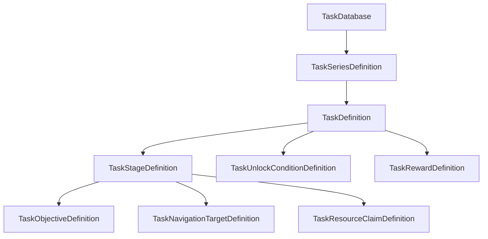
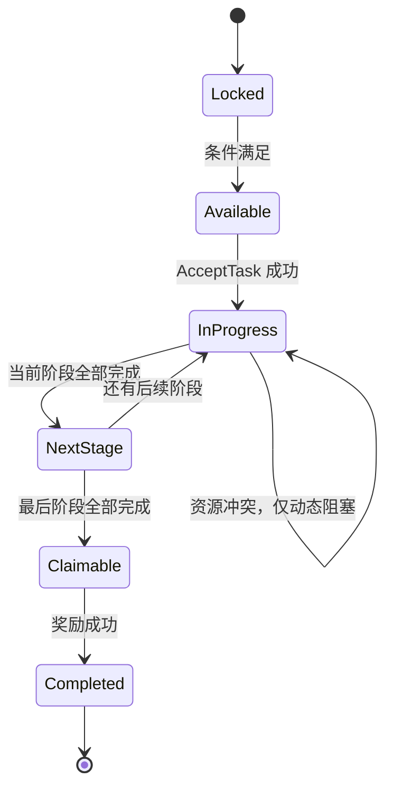
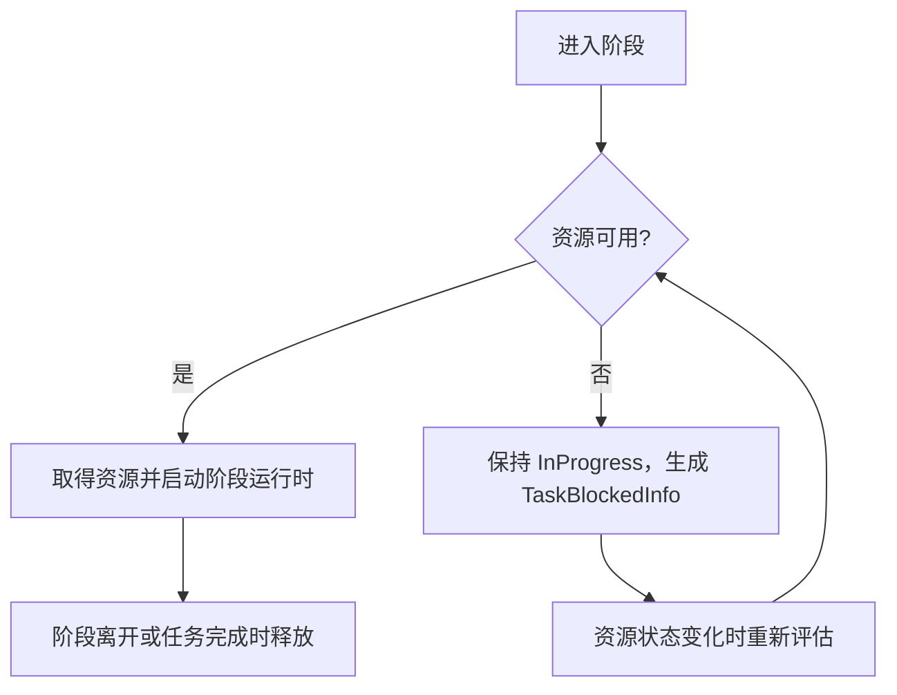
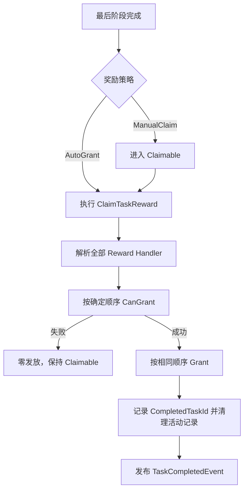
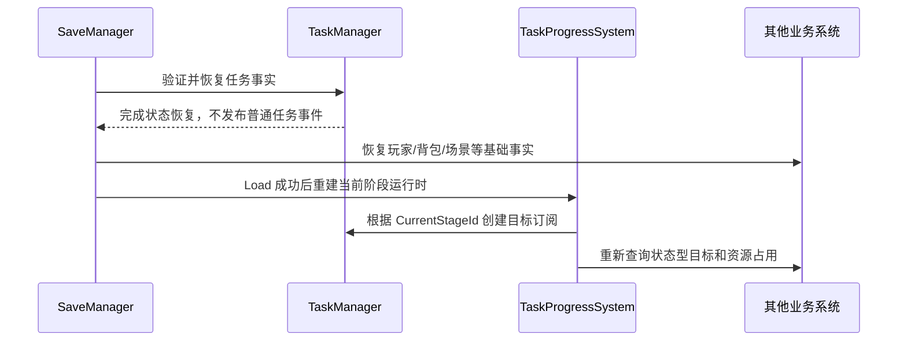

# 任务系统需求说明

> 文档状态：核心剧情任务需求确认稿
> 适用范围：单机 RPG、线性任务阶段、任务链、NPC/场景交互、任务导航和本地存档
> 当前实现基础：`TaskManager`、`TaskRuntime`、`TaskProgressSystem`、`TaskSaveModule`

本文档承接任务产品需求。任务、红点和存档的当前实现边界仍记录在
[`TaskRedDotSaveSystem_Architecture.md`](TaskRedDotSaveSystem_Architecture.md)；两份文档出现冲突时，本文档负责下一阶段产品行为，架构文档负责已落地代码行为。

## 1. 目标与范围

### 1.1 产品目标

任务系统需要让玩家能够：

- 看到主线、支线和其他剧情任务的分类与章节关系。
- 清楚知道当前任务处于哪一个阶段、下一步需要做什么以及为什么暂时不能做。
- 在多个任务并行时只追踪一个任务，并获得稳定的目标导航信息。
- 在 NPC 或场景被其他剧情占用时看到可解释的阻塞原因。
- 保存并恢复当前阶段、目标进度、领奖状态、追踪状态和未读状态。

设计参考了《原神》任务菜单中的分类、章节折叠、当前步骤、奖励和 Navigate 入口，以及角色/地点被其他任务占用时的前置任务提示：

- [Quest Menu 参考](https://genshin-impact.fandom.com/wiki/Quest/Menu)
- [Quest 参考](https://genshin-impact.fandom.com/wiki/Quest)

### 1.2 本阶段包含

- 一次性主线、支线和世界任务。
- 任务链与章节分组。
- 任务内部的线性阶段。
- 多个任务并行、一个任务追踪。
- 条件解锁、统一接取、手动领奖和自动发奖两种奖励策略。
- NPC、场景实体、世界坐标和区域四类导航语义。
- NPC/场景资源独占与可解释阻塞。
- 版本化本地存档迁移。

### 1.3 明确不包含

- 日常、周常、周期重置、随机事件和限时活动任务。
- 任务失败、放弃、重新接取和任务重玩。
- 任务自身的条件分支图、分支回溯和多结局。
- 云存档、加密、历史恢复点和损坏存档自动重置。
- 地图、寻路、HUD、NPC AI 或对话图实现；任务系统只提供业务契约和查询结果。

## 2. 当前基础与目标形态

当前代码已经具备以下事实状态：

| 能力 | 当前状态 |
| --- | --- |
| 稳定 `TaskId`、任务数据库和多态配置 | 已实现 |
| 活动任务、目标整数进度和 `InProgress/Claimable` | 已实现 |
| 目标 Handler 订阅/取消订阅生命周期 | 已实现 |
| 单任务追踪、未读集合和任务事实事件 | 已实现 |
| 任务快照、存档恢复和运行时重建 | 已实现 |
| 接取条件与统一接取流程 | 需求待实现 |
| 任务链、章节和阶段 | 需求待实现 |
| 奖励 Handler 与领奖事务 | 需求待实现 |
| 导航目标、资源占用和阻塞解释 | 需求待实现 |
| 任务查询层、UI 和任务红点数据源 | 需求待实现 |

目标配置层级如下：



### 2.1 稳定标识

- `TaskSeriesId` 标识章节或任务链。
- `TaskId` 标识可独立接取、完成和存档的任务。
- `TaskStageId` 只在所属任务内唯一，标识线性阶段。
- `ObjectiveId` 只在所属阶段内唯一。
- `ResourceKey` 标识 NPC 或场景资源的业务语义，不保存 Unity 对象引用或层级路径。
- Unity 配置字段使用 `string`；运行时索引和 API 使用强类型 ID；存档 JSON 使用 `string`。

## 3. 任务链、任务和阶段

### 3.1 `TaskSeries`

任务链负责展示和顺序关系，不直接保存玩家进度。

- 包含稳定 ID、分类、章节标题、排序和展示图标/背景引用。
- 包含有序 `TaskId` 列表。
- 任务链可以是主线、支线、角色故事或世界任务系列。
- 任务链不创建额外生命周期；玩家状态仍由任务实例和完成 ID 表达。

### 3.2 `TaskDefinition`

任务是一次性可接取单元，包含：

- 稳定 `TaskId`、所属 `TaskSeriesId`、分类、标题、描述和展示信息。
- 接取条件列表，默认全部满足（AND）。
- 有序阶段列表，至少一个阶段。
- 奖励列表和奖励策略 `AutoGrant` 或 `ManualClaim`。
- 后继任务策略 `UnlockOnly` 或 `AutoAccept`。
- 可选的推荐等级、推荐区域和剧情提示。

### 3.3 `TaskStageDefinition`

阶段是任务内部的线性执行单元：

- 具有稳定 `StageId`、标题、描述和排序序号。
- 包含一个或多个目标；阶段内目标默认全部完成才算阶段完成。
- 可声明一个当前导航目标。
- 可声明零个或多个独占资源 Key。
- 可配置进入阶段时发布的业务事实或交给 DialogueSystem 的 Action；任务系统不执行对话分支。
- 阶段完成后自动进入下一个阶段；最后阶段完成后进入奖励流程。

阶段推进时序：



`Blocked` 不是持久化生命周期，而是当前阶段的查询结果：任务仍然是 `InProgress`，但某个交互或导航目标暂时不可执行。

## 4. 解锁、接取与任务链衔接

### 4.1 解锁状态

未接取任务的 `Locked` 和 `Available` 是实时查询结果，不单独存档：

- `Locked`：至少一个条件不满足。
- `Available`：所有条件满足，且任务未活动、未完成。
- 已活动或已完成任务不再返回可接取状态。

条件 Handler 只回答当前是否满足，不主动调用接取 API。条件至少支持：

- 玩家等级或章节进度。
- 前置任务完成。
- 前置任务达到指定阶段。
- 拥有或未拥有指定物品/标签。
- 区域、世界状态或其他业务只读事实。
- 资源冲突导致的可执行性限制。

条件查询必须返回结构化原因，而不是只返回一条字符串。例如：

```text
TaskAvailabilityResult
├─ Status: Locked / Available / Active / Completed
└─ Reasons[]
   ├─ ReasonType: RequiredTask
   ├─ RelatedTaskId: main.chapter01.002
   └─ CanNavigate: true
```

### 4.2 统一接取入口

所有调用方使用同一入口：

```text
TryAcceptTask(TaskId taskId, TaskAcceptSource source) -> TaskAcceptResult
```

调用方包括 NPC、Dialogue Action、剧情触发器、任务链协调器和 UI ViewModel。`source` 只用于日志、调试和埋点，不改变规则。

接取入口按以下顺序执行：

1. 解析任务定义并校验配置。
2. 检查已完成和已活动状态。
3. 实时评估全部接取条件。
4. 创建活动记录，初始化第一个阶段和目标进度。
5. 记录活动序号，供资源冲突排序和存档恢复使用。
6. 将任务加入未读集合并发布接取事实。
7. 创建当前阶段运行时；状态型目标在此时首次查询。
8. 若配置了 `AutoAccept` 后继关系，则在当前任务完成后再次通过同一入口尝试接取后继任务。

后继任务的 `AutoAccept` 尝试失败不会回滚当前任务完成；后继任务保留为 `Available` 或带原因的 `Locked`。

### 4.3 接取失败语义

业务拒绝使用结构化结果：

- `TaskNotFound`
- `AlreadyActive`
- `AlreadyCompleted`
- `ConditionNotMet`
- `BlockedByResource`
- `InvalidConfiguration`

配置契约错误（重复 ID、缺少 Handler、非法阶段顺序）直接抛出或上报，不转换成普通玩家可恢复失败。

## 5. 目标与阶段运行时

### 5.1 目标语义

每个目标归属一个阶段，继续使用当前 `TaskObjectiveHandlerRegistry` 的显式类型注册模式：

- 累计型目标：只统计接取后发生且匹配的领域事实。
- 状态型目标：接取阶段时查询一次；相关业务事件发生后重新查询并覆盖进度。
- 阶段完成只由当前阶段目标决定，后续阶段目标不能提前计入。
- 阶段切换时停止旧阶段目标监听，再创建并启动新阶段目标监听。

目标进度变化发布任务事实事件；存档恢复不重放这些普通事件。

### 5.2 阶段切换约束

- 当前阶段未全部完成时不能手动跳阶段。
- 阶段切换是一次有序状态修改：停止旧运行时、写入新 `StageId`、初始化新目标、重建新运行时。
- 新阶段初始化失败属于配置/集成错误，不能伪造阶段完成。
- 追踪任务切换不影响任何任务阶段或目标进度。

## 6. 导航契约

任务系统提供语义导航，不直接引用地图或 HUD：

```text
TaskNavigationInfo
├─ TaskId
├─ StageId
├─ TargetKind: Npc / SceneEntity / WorldPosition / Area
├─ TargetId or Position/AreaData
├─ DisplayName
├─ RegionId
└─ IsAvailable
```

- `Npc`：使用稳定 NPC/参与者 ID，由场景或 NPC 系统解析当前实例。
- `SceneEntity`：使用稳定场景实体 ID，由场景系统解析位置。
- `WorldPosition`：保存配置坐标和场景/区域 ID。
- `Area`：保存区域 ID、中心和范围，用于探索或范围型目标。
- 当前阶段没有导航配置，或目标暂不可解析时，任务仍可追踪，但导航层只收到 `IsAvailable = false`。
- 任务系统不自动打开地图、不移动玩家、不选择传送点，也不负责寻路。

## 7. NPC/场景资源冲突

### 7.1 资源声明

阶段可以声明独占资源：

```text
TaskResourceClaimDefinition
├─ ResourceKey
├─ ResourceKind: Npc / SceneEntity / Location
└─ BlockMessage / ReleaseCondition
```

资源 Key 不绑定 GameObject；运行时由资源占用 Resolver 查询活动任务阶段。

### 7.2 占用规则

- 阶段进入时尝试取得全部声明资源。
- 没有冲突时取得资源并保持到阶段离开、任务完成或任务被清理。
- 发生冲突时，后激活任务不抢占资源，仍保持 `InProgress`，并返回 `TaskBlockedInfo`。
- 资源持有顺序以持久化 `ActivationOrdinal` 为主，`TaskId` 字典序为稳定平局规则。
- 阻塞信息至少包含资源 Key、当前占用任务、占用阶段和解除条件。
- 阻塞解除后任务无需重新接取；系统重新评估阶段可执行性并发布阻塞变化事实。
- 不自动调整主线优先级、不自动切换追踪任务、不自动取消任务。



## 8. 奖励策略与完成事务

### 8.1 奖励策略

- `AutoGrant`：最后阶段完成后自动执行奖励预检和发放。
- `ManualClaim`：最后阶段完成后进入 `Claimable`，由 UI 或 NPC 调用领奖入口。

两种策略共用同一奖励 Handler 注册表和同一预检规则。

### 8.2 奖励事务



奖励流程约束：

- 所有奖励 `CanGrant` 成功前不能产生副作用。
- 预检失败返回结构化原因，例如背包容量不足；任务保持 `Claimable`。
- `Grant` 失败属于 Handler 契约错误，不伪造完成，不允许静默吞异常。
- 成功完成后删除活动记录和阶段进度，清除追踪与未读状态，记录完成 ID。
- 任务完成后再按任务定义尝试后继任务的 `AutoAccept` 策略。

## 9. 查询、UI 与红点

### 9.1 查询结果

任务查询层至少提供：

- 按分类、章节和状态查询任务列表。
- 任务详情、当前阶段、目标进度和奖励预览。
- `TaskAvailabilityResult` 及可跳转的前置任务。
- 当前追踪任务与 `TaskNavigationInfo`。
- `TaskBlockedInfo` 和解除条件。
- 已完成任务的摘要、完成时间和奖励领取结果（若未来存档记录这些展示字段）。

Query 只读，不修改任务状态；ViewModel 通过 Command 调用接取、领奖、追踪和确认查看。

### 9.2 UI 行为

- 任务列表按分类分组，章节/任务链可折叠。
- 任务详情显示标题、描述、当前阶段、目标进度、奖励策略、导航按钮和阻塞原因。
- 前置条件不满足时显示具体条件，并提供跳转到关联任务的入口。
- 只有显式点击任务条目才确认未读；打开总窗口、切换页签或刷新列表不自动确认。
- 追踪任务最多一个；可领取任务保持追踪，领奖成功后清除追踪，不自动选择下一个。

### 9.3 红点规则

任务红点继续只表示“新接取且未确认查看”的任务：

- 接取成功加入 `UnreadTaskIds`。
- 点击具体任务条目调用 `AcknowledgeTask(TaskId)`。
- 领奖完成时移除未读状态。
- 阶段完成、可领奖、导航可用、资源阻塞都不新增任务红点。

## 10. 存档与迁移

### 10.1 活动任务快照

活动任务至少保存：

```text
TaskRecordSnapshot
├─ TaskId
├─ CurrentStageId
├─ State: InProgress / Claimable
├─ ActivationOrdinal
├─ ObjectiveProgress[]
├─ RewardState
├─ TrackedTaskId（全局字段）
└─ UnreadTaskIds（全局字段）
```

不保存任务定义、Handler 实例、事件句柄、Unity 对象引用、导航解析结果或可派生的阻塞结果。

### 10.2 恢复流程



- 恢复不调用接取 API，不增加目标进度，不发放奖励，不播放普通业务副作用。
- 资源阻塞和状态型目标在依赖业务模块恢复后重新计算。
- 恢复失败时不得部分覆盖当前任务状态。

### 10.3 旧版迁移

- 旧版直接挂在 `TaskDefinition` 下的目标进度迁移到该任务的首个 `TaskStageDefinition`。
- 旧版 `InProgress/Claimable` 状态保持原语义。
- 旧版没有 `ActivationOrdinal` 时按活动记录稳定排序生成，并立即在下一次保存时写入。
- TaskId、StageId、ObjectiveId 无法匹配定义时拒绝加载并保持当前状态不变。
- 迁移必须按模块版本链执行，不在业务查询期间隐式修复存档。

## 11. 业务边界与接口方向

### 11.1 任务核心

`TaskManager` 继续只持有任务事实；不直接依赖战斗、背包、对话、地图、UI 或 NPC GameObject。

`TaskProgressSystem` 继续负责跨业务编排、目标运行时生命周期和存档恢复后的订阅重建。

### 11.2 待实现契约

下一阶段按现有显式注册模式定义：

- `ITaskUnlockConditionHandler`：评估接取条件并返回结构化原因。
- `ITaskObjectiveHandler`：创建阶段目标运行时。
- `ITaskRewardHandler`：执行 `CanGrant` 与 `Grant`。
- `ITaskNavigationResolver`：把语义导航目标解析成当前世界导航信息。
- `ITaskResourceOccupancyResolver`：取得、释放和查询资源占用。
- 任务 Command：接取、领奖、追踪、清除追踪和确认查看。
- 任务 Query：列表、详情、可用性、导航和阻塞信息。

### 11.3 任务事实事件

在现有事件基础上补充：

- `TaskStageChangedEvent`
- `TaskBlockedChangedEvent`
- `TaskNavigationChangedEvent`
- `TaskRewardClaimableEvent`
- `TaskRewardClaimFailedEvent`

事件只表达已经发生的事实；接取、推进和领奖的核心顺序由 Command/System 保证。

## 12. 验收场景

### 12.1 任务与阶段

- 多阶段任务依次推进，当前阶段未完成时不能跳转。
- 阶段切换只重建新阶段目标订阅，不保留旧阶段事件句柄。
- 加载后恢复准确 `StageId` 和每个目标的当前值。
- 并行任务切换追踪不改变任何任务进度。

### 12.2 条件与任务链

- 条件不满足时返回具体原因和可跳转关联任务。
- NPC、Dialogue Action、剧情触发器和任务链使用同一接取入口。
- `UnlockOnly` 后继任务只变为可用；`AutoAccept` 后继任务尝试自动接取。
- 自动接取失败不回滚已经完成的前置任务。

### 12.3 冲突与导航

- 资源冲突指出 ResourceKey、占用任务、占用阶段和解除条件。
- 资源解除后任务无需重新接取即可继续。
- 任务追踪后能返回四类导航信息；目标不可解析时不伪造路标。

### 12.4 奖励与存档

- 自动奖励成功后直接完成；预检失败时零发放并保持可重试状态。
- 手动领奖在成功前保持 `Claimable`，成功后清理活动、追踪和未读事实。
- 旧版单阶段快照迁移到首个阶段。
- 未知 Task/Stage ID 不部分覆盖当前状态。
- 加载不重复接取、增加进度、发奖或发布普通任务副作用事件。

### 12.5 红点

- 新接取任务增加对应分类未读计数。
- 打开任务窗口不清除未读；点击具体任务条目才确认。
- 阶段完成、可领奖、导航变化和资源阻塞不产生任务红点。

## 13. 后续实现顺序

1. 扩展配置模型和数据库校验，加入 Series/Stage 稳定 ID。
2. 实现统一接取、条件 Handler 和任务链衔接。
3. 把目标运行时从任务级调整为当前阶段级。
4. 实现奖励 Handler、自动/手动领奖和完成事务。
5. 接入导航 Resolver 与资源 Occupancy Resolver。
6. 升级任务存档快照及迁移链。
7. 实现 Query、红点数据源和 UI ViewModel。
8. 用 Odin 手动测试覆盖本文档的验收场景，并补充 Unity 生命周期、场景和交互验证。
