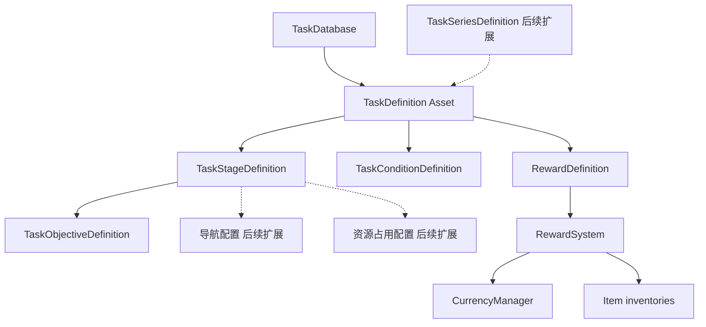
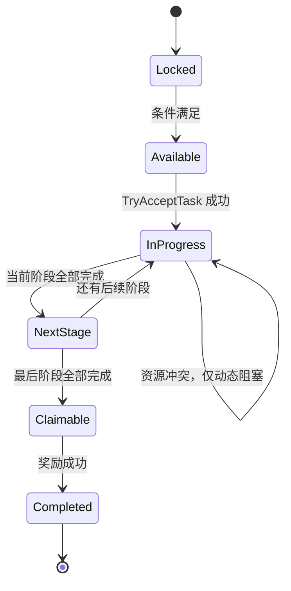
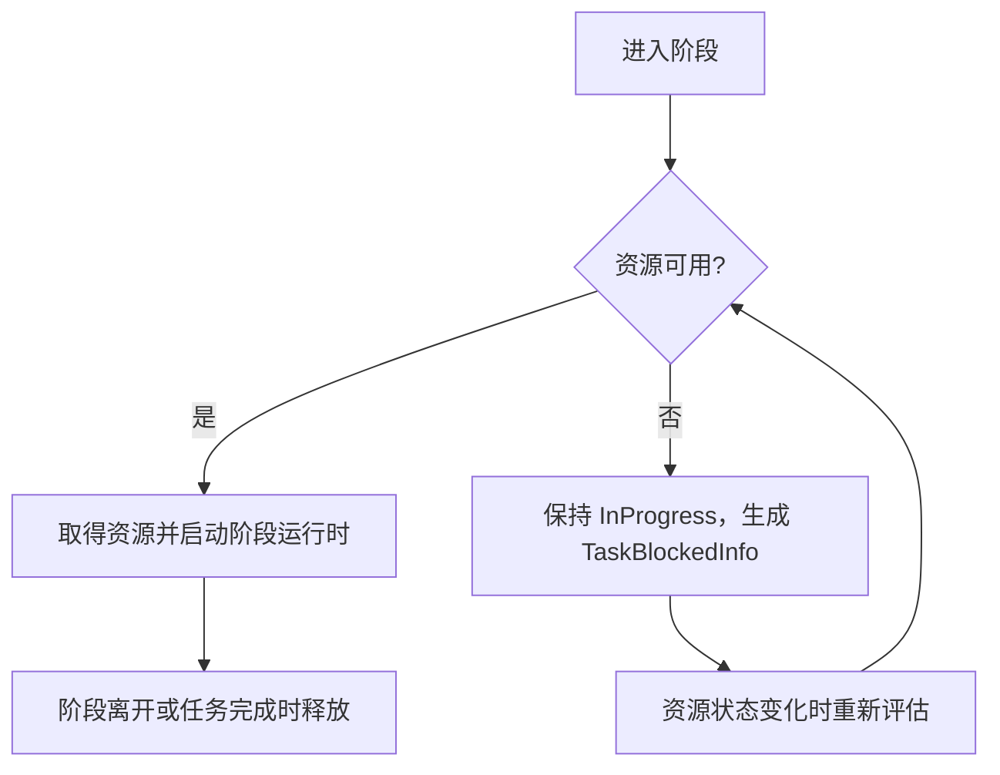
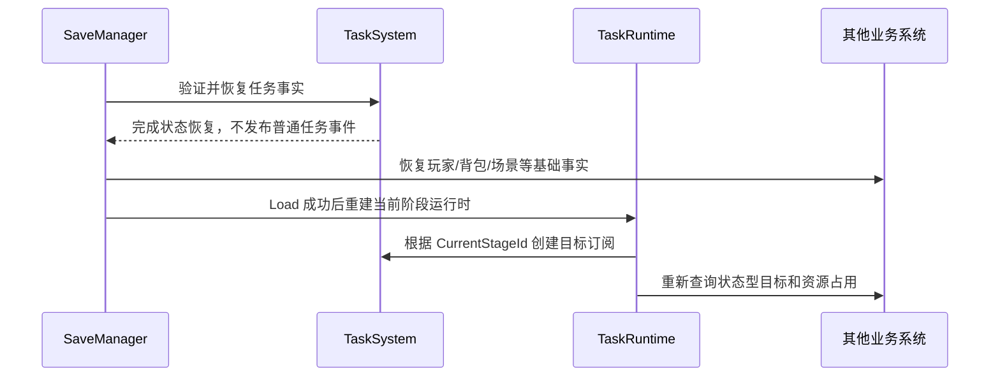

# 任务系统需求说明

> 文档状态：核心剧情任务需求与当前实现边界
> 适用范围：单机 RPG、线性任务阶段、任务链、NPC/场景交互、任务导航和本地存档
> 当前实现版本：任务生命周期 v2；手动领奖已接入货币、可堆叠道具、武器和圣遗物奖励；基础运行时任务窗口与未读红点已接入

本文档承接任务产品需求。任务系统当前代码行为与数据模型见
[`TaskSystem_Architecture.md`](TaskSystem_Architecture.md)；两份文档出现冲突时，本文档负责后续产品行为，架构文档负责已落地代码行为。

## 1. 目标与范围

### 1.1 产品目标

任务系统需要让玩家能够：

- 看到主线、支线和其他剧情任务的分类与章节关系。
- 清楚知道当前任务处于哪一个阶段、下一步需要做什么以及为什么暂时不能做。
- 在多个任务并行时只追踪一个任务，并获得稳定的目标导航信息。
- 在 NPC 或场景被其他剧情占用时看到可解释的阻塞原因。
- 保存并恢复当前阶段、目标进度、领奖状态、追踪状态和未读状态。

设计参考了《原神》任务菜单中的分类、章节折叠、当前步骤、奖励和 Navigate 入口，以及角色/地点被其他任务占用时的前置任务提示：

- [Quest Menu 参考](https://genshin-impact.fandom.com/wiki/Quest/Menu)
- [Quest 参考](https://genshin-impact.fandom.com/wiki/Quest)

### 1.2 完整产品目标范围

下列条目描述任务系统的完整产品目标，不代表本次都已实现；当前代码边界以第 2 节状态表为准。

- 一次性主线、支线和世界任务。
- 任务链与章节分组。
- 任务内部的线性阶段。
- 多个任务并行、一个任务追踪。
- 条件解锁、统一接取、手动领奖和自动发奖两种奖励策略。
- NPC、场景实体、世界坐标和区域四类导航语义。
- NPC/场景资源独占与可解释阻塞。
- 版本化本地存档迁移。

### 1.3 明确不包含

- 日常、周常、周期重置、随机事件和限时活动任务。
- 任务失败、放弃、重新接取和任务重玩。
- 任务自身的条件分支图、分支回溯和多结局。
- 云存档、加密、历史恢复点和损坏存档自动重置。
- 地图、寻路与导航 HUD、NPC AI 和任务来源交互；基础任务窗口按第 9 节描述，任务目标可以消费对话系统提供的完成事实，但不负责实现对话图。

## 2. 当前基础与目标形态

下表区分本轮已经落地的核心流程和仍属后续产品目标的功能：

| 能力 | 当前状态 |
| --- | --- |
| 每任务独立 `TaskDefinition` 资产、按 `TaskId` 索引及配置校验 | 已实现 |
| 按顺序执行任务阶段；当前阶段目标全部完成后推进 | 已实现 |
| 统一资格查询和接取 API；前置任务已完成条件 | 已实现 |
| Objective Definition 创建 Runtime、阶段监听与切换、追踪、未读和任务事实事件 | 已实现 |
| 引用指定 `DialogueAsset` 并在其正常结束时累计目标进度 | 已实现；首个正式玩法目标 |
| 手动提交通用奖励；摩拉、原石、可堆叠物品、武器和圣遗物统一预检与发放 | 已实现 |
| 保存当前阶段进度、活动状态、追踪、未读和完成 ID；任务模块 v2 | 已实现 |
| 任务链/章节、更多接取条件和新的奖励类型 | 后续扩展 |
| 对话目标 NPC 导航与 HUD 世界标记 | 已实现；其他导航类型、资源占用和阻塞解释后续扩展 |
| 基础活动任务 UI、统一打开入口和任务未读红点数据源 | 已接入；当前不展示未接取任务 |
| 更完整的任务查询层、正式 NPC/剧情接取调用方 | 后续扩展 |

当前配置层级为数据库引用多个独立任务资产，每个任务资产包含条件、顺序阶段、目标和奖励：


```mermaid
flowchart TD
    Database[TaskDatabase] --> Task[TaskDefinition Asset]
    Task --> Stage[TaskStageDefinition]
    Stage --> Objective[TaskObjectiveDefinition]
    Task --> Unlock[TaskConditionDefinition]
    Task --> Reward[RewardDefinition]
    Reward --> RewardSystem[RewardSystem]
    RewardSystem --> Wallet[CurrencyManager]
    RewardSystem --> Inventory[Item inventories]
    Series[TaskSeriesDefinition 后续扩展] -.-> Task
    Stage -.-> Navigation[导航配置 后续扩展]
    Stage -.-> Resource[资源占用配置 后续扩展]
```

### 2.1 稳定标识

- `TaskSeriesId` 标识章节或任务链。
- `TaskId` 标识可独立接取、完成和存档的任务。
- `TaskStageId` 只在所属任务内唯一，标识线性阶段。
- `ObjectiveId` 只在所属阶段内唯一。
- `ResourceKey` 标识 NPC 或场景资源的业务语义，不保存 Unity 对象引用或层级路径。
- Unity 配置字段使用 `string`；运行时索引和 API 使用强类型 ID；存档 JSON 使用 `string`。

## 3. 任务链、任务和阶段

### 3.1 `TaskSeries`（后续扩展）

任务链负责展示和顺序关系，不直接保存玩家进度；当前代码尚未实现任务链或章节配置。

- 包含稳定 ID、分类、章节标题、排序和展示图标/背景引用。
- 包含有序 `TaskId` 列表。
- 任务链可以是主线、支线、角色故事或世界任务系列。
- 任务链不创建额外生命周期；玩家状态仍由任务实例和完成 ID 表达。

### 3.2 `TaskDefinition`

当前 `TaskDefinition` 是每任务一个 ScriptableObject 资产的一次性可接取单元，包含：

- 稳定 `TaskId`、由静态分类表约束的 `TaskCategoryId`、标题和描述。首批分类为 `main`（主线）与 `side`（支线）；任务资产在 Inspector 中通过下拉框选择，显示名称调整不改变已保存 ID。
- 接取条件列表，全部满足（AND）；当前支持“前置任务已完成”。
- 有序阶段列表，至少一个阶段。
- 奖励列表使用通用 `RewardDefinition` 多态配置，当前支持货币和物品奖励，并统一手动领取。

任务链归属、奖励策略、自动接取、推荐信息和更多展示字段属于后续扩展。

新增任务分类时需在 `TaskCategoryCatalog` 中登记稳定 ID 和显示名称；任务资产 Drawer 与任务配置校验共用该表。

### 3.3 `TaskStageDefinition`

阶段是任务内部的线性执行单元：

- 具有所属任务内唯一的 `TaskStageId`、标题和描述；列表位置就是执行顺序。
- 包含一个或多个目标；阶段内目标默认全部完成才算阶段完成。
- `ObjectiveId` 在所属阶段内唯一。
- 导航目标和独占资源声明尚未接入。
- 可配置进入阶段时发布的业务事实或交给 DialogueSystem 的 Action；任务系统不执行对话分支。
- 阶段完成后自动进入下一个阶段；最后阶段完成后进入 `Claimable`，等待显式领奖。

阶段推进时序：


```mermaid
stateDiagram-v2
    [*] --> Locked
    Locked --> Available: 条件满足
    Available --> InProgress: TryAcceptTask 成功
    InProgress --> InProgress: 当前阶段目标变化
    InProgress --> InProgress: 资源冲突，仅动态阻塞
    InProgress --> NextStage: 当前阶段全部完成
    NextStage --> InProgress: 还有后续阶段
    NextStage --> Claimable: 最后阶段全部完成
    Claimable --> Completed: 奖励成功
    Completed --> [*]
```

`Blocked` 不是持久化生命周期，而是当前阶段的查询结果：任务仍然是 `InProgress`，但某个交互或导航目标暂时不可执行。

## 4. 解锁、接取与任务链衔接

### 4.1 解锁状态

未接取任务的 `Locked` 和 `Available` 是实时查询结果，不单独存档：

- `Locked`：至少一个条件不满足。
- `Available`：所有条件满足，且任务未活动、未完成。
- 已活动或已完成任务不再返回可接取状态。

通过 `TaskSystem.GetAvailability(TaskId)` 查询资格。条件 Handler 只回答当前是否满足，不主动调用接取 API。当前实现只有“前置任务已完成”；以下条件仍待扩展：

- 玩家等级或章节进度。
- 前置任务完成。
- 前置任务达到指定阶段。
- 拥有或未拥有指定物品/标签。
- 区域、世界状态或其他业务只读事实。
- 资源冲突导致的可执行性限制。

资格结果包含 `NotFound / Locked / Available / Active / Completed` 状态和结构化原因。当前结构化原因记录前置 `TaskId` 与可读说明，例如：

```text
TaskAvailabilityResult
├─ Status: NotFound / Locked / Available / Active / Completed
└─ Reasons[]
   ├─ ReasonType: RequiredTask
   ├─ RelatedTaskId: main.chapter01.002
   └─ CanNavigate: true
```

### 4.2 统一接取入口

所有来源都通过 `TaskSystem.TryAcceptTask` 使用同一入口：

```text
TryAcceptTask(TaskId taskId, TaskAcceptSource source) -> TaskAcceptResult
```

计划中的调用方包括 NPC、Dialogue Action、剧情触发器、任务链协调器和 UI ViewModel；这些正式入口目前尚未接入。`source` 只用于日志、调试和埋点，不改变规则。

接取入口按以下顺序执行：

1. 解析任务定义并校验配置。
2. 检查任务是否已完成或已活动，并评估接取条件。
3. 确认静态任务配置有效；不提前创建各阶段 Runtime。
4. 创建临时活动记录并启动首阶段监听。
5. 监听建立成功后才提交接取事实、加入未读集合并发布接取事件。

存档恢复使用专用恢复入口，不调用接取 API。调用来源只写入接取事实事件和诊断日志，不改变资格判断。任务链自动接取尚未实现。

### 4.3 接取失败语义

业务拒绝通过 `TaskAcceptResult` 或 `TaskClaimResult` 返回结构化结果。当前 `TaskCommandFailure` 包含：

- `TaskNotFound`
- `AlreadyActive`
- `AlreadyCompleted`
- `ConditionNotMet`
- `NotClaimable`（领奖时）
- `RewardClaimInProgress`（同一任务已有领奖流程执行时）
- `RewardRejected`（货币钱包预检或发放拒绝）

任务不存在、已活动、已完成、条件未满足分别映射为 `TaskNotFound`、`AlreadyActive`、`AlreadyCompleted`、`ConditionNotMet`。重复 ID、Definition 创建 Runtime 失败、非法阶段或奖励配置直接抛出或上报，不转换成普通玩家可恢复失败。资源阻塞与配置错误结果尚未实现。

## 5. 目标与阶段运行时

### 5.1 目标语义

每个目标归属一个阶段；Objective Definition 负责创建独立的目标 Runtime，配置对象不保存运行状态：

- 当前正式目标 `TaskDialogueCompletedObjectiveDefinition` 引用一个 `DialogueAsset`，并可选填 NPCId 作为导航来源；目标 Runtime 在当前阶段监听 `DialogueEndedEvent`。只有该资源以 `DialogueEndStatus.Completed` 结束时增加 1，`Required` 默认 1。开始会话、失败结束、其他资源和监听启动前的历史会话均不补计。
- 其他玩法目标通过自己的 Definition 工厂创建相应 Runtime；新的目标类型无需加入 Objective Handler 注册表。
- 阶段完成只由当前阶段目标决定，后续阶段目标不能提前计入。
- 阶段切换时停止旧阶段目标监听，再创建并启动新阶段目标监听。

目标进度变化发布任务事实事件；存档恢复只恢复目标进度并重新建立当前阶段监听，不重放对话结束或任务进度事件。任务 v2 快照不保存 DialogueAsset 或 NPC 引用，这些配置始终来自静态任务定义。

### 5.2 阶段切换约束

- 当前阶段未全部完成时不能手动跳阶段。
- 阶段切换是一次有序状态修改：停止旧运行时、写入新阶段进度、建立并启动新阶段监听；成功后才发布阶段切换事件。
- 新阶段初始化失败属于配置/集成错误，不能伪造阶段完成。Definition 创建 Runtime 或建立监听时发生的集成错误会在运行期暴露。
- 追踪任务切换不影响任何任务阶段或目标进度。

## 6. NPC 导航契约

对话 Objective 可以配置稳定 NPCId。配置了 NPCId 时，其 Runtime 在启动监听时从 GameArchitecture 获取并缓存 NPCManager，再按 ID 查询当前场景 NPC 锚点。TaskStageRuntime 按配置顺序选择首个未完成且声明导航能力的 Runtime，TaskSystem 将最终 Transform 暴露给 HUD 查询。NPC 未加载时查询失败并隐藏指示标，不跳到后续目标。该查询不改变 Objective 完成条件、不写入任务记录，也不进入存档。

任务层只提供目标 Transform，不依赖 HUD，也不保存 Transform 到任务记录或存档：

```text
TaskSystem.TryGetTrackedNavigationTarget(out Transform target)
```

- NPC 使用区分大小写的稳定 ID，由 NPCManager 解析当前已加载实例及显式导航锚点。
- 当前阶段没有导航配置，或首个选定 NPC 暂不可解析时，任务仍可追踪，查询返回 `false`。
- SceneEntity、WorldPosition 和 Area 导航类型留待对应目标类型接入时定义。
- 任务系统不自动打开地图、不移动玩家、不选择传送点，也不负责寻路。

## 7. NPC/场景资源冲突（后续能力）

### 7.1 资源声明

阶段可以声明独占资源：

```text
TaskResourceClaimDefinition
├─ ResourceKey
├─ ResourceKind: Npc / SceneEntity / Location
└─ BlockMessage / ReleaseCondition
```

资源 Key 不绑定 GameObject；运行时由资源占用 Resolver 查询活动任务阶段。

### 7.2 占用规则

- 阶段进入时尝试取得全部声明资源。
- 没有冲突时取得资源并保持到阶段离开、任务完成或任务被清理。
- 发生冲突时，后激活任务不抢占资源，仍保持 `InProgress`，并返回 `TaskBlockedInfo`。
- 资源持有顺序以持久化 `ActivationOrdinal` 为主，`TaskId` 字典序为稳定平局规则。
- 阻塞信息至少包含资源 Key、当前占用任务、占用阶段和解除条件。
- 阻塞解除后任务无需重新接取；系统重新评估阶段可执行性并发布阻塞变化事实。
- 不自动调整主线优先级、不自动切换追踪任务、不自动取消任务。


```mermaid
flowchart TD
    EnterStage[进入阶段] --> Acquire{资源可用?}
    Acquire -->|是| Own[取得资源并启动阶段运行时]
    Acquire -->|否| Block[保持 InProgress，生成 TaskBlockedInfo]
    Block --> Recheck[资源状态变化时重新评估]
    Recheck --> Acquire
    Own --> Release[阶段离开或任务完成时释放]
```

## 8. 奖励策略与完成事务

### 8.1 当前奖励策略

- 当前只支持手动领取：最后阶段完成后进入 `Claimable`，调用 `TaskSystem.TryClaimReward(TaskId)` 领奖。
- 当前通过通用 `RewardSystem` 发放摩拉、原石、可堆叠物品、武器和圣遗物；装备奖励创建未装备实例。
- 更广泛的自动发奖策略和新的奖励领域按后续业务需求扩展。

### 8.2 奖励事务


```mermaid
flowchart TD
    CompleteStage[最后阶段完成] --> Claimable[进入 Claimable]
    Claimable --> Preflight[RewardSystem 准备全部领域批次]
    Preflight -->|失败| Keep[零发放，保持 Claimable，可重试]
    Preflight -->|成功| Grant[统一提交货币与物品数据]
    Grant --> Finish[移除活动记录并记录 CompletedTaskId]
    Finish --> Event[发布奖励和任务事实事件]
```

奖励流程约束：

- 奖励系统先合并重复货币和物品项，并无副作用准备涉及的全部钱包与库存批次；任一领域拒绝时整包不写入。
- 货币上限、可堆叠数量上限、武器或圣遗物容量不足时任务保持 `Claimable`，条件恢复后可重试。
- 全部奖励数据提交后才记录任务完成事实，再发送领域通知；通知异常会记录日志，不会撤销已提交奖励。
- 成功完成后删除活动记录和阶段进度，清除追踪与未读状态，记录完成 ID。
- 发放成功后才执行任务完成提交；自动接取后继任务尚未实现。

## 9. 查询、UI 与红点

### 9.1 查询结果

任务查询层至少提供：

- 按分类、章节和状态查询任务列表。
- 任务详情、当前阶段、目标进度和奖励预览。
- `TaskAvailabilityResult` 及可跳转的前置任务。
- 当前追踪任务的 `TaskSystem.TryGetTrackedNavigationTarget(out Transform)` 查询。
- `TaskBlockedInfo` 和解除条件。
- 已完成任务的摘要、完成时间和奖励领取结果（若未来存档记录这些展示字段）。

Query 只读，不修改任务状态；ViewModel 通过 Command 调用接取、领奖、追踪和确认查看。

### 9.2 UI 行为

当前已接入的 `TaskWindow` 只显示活动任务：主线和支线分别分区，列表按 `TaskId` 排序；进行中和待领奖任务均保留在列表中。首次打开优先选中追踪任务，否则选择第一条活动任务。没有活动任务时显示空状态。J 快捷键和 HUD TaskButton 使用同一打开流程；HUD 会在任务窗口打开前隐藏，并在任务窗口关闭后恢复。已有其他全屏窗口显示或过渡期间，不叠开任务窗口。

详情显示任务标题、描述、所有当前阶段目标的说明和进度，以及货币与物品奖励预览。目标完成标记使用独立图像；完成文字字号略小并显示为低对比度灰色。追踪操作调用任务系统的追踪 API；待领奖任务显示单独的领奖按钮。领奖业务拒绝时保留任务并显示失败原因，成功后从活动列表移除。只有当前选中任务的详情实际显示后，才确认该任务已读；打开窗口不批量清除其他未读任务。Reward UI 只读配置，不负责发放奖励。

HUD 左侧摘要只显示当前追踪的活动任务，包含任务标题和当前阶段的全部目标进度；完成目标保留在列表并显示绿色图像标记，完成文字较小且显示为低对比度灰色。任务待领奖时摘要仍显示绿色“可领取奖励”，取消追踪或领奖完成后隐藏。该 HUD 只展示任务事实，不接收点击，也不确认任务未读。目标说明按“目标说明、阶段标题、完成目标”顺序回退；存在匹配的导航位置时显示三维距离，没有位置来源时隐藏距离行。摘要和目标行使用 UGUI LayoutGroup 管理排布。

中间世界标记由追踪任务的当前阶段目标驱动。对话目标可选配置 NPCId；任务层选择首个未完成且具备导航能力的目标，对话 Runtime 在启动监听时获取并缓存 NPCManager，再查询已加载 NPC 的显式锚点 Transform。HUD 仅在任务为 `InProgress` 且目标 Transform 可用时投影标记；NPC 暂未加载时隐藏标记和距离，场景注册后自动显示。屏幕外或相机背后的目标显示在安全边缘并旋转方向箭头。

~~~mermaid
flowchart LR
    Facts[TaskSystem：追踪任务与阶段目标事实] --> Tracker[HUD 左侧摘要]
    Runtime[Objective Runtime：NPCId 查询锚点] --> Facts[TaskSystem 导航查询]
    Facts --> Gate{追踪任务有可用目标且 InProgress?}
    Player[活动角色] --> Marker[HUD 世界标记]
    Camera[MainCamera 投影] --> Marker
    Gate -->|是| Marker
    Gate -->|否| Hidden[隐藏标记与距离行]
~~~

以下属于完整产品目标，尚未由当前基础窗口实现：

- 任务列表按分类分组，章节/任务链可折叠。
- 任务详情显示标题、描述、当前阶段、目标进度、奖励策略、导航按钮和阻塞原因。
- 前置条件不满足时显示具体条件，并提供跳转到关联任务的入口。
- 完整查询层、未接取任务的资格浏览和已完成任务摘要。

### 9.3 红点规则

已接入的任务红点只表示活动任务中“新接取且未确认查看”的数量，并按主线、支线分开聚合：

- 接取成功加入 `UnreadTaskIds`。
- 当前选中任务的详情实际展示后调用 `AcknowledgeTask(TaskId)`；初次打开窗口时默认选中的任务也会在显示后确认。
- 领奖完成时移除未读状态。
- 阶段完成、可领奖、导航可用、资源阻塞都不新增任务红点。
- `TaskSystem` 在未读集合变化及存档恢复后重算分类数量，直接写入 RedDotSystem 的 Task 主线／支线节点；RedDotSystem 负责帧末聚合和徽标通知。

## 10. 存档与迁移

### 10.1 活动任务快照

当前 v2 活动任务快照保存：

```text
TaskRecordSnapshot
├─ TaskId
├─ CurrentStageId
├─ State: InProgress / Claimable
├─ ObjectiveProgress[]
├─ TrackedTaskId（全局字段）
├─ CompletedTaskIds（全局字段）
└─ UnreadTaskIds（全局字段）
```

不保存任务定义、Handler 实例、事件句柄、Unity 对象引用、导航解析结果或可派生的阻塞结果。

### 10.2 恢复流程


```mermaid
sequenceDiagram
    participant Save as SaveManager
    participant Task as TaskSystem
    participant Runtime as TaskRuntime
    participant World as 其他业务系统
    Save->>Task: 验证并恢复任务事实
    Task-->>Save: 完成状态恢复，不发布普通任务事件
    Save->>World: 恢复玩家/背包/场景等基础事实
    Save->>Runtime: Load 成功后重建当前阶段运行时
    Runtime->>Task: 根据 CurrentStageId 创建目标订阅
    Runtime->>World: 重新查询状态型目标和资源占用
```

- 恢复不调用接取 API，不增加目标进度，不发放奖励，不播放普通业务副作用。
- 资源阻塞和状态型目标在依赖业务模块恢复后重新计算。
- 恢复失败时不得部分覆盖当前任务状态。

### 10.3 版本策略

- 任务快照模块版本当前为 v2，包含当前阶段 ID 和当前阶段目标进度。
- 按已确认的项目情况，目前没有实际任务存档槽位，因此本次不提供 v1 到 v2 迁移。
- 任务、阶段或目标 ID 无法匹配定义时拒绝恢复并保持当前状态不变；存档模块的通用版本迁移机制仍按需使用。

## 11. 业务边界与接口方向

### 11.1 任务核心

`TaskConfigManager` 持有已校验的任务数据库引用并按 `TaskId` 查询定义。`TaskSystem` 管理玩家任务集合、全局追踪和未读事实，并负责接取、领奖、存档与恢复编排。

每个活动任务由 `TaskRuntime` 持有唯一 `TaskRecord`；它推进整条任务阶段。`TaskStageRuntime` 管理当前阶段，目标运行时负责最低层领域事件监听与自身导航解析。对话 ObjectiveRuntime 在启动监听时从 GameArchitecture 获取 NPCManager，并用稳定 ID 查询当前场景锚点；通用 Objective 上下文只提供任务身份和进度操作，HUD 只消费任务系统返回的 Transform。

### 11.2 已实现与待实现契约

已经提供的业务契约与 API：

- `TaskObjectiveDefinition.CreateRuntime`：由静态目标配置创建任务实例独有的 Objective Runtime。
- `ITaskConditionHandler`：评估接取条件并返回结构化原因；目前注册前置任务已完成 Handler。
- `TaskConfigManager.TryGetDefinition` 与 `GetRequiredDefinition`。
- `TaskSystem.GetAvailability`、`TryAcceptTask`、`TryClaimReward`、`TryGetTrackedNavigationTarget`、追踪、未读和快照入口。
- `TaskRuntime`、`TaskStageRuntime` 与目标运行时的分层生命周期。
- `RewardSystem.CanGrant` 与 `RewardSystem.TryGrant`；任务领奖由 `TaskSystem` 统一编排。
- `CurrencyRewardDefinition` 支持现有摩拉和原石；`ItemRewardDefinition` 支持可堆叠物品、武器和圣遗物。

后续按现有显式注册模式扩展：

- 更多接取条件与奖励 Handler；默认 Handler 在 `RewardHandlerRegistry.RegisterDefault` 显式登记。
- `ITaskNavigationResolver`：把语义导航目标解析成当前世界导航信息。
- `ITaskResourceOccupancyResolver`：取得、释放和查询资源占用。
- 完整任务列表与详情 Query、未接取任务的资格浏览及正式 NPC/剧情接取调用方。

### 11.3 任务事实事件

当前已提供 `TaskAcceptedEventArgs`、`TaskObjectiveProgressChangedEventArgs`、`TaskStageChangedEventArgs`、`TaskStateChangedEventArgs`、`TaskRewardClaimableEventArgs`、`TaskCompletedEventArgs`、`TaskTrackedChangedEventArgs` 和 `TaskAcknowledgedEventArgs`。后续导航与占用能力再补充：

- `TaskBlockedChangedEvent`
- `TaskNavigationChangedEvent`
- `TaskRewardClaimFailedEvent`

事件只表达已经发生的事实；接取、推进和领奖的核心顺序由 Command/System 保证。

## 12. 验收场景

### 12.1 任务与阶段

- 多阶段任务依次推进，当前阶段未完成时不能跳转。
- 阶段切换只重建新阶段目标订阅，不保留旧阶段事件句柄。
- 加载后恢复准确 `StageId` 和每个目标的当前值。
- 并行任务切换追踪不改变任何任务进度。

### 12.2 条件与任务链

- 条件不满足时返回具体原因和可跳转关联任务。
- NPC、Dialogue Action、剧情触发器和任务链使用同一接取入口。
- `UnlockOnly` 后继任务只变为可用；`AutoAccept` 后继任务尝试自动接取。
- 自动接取失败不回滚已经完成的前置任务。

### 12.3 冲突与导航

- 资源冲突指出 ResourceKey、占用任务、占用阶段和解除条件。
- 资源解除后任务无需重新接取即可继续。
- 任务追踪后能返回四类导航信息；目标不可解析时不伪造路标。

### 12.4 奖励与存档

- 自动奖励成功后直接完成；预检失败时零发放并保持可重试状态。
- 手动领奖在成功前保持 `Claimable`，成功后清理活动、追踪和未读事实。
- 旧版单阶段快照迁移到首个阶段。
- 未知 Task/Stage ID 不部分覆盖当前状态。
- 加载不重复接取、增加进度、发奖或发布普通任务副作用事件。

### 12.5 红点

- 新接取任务增加对应分类未读计数。
- 只有详情实际展示的当前任务才会确认；打开时默认展示的任务也会确认，其他未读任务保持未读。
- 阶段完成、可领奖、导航变化和资源阻塞不产生任务红点。
- `TaskSystem` 直接更新 RedDotSystem 的分类节点，HUD TaskButton Prefab 中的 `RedDotUGUIBadge` 订阅聚合根并显示未读数量。

### 12.6 HUD 追踪摘要与测试标记

- 无追踪任务或追踪任务领奖完成时，左侧摘要和目标标记隐藏；切换追踪后摘要只显示新任务。
- 当前阶段多个目标同时显示；未完成目标按事件更新，已完成目标保留绿色完成标记；阶段切换后只显示新阶段目标。
- `Claimable` 状态保留摘要并显示领奖提示，世界标记隐藏；取消追踪后不再显示摘要或距离。
- HUD 展示不会调用 `AcknowledgeTask()`，不清除未读状态；HUD 开关及读档不会重复订阅或累计目标进度。
- 当前追踪任务处于 `InProgress` 且阶段首个未完成导航目标可解析时显示中间世界标记与左侧距离；NPC 暂未加载或没有目标时隐藏。
- 屏幕内目标显示标记和整数米数；屏幕外及相机背后目标被限制到视口安全边缘，方向箭头指向目标方向。
- 任务测试按钮只负责接取或追踪，不传入 HUD 导航目标；NPC 导航由 Objective 配置、NPCIdentity 注册和 TaskSystem 查询驱动。

## 13. 后续实现顺序

1. 补足已接入目标与任务窗口的 Unity 生命周期、场景和运行时交互验证。
2. 接入正式 NPC/剧情接取调用方及完整资格查询界面。
3. 按后续需求扩展奖励领域与自动奖励策略。
4. 增加任务链/章节、导航 Resolver 与资源 Occupancy Resolver。
5. 若未来存在需要保留的旧版本任务存档，再按真实数据添加迁移器。

## 14. 任务配置编辑器

当前任务配置编辑器用于维护 `TaskDatabase` 和独立 `TaskDefinition` 资产，通过菜单 `RPG > TaskSystem > 任务配置编辑器` 打开，也支持双击对应资产进入。它属于 Editor 工具，不会创建运行时任务实例。

~~~mermaid
flowchart LR
    User[编辑者] --> Window[任务配置编辑器]
    Window --> Database[TaskDatabase 选择与登记]
    Window --> List[搜索、筛选、排序和右键操作]
    Window --> Detail[任务、条件、阶段、目标和奖励]
    Detail -->|SerializedObject 和 Undo| Definition[TaskDefinition 资产]
    Window --> Settings[ProjectSettings 中的后缀与编号设置]
~~~

- 支持当前数据库、项目全部任务、未加入当前数据库三种列表范围；搜索 TaskId、标题和资源路径，按分类过滤，并按 TaskId、分类或标题升降序排列。
- 任务行右键提供重命名、复制、定位、加入/移出数据库和删除；列表空白处右键提供按“分类 > 后缀”新建、刷新和校验。删除会清理所有 `TaskDatabase` 对目标资产的引用；其他任务的前置引用由校验报告。
- TaskId 由稳定分类 ID、分类共享递增编号和可选后缀组成，如 `main_001` 与 `side_001_dialogue`。编号至少三位，超过 999 自动扩位；任务删除后编号不复用。后缀配置修改不会改写已有 TaskId。
- 后缀、已分配编号和新资产目录持久化在 `ProjectSettings/TaskConfigEditorSettings.asset`。默认任务定义目录为 `Assets/Scripts/TaskSystem/Runtime/Config/Assets/Definitions`。
- 新任务自动加入当前数据库，初始化一个待配置目标的阶段及 1 摩拉奖励。空目标草稿可以保存，但详情校验会提示缺失目标，数据库校验不接受它。
- 任务详情使用 Unity `SerializedObject`、`PropertyField` 和 Undo；接取条件、目标及奖励通过 Managed Reference 类型选择器配置。新增派生定义不需要改窗口，仍需依照本架构文档的 Registry 扩展约定登记运行时 Handler。
- Play Mode 只允许查看和定位，不能修改任务资产或创建、删除、登记任务。关闭或重建窗口会清理序列化绑定和事件订阅。

该工具不代替运行时资格查询、接取、任务进度、领奖或存档接口。任务来源仍调用 `TaskSystem` 的统一 API；配置修改后应使用窗口的“验证”检查数据库和当前任务。
