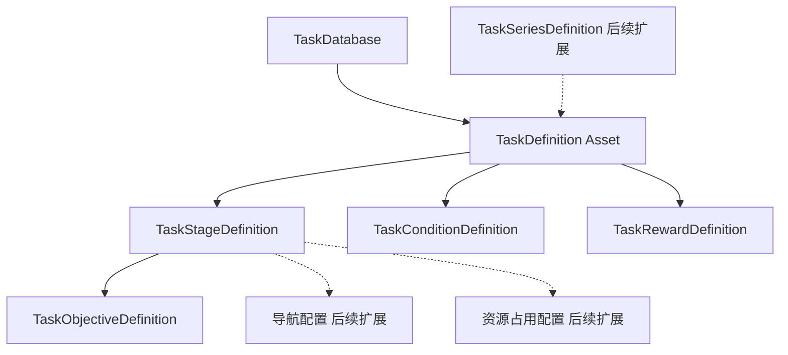
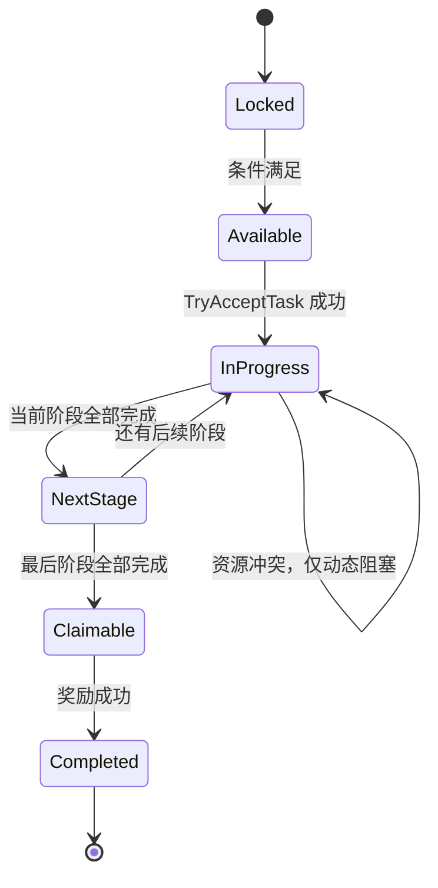
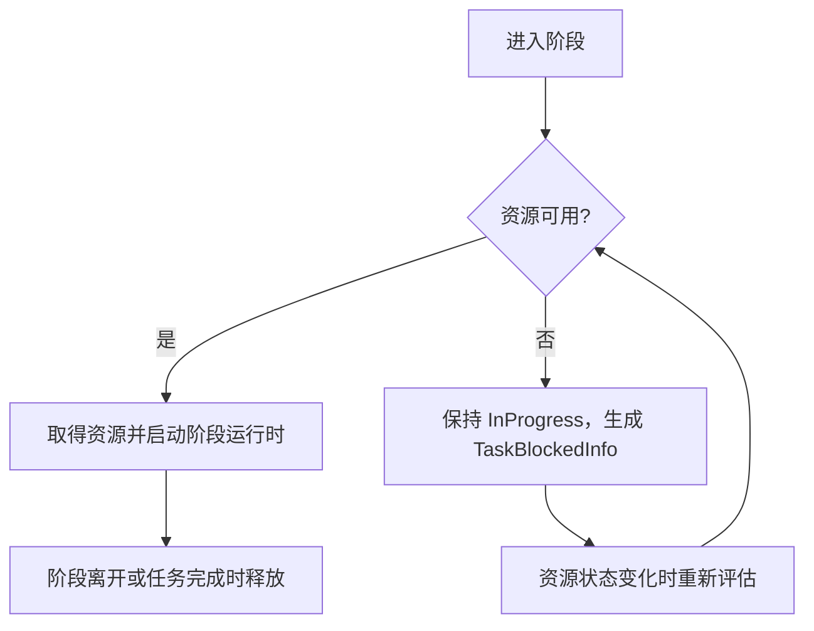
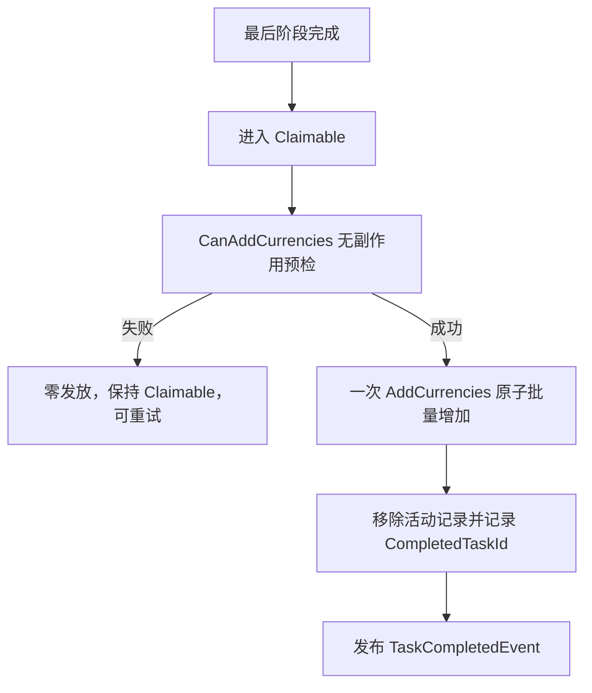

# 任务系统需求说明

> 文档状态：核心剧情任务需求与当前实现边界
> 适用范围：单机 RPG、线性任务阶段、任务链、NPC/场景交互、任务导航和本地存档
> 当前实现版本：任务生命周期 v2；手动领奖目前仅支持货币

本文档承接任务产品需求。任务系统当前代码行为与数据模型见
[`TaskSystem_Architecture.md`](TaskSystem_Architecture.md)；两份文档出现冲突时，本文档负责后续产品行为，架构文档负责已落地代码行为。

## 1. 目标与范围

### 1.1 产品目标

任务系统需要让玩家能够：

- 看到主线、支线和其他剧情任务的分类与章节关系。
- 清楚知道当前任务处于哪一个阶段、下一步需要做什么以及为什么暂时不能做。
- 在多个任务并行时只追踪一个任务，并获得稳定的目标导航信息。
- 在 NPC 或场景被其他剧情占用时看到可解释的阻塞原因。
- 保存并恢复当前阶段、目标进度、领奖状态、追踪状态和未读状态。

设计参考了《原神》任务菜单中的分类、章节折叠、当前步骤、奖励和 Navigate 入口，以及角色/地点被其他任务占用时的前置任务提示：

- [Quest Menu 参考](https://genshin-impact.fandom.com/wiki/Quest/Menu)
- [Quest 参考](https://genshin-impact.fandom.com/wiki/Quest)

### 1.2 完整产品目标范围

下列条目描述任务系统的完整产品目标，不代表本次都已实现；当前代码边界以第 2 节状态表为准。

- 一次性主线、支线和世界任务。
- 任务链与章节分组。
- 任务内部的线性阶段。
- 多个任务并行、一个任务追踪。
- 条件解锁、统一接取、手动领奖和自动发奖两种奖励策略。
- NPC、场景实体、世界坐标和区域四类导航语义。
- NPC/场景资源独占与可解释阻塞。
- 版本化本地存档迁移。

### 1.3 明确不包含

- 日常、周常、周期重置、随机事件和限时活动任务。
- 任务失败、放弃、重新接取和任务重玩。
- 任务自身的条件分支图、分支回溯和多结局。
- 云存档、加密、历史恢复点和损坏存档自动重置。
- 地图、寻路、HUD、NPC AI 或对话图实现；任务系统只提供业务契约和查询结果。

## 2. 当前基础与目标形态

下表区分本轮已经落地的核心流程和仍属后续产品目标的功能：

| 能力 | 当前状态 |
| --- | --- |
| 每任务独立 `TaskDefinition` 资产、按 `TaskId` 索引及配置校验 | 已实现 |
| 按顺序执行任务阶段；当前阶段目标全部完成后推进 | 已实现 |
| 统一资格查询和接取 API；前置任务已完成条件 | 已实现 |
| 当前阶段目标 Handler 订阅与切换、追踪、未读和任务事实事件 | 已实现 |
| 手动提交货币奖励；预检后一次批量发放 | 已实现 |
| 保存当前阶段进度、活动状态、追踪、未读和完成 ID；任务模块 v2 | 已实现 |
| 任务链/章节、更多接取条件和非货币奖励 | 后续扩展 |
| 导航目标、资源占用和阻塞解释 | 后续扩展 |
| 任务查询层、正式 UI/NPC/对话接入和任务红点数据源 | 后续扩展 |

当前配置层级为数据库引用多个独立任务资产，每个任务资产包含条件、顺序阶段、目标和奖励：


```mermaid
flowchart TD
    Database[TaskDatabase] --> Task[TaskDefinition Asset]
    Task --> Stage[TaskStageDefinition]
    Stage --> Objective[TaskObjectiveDefinition]
    Task --> Unlock[TaskConditionDefinition]
    Task --> Reward[TaskRewardDefinition]
    Series[TaskSeriesDefinition 后续扩展] -.-> Task
    Stage -.-> Navigation[导航配置 后续扩展]
    Stage -.-> Resource[资源占用配置 后续扩展]
```

### 2.1 稳定标识

- `TaskSeriesId` 标识章节或任务链。
- `TaskId` 标识可独立接取、完成和存档的任务。
- `TaskStageId` 只在所属任务内唯一，标识线性阶段。
- `ObjectiveId` 只在所属阶段内唯一。
- `ResourceKey` 标识 NPC 或场景资源的业务语义，不保存 Unity 对象引用或层级路径。
- Unity 配置字段使用 `string`；运行时索引和 API 使用强类型 ID；存档 JSON 使用 `string`。

## 3. 任务链、任务和阶段

### 3.1 `TaskSeries`（后续扩展）

任务链负责展示和顺序关系，不直接保存玩家进度；当前代码尚未实现任务链或章节配置。

- 包含稳定 ID、分类、章节标题、排序和展示图标/背景引用。
- 包含有序 `TaskId` 列表。
- 任务链可以是主线、支线、角色故事或世界任务系列。
- 任务链不创建额外生命周期；玩家状态仍由任务实例和完成 ID 表达。

### 3.2 `TaskDefinition`

当前 `TaskDefinition` 是每任务一个 ScriptableObject 资产的一次性可接取单元，包含：

- 稳定 `TaskId`、由静态分类表约束的 `TaskCategoryId`、标题和描述。首批分类为 `main`（主线）与 `side`（支线）；任务资产在 Inspector 中通过下拉框选择，显示名称调整不改变已保存 ID。
- 接取条件列表，全部满足（AND）；当前支持“前置任务已完成”。
- 有序阶段列表，至少一个阶段。
- 奖励列表；当前只接受 `TaskCurrencyRewardDefinition`，并统一手动领取。

任务链归属、奖励策略、自动接取、推荐信息和更多展示字段属于后续扩展。

新增任务分类时需在 `TaskCategoryCatalog` 中登记稳定 ID 和显示名称；任务资产 Drawer 与任务配置校验共用该表。

### 3.3 `TaskStageDefinition`

阶段是任务内部的线性执行单元：

- 具有所属任务内唯一的 `TaskStageId`、标题和描述；列表位置就是执行顺序。
- 包含一个或多个目标；阶段内目标默认全部完成才算阶段完成。
- `ObjectiveId` 在所属阶段内唯一。
- 导航目标和独占资源声明尚未接入。
- 可配置进入阶段时发布的业务事实或交给 DialogueSystem 的 Action；任务系统不执行对话分支。
- 阶段完成后自动进入下一个阶段；最后阶段完成后进入 `Claimable`，等待显式领奖。

阶段推进时序：


```mermaid
stateDiagram-v2
    [*] --> Locked
    Locked --> Available: 条件满足
    Available --> InProgress: TryAcceptTask 成功
    InProgress --> InProgress: 当前阶段目标变化
    InProgress --> InProgress: 资源冲突，仅动态阻塞
    InProgress --> NextStage: 当前阶段全部完成
    NextStage --> InProgress: 还有后续阶段
    NextStage --> Claimable: 最后阶段全部完成
    Claimable --> Completed: 奖励成功
    Completed --> [*]
```

`Blocked` 不是持久化生命周期，而是当前阶段的查询结果：任务仍然是 `InProgress`，但某个交互或导航目标暂时不可执行。

## 4. 解锁、接取与任务链衔接

### 4.1 解锁状态

未接取任务的 `Locked` 和 `Available` 是实时查询结果，不单独存档：

- `Locked`：至少一个条件不满足。
- `Available`：所有条件满足，且任务未活动、未完成。
- 已活动或已完成任务不再返回可接取状态。

通过 `TaskProgressSystem.GetAvailability(TaskId)` 查询资格。条件 Handler 只回答当前是否满足，不主动调用接取 API。当前实现只有“前置任务已完成”；以下条件仍待扩展：

- 玩家等级或章节进度。
- 前置任务完成。
- 前置任务达到指定阶段。
- 拥有或未拥有指定物品/标签。
- 区域、世界状态或其他业务只读事实。
- 资源冲突导致的可执行性限制。

资格结果包含 `NotFound / Locked / Available / Active / Completed` 状态和结构化原因。当前结构化原因记录前置 `TaskId` 与可读说明，例如：

```text
TaskAvailabilityResult
├─ Status: NotFound / Locked / Available / Active / Completed
└─ Reasons[]
   ├─ ReasonType: RequiredTask
   ├─ RelatedTaskId: main.chapter01.002
   └─ CanNavigate: true
```

### 4.2 统一接取入口

所有来源都通过 `TaskProgressSystem.TryAcceptTask` 使用同一入口：

```text
TryAcceptTask(TaskId taskId, TaskAcceptSource source) -> TaskAcceptResult
```

计划中的调用方包括 NPC、Dialogue Action、剧情触发器、任务链协调器和 UI ViewModel；这些正式入口目前尚未接入。`source` 只用于日志、调试和埋点，不改变规则。

接取入口按以下顺序执行：

1. 解析任务定义并校验配置。
2. 检查任务是否已完成或已活动，并评估接取条件。
3. 预解析全部阶段的目标 Handler，配置缺失时明确抛出错误。
4. 创建临时活动记录并启动首阶段监听。
5. 监听建立成功后才提交接取事实、加入未读集合并发布接取事件。

存档恢复使用专用恢复入口，不调用接取 API。调用来源只写入接取事实事件和诊断日志，不改变资格判断。任务链自动接取尚未实现。

### 4.3 接取失败语义

业务拒绝通过 `TaskAcceptResult` 或 `TaskClaimResult` 返回结构化结果。当前 `TaskCommandFailure` 包含：

- `TaskNotFound`
- `AlreadyActive`
- `AlreadyCompleted`
- `ConditionNotMet`
- `NotClaimable`（领奖时）
- `RewardClaimInProgress`（同一任务已有领奖流程执行时）
- `RewardRejected`（货币钱包预检或发放拒绝）

任务不存在、已活动、已完成、条件未满足分别映射为 `TaskNotFound`、`AlreadyActive`、`AlreadyCompleted`、`ConditionNotMet`。重复 ID、缺少 Handler、非法阶段或奖励配置直接抛出或上报，不转换成普通玩家可恢复失败。资源阻塞与配置错误结果尚未实现。

## 5. 目标与阶段运行时

### 5.1 目标语义

每个目标归属一个阶段，继续使用 `TaskObjectiveHandlerRegistry` 的显式类型注册模式：

- Handler 可按玩法领域实现累计或状态查询语义；当前框架提供注册契约及 Odin 测试事件，具体战斗、背包、对话 Handler 后续接入。
- 阶段完成只由当前阶段目标决定，后续阶段目标不能提前计入。
- 阶段切换时停止旧阶段目标监听，再创建并启动新阶段目标监听。

目标进度变化发布任务事实事件；存档恢复不重放这些普通事件。

### 5.2 阶段切换约束

- 当前阶段未全部完成时不能手动跳阶段。
- 阶段切换是一次有序状态修改：停止旧运行时、写入新阶段进度、建立并启动新阶段监听；成功后才发布阶段切换事件。
- 新阶段初始化失败属于配置/集成错误，不能伪造阶段完成。配置 Handler 在接取时预解析，运行期建立监听仍可能暴露集成错误。
- 追踪任务切换不影响任何任务阶段或目标进度。

## 6. 导航契约（后续能力）

任务系统提供语义导航，不直接引用地图或 HUD：

```text
TaskNavigationInfo
├─ TaskId
├─ StageId
├─ TargetKind: Npc / SceneEntity / WorldPosition / Area
├─ TargetId or Position/AreaData
├─ DisplayName
├─ RegionId
└─ IsAvailable
```

- `Npc`：使用稳定 NPC/参与者 ID，由场景或 NPC 系统解析当前实例。
- `SceneEntity`：使用稳定场景实体 ID，由场景系统解析位置。
- `WorldPosition`：保存配置坐标和场景/区域 ID。
- `Area`：保存区域 ID、中心和范围，用于探索或范围型目标。
- 当前阶段没有导航配置，或目标暂不可解析时，任务仍可追踪，但导航层只收到 `IsAvailable = false`。
- 任务系统不自动打开地图、不移动玩家、不选择传送点，也不负责寻路。

## 7. NPC/场景资源冲突（后续能力）

### 7.1 资源声明

阶段可以声明独占资源：

```text
TaskResourceClaimDefinition
├─ ResourceKey
├─ ResourceKind: Npc / SceneEntity / Location
└─ BlockMessage / ReleaseCondition
```

资源 Key 不绑定 GameObject；运行时由资源占用 Resolver 查询活动任务阶段。

### 7.2 占用规则

- 阶段进入时尝试取得全部声明资源。
- 没有冲突时取得资源并保持到阶段离开、任务完成或任务被清理。
- 发生冲突时，后激活任务不抢占资源，仍保持 `InProgress`，并返回 `TaskBlockedInfo`。
- 资源持有顺序以持久化 `ActivationOrdinal` 为主，`TaskId` 字典序为稳定平局规则。
- 阻塞信息至少包含资源 Key、当前占用任务、占用阶段和解除条件。
- 阻塞解除后任务无需重新接取；系统重新评估阶段可执行性并发布阻塞变化事实。
- 不自动调整主线优先级、不自动切换追踪任务、不自动取消任务。


```mermaid
flowchart TD
    EnterStage[进入阶段] --> Acquire{资源可用?}
    Acquire -->|是| Own[取得资源并启动阶段运行时]
    Acquire -->|否| Block[保持 InProgress，生成 TaskBlockedInfo]
    Block --> Recheck[资源状态变化时重新评估]
    Recheck --> Acquire
    Own --> Release[阶段离开或任务完成时释放]
```

## 8. 奖励策略与完成事务

### 8.1 当前奖励策略

- 当前只支持手动领取：最后阶段完成后进入 `Claimable`，调用 `TaskProgressSystem.TryClaimReward(TaskId)` 领奖。
- 当前只支持货币奖励；其它奖励类型在 `TaskDefinition.Validate()` 阶段明确拒绝。

自动发奖及其他奖励类型需要具备跨系统事务方案后再扩展。

### 8.2 奖励事务


```mermaid
flowchart TD
    CompleteStage[最后阶段完成] --> Claimable[进入 Claimable]
    Claimable --> Preflight[CanAddCurrencies 无副作用预检]
    Preflight -->|失败| Keep[零发放，保持 Claimable，可重试]
    Preflight -->|成功| Grant[一次 AddCurrencies 原子批量增加]
    Grant --> Finish[移除活动记录并记录 CompletedTaskId]
    Finish --> Event[发布 TaskCompletedEvent]
```

奖励流程约束：

- 合并同任务内相同货币项后，调用无副作用的 `CanAddCurrencies`；失败返回结构化钱包状态且不发放。
- 预检成功后只调用一次现有原子批量增加 API `AddCurrencies`。
- 货币超过上限时任务保持 `Claimable`，修正钱包余额后可重试。
- 成功完成后删除活动记录和阶段进度，清除追踪与未读状态，记录完成 ID。
- 发放成功后才执行任务完成提交；自动接取后继任务尚未实现。

## 9. 查询、UI 与红点

### 9.1 查询结果

任务查询层至少提供：

- 按分类、章节和状态查询任务列表。
- 任务详情、当前阶段、目标进度和奖励预览。
- `TaskAvailabilityResult` 及可跳转的前置任务。
- 当前追踪任务与 `TaskNavigationInfo`。
- `TaskBlockedInfo` 和解除条件。
- 已完成任务的摘要、完成时间和奖励领取结果（若未来存档记录这些展示字段）。

Query 只读，不修改任务状态；ViewModel 通过 Command 调用接取、领奖、追踪和确认查看。

### 9.2 UI 行为

- 任务列表按分类分组，章节/任务链可折叠。
- 任务详情显示标题、描述、当前阶段、目标进度、奖励策略、导航按钮和阻塞原因。
- 前置条件不满足时显示具体条件，并提供跳转到关联任务的入口。
- 只有显式点击任务条目才确认未读；打开总窗口、切换页签或刷新列表不自动确认。
- 追踪任务最多一个；可领取任务保持追踪，领奖成功后清除追踪，不自动选择下一个。

### 9.3 红点规则

任务红点继续只表示“新接取且未确认查看”的任务：

- 接取成功加入 `UnreadTaskIds`。
- 点击具体任务条目调用 `AcknowledgeTask(TaskId)`。
- 领奖完成时移除未读状态。
- 阶段完成、可领奖、导航可用、资源阻塞都不新增任务红点。

## 10. 存档与迁移

### 10.1 活动任务快照

当前 v2 活动任务快照保存：

```text
TaskRecordSnapshot
├─ TaskId
├─ CurrentStageId
├─ State: InProgress / Claimable
├─ ObjectiveProgress[]
├─ TrackedTaskId（全局字段）
├─ CompletedTaskIds（全局字段）
└─ UnreadTaskIds（全局字段）
```

不保存任务定义、Handler 实例、事件句柄、Unity 对象引用、导航解析结果或可派生的阻塞结果。

### 10.2 恢复流程


```mermaid
sequenceDiagram
    participant Save as SaveManager
    participant Task as TaskManager
    participant Runtime as TaskProgressSystem
    participant World as 其他业务系统
    Save->>Task: 验证并恢复任务事实
    Task-->>Save: 完成状态恢复，不发布普通任务事件
    Save->>World: 恢复玩家/背包/场景等基础事实
    Save->>Runtime: Load 成功后重建当前阶段运行时
    Runtime->>Task: 根据 CurrentStageId 创建目标订阅
    Runtime->>World: 重新查询状态型目标和资源占用
```

- 恢复不调用接取 API，不增加目标进度，不发放奖励，不播放普通业务副作用。
- 资源阻塞和状态型目标在依赖业务模块恢复后重新计算。
- 恢复失败时不得部分覆盖当前任务状态。

### 10.3 版本策略

- 任务快照模块版本当前为 v2，包含当前阶段 ID 和当前阶段目标进度。
- 按已确认的项目情况，目前没有实际任务存档槽位，因此本次不提供 v1 到 v2 迁移。
- 任务、阶段或目标 ID 无法匹配定义时拒绝恢复并保持当前状态不变；存档模块的通用版本迁移机制仍按需使用。

## 11. 业务边界与接口方向

### 11.1 任务核心

`TaskManager` 持有已校验的任务数据库引用和玩家任务事实；不直接依赖战斗、背包、对话、地图、UI 或 NPC GameObject。它负责查询和写入任务数据，`TaskProgressSystem` 负责接取、阶段推进、领奖以及目标监听生命周期。

`TaskProgressSystem` 继续负责跨业务编排、目标运行时生命周期和存档恢复后的订阅重建。

### 11.2 已实现与待实现契约

已经提供的业务契约与 API：

- `ITaskObjectiveHandler`：创建阶段目标运行时。
- `ITaskConditionHandler`：评估接取条件并返回结构化原因；目前注册前置任务已完成 Handler。
- `TaskProgressSystem.GetAvailability`、`TryAcceptTask` 和 `TryClaimReward`。
- `TaskCurrencyRewardHandler` 与 `ICurrencyWallet.CanAddCurrencies` / `AddCurrencies`。

后续按现有显式注册模式扩展：

- 更多接取条件与奖励 Handler。
- `ITaskNavigationResolver`：把语义导航目标解析成当前世界导航信息。
- `ITaskResourceOccupancyResolver`：取得、释放和查询资源占用。
- 任务列表与详情 Query、正式 UI/NPC/对话调用方及任务红点数据源。

### 11.3 任务事实事件

当前已提供 `TaskAcceptedEventArgs`、`TaskObjectiveProgressChangedEventArgs`、`TaskStageChangedEventArgs`、`TaskStateChangedEventArgs`、`TaskRewardClaimableEventArgs`、`TaskCompletedEventArgs`、`TaskTrackedChangedEventArgs` 和 `TaskAcknowledgedEventArgs`。后续导航与占用能力再补充：

- `TaskBlockedChangedEvent`
- `TaskNavigationChangedEvent`
- `TaskRewardClaimFailedEvent`

事件只表达已经发生的事实；接取、推进和领奖的核心顺序由 Command/System 保证。

## 12. 验收场景

### 12.1 任务与阶段

- 多阶段任务依次推进，当前阶段未完成时不能跳转。
- 阶段切换只重建新阶段目标订阅，不保留旧阶段事件句柄。
- 加载后恢复准确 `StageId` 和每个目标的当前值。
- 并行任务切换追踪不改变任何任务进度。

### 12.2 条件与任务链

- 条件不满足时返回具体原因和可跳转关联任务。
- NPC、Dialogue Action、剧情触发器和任务链使用同一接取入口。
- `UnlockOnly` 后继任务只变为可用；`AutoAccept` 后继任务尝试自动接取。
- 自动接取失败不回滚已经完成的前置任务。

### 12.3 冲突与导航

- 资源冲突指出 ResourceKey、占用任务、占用阶段和解除条件。
- 资源解除后任务无需重新接取即可继续。
- 任务追踪后能返回四类导航信息；目标不可解析时不伪造路标。

### 12.4 奖励与存档

- 自动奖励成功后直接完成；预检失败时零发放并保持可重试状态。
- 手动领奖在成功前保持 `Claimable`，成功后清理活动、追踪和未读事实。
- 旧版单阶段快照迁移到首个阶段。
- 未知 Task/Stage ID 不部分覆盖当前状态。
- 加载不重复接取、增加进度、发奖或发布普通任务副作用事件。

### 12.5 红点

- 新接取任务增加对应分类未读计数。
- 打开任务窗口不清除未读；点击具体任务条目才确认。
- 阶段完成、可领奖、导航变化和资源阻塞不产生任务红点。

## 13. 后续实现顺序

1. 接入真实玩法目标 Handler，并补足 Unity 生命周期、场景和运行时交互验证。
2. 创建正式任务定义资产，并继续维护 TaskDatabase 配置。
3. 接入任务列表与详情 Query、正式 NPC/对话/剧情调用方和 UI ViewModel。
4. 接入任务红点数据源。
5. 在具备跨系统事务方案后扩展非货币奖励与自动奖励。
6. 增加任务链/章节、导航 Resolver 与资源 Occupancy Resolver。
7. 若未来存在需要保留的旧版本任务存档，再按真实数据添加迁移器。
