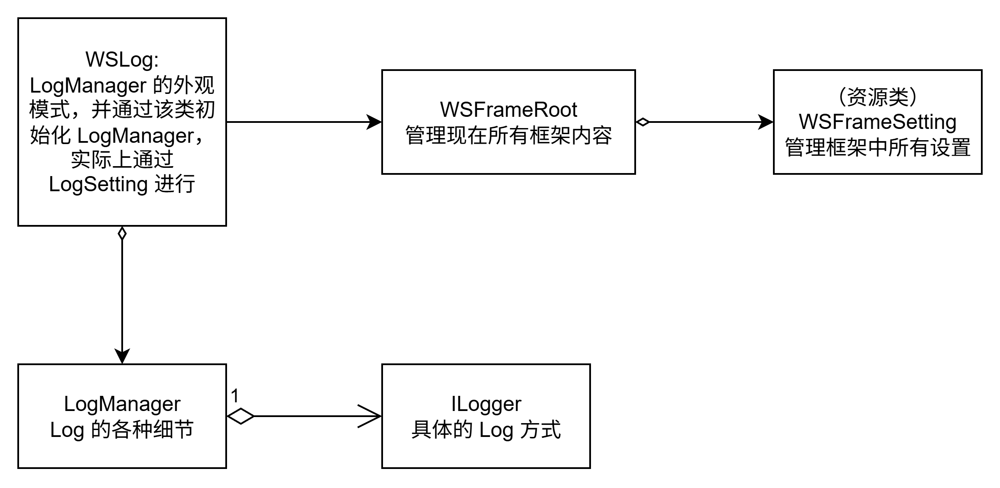

# Debug 模块

## 简介
Debug 模块提供了一组用于调试和日志记录的功能，帮助开发者在开发过程中跟踪代码执行情况、捕获错误信息以及输出调试信息。
无需其他依赖，但WSLog 需要 WSFrameRoot 的控制。

## 功能
- **日志记录**：提供多种日志级别（如信息、警告、错误）以便分类和过滤日志信息。
- **颜色化输出**：支持在控制台中以不同颜色显示不同级别的日志，提升可读性。
- **断言**：允许开发者在代码中设置断言条件，当条件不满足时触发调试信息输出。
- **调试输出**：支持将调试信息输出到控制台、文件。
- **堆栈跟踪**：在发生错误时，提供详细的堆栈跟踪信息，便于定位问题。

## 使用说明
在 Test 文件夹中，可以找到 Debug 模块的使用示例代码。以下是一个简单的示例，展示如何使用 Debug 模块记录日志信息：
引入 WS_Modules.LogModule 命名空间，然后调用 WSLog 类中的方法来记录不同级别的日志信息。
```Csharp
using Sirenix.OdinInspector;
using UnityEngine;
using WS_Modules.LogModule;

public class WS_Custom_Log_Test : MonoBehaviour
{
    [Button("测试自制Log")]
    public void TestLog()
    {
        WSLog.Log("这是一个普通日志");
        WSLog.LogSuccess("这是一个成功日志");
        WSLog.LogWarning("这是一个警告日志");
        WSLog.LogError("这是一个错误日志");
    }
}
```

运行上述代码后，可以在控制台中看到不同级别的日志输出，帮助开发者更好地理解代码的执行流程和状态。

### 控制
Debug 模块的日志输出行为可以通过配置文件 (FrameSetting) 进行调整，例如设置日志级别、输出目标等。具体配置方法请参考模块的文档或配置文件说明。
通过在 FrameSetting 中配置 LogModule，可以控制日志的输出行为和格式。

通过查看 LogManager 类，可以了解更多关于日志管理和配置的细节:
1. 输出的颜色：info 颜色、 success 颜色、 warning 颜色、 error 颜色
2. 是否开启日志输出
3. 是否开启写出时间
4. 是否开启写出线程信息 
5. 是否开启写出堆栈信息 
6. 是否开启写出存入到文件

    6.1 保存日志类型

    6.2 保存日志的文件名（如果为空则使用默认文件名，并且会在文件名后面加上时间，非覆盖式，
如果是自定义名字，则是通过覆盖式的方式进行保存。）
    
    6.3  保存路径（需要在头尾加上 / ）


## 代码结构
