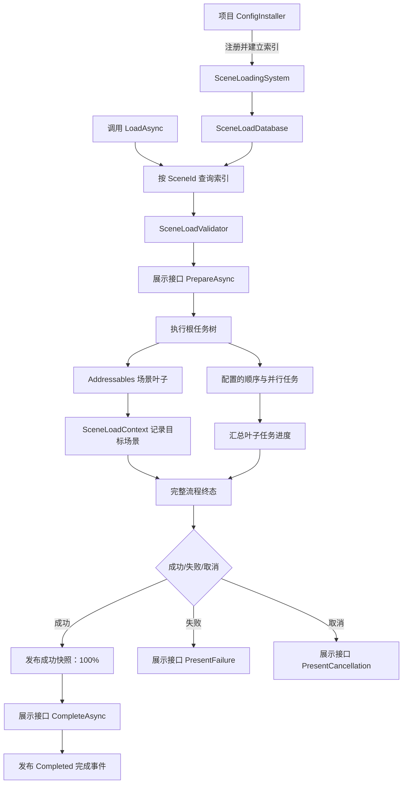
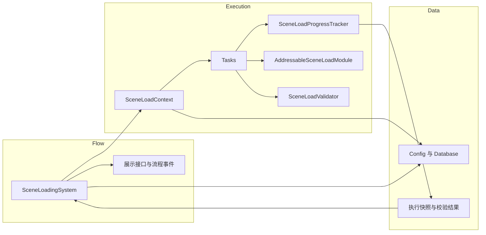

# WSFrame 组合式场景加载

`SceneLoadingSystem` 位于 `WS_Modules.SceneModule`，负责查询 `SceneLoadDatabase`、校验目标配置、执行组合任务树并发布进度快照。ConfigInstaller 调用 `SceneLoadingSystem.RegisterDatabase` 时，系统先校验全部配置并建立 SceneId 索引，再发布数据库引用；运行时查询使用 `sceneConfigByIdMap`，不扫描序列化列表。项目通过自己的 Architecture 注册系统，并提供具体界面适配器。

## 源码职责分层

- `Flow` 放置完整流程控制器和对外展示、事件契约；System 创建一次流程的执行对象，并负责流程终态。
- `Execution` 放置 `SceneLoadContext`、`SceneLoadProgressTracker`、场景加载模块和校验器；可配置任务实现放在 `Execution/Tasks`。
- `Data` 保存 ScriptableObject 配置与数据库，以及流程快照和校验结果类型。
- 三层继续使用同一程序集和命名空间；目录用于按职责查找代码，不改变类型 API 或运行时依赖。

## 运行时入口

- `LoadAsync(config, cancellationToken)` 直接运行调用方已有的 `SceneLoadConfig`，不要求先注册或查询数据库。
- `LoadAsync(sceneId, cancellationToken)` 通过已注册数据库解析稳定 `SceneId`，再进入相同执行流程。
- `InitializeCurrentSceneAsync(sceneId, cancellationToken)` 让已直接打开的活动场景执行相同准备任务；`AddressableSceneLoadTask` 只校验并登记当前场景，不会重复加载。
- `IsSceneJoiningCurrentFlow(sceneId, scene)` 供场景入口识别统一流程已加载的目标场景，避免创建第二个流程。
- `UnloadSceneAsync(scene, cancellationToken)` 只卸载本系统 Addressables 模块持有的 Additive 场景并释放其句柄。

`SceneLoadingEntry.sceneId` 使用 `SceneIdDropdown` PropertyDrawer 从 `SceneLoadDatabase` 的场景列表中选择稳定 ID。编辑器会话自动选用唯一数据库；项目有多个数据库时，在 Inspector 中明确选择后再选场景。Drawer 只通过 `SerializedProperty` 写入 ID，缺失或重复 ID 会显示提示并保留原字段值；运行时类型不依赖 UnityEditor。`SceneLoadConfig.sceneId` 是 ID 定义本身，仍由配置作者编辑，不使用该选择器。

同一个 `SceneLoadingSystem` 一次只允许一个完整流程运行。配置与任务资产保存定义；进度、事件和 Addressables 句柄属于当前运行实例，不写回任务资产。

场景数据库由 ConfigInstaller 在 Architecture 注册流程前注入。数据库的 Inspector 列表保留编辑顺序；`RegisterDatabase` 先调用 `SceneLoadDatabase.ValidateAndBuildIndex()`，成功后才发布静态数据库引用。注册检查空配置项、空 SceneId 和重复 ID；同一数据库重复注册幂等，不同数据库不能覆盖已注册库。进入运行时子系统时会清除静态引用，关闭 Domain Reload 时也会重新执行项目配置注册。

## 进度与事件

进度由 `SceneLoadProgressTracker` 根据叶子任务的 `ProgressWeight` 加权汇总。`CurrentSnapshot` 提供最近一次只读快照；`RegisterSnapshotChanged`、`RegisterTaskChanged` 及成功、失败、取消事件用于订阅流程状态。成功快照先发布，展示实现完成成功收尾尝试后再发送 `Completed`；失败和取消事件随终态快照发送。事件回调异常会被记录，不会截断任务树执行。

可选展示实现通过 `ISceneLoadingPresentation` 接收准备、进度、成功、失败和取消状态。系统不依赖任何窗口或 HUD 类型；没有提供展示实现时仍可执行同一任务树。

## 任务结构

`SceneLoadTask` 是可复用的任务资产基类。`SequenceSceneLoadTask` 按子任务顺序执行；`ParallelSceneLoadTask` 同时启动分支，并等待已启动分支收尾后传播失败。一个配置的根任务树必须包含且只包含一个 `AddressableSceneLoadTask`。`SceneLoadValidator` 在运行前检查场景引用、任务引用、循环和并行场景就绪依赖。

RPG 的 ConfigInstaller 注册、玩家初始化、窗口预加载、直接进入场景和 LoadingWindow 接入步骤见 [RPG 场景加载流程](../../../Game/Runtime/SceneLoading/SceneLoading_README.md)。旧的 `SceneSystem` Build Settings 接口和新流程的目录划分见 [WSFrame SceneSystem](../SceneSystem_README.md)。
