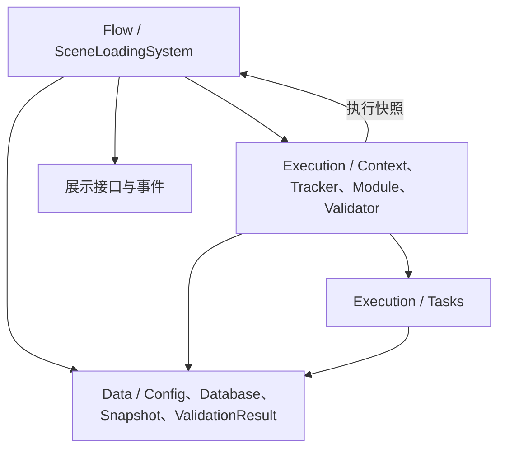
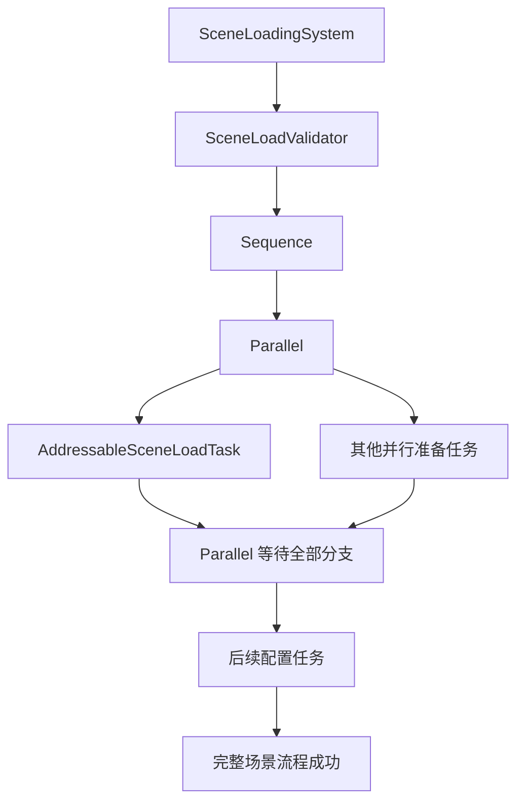

# WSFrame SceneSystem

`BuiltIn` 保留既有的内置场景兼容门面，`Loading` 提供新的 Addressables 组合任务流程。两者都属于 `WS_Modules.SceneModule`，并共用本程序集；旧流程不会在 Addressables 加载失败时被隐式调用。

`WS_Modules.SceneModule.SceneSystem` 是内置场景加载门面，保留 `SceneManager`、BuildIndex、进度事件、手动激活和 Additive 查询 API。它的实现位于 `BuiltIn/SceneLoadModule`。新流程由 `Loading/Flow/SceneLoadingSystem` 执行。

## 加载职责

| 模块 | 职责 |
| --- | --- |
| `SceneLoadModule` | 保持旧 `SceneSystem` 的 SceneManager 加载和事件逻辑。 |
| `SceneLoadingSystem` | 校验并执行数据库中的组合任务树，广播不可变快照，提供直接初始化当前场景和 Additive 卸载入口。 |
| `SceneLoadDatabase` | 以有序列表保存可编辑配置，在注册时校验 SceneId 并建立运行时字典索引。 |
| `AddressableSceneLoadModule` | 通过 `AssetReference` 加载场景、切换活动场景、跟踪操作句柄，并在卸载或 Single 替换时释放句柄。 |
| `SceneLoadTask` | 可保存为资产的流程节点；每次调用只把运行状态放入 `SceneLoadContext`。 |
| `SequenceSceneLoadTask` | 按真实子节点列表顺序逐个等待执行。 |
| `ParallelSceneLoadTask` | 同时启动所有子任务，等待已启动分支全部收尾，再传播失败。 |
| `SceneLoadValidator` | 校验场景任务唯一性、配置地址、空引用、循环引用和并行场景就绪依赖。 |

## 组合加载目录职责

`Loading/Flow` 管理一次完整请求，并定义展示适配器和对外事件契约。`Loading/Execution` 放置任务运行环境、进度汇总、Addressables 场景句柄和任务树校验；具体任务资产类型集中在其 `Tasks` 子目录。`Loading/Data` 保存配置、数据库、快照和校验结果。它们继续共用 `WSFrame.SceneSystem.asmdef` 与 `WS_Modules.SceneModule` 命名空间。



场景本身是 `AddressableSceneLoadTask` 叶子节点。`SceneLoadMode.Single` 会替换当前场景；`Additive` 会保留其他场景。统一加载流程通过 `SceneLoadingSystem.UnloadSceneAsync` 卸载其持有的 Additive 场景。

`SceneLoadDatabase` 保留 Inspector 使用的配置列表；RPG 的 ConfigInstaller 调用 `SceneLoadingSystem.RegisterDatabase` 时一次验证全部配置并建立按 SceneId 查询的字典。运行时查询要求数据库已注册并建好索引，空配置、空 ID 和重复 ID 会在注册阶段报错。场景资源字段使用 `AssetReferences/SceneAssetReference`，编辑器限制选择场景资产，运行时保留 Addressables GUID。



## 旧 SceneSystem API

旧调用继续使用 `SceneSystem` 静态门面：

```csharp
await SceneSystem.LoadSceneAsync("BootScene");
await SceneSystem.LoadSceneAsync(1, mode: LoadSceneMode.Additive);
string[] additiveScenes = SceneSystem.GetLoadedAdditiveSceneNames();
await SceneSystem.UnloadSceneAsync("BootScene");
```

旧 API 使用 Unity Build Settings 的场景名或 BuildIndex；统一流程使用 Addressables 场景引用。两条入口有意保持显式，不会在一种方式失败后暗中尝试另一种方式。

## SceneSystem 编辑器中的任务资产

SceneSystem 面板的任务名称同时作为 `.asset` 文件名和 ScriptableObject 名称。编辑器通过 `AssetDatabase.RenameAsset` 原位改名，保留 GUID 和所有共享引用；该文件操作不进入 `Undo`，其他序列化字段与任务树结构仍沿用 Unity `Undo`。

在左侧场景树中右键配置行可定位配置资产，右键任意任务行可定位任务资产。右侧“节点操作”的“定位任务资产”按钮使用同一定位入口，打开 Project 窗口并选中对应资产；Play Mode 中仍允许定位，资产和任务结构修改仍受编辑权限限制。

面板 UXML 路径使用 `Utilities/Editor/UXMLUSSGenerate` 生成的 `UxmlUssPathConstants`，资源加载和缺失提示都引用同一生成常量。

## 关联文档

通用组合任务流程、目录职责、事件和展示接口见 [Loading/SceneLoading_README.md](Loading/SceneLoading_README.md)。RPG 场景数据库、ConfigInstaller 注册、直接打开场景初始化、玩家和窗口接入步骤见 [SceneLoading_README.md](../../Game/Runtime/SceneLoading/SceneLoading_README.md)。
