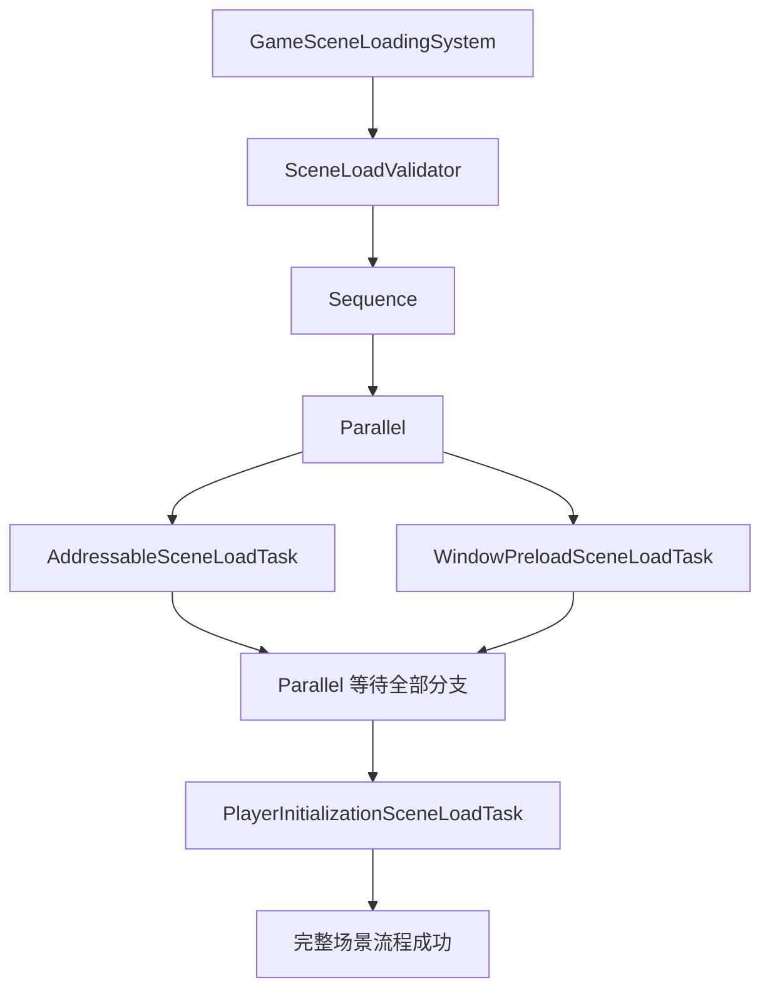

# WSFrame SceneSystem

`WS_Modules.SceneModule.SceneSystem` 是既有的内置场景兼容门面，保留 `SceneManager`、BuildIndex、进度事件、手动激活和 Additive 查询 API。内部实现位于 `SceneLoadModule`。新项目场景进入流程使用独立的 Addressables 任务树，不会在 Addressables 加载失败时回退到 BuildIndex。

## 加载职责

| 模块 | 职责 |
| --- | --- |
| `SceneLoadModule` | 保持旧 `SceneSystem` 的 SceneManager 加载和事件逻辑。 |
| `AddressableSceneLoadModule` | 通过 `AssetReference` 加载场景、切换活动场景、跟踪操作句柄，并在卸载或 Single 替换时释放句柄。 |
| `SceneLoadTask` | 可保存为资产的流程节点；每次调用只把运行状态放入 `SceneLoadContext`。 |
| `SequenceSceneLoadTask` | 按真实子节点列表顺序逐个等待执行。 |
| `ParallelSceneLoadTask` | 同时启动所有子任务，等待已启动分支全部收尾，再传播失败。 |
| `SceneLoadValidator` | 校验场景任务唯一性、配置地址、空引用、循环引用和并行场景就绪依赖。 |

场景本身是 `AddressableSceneLoadTask` 叶子节点。`SceneLoadMode.Single` 会替换当前场景；`Additive` 会保留其他场景。统一加载流程通过 `GameSceneLoadingSystem.UnloadSceneAsync` 卸载其持有的 Additive 场景。



## 旧 SceneSystem API

旧调用继续使用 `SceneSystem` 静态门面：

```csharp
await SceneSystem.LoadSceneAsync("BootScene");
await SceneSystem.LoadSceneAsync(1, mode: LoadSceneMode.Additive);
string[] additiveScenes = SceneSystem.GetLoadedAdditiveSceneNames();
await SceneSystem.UnloadSceneAsync("BootScene");
```

旧 API 使用 Unity Build Settings 的场景名或 BuildIndex；统一流程使用 Addressables 场景引用。两条入口有意保持显式，不会在一种方式失败后暗中尝试另一种方式。

## 关联文档

RPG 场景数据库、ConfigInstaller 注册、直接打开场景初始化、玩家和窗口接入步骤见 [SceneLoading_README.md](../../Game/Runtime/Loading/SceneLoading_README.md)。
