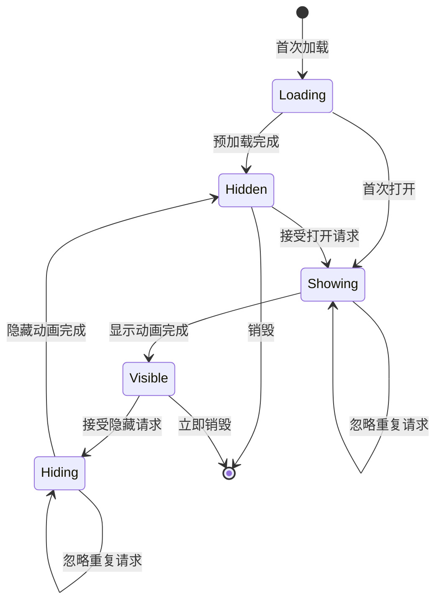
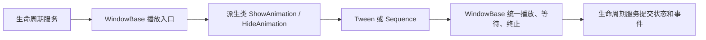

# UI System Documentation

## 1. 概述
本 UI 系统基于 Unity 引擎开发，采用 **Manager-Window** 架构。核心模块 `UIManager` 负责管理所有 UI 窗口的生命周期（加载、显示、隐藏、销毁）、层级管理、智能显隐优化以及堆栈导航功能。

系统设计目标是**高性能**、**易扩展**和**自动化**（自动绑定组件、自动层级处理）。

---

## 2. 核心功能

### 2.1 窗口生命周期管理
系统提供了一套完整的异步/同步 API 来管理窗口：
- **PreLoad (预加载)**: 提前加载窗口资源并实例化，但不显示。适用于大型窗口避免首次打开卡顿。
- **PopUp (弹出/显示)**: 加载（如未加载）并显示窗口。支持异步 `UniTask`。
- **Hide (隐藏)**: 由生命周期服务播放隐藏过渡，完成后设为不可见并保留在内存中；`HideWindowAsync` 可等待整个流程结束。
- **Destroy (销毁)**: 彻底销毁窗口 GameObject 并卸载相关资源。



### 2.2 智能显隐 (Smart Show/Hide)
**核心亮点**：为了优化 DrawCall 和渲染性能，系统实现了“伪隐藏”机制。
- **逻辑**：当一个标记为 `FullScreenWindow = true` (全屏窗口) 打开时，系统会自动将它底下的所有窗口进行“伪隐藏”（通常是设置 CanvasGroup Alpha=0 或不可交互，不触发 Rebuild），从而避免遮挡剔除计算开销。
- **恢复**：当全屏窗口关闭时，系统会自动寻找上一个显示的窗口并恢复其可见性。
- **层级保护**：系统包含防误杀逻辑。如果新打开的全屏窗口层级较低（例如只是换了个背景），位于其上层的悬浮窗（非全屏）不会被误隐藏。

### 2.3 遮罩管理 (Mask System)
支持单遮罩模式（Single Mask）：
- 系统维护全局唯一的遮罩层。
- 自动计算当前显示的窗口中层级最高（SortingOrder 最大）的一个，将遮罩放置在其下方。
- 实现了 `SetWindowMaskVisible` 逻辑，自动处理多窗口叠加时的遮罩层级问题。

### 2.4 堆栈导航 (Stack System)
支持弹窗的队列管理，适用于“连续弹窗”业务（如：升级 -> 解锁新功能 -> 获得奖励，一系列弹窗依次展示）：
- `PushWindowToStack`: 将窗口请求压入栈，不立即显示。
- `PopStackWindow`: 从栈中取出并显示下一个窗口。
- `PushAndPopStackWindow`: 便捷方法，压入栈并尝试立即启动堆栈显示流程。
- **参数支持**:
    - `popCallBack`: 窗口真正被显示时执行的回调（而不是压入时）。
    - `single`: 栈内去重，如果栈中已有该类型窗口则不重复添加。
    - `pushToStackTop`: 插队功能，将该窗口插入到栈顶，下一个弹出。

### 2.5 自动化与绑定
- **代码生成**: 配套编辑器工具 `WindowCodeGenerator` 和 `WindowBindDataCompGenerator`。
- **自动绑定**: 窗口实例化时，自动将 UI 组件（Button, Text 等）绑定到对应的 `DataComponent` 脚本中，无需手动拖拽引用。
- **操作方式**: 在 Hierarchy 中选中窗口根节点，右键选择 `GameObject/生成组件数据脚本(Shift+B)`。
- **命名规范**: 工具会自动解析节点名称（具体规则参考 `AnalysisComponentDataTool`，通常支持 `[Type]Name` 或后缀识别）。生成的脚本为 `*DataComponent.cs`。
- **注意**： 在自动生成的时候，在进行绑定的时候请等待编辑器完成生成并编译后再进行下一步操作，否则可能会因为脚本未编译完成导致绑定失败，其间也不要点击其他物体，以免绑定错误。

### 2.6 子模块/Item 生成 (Item Generator)
除了窗口，系统还支持对复用性高的 UI 子模块（如背包格子、列表项、技能图标）进行自动化生成。
- **工具名称**: `GeneratorBindItemsComponentTool`
- **操作方式**: 选中 Item 根节点，右键选择 `GameObject/生成Item脚本(Shift+I)`。
- **生成内容**: 
    - 自动生成继承自 `MonoBehaviour` 的脚本。
    - 包含组件字段声明。
    - 包含 `OnInitialize` (事件自动绑定), `SetItemData`, `OnDispose` 生命周期方法骨架。

**与 WindowDataComponent 的区别**:

| 特性 | WindowDataComponent (Shift+B) | Item Script (Shift+I) |
| :--- | :--- | :--- |
| **定位** | 窗口的数据层，主要负责持有组件引用。 | 独立的小型逻辑单元 (View + Logic)。 |
| **生命周期** | 跟随 Window，通常较被动。 | 提供 `OnInitialize`/`OnDispose` 供父级手动管理。 |
| **包含内容** | 仅包含组件字段 (public fields)。 | 包含组件字段 + 事件绑定代码 + 数据刷新接口。 |
| **适用场景** | 这里的 `Button` 是窗口上的关闭按钮。 | 这里的 `Button` 是列表里 100 个格子各自的点击按钮。 |

### 2.7 系统配置 (Configuration)
`UIManager` 的运行依赖于 `WSFrameSetting` 中的 `UIManagerSetting` 配置。在使用前请前往 `Tools/WSFrame/FrameSetting` (或对应 Asset 文件) 进行设置。

| 配置项 | 说明 | 推荐示例 / 备注 |
| :--- | :--- | :--- |
| **基础资源配置** | | |
| `UI Root Path` | UI 根节点预制体的加载路径 | `UISystem/UIPrefab/Root` |
| `UI Camera Prefab Path` | UI 摄像机预制体的加载路径 | `UISystem/UIPrefab/UICamera` |
| `UI EventSystem Prefab Path` | 事件系统预制体的加载路径 | `UISystem/UIPrefab/EventSystem` |
| `Window Config` | 窗口配置表引用 (ScriptableObject) | 拖入 `WindowConfig.asset` |
| `Is Single Mask` | 是否启用单遮罩模式 | `True` (推荐) |
| **自动化脚本生成配置** | **用于定义生成代码的输出位置** | |
| `Bind Component Generator Path` | 组件绑定数据脚本 (`*DataComponent.cs`) 的生成目录 | `Assets/Scripts/Game/UI/WindowDataComponent` |
| `Bind Component Name Space` | 生成的数据脚本所属的命名空间 | `Game.UI` |
| `Window Generator Path` | 窗口逻辑脚本 (`*Window.cs`) 的生成目录 | `Assets/Scripts/Game/UI/WindowCode` |
| `Item Scripts Generator Path` | 子模块/Item 脚本的生成目录 | `Assets/Scripts/Game/UI/Items` |
| `Using Name Space Arr` | 生成脚本时自动引用的命名空间列表 | `UnityEngine.UI`, `TMPro` |
| **窗口资源扫描配置** | **用于自动扫描 Prefab 更新 Config** | |
| `Window Prefab Folder Path Arr` | 存放 UI 窗口 Prefab 的文件夹路径列表。框架会扫描这些目录下的 Prefab 并自动注册到 `WindowConfig` 中。 | `Assets/Addressable/Prefabs/UI/Windows` |

---

## 3. 实现细节

### 3.1 目录结构
```text
UISystem/
├── UIManager.cs            // 核心管理器，单例
├── WindowBase.cs           // 窗口基类，所有 UI 窗口继承此页
├── WindowConfig.asset      // 窗口配置表（Prefab 路径映射）
├── Editor/                 // 编辑器工具（代码生成、组件绑定）
└── Utilities/              // 辅助工具类
```

### 3.2 关键类说明

#### `UIManager` (Singleton)
- **初始化**: `Initialize` 方法负责创建 `UIRoot` (挂载点)、`UICamera` 和 `UIEventSystem`。
- **窗口容器**:
  - `_allWindowDic`: 存储所有已实例化的窗口（包括隐藏的）。
  - `_visibleWindowList`: 存储当前逻辑上可见的窗口（用于计算遮罩和智能显隐）。
  - `_windowStack`: 弹窗等待队列。

#### `WindowBase` (各 Window 的基类)
- 此类（假设存在）通常包含：
  - `OnAwake`, `OnShow`, `OnHide`, `OnDestroy` 生命周期回调。
  - **核心组件**: 
    - `_CanvasGroup`: 控制整体透明度和交互。
    - `_UIMaskCanvasGroup`: 控制背景遮罩。
    - `_UIContent`: 窗口内容父节点，用于动画缩放。
  - **动画系统**: 内置集成 DOTween。
    - 显示过渡：生命周期服务进入 `Showing`，调用窗口 `OnShow` 后让根 `CanvasGroup` 在 0.2 秒内渐入，同时让 `UIContent` 从 0.8 倍放大到 1 倍（0.3 秒，`Ease.OutBack`），动画完成后进入 `Visible` 并发送 `WindowOpened`。
    - 隐藏过渡：生命周期服务进入 `Hiding`，让根 `CanvasGroup` 在 0.2 秒内渐出，同时让 `UIContent` 缩小到 0.8 倍（`Ease.InQuad`），动画完成后调用 `OnHide`、进入 `Hidden` 并发送 `WindowHidden`；窗口的 `HideWindow()` 只提交管理器请求。
    - 派生窗口可以重写 `ShowAnimation()` 和 `HideAnimation()` 返回自定义 Tween 或 Sequence；返回 `null` 表示该方向不播放动画。
    - `WindowCanvasGroup` 和 `UIContent` 以只读受保护属性提供给派生窗口，具体窗口只创建动画，不负责等待、终止或改变窗口生命周期。
    - 默认动画保留 `Canvas.sortingOrder > 90` 的显示策略；派生类重写后不受该默认层级限制，仍由 `_disableAnim` 控制是否跳过动画。
    - `Showing` 或 `Hiding` 期间的打开、隐藏和销毁请求会被忽略，不排队也不重播动画。


  - `PseudoHidden()`: 用于智能显隐的接口，修改 CanvasGroup 属性而非 SetActive。
  - `FullScreenWindow`: 是否全屏的配置属性。

派生窗口可以只重写需要变化的方向。例如以下窗口使用右侧滑入和滑出，同时仍由 `WindowBase` 管理完成时机：

```csharp
protected override Tween ShowAnimation()
{
    UIContent.localPosition = new Vector3(500f, 0f, 0f);
    return UIContent.DOLocalMove(Vector3.zero, 0.35f).SetEase(Ease.OutCubic);
}

protected override Tween HideAnimation()
{
    return UIContent.DOLocalMove(new Vector3(500f, 0f, 0f), 0.25f)
        .SetEase(Ease.InCubic);
}
```

自定义方法只创建并返回 Tween。不要在其中调用 `UIManager.HideWindow`、等待 Tween 或杀死基类当前动画；返回的 Tween 会被基类放入外层 Sequence，并在 `Shutdown` 时统一终止。

### 3.3 资源加载
- 使用 `ResSystem` (基于 Addressables 或 Resources 的封装) 进行异步加载。
- 窗口 Prefab 路径通过 `WindowConfig` 配置文件管理，实现代码与资源路径解耦。

---

## 4. API 使用示例

### 初始化
```csharp
// 通常在游戏启动流程中调用
WSFrameRoot.Instance.FrameSetting.uiManagerSetting; // 获取配置
UIManager.Instance.Initialize(setting);
```

### 打开窗口
```csharp
// 异步打开（推荐）
await UIManager.Instance.PopUpWindowAsync<HomeWindow>();

// 同步发后即忘
UIManager.Instance.PopUpWindow<BagWindow>();
```

### 关闭与销毁
```csharp
// 隐藏（保留状态）
UIManager.Instance.HideWindow<BagWindow>();

// 等待隐藏动画和生命周期完成
await UIManager.Instance.HideWindowAsync<BagWindow>();

// 销毁（释放内存）
UIManager.Instance.DestroyWindow<HomeWindow>();
```

### 事件绑定 helper
`WindowBase` 提供了简化的事件绑定方法，自动管理事件生命周期（在 Destroy 时自动移除）：
```csharp
// 绑定按钮点击
AddButtonClickListener(m_BtnLogin, OnLoginClicked);

// 绑定 Toggle（带自身引用回传，方便 Group 处理）
AddToggleClickListener(m_ToggleHighQuality, OnQualityChanged);
```

### 堆栈弹窗
```csharp
// 压入堆栈，当堆栈轮到它时自动弹出
UIManager.Instance.PushAndPopStackWindow<RewardWindow>(
    popCallBack: (window) => {
        // 窗口弹出后的回调，可用于传递数据
        (window as RewardWindow).SetData(rewards);
    }
);
```

---

## 5. 注意事项 (Best Practices)

1. **全屏标记 (`FullScreenWindow`)**: 
   - 务必正确设置。如果一个窗口是全屏如果不透明的（如主界面、战斗界面），请在窗口脚本中将其标记为 true。这是智能显隐优化生效的关键。
   - 悬浮窗、弹窗等半透明界面 **必须** 设为 false，否则会错误的隐藏底下的界面。

2. **组件绑定命名规范**:
   - 依赖编辑器工具自动生成代码时，注意 GameObject 的命名规范（通常需要特定前缀或后缀，视生成器规则而定），否则可能导致组件无法自动绑定。

3. **资源卸载**:
   - `DestroyWindow` 会调用 `ResSystem.UnLoadAsync`。确保没有其他地方引用该 Prefab 资源，或者依赖引用计数机制，否则可能导致资源丢失紫块。

4. **层级管理 (SortingOrder)**:
   - 系统依赖 Canvas 的 `sortingOrder` 来计算遮罩位置和智能显隐保护。
   - **推荐规范**: 建议以 **100** 为一个层级单位进行管理，预留足够的空间给动态插入的窗口。
     - **0 - 99**: 背景层 / 3D 场景映射层
     - **100 - 199**: 主界面 (HUD)
     - **200 - 299**: 普通弹窗 (Window)
     - **300 - 399**: 一级弹窗 / 确认框 (Box)
     - **400+**: 引导层 / 顶层通知 (Top)
   - 这样设计可以方便在两个大层级之间插入临时层级，避免层级冲突。

5. **异步调用**:
   - `PopUpWindowAsync` 会等待显示过渡完成；窗口处于 `Showing` 或 `Hiding` 时重复打开会立即返回 `null`。
   - `HideWindowAsync` 会等待隐藏动画、状态提交和 `WindowHidden` 通知完成，适合在关闭一个窗口后再打开下一个窗口的流程中使用。

6. **Canvas Camera**:
   - 默认所有窗口的 Canvas 会被设置为 `WorldSpace` 或 `ScreenSpace-Camera` 并绑定到系统的 `UICamera`。不要手动修改 Canvas 的 Render Mode，除非你非常清楚自己在做什么。

7. **URP Camera Stack**:
   - 游戏主相机必须是带有 `MainCamera` Tag 的同一个常驻 URP **Base Camera**，并在 `UIManager` 初始化前完成创建和启用。
   - `UICamera` 必须设置为 URP **Overlay Camera**。`UIManager` 初始化时会将它追加到主相机的 `cameraStack`，不会清空主相机已有的其他 Overlay 相机。
   - 不要把 `UICamera` 设置为 Base；它会独立输出并清除主相机的画面。主相机的 Renderer 必须支持 Camera Stack。

8. **DOTween 依赖**:
   - 窗口动效依赖 DOTween 插件，确保工程中已安装该插件。
