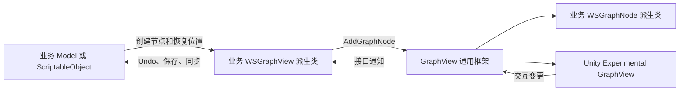
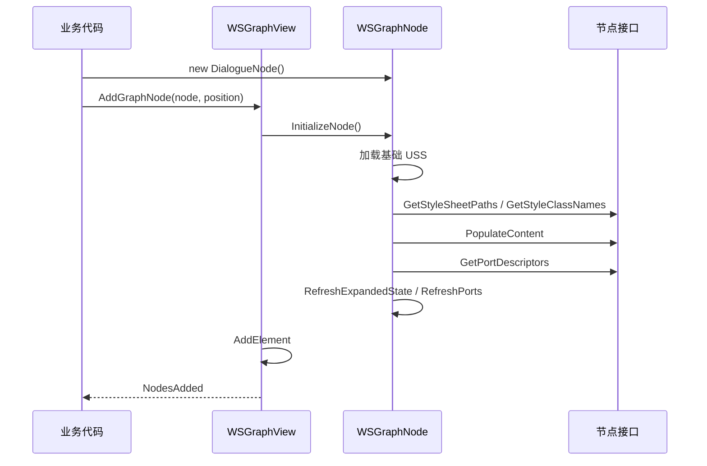
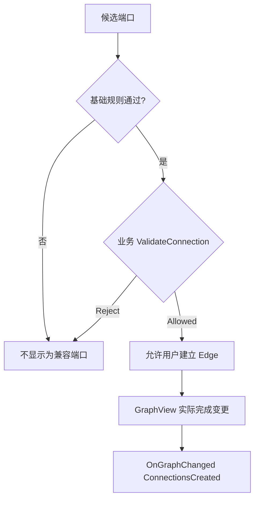

# WSFrame GraphView 扩展指南

## 1. 适用范围

该模块封装 Unity 2022.3 的 `UnityEditor.Experimental.GraphView`，用于快速创建 Editor 图编辑工具。

业务工具只需要：

1. 继承 `WSGraphView`，按需实现连接规则、变更通知、点击选择和菜单接口。
2. 继承 `WSGraphNode`，按需实现节点内容、端口、样式和菜单接口。
3. 始终通过 `AddGraphNode` 和 `RemoveGraphElements` 修改通用节点与元素。

框架负责画布交互、节点 UI 初始化、端口兼容性筛选和交互结果通知；业务层仍负责数据模型、资产保存、Undo 和脏标记。



## 2. 程序集与命名空间

GraphView 框架位于 Editor-only 程序集 `WSFrame.Editor.UIToolkitExtensions`：

```csharp
using WS_Modules.UIToolkitExtensions.Editor.GraphView;
```

业务 asmdef 至少需要引用 `WSFrame.Editor.UIToolkitExtensions`。如果业务节点直接使用生成的 USS/UXML 路径常量，还需要引用 `WSFrame.Editor.Utilities`：

```csharp
using WS_Modules.UIModule.Editor;
```

不要把这些类型放进 Runtime 程序集；它们依赖 `UnityEditor.Experimental.GraphView` 和 `AssetDatabase`。

## 3. 扩展接口速查

| 接口 | 实现位置 | 用途 |
| --- | --- | --- |
| `IGraphNodeContentProvider` | Node | 向节点中间的 `extensionContainer` 填充 UI |
| `IGraphPortProvider` | Node | 声明输入、输出端口及数据类型 |
| `IGraphNodeStyleProvider` | Node | 追加 USS 和节点根 class |
| `IGraphConnectionPolicy` | GraphView | 在框架基础规则之后追加业务接线限制 |
| `IGraphChangeListener` | GraphView | 接收节点增删移动、连接与断开结果 |
| `IGraphNodeInteractionListener` | GraphView | 接收节点点击和选择集合变化 |
| `IGraphContextMenuProvider` | GraphView 或 Node | 扩展画布、节点和 Edge 右键菜单 |

所有接口都是可选的。未实现某个接口时，仅缺少对应能力，不影响 GraphView 的其他基础交互。

## 4. 最小接入

### 4.1 创建 GraphView

```csharp
using UnityEditor.Experimental.GraphView;
using UnityEngine;
using UnityEngine.UIElements;
using WS_Modules.UIToolkitExtensions.Editor.GraphView;

internal sealed class DialogueGraphView : WSGraphView,
    IGraphConnectionPolicy,
    IGraphChangeListener,
    IGraphNodeInteractionListener,
    IGraphContextMenuProvider
{
    public GraphConnectionValidationResult ValidateConnection(GraphConnectionContext context)
    {
        // 基础方向、节点、类型和容量规则已经由框架检查。
        return GraphConnectionValidationResult.Allowed;
    }

    public void OnGraphChanged(GraphChangeEvent change)
    {
        // 在这里把已经生效的节点或连接变化同步到业务 Model。
    }

    public void OnNodeClicked(GraphNodeClickContext context)
    {
        // context.Node 是本次左键点击的节点。
    }

    public void OnNodeSelectionChanged(GraphNodeSelectionChange change)
    {
        // change.SelectedNodes 是变化后的完整节点选择快照。
    }

    public void PopulateContextMenu(GraphContextMenuContext context, DropdownMenu menu)
    {
        if (context.Target != GraphContextTarget.Canvas) return;

        menu.AppendAction("创建节点", _ =>
        {
            AddGraphNode(new DialogueNode(), context.GraphPosition);
        });
    }
}
```

将 GraphView 加入 EditorWindow：

```csharp
private void CreateGUI()
{
    var graphView = new DialogueGraphView();
    rootVisualElement.Add(graphView);
}
```

`WSGraphView` 已配置网格、缩放、画布拖动、节点拖动和框选，不需要重复添加这些 Manipulator。

### 4.2 创建节点

```csharp
using System;
using System.Collections.Generic;
using UnityEditor.Experimental.GraphView;
using UnityEngine.UIElements;
using WS_Modules.UIModule.Editor;
using WS_Modules.UIToolkitExtensions.Editor.GraphView;

internal sealed class DialogueNode : WSGraphNode,
    IGraphNodeContentProvider,
    IGraphPortProvider,
    IGraphNodeStyleProvider,
    IGraphContextMenuProvider
{
    public DialogueNode()
    {
        // 构造函数只保存业务状态和设置 Node 自带属性。
        title = "对话节点";
    }

    public void PopulateContent(VisualElement contentContainer)
    {
        contentContainer.Add(new TextField("文本"));
    }

    public IEnumerable<GraphPortDescriptor> GetPortDescriptors()
    {
        yield return new GraphPortDescriptor(
            "input", "输入", Direction.Input, Port.Capacity.Single, typeof(string));
        yield return new GraphPortDescriptor(
            "output", "输出", Direction.Output, Port.Capacity.Multi, typeof(string));
    }

    public IEnumerable<string> GetStyleSheetPaths()
    {
        yield return UxmlUssPathConstants.Uss.AssetsYourGeneratedStyleConstant;
    }

    public IEnumerable<string> GetStyleClassNames()
    {
        yield return "dialogue-node";
    }

    public void PopulateContextMenu(GraphContextMenuContext context, DropdownMenu menu)
    {
        menu.AppendAction("删除节点",
            _ => context.GraphView.RemoveGraphElements(new[] { this }));
    }
}
```

不要在节点构造函数中主动创建端口、加载 USS 或调用框架初始化方法。`AddGraphNode` 会在派生类构造完成后统一执行，而且只初始化一次。



## 5. 节点内容与端口

### 5.1 中间内容

`IGraphNodeContentProvider.PopulateContent` 收到的是节点的 `extensionContainer`。可以添加任意 UI Toolkit 控件，但业务规则不应放在 View 控件中；复杂命令应转交 Controller、Model 或服务。

### 5.2 端口描述

`GraphPortDescriptor` 参数含义：

| 参数 | 说明 |
| --- | --- |
| `id` | 节点内稳定且唯一的业务标识，用于连接结果映射 |
| `displayName` | 端口显示名称 |
| `direction` | `Direction.Input` 或 `Direction.Output` |
| `capacity` | `Single` 或 `Multi` |
| `dataType` | 连接类型；当前基础规则要求两端类型完全相同 |
| `orientation` | 端口布局方向，默认 `Horizontal` |

端口创建后可通过 `node.TryGetPort(portId, out Port port)` 查询。不要直接修改框架维护的端口 `userData`，其中保存了对应的 `GraphPortDescriptor`。

同一节点返回重复 ID、空描述或不存在的数据类型会在初始化阶段直接报错。

## 6. 接线规则与结果

框架按以下顺序筛选兼容端口：

1. 起点和候选端口不是同一实例。
2. 两端都属于 `WSGraphNode`。
3. 禁止节点连接自身。
4. 两端方向必须相反。
5. `portType` 必须相同。
6. `Single` 端口不能已有连接。
7. 最后调用 `IGraphConnectionPolicy.ValidateConnection` 执行业务限制。

`GraphConnectionContext` 始终按 Output → Input 规范化，无论用户从哪一端开始拖线。候选校验期间 `Edge` 可以为空；连接建立或断开结果中的 `Edge` 是对应连线。



`IGraphChangeListener` 收到的是已经生效的结果。删除节点时，框架先通知相关 `ConnectionsRemoved`，再通知 `NodesRemoved`，便于业务层在节点消失前清理连接数据。

## 7. 图变更通知

`GraphChangeEvent.Type` 可能为：

| 类型 | 主要数据 |
| --- | --- |
| `NodesAdded` | `Nodes` |
| `NodesMoved` | `Nodes`、`MoveDelta` |
| `ConnectionsCreated` | `Connections` |
| `ConnectionsRemoved` | `Connections` |
| `NodesRemoved` | `Nodes` |

`GraphChangeEvent`、`GraphNodeSelectionChange` 等通知 DTO 是值类型，但其中的节点、Edge 和只读集合仍是引用。业务代码应把它们当作一次回调期间的只读快照，不要使用 `default` 伪造事件，也不要长期持有已被删除的 GraphElement。

框架不会自动调用 `Undo.RecordObject`、`EditorUtility.SetDirty` 或保存资产。业务层在 `OnGraphChanged` 中修改 Unity 序列化数据时，应按自身资产契约处理 Undo 和保存。

## 8. 点击与选择

`IGraphNodeInteractionListener` 区分两种语义：

- `OnNodeClicked`：每次左键点击节点都会触发；重复点击已选节点仍会通知。
- `OnNodeSelectionChanged`：仅当最终节点选择集合发生变化时触发。

`GraphNodeSelectionChange` 提供：

- `SelectedNodes`：变化后的完整选择。
- `AddedNodes`：本次新增选择。
- `RemovedNodes`：本次取消选择。
- `TriggerNode`：直接触发同步的节点；框选、空白点击或键盘操作时可能为空。

业务也可以使用：

```csharp
graphView.SelectGraphNode(node);                 // 替换选择
graphView.SelectGraphNode(node, additive: true); // 追加选择
graphView.ClearGraphNodeSelection();             // 清空选择
IReadOnlyList<WSGraphNode> nodes = graphView.SelectedNodes;
```

`SelectedNodes` 是框架维护的只读选择快照，不包含 Edge 等其他 GraphElement。

## 9. 右键菜单

GraphView 会先保留 Unity 默认菜单，再调用业务接口：

- 空白画布：GraphView 的 `IGraphContextMenuProvider`。
- 节点：先调用节点的接口，再调用 GraphView 的接口。
- Edge：调用 GraphView 的接口。

通过 `GraphContextMenuContext.Target` 区分 `Canvas`、`Node` 和 `Edge`。创建节点时必须使用 `context.GraphPosition`，该坐标已经从 Panel 空间转换为 Graph 内容空间，兼容缩放和平移。

## 10. USS 扩展

所有节点都会先加载 `WSGraphNode.uss`，再按 `IGraphNodeStyleProvider.GetStyleSheetPaths()` 的顺序加载业务 USS，因此相同权重下业务样式可以覆盖基础样式。

可使用的稳定 class：

| 常量 | USS class | 目标 |
| --- | --- | --- |
| `RootClassName` | `.ws-graph-node` | 节点根元素 |
| `MainClassName` | `.ws-graph-node__main` | 主结构容器 |
| `TitleClassName` | `.ws-graph-node__title` | 标题区域 |
| `InputClassName` | `.ws-graph-node__input` | 输入端口容器 |
| `OutputClassName` | `.ws-graph-node__output` | 输出端口容器 |
| `ContentClassName` | `.ws-graph-node__content` | 中间内容区域 |
| `PortClassName` | `.ws-graph-node__port` | 所有端口 |
| `InputPortClassName` | `.ws-graph-node__port--input` | 输入端口 |
| `OutputPortClassName` | `.ws-graph-node__port--output` | 输出端口 |
| `SelectedClassName` | `.ws-graph-node--selected` | 当前选中节点 |

示例：

```css
.dialogue-node .ws-graph-node__title {
    background-color: rgb(45, 84, 108);
}

.dialogue-node .ws-graph-node__content {
    padding: 8px;
}

.dialogue-node.ws-graph-node--selected {
    border-top-width: 2px;
    border-top-color: rgb(255, 196, 72);
}
```

新增或移动 USS/UXML 后，通过菜单 `WSFrame/UI/Generate UXML USS Paths` 刷新 `UxmlUssPathConstants.generated.cs`，随后在 `GetStyleSheetPaths` 中引用生成字段。不要在业务 C# 中重新写硬编码资源路径，也不要手工修改 generated 文件。

## 11. 生命周期与数据同步约束

- GraphView 和 Node 都属于 Editor View，不应成为业务数据的权威来源。
- Node 构造函数只保存状态；所有接口会在 `AddGraphNode` 调用期间执行。
- `PopulateContent`、`GetPortDescriptors` 和样式接口只在节点首次初始化时调用一次。
- `ValidateConnection` 可能在拖线过程中被频繁调用，必须轻量、确定且无副作用。
- getter 和连接校验不得修改 Model、发送业务事件或保存资产。
- 回调异常不会被框架吞掉；违反内部契约时应直接修复调用方。
- 重建窗口时应从业务 Model 重新创建节点、位置和连接，不要把 VisualElement 当作持久化对象。

## 12. 示例与验证清单

完整示例位于 `Samples/GraphViewFrameworkSampleWindow.cs`，通过菜单 `WSFrame/GraphView 框架示例` 打开。

接入新图工具后至少验证：

- 节点中间内容正确显示且控件可交互。
- 输入、输出端口方向、类型和容量符合业务规则。
- 合法连接建立一次，非法端口不显示为候选。
- 连接和断开结果不会重复发送。
- 删除节点时先处理连接断开，再处理节点删除。
- 单击、重复点击、Ctrl 多选、框选和空白取消选择正确。
- Canvas、Node、Edge 菜单目标和 Graph 内容坐标正确。
- 基础 USS、自定义 USS 和选中态 class 正确应用。
- 业务资产的 Undo、Dirty 和保存行为由接入方正确处理。
- Unity Console 没有 C#、UXML 或 USS 错误。
