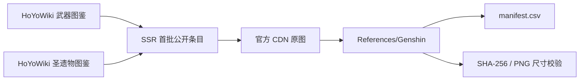

# 原神武器与圣遗物图标参考素材

本目录保存从 HoYoLAB 官方 HoYoWiki 图鉴读取的装备图标，仅作为 UI 设计分析和个人参考素材。HoYoverse 的名称、图像和相关知识产权仍归其权利人所有；这些文件不应直接作为商业发行资源。

## 本次采集快照

- 采集时间：2026-08-26（UTC 时间记录在临时采集过程；本目录按该次快照整理）。
- 官方来源：
  - [Weapons 图鉴](https://wiki.hoyolab.com/pc/genshin/aggregate/weapon?lang=zh-cn)
  - [Artifacts 图鉴](https://wiki.hoyolab.com/pc/genshin/aggregate/artifact?lang=zh-cn)
- 武器首个公开 SSR 页面：30 把；页面报告总数 246 把，剩余页面未下载。
- 圣遗物首个公开 SSR 页面：30 套；页面报告总数 63 套，剩余套装未下载。
- 已下载：30 把武器图标 + 30 套圣遗物 × 5 个部位 = 180 张 PNG。
- 校验结果：180/180 成功，均为 256×256、非空、可识别 PNG；总大小约 10.59 MB；本批次没有缺图和重复 SHA-256。

采集关系如下：

## 目录规则

- 武器按 `Weapons/Sword`、`Claymore`、`Polearm`、`Bow`、`Catalyst` 分类。
- 圣遗物按 `Artifacts/<套装中文名_官方ID>/<部位>` 分类，部位使用 `Flower`、`Plume`、`Sands`、`Goblet`、`Circlet`。
- 文件名使用中文名称、部位和官方条目 ID；`manifest.csv` 保留完整官方名称、官方 ID、原图 URL 和详情页 URL。
- `manifest.csv` 中 `local_path` 使用 `/` 分隔，便于在 Windows、脚本和 Unity 外部参考工具之间共享。

## 完整列表的阻断说明

HoYoWiki 首屏 SSR 数据公开了第一页条目和总数，但后续页由站内 `get_entry_page_list` POST 请求加载。按本次执行环境进行的官方公开请求返回 HTTP 403；根据采集计划中的约束，没有伪造设备/会话、绕过验证码或切换到 Fandom、GitHub 等第三方来源。因此本目录明确是“首个可访问页面快照”，不是当前游戏的完整装备库。

- 武器缺口：页面报告 246 把，已保存 30 把，理论缺口 216 把。
- 圣遗物缺口：页面报告 63 套，已保存 30 套，理论缺口 33 套（每套应有五个部位）。
- 若后续在正常 HoYoLAB 会话中能够翻页，应继续使用原官方详情页和 CDN 地址，并在本目录重新生成索引；不要用第三方图片静默填补缺口。

## 使用索引

请以 [manifest.csv](./manifest.csv) 为机器可读入口。每一行包含类别、武器类型或圣遗物套装、部位、官方 ID、官方详情页、官方原图 URL、本地路径、图片格式、像素尺寸、字节数、SHA-256、重复标记和下载状态。
